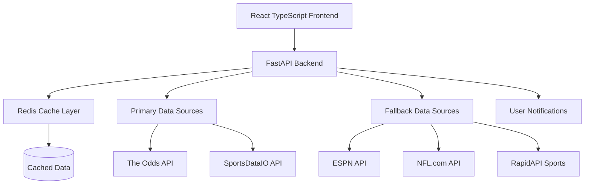
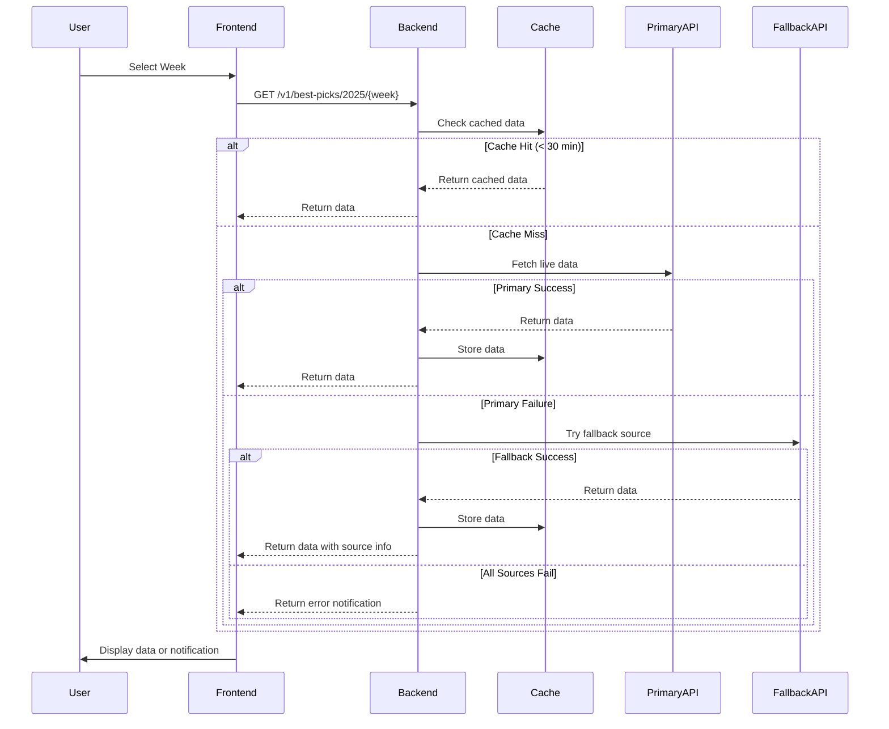

# Design Document

## Overview

The live data integration system will transform the NFL Predictor platform from a mock data prototype into a production-ready TypeScript application that fetches real-time sports data from multiple APIs. The system will be built with a modular architecture that supports primary data sources (The Odds API and SportsDataIO) with fallback to alternative sources (ESPN API, NFL.com API, RapidAPI) when needed.

The design prioritizes user experience through clear error notifications, maintains code quality with TypeScript throughout, and ensures maintainability by keeping all files under 400 lines. The system will implement intelligent caching, retry logic, and comprehensive error handling while preserving the existing UI structure.

## Architecture

### High-Level Architecture



### Data Flow Architecture



## Components and Interfaces

### Backend Components

#### 1. API Client Manager (`src/api/client_manager.py`)
- **Purpose**: Manages multiple API clients with failover logic
- **Key Features**: 
  - Primary/fallback source routing
  - Rate limit handling
  - Exponential backoff retry
  - API key rotation
- **Size**: ~350 lines

#### 2. Data Transformers (`src/transformers/`)
- **odds_transformer.py**: Transforms Odds API responses to standard format (~200 lines)
- **sportsdata_transformer.py**: Transforms SportsDataIO responses (~200 lines)
- **espn_transformer.py**: Transforms ESPN API responses (~200 lines)
- **nfl_transformer.py**: Transforms NFL.com API responses (~200 lines)

#### 3. Cache Manager (`src/cache/cache_manager.py`)
- **Purpose**: Handles Redis caching with TTL management
- **Key Features**:
  - 30-minute cache TTL for live data
  - Cache invalidation strategies
  - Fallback to in-memory cache if Redis unavailable
- **Size**: ~250 lines

#### 4. Notification Service (`src/notifications/notification_service.py`)
- **Purpose**: Generates user-friendly error messages and status updates
- **Key Features**:
  - API status tracking
  - User notification formatting
  - Retry status communication
- **Size**: ~150 lines

### Frontend Components

#### 1. API Service (`src/services/apiService.ts`)
- **Purpose**: TypeScript service for backend communication
- **Key Features**:
  - Type-safe API calls
  - Error handling with user notifications
  - Loading state management
- **Size**: ~300 lines

#### 2. Type Definitions (`src/types/`)
- **nfl.types.ts**: Core NFL data types (~200 lines)
- **api.types.ts**: API response types (~150 lines)
- **ui.types.ts**: UI component types (~100 lines)

#### 3. Notification Components (`src/components/notifications/`)
- **NotificationBanner.tsx**: Displays API status messages (~150 lines)
- **ErrorBoundary.tsx**: Catches and displays errors (~200 lines)

#### 4. Enhanced Dashboard (`src/components/NFLDashboard.tsx`)
- **Purpose**: Main dashboard with TypeScript and notifications
- **Key Features**:
  - Type-safe data handling
  - Integrated notification display
  - Loading states with progress indicators
- **Size**: ~400 lines (split from current 200+ line JSX)

## Data Models

### Core TypeScript Interfaces

```typescript
// Primary data structures
interface GamePrediction {
  home: string;
  away: string;
  matchup: string;
  su_pick: string;
  su_confidence: number;
  source: DataSource;
  timestamp: string;
}

interface ATSPrediction {
  matchup: string;
  ats_pick: string;
  spread: number;
  ats_confidence: number;
  source: DataSource;
  timestamp: string;
}

interface TotalsPrediction {
  matchup: string;
  tot_pick: string;
  total_line: number;
  tot_confidence: number;
  source: DataSource;
  timestamp: string;
}

interface PropBet {
  player: string;
  prop_type: PropType;
  units: string;
  line: number;
  pick: 'Over' | 'Under';
  confidence: number;
  bookmaker: string;
  team: string;
  opponent: string;
  source: DataSource;
  timestamp: string;
}

interface FantasyPick {
  player: string;
  position: Position;
  salary: number;
  projected_points: number;
  value_score: number;
  source: DataSource;
  timestamp: string;
}

// API Response wrapper
interface APIResponse<T> {
  data: T;
  source: DataSource;
  cached: boolean;
  timestamp: string;
  notifications?: Notification[];
}

// Error and notification types
interface Notification {
  type: 'error' | 'warning' | 'info' | 'success';
  message: string;
  source?: DataSource;
  retryable: boolean;
}

// Enums
enum DataSource {
  ODDS_API = 'odds_api',
  SPORTSDATA_IO = 'sportsdata_io',
  ESPN_API = 'espn_api',
  NFL_API = 'nfl_api',
  RAPID_API = 'rapid_api',
  CACHE = 'cache'
}

enum PropType {
  PASSING_YARDS = 'Passing Yards',
  RUSHING_YARDS = 'Rushing Yards',
  RECEIVING_YARDS = 'Receiving Yards',
  RECEPTIONS = 'Receptions',
  TOUCHDOWNS = 'Touchdowns',
  FANTASY_POINTS = 'Fantasy Points'
}

enum Position {
  QB = 'QB',
  RB = 'RB',
  WR = 'WR',
  TE = 'TE',
  K = 'K',
  DST = 'DST'
}
```

### API Configuration Schema

```typescript
interface APIConfig {
  primary_sources: {
    odds_api: {
      base_url: string;
      api_key: string;
      rate_limit: number;
      timeout: number;
    };
    sportsdata_io: {
      base_url: string;
      api_key: string;
      rate_limit: number;
      timeout: number;
    };
  };
  fallback_sources: {
    espn_api: {
      base_url: string;
      rate_limit: number;
      timeout: number;
    };
    nfl_api: {
      base_url: string;
      rate_limit: number;
      timeout: number;
    };
    rapid_api: {
      base_url: string;
      api_key?: string;
      rate_limit: number;
      timeout: number;
    };
  };
  cache_config: {
    ttl_minutes: number;
    max_retries: number;
    backoff_factor: number;
  };
}
```

## Error Handling

### Error Classification System

```typescript
enum ErrorType {
  API_UNAVAILABLE = 'api_unavailable',
  RATE_LIMITED = 'rate_limited',
  INVALID_DATA = 'invalid_data',
  NETWORK_ERROR = 'network_error',
  AUTHENTICATION_ERROR = 'authentication_error',
  CACHE_ERROR = 'cache_error'
}

interface ErrorContext {
  source: DataSource;
  endpoint: string;
  week: number;
  retry_count: number;
  timestamp: string;
}
```

### Notification Strategy

1. **API Unavailable**: "The Odds API is currently unavailable. Trying backup sources..."
2. **All Sources Failed**: "Live data is temporarily unavailable. Please try again in a few minutes."
3. **Rate Limited**: "API rate limit reached. Data will refresh in X minutes."
4. **Partial Data**: "Some data sources are unavailable. Showing available predictions."
5. **Cache Served**: "Showing recent data (updated X minutes ago) while fetching latest."

### Retry Logic

```python
async def fetch_with_retry(
    source: DataSource,
    endpoint: str,
    max_retries: int = 3,
    backoff_factor: float = 2.0
) -> APIResponse:
    for attempt in range(max_retries + 1):
        try:
            response = await make_api_call(source, endpoint)
            return response
        except Exception as e:
            if attempt == max_retries:
                raise e
            
            wait_time = backoff_factor ** attempt
            await asyncio.sleep(wait_time)
            
            # Notify user of retry attempt
            notify_retry_attempt(source, attempt + 1, max_retries)
```

## Testing Strategy

### Unit Testing Structure

1. **API Client Tests** (`tests/api/`)
   - Mock API responses for each data source
   - Test error handling and retry logic
   - Validate data transformation accuracy

2. **Cache Tests** (`tests/cache/`)
   - Test TTL expiration
   - Test cache invalidation
   - Test fallback to in-memory cache

3. **Frontend Tests** (`tests/frontend/`)
   - Component rendering with TypeScript
   - API service error handling
   - Notification display logic

4. **Integration Tests** (`tests/integration/`)
   - End-to-end data flow testing
   - Fallback source switching
   - Error notification delivery

### Test Data Strategy

- **Mock API Responses**: Create realistic mock responses for each API source
- **Error Simulation**: Test various error conditions (4xx, 5xx, timeouts, malformed data)
- **Performance Testing**: Validate response times under load
- **Type Safety Testing**: Ensure TypeScript interfaces catch data inconsistencies

### Alternative Data Sources Research

Based on research, here are the recommended fallback data sources:

1. **ESPN API** (Free)
   - Endpoint: `https://site.api.espn.com/apis/site/v2/sports/football/nfl/scoreboard`
   - Provides: Game scores, basic stats, schedules
   - Rate Limit: ~1000 requests/hour
   - Reliability: High

2. **NFL.com API** (Free)
   - Endpoint: `https://api.nfl.com/v1/games`
   - Provides: Official NFL data, scores, player stats
   - Rate Limit: ~500 requests/hour
   - Reliability: Very High

3. **RapidAPI Sports Collection** (Freemium)
   - Multiple sports APIs available
   - Provides: Betting odds, player props, fantasy data
   - Rate Limit: Varies by plan (100-10000 requests/month)
   - Reliability: Medium to High

4. **SportsRadar API** (Paid backup option)
   - Comprehensive sports data
   - Provides: Real-time odds, player props, fantasy data
   - Rate Limit: Based on subscription
   - Reliability: Very High

### Implementation Priority

1. **Phase 1**: Implement primary sources (Odds API + SportsDataIO) with basic error notifications
2. **Phase 2**: Add caching layer and ESPN API fallback
3. **Phase 3**: Integrate NFL.com API and RapidAPI fallbacks
4. **Phase 4**: Add advanced features (retry logic, rate limiting, performance optimization)