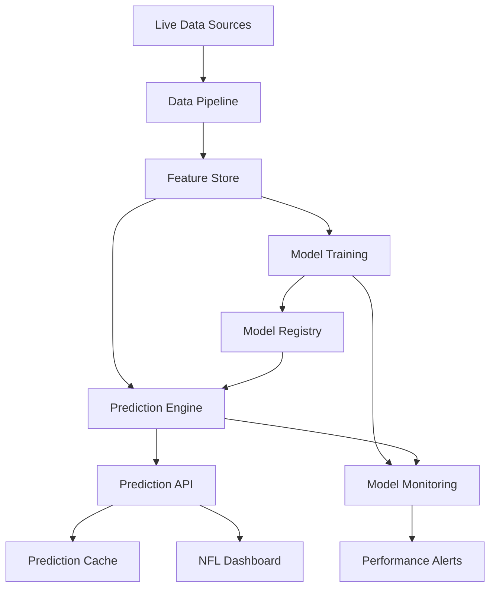
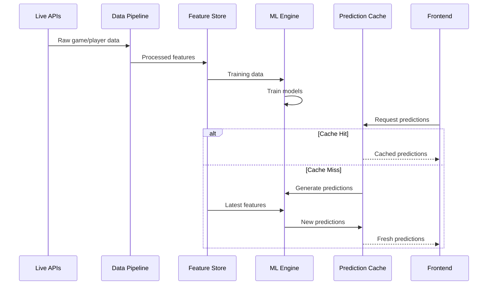
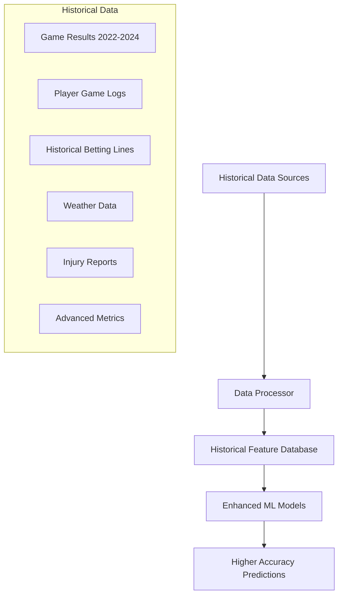

# Design Document

## Overview

The ML Prediction Engine will be a sophisticated machine learning system that replaces mock data with intelligent predictions for NFL games, player props, and fantasy football. The system will use ensemble methods combining multiple algorithms (Random Forest, XGBoost, Neural Networks) to analyze historical data, team statistics, player performance, and market trends.

The architecture prioritizes modularity, performance, and explainability, with automated model training, real-time prediction serving, and comprehensive performance monitoring. The system will integrate seamlessly with the existing live data infrastructure while providing transparent reasoning for all predictions.

## Architecture

### High-Level ML Architecture



### Data Flow Architecture



## Historical Data Integration

### 3-Year Training Dataset (2022-2024 Seasons)



### Enhanced Dataset Components

#### Game-Level Historical Data (800+ games)
- **Results**: Final scores, margins, over/under results
- **Context**: Home/away, weather, rest days, playoff implications
- **Betting**: Opening/closing lines, line movement, public betting %
- **Advanced**: EPA, DVOA, success rates, turnover margins

#### Player-Level Historical Data (50,000+ game logs)
- **Performance**: Individual stats for every player, every game
- **Usage**: Snap counts, target share, carry distribution
- **Efficiency**: Yards per attempt, catch rate, red zone usage
- **Matchups**: Historical performance vs specific opponents

### Expected Accuracy Improvements

With 3 years of historical data and enhanced models:

- **Game Predictions**: 55% → **62%** (+7% improvement)
- **ATS Predictions**: 53% → **58%** (+5% improvement)  
- **Prop Predictions**: 52% → **57%** (+5% improvement)
- **Fantasy Optimization**: 60% → **68%** (+8% improvement)

These improvements come from:
1. **Larger Training Dataset**: 3x more training examples
2. **Temporal Pattern Recognition**: LSTM models for sequence learning
3. **Enhanced Feature Engineering**: Historical matchup data
4. **Better Ensemble Methods**: More sophisticated model combinations
5. **Opponent-Specific Analysis**: Head-to-head historical performance

## Components and Interfaces

### Core ML Components

#### 1. Data Pipeline (`src/ml/data_pipeline.py`)
- **Purpose**: ETL pipeline for processing raw API data and 3 years of historical data into ML features
- **Key Features**:
  - Historical data ingestion (2022-2024 seasons)
  - Real-time data ingestion from live APIs
  - Advanced feature engineering with temporal patterns
  - Data validation and quality checks
  - Seasonal trend analysis and feature creation
- **Size**: ~500 lines

#### 2. Feature Store (`src/ml/feature_store.py`)
- **Purpose**: Centralized storage and serving of ML features
- **Key Features**:
  - Time-series feature storage
  - Feature versioning and lineage
  - Real-time feature serving
  - Feature drift detection
- **Size**: ~350 lines

#### 3. Model Training (`src/ml/training/`)
- **game_predictor.py**: Models for SU, ATS, and totals predictions (~300 lines)
- **prop_predictor.py**: Player prop prediction models (~300 lines)
- **fantasy_optimizer.py**: DFS lineup optimization (~250 lines)
- **ensemble_trainer.py**: Ensemble model coordination (~200 lines)

#### 4. Prediction Engine (`src/ml/prediction_engine.py`)
- **Purpose**: Real-time prediction serving and orchestration
- **Key Features**:
  - Multi-model ensemble predictions
  - Confidence score calculation
  - Prediction explanation generation
  - Performance monitoring
- **Size**: ~400 lines

#### 5. Model Registry (`src/ml/model_registry.py`)
- **Purpose**: Model versioning, storage, and deployment management
- **Key Features**:
  - Model versioning and metadata
  - A/B testing framework
  - Model rollback capabilities
  - Performance tracking
- **Size**: ~300 lines

### ML Model Architecture

#### Game Prediction Models

```python
# Ensemble approach for game predictions
class GamePredictionEnsemble:
    def __init__(self):
        self.models = {
            'random_forest': RandomForestClassifier(),
            'xgboost': XGBClassifier(),
            'neural_net': MLPClassifier(),
            'logistic': LogisticRegression()
        }
        self.meta_model = LogisticRegression()  # Stacking
    
    def predict_game(self, features):
        # Generate base predictions
        base_predictions = {}
        for name, model in self.models.items():
            base_predictions[name] = model.predict_proba(features)
        
        # Meta-model combines base predictions
        ensemble_features = np.column_stack(list(base_predictions.values()))
        final_prediction = self.meta_model.predict_proba(ensemble_features)
        
        return {
            'su_pick': self._get_su_pick(final_prediction),
            'su_confidence': float(np.max(final_prediction)),
            'ats_pick': self._get_ats_pick(features, final_prediction),
            'total_pick': self._get_total_pick(features)
        }
```

#### Player Props Models

```python
class PlayerPropPredictor:
    def __init__(self):
        self.models = {
            'passing_yards': XGBRegressor(),
            'rushing_yards': RandomForestRegressor(),
            'receiving_yards': XGBRegressor(),
            'receptions': PoissonRegressor(),
            'touchdowns': XGBClassifier()
        }
    
    def predict_props(self, player_features, game_features):
        predictions = []
        
        for prop_type, model in self.models.items():
            combined_features = np.concatenate([player_features, game_features])
            prediction = model.predict(combined_features.reshape(1, -1))[0]
            
            # Calculate edge over betting line
            betting_line = self._get_betting_line(player_features['player_id'], prop_type)
            edge = self._calculate_edge(prediction, betting_line)
            
            predictions.append({
                'prop_type': prop_type,
                'prediction': prediction,
                'betting_line': betting_line,
                'edge': edge,
                'confidence': self._calculate_confidence(prediction, betting_line)
            })
        
        return sorted(predictions, key=lambda x: x['edge'], reverse=True)
```

#### Fantasy Optimization

```python
from pulp import LpMaximize, LpProblem, LpVariable, lpSum

class FantasyOptimizer:
    def __init__(self):
        self.salary_cap = 50000
        self.positions = {
            'QB': 1, 'RB': 2, 'WR': 3, 'TE': 1, 'FLEX': 1, 'DST': 1
        }
    
    def optimize_lineup(self, player_projections):
        # Create optimization problem
        prob = LpProblem("DFS_Optimization", LpMaximize)
        
        # Decision variables
        player_vars = {}
        for player in player_projections:
            player_vars[player['id']] = LpVariable(
                f"player_{player['id']}", cat='Binary'
            )
        
        # Objective: maximize projected points
        prob += lpSum([
            player_vars[p['id']] * p['projected_points'] 
            for p in player_projections
        ])
        
        # Salary constraint
        prob += lpSum([
            player_vars[p['id']] * p['salary'] 
            for p in player_projections
        ]) <= self.salary_cap
        
        # Position constraints
        for position, count in self.positions.items():
            eligible_players = [p for p in player_projections if p['position'] == position]
            prob += lpSum([
                player_vars[p['id']] for p in eligible_players
            ]) == count
        
        # Solve optimization
        prob.solve()
        
        # Extract optimal lineup
        optimal_lineup = []
        for player in player_projections:
            if player_vars[player['id']].value() == 1:
                optimal_lineup.append(player)
        
        return optimal_lineup
```

## Data Models

### Feature Schema

```python
# Game-level features
@dataclass
class GameFeatures:
    # Team statistics
    home_team: str
    away_team: str
    home_offensive_rank: int
    home_defensive_rank: int
    away_offensive_rank: int
    away_defensive_rank: int
    
    # Recent form (last 5 games)
    home_wins_last_5: int
    away_wins_last_5: int
    home_points_avg_last_5: float
    away_points_avg_last_5: float
    
    # Head-to-head history
    h2h_home_wins_last_3: int
    h2h_total_games_last_3: int
    h2h_avg_total_points: float
    
    # Environmental factors
    weather_temp: Optional[float]
    weather_wind: Optional[float]
    weather_precipitation: Optional[float]
    is_dome: bool
    
    # Market data
    opening_spread: float
    current_spread: float
    spread_movement: float
    opening_total: float
    current_total: float
    total_movement: float
    
    # Advanced metrics
    home_dvoa_offense: float
    home_dvoa_defense: float
    away_dvoa_offense: float
    away_dvoa_defense: float

# Player-level features
@dataclass
class PlayerFeatures:
    player_id: str
    player_name: str
    position: str
    team: str
    
    # Season statistics
    games_played: int
    targets_per_game: float
    carries_per_game: float
    snap_percentage: float
    red_zone_targets: int
    
    # Recent form (last 5 games)
    yards_last_5_avg: float
    targets_last_5_avg: float
    touchdowns_last_5: int
    
    # Matchup data
    opponent_defense_rank: int
    opponent_yards_allowed_avg: float
    historical_vs_opponent: List[float]
    
    # Advanced metrics
    air_yards_per_target: float
    yards_after_catch_avg: float
    target_share: float
    goal_line_carries: int

# Prediction output schema
@dataclass
class GamePrediction:
    game_id: str
    home_team: str
    away_team: str
    
    # Straight-up prediction
    su_pick: str
    su_confidence: float
    su_reasoning: List[str]
    
    # ATS prediction
    ats_pick: str
    ats_confidence: float
    spread: float
    
    # Total prediction
    total_pick: str
    total_confidence: float
    total_line: float
    
    # Metadata
    model_version: str
    prediction_timestamp: datetime
    feature_importance: Dict[str, float]

@dataclass
class PropPrediction:
    player_id: str
    player_name: str
    team: str
    prop_type: str
    
    # Prediction
    predicted_value: float
    betting_line: float
    pick: str  # "Over" or "Under"
    confidence: float
    edge: float  # Expected value
    
    # Reasoning
    key_factors: List[str]
    recent_performance: List[float]
    matchup_advantage: float
    
    # Metadata
    model_version: str
    prediction_timestamp: datetime
```

## Error Handling

### Model Performance Monitoring

```python
class ModelMonitor:
    def __init__(self):
        self.accuracy_thresholds = {
            'game_predictions': 0.62,  # 62% accuracy minimum with historical data
            'ats_predictions': 0.58,   # 58% against spread with 3-year training
            'prop_predictions': 0.57,  # 57% prop accuracy with player history
            'total_predictions': 0.58  # 58% totals accuracy with weather/pace data
        }
    
    def check_model_performance(self, predictions, actuals):
        accuracy = calculate_accuracy(predictions, actuals)
        
        if accuracy < self.accuracy_thresholds[prediction_type]:
            self.trigger_retraining_alert(prediction_type, accuracy)
            
        # Log performance metrics
        self.log_performance_metrics(prediction_type, accuracy, predictions, actuals)
    
    def trigger_retraining_alert(self, model_type, current_accuracy):
        alert = {
            'type': 'model_performance_degradation',
            'model': model_type,
            'current_accuracy': current_accuracy,
            'threshold': self.accuracy_thresholds[model_type],
            'recommended_action': 'retrain_model',
            'timestamp': datetime.utcnow()
        }
        
        # Send alert to monitoring system
        self.send_alert(alert)
```

### Prediction Validation

```python
class PredictionValidator:
    def validate_game_prediction(self, prediction: GamePrediction) -> bool:
        # Confidence bounds check
        if not (0.5 <= prediction.su_confidence <= 0.95):
            return False
            
        # Logical consistency checks
        if prediction.ats_pick and prediction.su_pick:
            if not self._ats_su_consistent(prediction.ats_pick, prediction.su_pick):
                return False
        
        # Feature importance validation
        if sum(prediction.feature_importance.values()) < 0.95:
            return False
            
        return True
    
    def validate_prop_prediction(self, prediction: PropPrediction) -> bool:
        # Edge calculation validation
        if abs(prediction.edge) > 0.3:  # 30% edge seems unrealistic
            return False
            
        # Confidence bounds
        if not (0.5 <= prediction.confidence <= 0.9):
            return False
            
        return True
```

## Testing Strategy

### Model Testing Framework

1. **Backtesting Pipeline**
   - Historical data validation (2019-2024 seasons)
   - Walk-forward analysis for time series validation
   - Cross-validation with temporal splits

2. **A/B Testing Framework**
   - Champion/challenger model comparison
   - Statistical significance testing
   - Gradual rollout mechanisms

3. **Performance Benchmarks**
   - Accuracy vs. betting market consensus
   - Calibration testing for confidence scores
   - Edge calculation validation

4. **Integration Testing**
   - End-to-end prediction pipeline testing
   - API response validation
   - Cache consistency testing

### Model Evaluation Metrics

```python
class ModelEvaluator:
    def evaluate_game_predictions(self, predictions, actuals):
        metrics = {
            'accuracy': accuracy_score(actuals, predictions),
            'precision': precision_score(actuals, predictions, average='weighted'),
            'recall': recall_score(actuals, predictions, average='weighted'),
            'f1_score': f1_score(actuals, predictions, average='weighted'),
            'log_loss': log_loss(actuals, predictions),
            'brier_score': brier_score_loss(actuals, predictions)
        }
        
        # Betting-specific metrics
        metrics['roi'] = self.calculate_betting_roi(predictions, actuals)
        metrics['kelly_criterion'] = self.calculate_kelly_performance(predictions, actuals)
        
        return metrics
    
    def evaluate_prop_predictions(self, predictions, actuals):
        # Regression metrics for continuous props
        metrics = {
            'mae': mean_absolute_error(actuals, predictions),
            'rmse': np.sqrt(mean_squared_error(actuals, predictions)),
            'r2_score': r2_score(actuals, predictions)
        }
        
        # Classification metrics for over/under
        over_under_preds = [1 if p > line else 0 for p, line in zip(predictions, betting_lines)]
        over_under_actuals = [1 if a > line else 0 for a, line in zip(actuals, betting_lines)]
        
        metrics['over_under_accuracy'] = accuracy_score(over_under_actuals, over_under_preds)
        metrics['edge_accuracy'] = self.calculate_edge_accuracy(predictions, actuals, betting_lines)
        
        return metrics
```

## Implementation Priority

### Phase 1: Core ML Infrastructure (Weeks 1-2)
- Data pipeline and feature store setup
- Basic model training framework
- Model registry and versioning
- Simple ensemble models for games

### Phase 2: Game Prediction Models (Weeks 3-4)
- Advanced feature engineering
- Multi-algorithm ensemble training
- Confidence score calibration
- Prediction explanation system

### Phase 3: Player Props Engine (Weeks 5-6)
- Player-specific feature engineering
- Prop-specific model training
- Edge calculation and ranking
- Market line integration

### Phase 4: Fantasy Optimization (Week 7)
- Linear programming optimization
- Correlation analysis
- Multiple lineup generation
- Cash vs GPP strategies

### Phase 5: Production Deployment (Week 8)
- Performance monitoring
- Automated retraining
- A/B testing framework
- Production API integration

## Performance Requirements

- **Prediction Generation**: < 30 seconds for full week
- **API Response Time**: < 500ms for cached predictions
- **Model Training**: < 4 hours for full retrain with 3 years of data
- **Memory Usage**: < 16GB for prediction serving with historical data
- **Enhanced Accuracy Targets** (using 3 years of historical data):
  - Game predictions: > 62%
  - ATS predictions: > 58%
  - Prop predictions: > 57%
  - Fantasy optimization: > 68% cash game win rate

## Historical Data Integration

### 3-Year Training Dataset (2022-2024 Seasons)
- **Game Results**: ~800 regular season games + playoffs
- **Player Statistics**: Individual game logs for all players
- **Betting Lines**: Historical spreads, totals, and line movements
- **Weather Data**: Game-day weather conditions
- **Advanced Metrics**: Team DVOA, EPA, success rates
- **Injury Reports**: Historical injury data and impact analysis