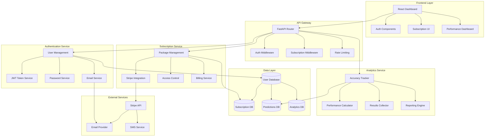

# User Authentication & Subscription System Design

## Overview

This design document outlines the architecture for implementing a comprehensive user authentication and subscription system for the NFL ML Prediction platform. The system will transform our world-class ML predictions into a profitable SaaS business with tiered access and real-time performance tracking.

## Architecture

### System Architecture Diagram



### Database Schema

#### Users Table
```sql
CREATE TABLE users (
    id UUID PRIMARY KEY DEFAULT gen_random_uuid(),
    email VARCHAR(255) UNIQUE NOT NULL,
    password_hash VARCHAR(255) NOT NULL,
    first_name VARCHAR(100),
    last_name VARCHAR(100),
    email_verified BOOLEAN DEFAULT FALSE,
    created_at TIMESTAMP DEFAULT NOW(),
    updated_at TIMESTAMP DEFAULT NOW(),
    last_login TIMESTAMP,
    is_active BOOLEAN DEFAULT TRUE
);
```

#### Subscriptions Table
```sql
CREATE TABLE subscriptions (
    id UUID PRIMARY KEY DEFAULT gen_random_uuid(),
    user_id UUID REFERENCES users(id) ON DELETE CASCADE,
    package_type VARCHAR(50) NOT NULL, -- 'weekly', 'monthly', 'season'
    stripe_subscription_id VARCHAR(255),
    status VARCHAR(50) DEFAULT 'active', -- 'active', 'cancelled', 'expired'
    start_date TIMESTAMP NOT NULL,
    end_date TIMESTAMP NOT NULL,
    auto_renew BOOLEAN DEFAULT TRUE,
    amount_paid DECIMAL(10,2),
    created_at TIMESTAMP DEFAULT NOW()
);
```

#### Predictions Table
```sql
CREATE TABLE predictions (
    id UUID PRIMARY KEY DEFAULT gen_random_uuid(),
    week INTEGER NOT NULL,
    season INTEGER NOT NULL,
    prediction_type VARCHAR(20) NOT NULL, -- 'game', 'ats', 'total', 'prop'
    home_team VARCHAR(10),
    away_team VARCHAR(10),
    prediction_data JSONB NOT NULL,
    confidence DECIMAL(5,4),
    actual_result JSONB,
    is_correct BOOLEAN,
    created_at TIMESTAMP DEFAULT NOW(),
    result_updated_at TIMESTAMP
);
```

#### User Sessions Table
```sql
CREATE TABLE user_sessions (
    id UUID PRIMARY KEY DEFAULT gen_random_uuid(),
    user_id UUID REFERENCES users(id) ON DELETE CASCADE,
    token_hash VARCHAR(255) NOT NULL,
    expires_at TIMESTAMP NOT NULL,
    created_at TIMESTAMP DEFAULT NOW(),
    last_accessed TIMESTAMP DEFAULT NOW(),
    ip_address INET,
    user_agent TEXT
);
```

#### Admin Users Table
```sql
CREATE TABLE admin_users (
    id UUID PRIMARY KEY DEFAULT gen_random_uuid(),
    user_id UUID REFERENCES users(id) ON DELETE CASCADE,
    role VARCHAR(50) NOT NULL DEFAULT 'admin', -- 'super_admin', 'admin', 'support'
    permissions JSONB NOT NULL DEFAULT '[]',
    created_by UUID REFERENCES admin_users(id),
    created_at TIMESTAMP DEFAULT NOW(),
    last_admin_login TIMESTAMP
);
```

#### Free Access Grants Table
```sql
CREATE TABLE free_access_grants (
    id UUID PRIMARY KEY DEFAULT gen_random_uuid(),
    user_id UUID REFERENCES users(id) ON DELETE CASCADE,
    granted_by UUID REFERENCES admin_users(id),
    access_type VARCHAR(50) NOT NULL, -- 'friends_family', 'beta_tester', 'promotional'
    start_date TIMESTAMP NOT NULL DEFAULT NOW(),
    end_date TIMESTAMP NOT NULL,
    notes TEXT,
    is_active BOOLEAN DEFAULT TRUE,
    created_at TIMESTAMP DEFAULT NOW(),
    updated_at TIMESTAMP DEFAULT NOW()
);
```

#### Affiliates Table
```sql
CREATE TABLE affiliates (
    id UUID PRIMARY KEY DEFAULT gen_random_uuid(),
    user_id UUID REFERENCES users(id) ON DELETE CASCADE,
    referral_code VARCHAR(20) UNIQUE NOT NULL,
    commission_rate DECIMAL(5,4) DEFAULT 0.30, -- 30% default
    tier VARCHAR(20) DEFAULT 'bronze', -- 'bronze', 'silver', 'gold'
    total_referrals INTEGER DEFAULT 0,
    total_earnings DECIMAL(10,2) DEFAULT 0.00,
    pending_earnings DECIMAL(10,2) DEFAULT 0.00,
    paid_earnings DECIMAL(10,2) DEFAULT 0.00,
    payout_method VARCHAR(50), -- 'paypal', 'bank_transfer'
    payout_details JSONB,
    is_active BOOLEAN DEFAULT TRUE,
    created_at TIMESTAMP DEFAULT NOW(),
    updated_at TIMESTAMP DEFAULT NOW()
);
```

#### Referrals Table
```sql
CREATE TABLE referrals (
    id UUID PRIMARY KEY DEFAULT gen_random_uuid(),
    affiliate_id UUID REFERENCES affiliates(id) ON DELETE CASCADE,
    referred_user_id UUID REFERENCES users(id) ON DELETE CASCADE,
    referral_code VARCHAR(20) NOT NULL,
    conversion_date TIMESTAMP, -- When they became paying customer
    subscription_id UUID REFERENCES subscriptions(id),
    commission_earned DECIMAL(10,2) DEFAULT 0.00,
    commission_paid BOOLEAN DEFAULT FALSE,
    status VARCHAR(20) DEFAULT 'pending', -- 'pending', 'converted', 'paid'
    created_at TIMESTAMP DEFAULT NOW(),
    updated_at TIMESTAMP DEFAULT NOW()
);
```

#### Affiliate Payouts Table
```sql
CREATE TABLE affiliate_payouts (
    id UUID PRIMARY KEY DEFAULT gen_random_uuid(),
    affiliate_id UUID REFERENCES affiliates(id) ON DELETE CASCADE,
    amount DECIMAL(10,2) NOT NULL,
    payout_method VARCHAR(50) NOT NULL,
    transaction_id VARCHAR(255),
    status VARCHAR(20) DEFAULT 'pending', -- 'pending', 'processing', 'completed', 'failed'
    processed_at TIMESTAMP,
    created_at TIMESTAMP DEFAULT NOW()
);
```

## Components and Interfaces

### Authentication Service

#### User Registration Flow
```python
class UserRegistrationService:
    async def register_user(self, email: str, password: str, profile: dict) -> UserResponse:
        # 1. Validate email format and uniqueness
        # 2. Hash password with bcrypt
        # 3. Create user record
        # 4. Send verification email
        # 5. Return user data (without sensitive info)
        
    async def verify_email(self, token: str) -> bool:
        # 1. Validate verification token
        # 2. Update user email_verified status
        # 3. Return success/failure
```

#### Authentication Flow
```python
class AuthenticationService:
    async def login(self, email: str, password: str) -> LoginResponse:
        # 1. Validate credentials
        # 2. Check account status
        # 3. Generate JWT token
        # 4. Create session record
        # 5. Return token and user data
        
    async def refresh_token(self, refresh_token: str) -> TokenResponse:
        # 1. Validate refresh token
        # 2. Generate new access token
        # 3. Update session
        # 4. Return new tokens
```

### Subscription Service

#### Package Management
```python
class SubscriptionPackage:
    FREE_TRIAL = {
        'name': 'Free Trial',
        'price': 0.00,
        'duration_days': 7,
        'features': ['sample_predictions', 'basic_accuracy', 'limited_access']
    }
    
    DAILY = {
        'name': '1 Day Access',
        'price': 12.99,
        'duration_days': 1,
        'features': ['real_time_predictions', 'basic_props', 'live_accuracy']
    }
    
    WEEKLY = {
        'name': '1 Week Access',
        'price': 29.99,
        'duration_days': 7,
        'features': ['real_time_predictions', 'basic_props', 'live_accuracy', 'email_alerts']
    }
    
    MONTHLY = {
        'name': '1 Month Access', 
        'price': 99.99,
        'duration_days': 30,
        'features': ['all_weekly', 'advanced_analytics', 'full_props', 'priority_email_alerts']
    }
    
    SEASON = {
        'name': 'Full Season + Playoffs',
        'price': 299.99,
        'duration_days': 180,
        'features': ['all_monthly', 'playoff_predictions', 'data_export', 'priority_support']
    }
    
    FRIENDS_FAMILY = {
        'name': 'Friends & Family',
        'price': 0.00,
        'duration_days': 180,  # Admin configurable
        'features': ['all_season', 'special_access'],
        'admin_granted': True
    }
    
    BETA_TESTER = {
        'name': 'Beta Tester',
        'price': 0.00,
        'duration_days': 365,  # Extended access
        'features': ['all_season', 'beta_features', 'feedback_tools'],
        'admin_granted': True
    }
```

#### Access Control Middleware
```python
class AccessControlMiddleware:
    async def check_subscription_access(self, user_id: UUID, feature: str) -> bool:
        # 1. Get user's active subscription (including free trial)
        # 2. Check if subscription covers requested feature
        # 3. Verify subscription hasn't expired
        # 4. Return access permission
        
    async def get_user_permissions(self, user_id: UUID) -> List[str]:
        # 1. Retrieve active subscription
        # 2. Map subscription to feature list
        # 3. Return available features
        
    async def create_free_trial(self, user_id: UUID) -> bool:
        # 1. Check if user already had free trial
        # 2. Create 7-day free trial subscription
        # 3. Enable trial features
        # 4. Return success status

#### Payment Processing Integration
```python
class PaymentService:
    def __init__(self):
        # Primary payment processor: NMI (Network Merchants Inc.)
        self.nmi_client = NMIClient()
        
        # Backup/alternative processors for flexibility
        self.stripe_client = StripeClient()  # Backup option
        self.paypal_client = PayPalClient()  # Alternative for users
        self.authorize_net = AuthorizeNetClient()  # Enterprise option
        
    async def process_payment(self, amount: float, payment_method: str, processor: str = 'nmi'):
        # 1. Route to appropriate payment processor (default: NMI)
        # 2. Handle processor-specific logic
        # 3. Return standardized response
        # 4. Store transaction record
        
    async def create_nmi_subscription(self, customer_data: dict, plan_data: dict):
        # 1. Create customer vault in NMI
        # 2. Set up recurring billing plan
        # 3. Process initial payment
        # 4. Return subscription details

### Admin Management Service

#### Free Access Management
```python
class AdminService:
    async def grant_free_access(self, admin_id: UUID, user_email: str, 
                               access_type: str, duration_days: int, notes: str = None) -> bool:
        # 1. Validate admin permissions
        # 2. Find or create user account
        # 3. Create free access grant record
        # 4. Send welcome email to user
        # 5. Log admin action
        
    async def list_free_users(self, admin_id: UUID, filters: dict = None) -> List[FreeAccessGrant]:
        # 1. Verify admin access
        # 2. Apply filters (access_type, status, date_range)
        # 3. Return paginated results with user details
        
    async def revoke_free_access(self, admin_id: UUID, grant_id: UUID, reason: str) -> bool:
        # 1. Validate admin permissions
        # 2. Update grant status to inactive
        # 3. Send notification to user
        # 4. Log revocation reason
        
    async def bulk_import_free_users(self, admin_id: UUID, csv_data: str, 
                                   access_type: str) -> BulkImportResult:
        # 1. Parse CSV data (email, name, notes)
        # 2. Validate email addresses
        # 3. Create user accounts and grants
        # 4. Send invitation emails
        # 5. Return import summary
```

#### Admin Analytics
```python
class AdminAnalyticsService:
    async def get_free_user_analytics(self, admin_id: UUID) -> FreeUserAnalytics:
        # 1. Count active free users by type
        # 2. Calculate conversion rates (free to paid)
        # 3. Track engagement metrics
        # 4. Generate usage reports
        
    async def get_conversion_funnel(self, admin_id: UUID, date_range: tuple) -> ConversionFunnel:
        # 1. Track user journey: signup -> trial -> paid
        # 2. Identify drop-off points
        # 3. Calculate conversion rates by source
        # 4. Generate optimization recommendations

### Affiliate Program Service

#### Affiliate Management
```python
class AffiliateService:
    async def register_affiliate(self, user_id: UUID) -> AffiliateRegistration:
        # 1. Check if user already has affiliate account
        # 2. Generate unique referral code
        # 3. Create affiliate record with bronze tier
        # 4. Send welcome package with marketing materials
        # 5. Return affiliate dashboard access
        
    async def generate_referral_link(self, affiliate_id: UUID, campaign: str = None) -> str:
        # 1. Get affiliate referral code
        # 2. Create trackable URL with campaign parameters
        # 3. Log link generation for analytics
        # 4. Return formatted referral link
        
    async def track_referral_click(self, referral_code: str, ip_address: str, 
                                 user_agent: str) -> bool:
        # 1. Validate referral code
        # 2. Set tracking cookie (30-day expiration)
        # 3. Log click event with metadata
        # 4. Update affiliate click statistics
        
    async def process_referral_conversion(self, user_id: UUID, subscription_id: UUID) -> bool:
        # 1. Check for referral tracking cookie
        # 2. Find associated affiliate
        # 3. Calculate commission based on subscription
        # 4. Create referral record
        # 5. Update affiliate earnings
```

#### Commission Calculation
```python
class CommissionService:
    async def calculate_commission(self, affiliate_id: UUID, subscription_amount: Decimal) -> Decimal:
        # 1. Get affiliate tier and commission rate
        # 2. Apply tier-based multipliers
        # 3. Handle first-month vs recurring commissions
        # 4. Return calculated commission amount
        
    async def process_monthly_payouts(self) -> PayoutSummary:
        # 1. Find affiliates with pending earnings > $50
        # 2. Calculate final payout amounts
        # 3. Process payments via PayPal/bank transfer
        # 4. Update affiliate records
        # 5. Generate payout reports
        
    async def handle_refund_clawback(self, subscription_id: UUID) -> bool:
        # 1. Find associated referral
        # 2. Calculate commission to deduct
        # 3. Update affiliate pending earnings
        # 4. Notify affiliate of adjustment
```

#### Affiliate Analytics
```python
class AffiliateAnalyticsService:
    async def get_affiliate_dashboard(self, affiliate_id: UUID) -> AffiliateDashboard:
        # 1. Get click and conversion statistics
        # 2. Calculate earnings (pending, paid, total)
        # 3. Show referral performance trends
        # 4. Display tier progress and bonuses
        
    async def get_leaderboard(self, period: str = 'month') -> List[AffiliateRanking]:
        # 1. Rank affiliates by conversions/earnings
        # 2. Apply period filter (week, month, quarter)
        # 3. Calculate tier achievements
        # 4. Return top performers list
        
    async def generate_marketing_materials(self, affiliate_id: UUID) -> MarketingKit:
        # 1. Create personalized banners with referral code
        # 2. Generate email templates
        # 3. Provide social media post templates
        # 4. Include performance tracking links
```

### Real-Time Accuracy Tracking

#### Performance Calculator
```python
class AccuracyTracker:
    async def update_prediction_result(self, prediction_id: UUID, actual_result: dict):
        # 1. Update prediction with actual result
        # 2. Calculate if prediction was correct
        # 3. Update running accuracy statistics
        # 4. Trigger real-time dashboard updates
        
    async def get_live_accuracy(self, week: int = None) -> AccuracyMetrics:
        # 1. Calculate current accuracy by prediction type
        # 2. Generate trend data
        # 3. Compare to historical performance
        # 4. Return comprehensive metrics
        
    async def calculate_roi_metrics(self, user_id: UUID = None) -> ROIMetrics:
        # 1. Calculate theoretical ROI based on predictions
        # 2. Factor in confidence levels
        # 3. Generate performance reports
        # 4. Return ROI analysis
```

#### Real-Time Dashboard Updates
```python
class DashboardService:
    async def get_performance_dashboard(self, user_id: UUID) -> DashboardData:
        # 1. Get user's subscription level
        # 2. Fetch appropriate accuracy data
        # 3. Calculate performance metrics
        # 4. Generate charts and visualizations
        # 5. Return dashboard data
        
    async def stream_live_updates(self, user_id: UUID) -> AsyncGenerator:
        # 1. Set up WebSocket connection
        # 2. Stream real-time accuracy updates
        # 3. Push new predictions as they're made
        # 4. Handle connection management
```

## Data Models

### User Model
```python
from pydantic import BaseModel, EmailStr
from datetime import datetime
from typing import Optional

class User(BaseModel):
    id: UUID
    email: EmailStr
    first_name: Optional[str]
    last_name: Optional[str]
    email_verified: bool
    created_at: datetime
    last_login: Optional[datetime]
    is_active: bool
    
class UserCreate(BaseModel):
    email: EmailStr
    password: str
    first_name: Optional[str]
    last_name: Optional[str]
    
class UserLogin(BaseModel):
    email: EmailStr
    password: str
```

### Subscription Model
```python
class Subscription(BaseModel):
    id: UUID
    user_id: UUID
    package_type: str
    status: str
    start_date: datetime
    end_date: datetime
    auto_renew: bool
    amount_paid: Decimal
    
class SubscriptionCreate(BaseModel):
    package_type: str
    payment_method_id: str  # Stripe payment method
    
class AccessLevel(BaseModel):
    can_view_predictions: bool
    can_view_props: bool
    can_export_data: bool
    max_predictions_per_week: int
    has_email_alerts: bool
    has_priority_support: bool
```

### Performance Model
```python
class AccuracyMetrics(BaseModel):
    game_accuracy: float
    ats_accuracy: float
    totals_accuracy: float
    props_accuracy: float
    overall_accuracy: float
    total_predictions: int
    correct_predictions: int
    week_range: str
    last_updated: datetime
    
class PerformanceChart(BaseModel):
    labels: List[str]  # Week labels
    game_data: List[float]  # Weekly game accuracy
    ats_data: List[float]   # Weekly ATS accuracy
    trend_line: List[float] # Trend analysis
    
class ROIMetrics(BaseModel):
    theoretical_roi: float
    high_confidence_roi: float
    total_units: float
    winning_percentage: float
    average_odds: float

### Admin Models
```python
class AdminUser(BaseModel):
    id: UUID
    user_id: UUID
    role: str
    permissions: List[str]
    created_by: Optional[UUID]
    created_at: datetime
    last_admin_login: Optional[datetime]

class FreeAccessGrant(BaseModel):
    id: UUID
    user_id: UUID
    user_email: str
    user_name: Optional[str]
    granted_by: UUID
    access_type: str
    start_date: datetime
    end_date: datetime
    notes: Optional[str]
    is_active: bool
    days_remaining: int
    usage_stats: dict

class BulkImportResult(BaseModel):
    total_processed: int
    successful_imports: int
    failed_imports: int
    errors: List[str]
    created_users: List[str]

class FreeUserAnalytics(BaseModel):
    total_free_users: int
    active_free_users: int
    friends_family_count: int
    beta_tester_count: int
    conversion_rate: float
    avg_engagement_score: float
    top_features_used: List[str]

### Affiliate Models
```python
class Affiliate(BaseModel):
    id: UUID
    user_id: UUID
    referral_code: str
    commission_rate: Decimal
    tier: str
    total_referrals: int
    total_earnings: Decimal
    pending_earnings: Decimal
    paid_earnings: Decimal
    payout_method: Optional[str]
    is_active: bool
    created_at: datetime

class Referral(BaseModel):
    id: UUID
    affiliate_id: UUID
    referred_user_id: UUID
    referred_user_email: str
    referral_code: str
    conversion_date: Optional[datetime]
    subscription_id: Optional[UUID]
    commission_earned: Decimal
    commission_paid: bool
    status: str
    created_at: datetime

class AffiliateDashboard(BaseModel):
    affiliate: Affiliate
    stats: dict  # clicks, conversions, conversion_rate
    earnings: dict  # pending, paid, total, this_month
    recent_referrals: List[Referral]
    tier_progress: dict  # current_tier, next_tier, referrals_needed
    marketing_links: List[str]

class AffiliateRanking(BaseModel):
    rank: int
    affiliate_id: UUID
    affiliate_name: str
    referrals_count: int
    earnings: Decimal
    tier: str
    badge: Optional[str]

class MarketingKit(BaseModel):
    referral_link: str
    banner_urls: List[str]
    email_templates: List[dict]
    social_posts: List[dict]
    tracking_pixels: List[str]
```

## Error Handling

### Authentication Errors
```python
class AuthenticationError(Exception):
    """Base authentication error"""
    pass

class InvalidCredentialsError(AuthenticationError):
    """Invalid email/password combination"""
    pass

class AccountNotVerifiedError(AuthenticationError):
    """Email not verified"""
    pass

class SubscriptionExpiredError(AuthenticationError):
    """User subscription has expired"""
    pass
```

### Subscription Errors
```python
class SubscriptionError(Exception):
    """Base subscription error"""
    pass

class PaymentFailedError(SubscriptionError):
    """Payment processing failed"""
    pass

class InvalidPackageError(SubscriptionError):
    """Invalid subscription package selected"""
    pass
```

## Testing Strategy

### Unit Tests
- Authentication service methods
- Subscription validation logic
- Accuracy calculation algorithms
- Access control middleware
- Payment processing integration

### Integration Tests
- End-to-end user registration flow
- Subscription purchase and activation
- Real-time accuracy updates
- Dashboard data retrieval
- Payment webhook handling

### Performance Tests
- Authentication under load
- Dashboard response times
- Real-time update performance
- Database query optimization
- Concurrent user handling

### Security Tests
- Password hashing validation
- JWT token security
- SQL injection prevention
- Rate limiting effectiveness
- Payment data protection

## Security Considerations

### Data Protection
- All passwords hashed with bcrypt (cost factor 12)
- JWT tokens with short expiration (15 minutes access, 7 days refresh)
- Sensitive data encrypted at rest using AES-256
- PCI DSS compliance for payment processing
- HTTPS/TLS 1.3 for all communications

### Access Control
- Role-based access control (RBAC)
- API rate limiting (100 requests/minute per user)
- Session management with automatic cleanup
- IP-based fraud detection
- Account lockout after failed attempts

### Compliance
- GDPR compliance for EU users
- Data retention policies
- User data export capabilities
- Right to deletion implementation
- Privacy policy integration

## Deployment Strategy

### Infrastructure
- Containerized deployment with Docker
- Kubernetes orchestration for scalability
- Redis for session storage and caching
- PostgreSQL for persistent data
- Load balancing with NGINX

### Monitoring
- Real-time performance metrics
- Error tracking and alerting
- User behavior analytics
- Revenue tracking dashboards
- System health monitoring

### Backup & Recovery
- Automated daily database backups
- Point-in-time recovery capabilities
- Disaster recovery procedures
- Data replication across regions
- Regular backup testing

This design provides a comprehensive foundation for monetizing the NFL ML prediction system while maintaining the high performance and accuracy that users expect.