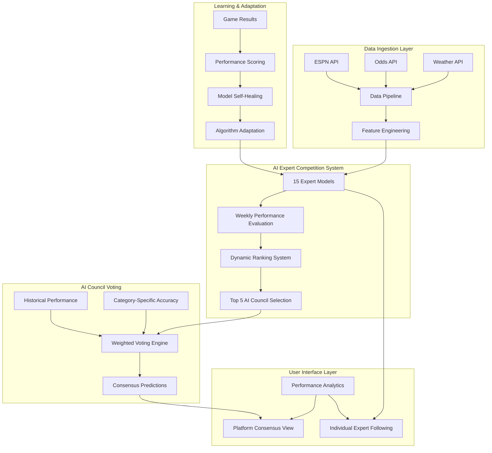
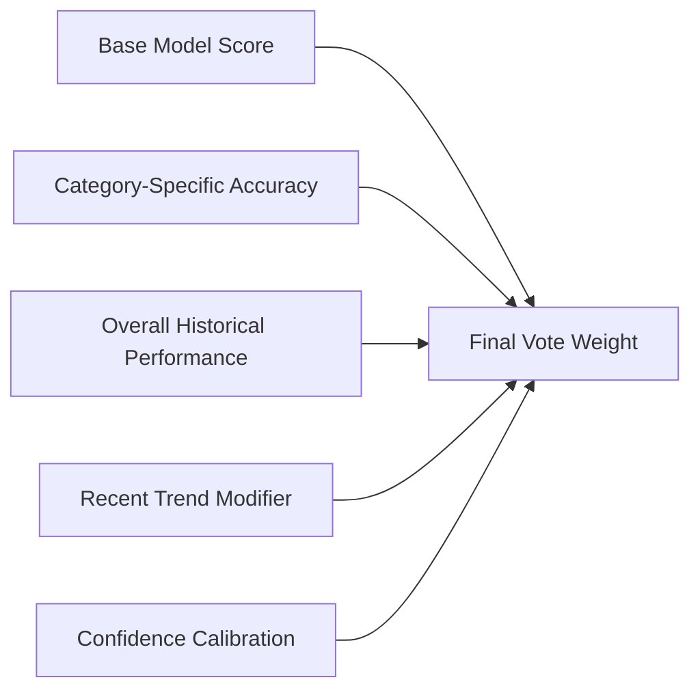
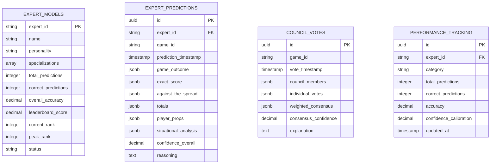
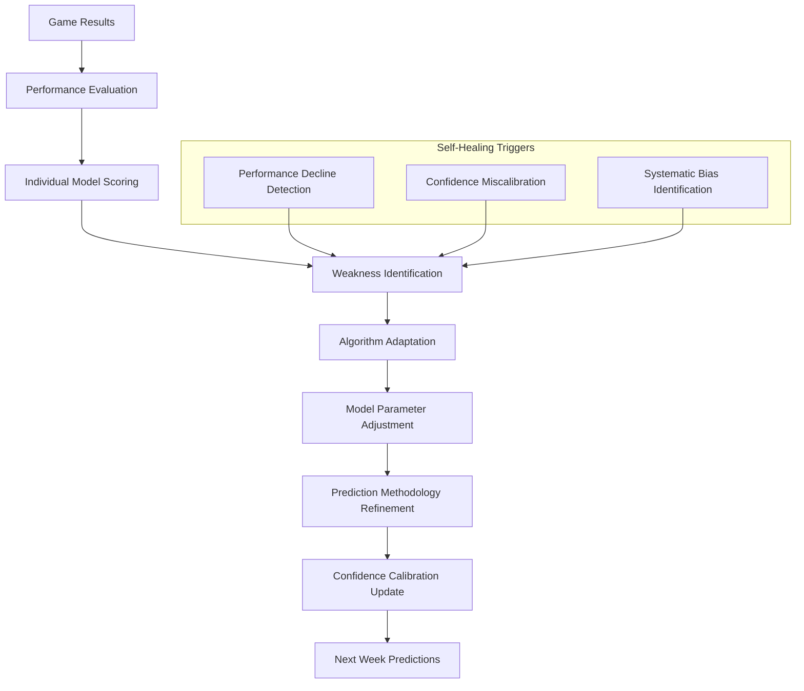
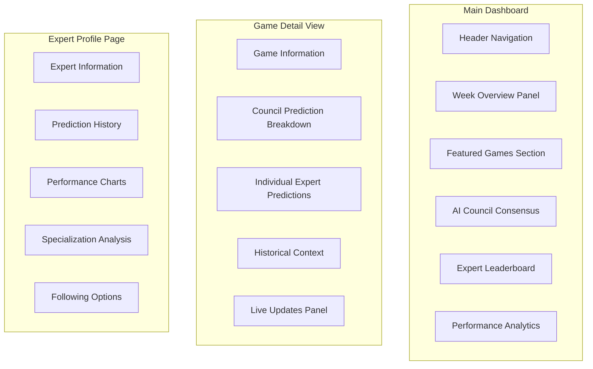
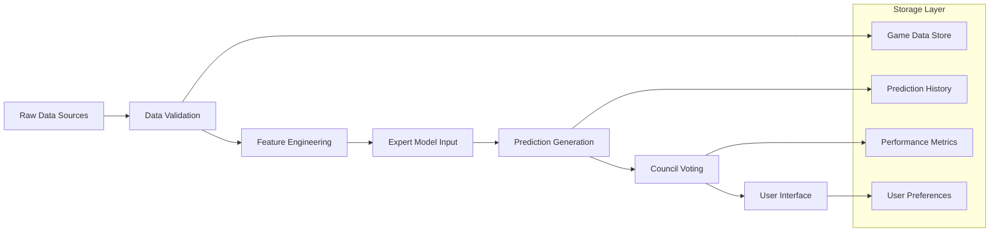

# AI-Powered Sports Prediction Platform Specification

## Overview

A sophisticated AI-driven sports prediction platform featuring 15 competing expert models in a hierarchical ranking system. The platform initially focuses on NFL predictions with planned expansion to other sports, utilizing a democratic council voting mechanism where the top-performing models make consensus predictions.

### Core Value Proposition
- **Competitive Intelligence**: 15 AI experts compete weekly, creating natural selection for the most accurate models
- **Dynamic Hierarchy**: Performance-based ranking ensures only the best models influence final predictions
- **Weighted Democracy**: AI Council voting system where expertise in specific bet types determines influence
- **Self-Improving System**: Models learn from outcomes and adapt their prediction strategies
- **Transparency**: Users can track individual model performance and follow specific experts

## System Architecture

### High-Level Architecture

### Expert Model Competition Framework

The platform operates 15 distinct AI expert models, each with unique personalities, specializations, and prediction methodologies:

#### Expert Model Categories

| Expert Type | Specialization | Methodology |
|-------------|----------------|-------------|
| Statistical Models | ELO, Bayesian Inference | Mathematical probability analysis |
| AI Language Models | Claude, Gemini, GPT | Natural language reasoning and pattern recognition |
| Market Analysts | Spread, Public Betting | Market efficiency and crowd psychology |
| Situational Specialists | Weather, Injuries, Momentum | Context-specific factor analysis |
| Performance Experts | Coaching, QB Analysis | Strategic and individual performance focus |

#### Individual Expert Personalities

| Expert Name | Core Philosophy | Primary Strengths |
|-------------|----------------|-------------------|
| Conservative Analyzer | Risk-averse, data-driven | High accuracy on favorites |
| Contrarian Rebel | Contrarian approach | Upset predictions and value finding |
| Weather Oracle | Environmental focus | Weather-dependent game outcomes |
| Injury Detective | Medical impact analysis | Player availability impact assessment |
| Momentum Tracker | Trend analysis | Recent performance patterns |
| Divisional Expert | Rivalry dynamics | Head-to-head historical patterns |
| QB Whisperer | Quarterback-centric | Quarterback performance correlation |
| Coaching Connoisseur | Strategic analysis | Game plan and tactical advantages |
| Home Field Hawk | Home advantage specialist | Venue-specific performance factors |
| Road Warrior | Away team value | Travel and hostile environment analysis |

## AI Council Voting Mechanism

### Council Formation
- **Dynamic Membership**: Top 5 performing models from weekly rankings
- **Evaluation Period**: Rolling 4-week performance window
- **Promotion/Demotion**: Models can enter/exit council based on performance

### Weighted Voting System

The AI Council employs a sophisticated weighting mechanism:

#### Vote Weight Calculation

#### Weighting Formula Components

| Component | Weight Factor | Description |
|-----------|---------------|-------------|
| Category Accuracy | 40% | Model's accuracy in specific bet type (spread, total, etc.) |
| Overall Performance | 30% | Historical accuracy across all prediction categories |
| Recent Trend | 20% | Performance trajectory over last 10 predictions |
| Confidence Calibration | 10% | How well model's confidence predicts actual success |

### Voting Process

1. **Prediction Generation**: Each council member generates predictions with confidence scores
2. **Weight Calculation**: Individual vote weights calculated based on historical performance
3. **Consensus Building**: Weighted average determines final prediction
4. **Confidence Scoring**: Overall council confidence based on agreement level
5. **Explanation Generation**: Natural language reasoning for final prediction

## Prediction Categories & Analysis

### Core Prediction Types (25+ categories per expert)

#### Game Outcome Predictions
- Winner prediction with probability
- Exact score prediction
- Margin of victory
- Moneyline value analysis

#### Betting Market Predictions
- Against the spread (ATS)
- Totals (Over/Under)
- First half winner
- Highest scoring quarter

#### Live Game Scenarios
- Real-time win probability updates
- Next score probability
- Drive outcome predictions
- Fourth down decision recommendations

#### Player Performance Props
- Quarterback statistics (yards, TDs, INTs)
- Running back performance (yards, attempts, TDs)
- Receiving statistics (yards, catches, TDs)
- Fantasy points projections

#### Situational Analysis
- Weather impact assessment
- Injury impact evaluation
- Travel and rest factors
- Divisional game dynamics
- Coaching matchup analysis
- Special teams performance
- Home field advantage quantification

### Prediction Data Model

## Self-Improving & Self-Healing Mechanisms

### Learning Pipeline Architecture

### Self-Improvement Features

#### Episodic Memory System
- **Game Memory Storage**: Each expert maintains detailed memory of past predictions and outcomes
- **Pattern Recognition**: Models identify recurring scenarios and adjust strategies
- **Similarity Matching**: Current games matched against historical similar situations
- **Learning Transfer**: Successful strategies from similar contexts applied to new predictions

#### Adaptive Algorithms
- **Dynamic Weighting**: Feature importance adjusted based on predictive success
- **Methodology Evolution**: Core prediction algorithms refined through performance feedback
- **Specialization Enhancement**: Models double-down on areas of demonstrated expertise
- **Bias Correction**: Systematic biases identified and corrected through statistical analysis

#### Self-Healing Mechanisms
- **Performance Monitoring**: Continuous tracking of prediction accuracy and confidence calibration
- **Decline Detection**: Automated identification of performance degradation
- **Recovery Protocols**: Systematic approaches to restore model performance
- **Emergency Interventions**: Extreme underperformance triggers comprehensive model review

### Learning Feedback Loop

| Trigger | Response | Timeline |
|---------|----------|----------|
| Single bad prediction | Confidence adjustment | Immediate |
| 3-game losing streak | Algorithm parameter tuning | Within 24 hours |
| Weekly rank drop | Methodology review | End of week |
| Sustained underperformance | Complete model rebuild | Monthly cycle |

## User Experience Design

### Platform Access Models

#### Consensus View (Primary Interface)
- **AI Council Predictions**: Aggregated predictions from top 5 performing models
- **Confidence Indicators**: Visual representation of council agreement levels
- **Breakdown Analysis**: Individual council member contributions to final prediction
- **Performance Tracking**: Historical accuracy of council predictions

#### Individual Expert Following
- **Expert Profiles**: Detailed information about each AI model's methodology and performance
- **Prediction History**: Complete track record of individual expert predictions
- **Specialization Focus**: Expert recommendations based on prediction category preferences
- **Performance Analytics**: Detailed statistics on expert accuracy across different scenarios

### User Interface Components

#### Dashboard Layout

#### Key Interface Elements

| Component | Purpose | Features |
|-----------|---------|----------|
| Council Consensus Card | Display aggregated AI predictions | Vote breakdown, confidence meters, reasoning |
| Expert Leaderboard | Show current rankings | Weekly movement, accuracy trends, specializations |
| Game Analysis Panel | Deep dive into specific matchups | Multiple prediction categories, factor analysis |
| Performance Dashboard | Track accuracy over time | Charts, statistics, trend analysis |
| Live Updates Feed | Real-time prediction adjustments | Game progress, probability changes |

### User Interaction Flows

#### Primary User Journey
1. **Landing**: User views weekly games with AI Council predictions
2. **Game Selection**: User clicks on specific game for detailed analysis
3. **Prediction Review**: User examines council consensus and individual expert opinions
4. **Expert Exploration**: User investigates specific expert performance and methodology
5. **Decision Making**: User makes informed betting or entertainment decisions
6. **Result Tracking**: User follows up on prediction accuracy and expert performance

#### Expert Following Journey
1. **Expert Discovery**: User browses expert leaderboard and specializations
2. **Performance Analysis**: User reviews historical accuracy and prediction style
3. **Following Setup**: User subscribes to specific expert's predictions
4. **Notification Preferences**: User customizes alerts for followed expert predictions
5. **Ongoing Engagement**: User receives regular updates and performance summaries

## Data Architecture & Requirements

### Data Sources Integration

#### Primary Data Feeds
- **ESPN API**: Game schedules, scores, player statistics, injury reports
- **Odds API**: Betting lines, line movement, public betting percentages
- **Weather Services**: Game-time weather conditions and forecasts
- **Team Statistics**: Advanced analytics including EPA, DVOA, success rates

#### Data Processing Pipeline

### Performance Analytics Framework

#### Expert Performance Metrics

| Metric Category | Specific Measurements | Purpose |
|----------------|----------------------|---------|
| Accuracy Tracking | Overall win percentage, category-specific accuracy | Rank experts and determine council membership |
| Confidence Calibration | Correlation between confidence and actual success | Improve prediction reliability |
| Trend Analysis | Performance over time, streak identification | Monitor expert form and trigger adaptations |
| Specialization Evaluation | Category-specific performance comparison | Optimize expert voting weights |
| Consensus Contribution | Individual impact on council decisions | Measure expert influence and value |

#### System-Wide Analytics

| Analysis Type | Key Indicators | Business Value |
|--------------|----------------|----------------|
| Prediction Accuracy | Council consensus success rate | Platform credibility and user trust |
| Expert Competition | Ranking volatility, performance spread | System health and competitive balance |
| User Engagement | Expert following patterns, prediction views | Product optimization and feature development |
| Learning Effectiveness | Model improvement rates, adaptation success | Platform intelligence and competitive advantage |

## Technical Implementation Considerations

### Scalability Architecture

#### Microservices Design
- **Expert Model Service**: Isolated prediction generation for each AI expert
- **Council Voting Service**: Aggregation and consensus building logic
- **Performance Analytics Service**: Comprehensive tracking and analysis
- **User Interface Service**: Frontend presentation and interaction
- **Data Pipeline Service**: External data integration and processing

#### Performance Optimization
- **Caching Strategy**: Frequently accessed predictions and performance data
- **Database Optimization**: Indexed queries for real-time performance
- **Async Processing**: Non-blocking prediction generation and updates
- **CDN Distribution**: Global content delivery for improved user experience

### Security & Reliability

#### Data Protection
- **API Security**: Rate limiting and authentication for external data sources
- **User Privacy**: Secure handling of user preferences and following patterns
- **Prediction Integrity**: Tamper-proof storage of expert predictions and outcomes

#### System Reliability
- **Failover Mechanisms**: Backup systems for critical prediction generation
- **Monitoring & Alerting**: Comprehensive system health tracking
- **Graceful Degradation**: Continued operation during partial system failures
- **Data Backup**: Regular snapshots of critical prediction and performance data

### Testing Strategy

#### Expert Model Validation
- **Backtesting Framework**: Historical data validation of prediction accuracy
- **A/B Testing**: Comparison of different expert algorithms and methodologies
- **Simulation Environment**: Safe testing of new expert models and voting mechanisms
- **Performance Benchmarking**: Standardized evaluation across all expert models

## Future Expansion Framework

### Multi-Sport Platform Evolution

#### Sport Integration Roadmap
1. **Phase 1**: NFL foundation (current focus)
2. **Phase 2**: College Football integration
3. **Phase 3**: NBA basketball predictions
4. **Phase 4**: MLB baseball analysis
5. **Phase 5**: International sports (soccer, tennis)

#### Sport-Specific Adaptations

| Sport | Unique Prediction Categories | Expert Specializations |
|-------|----------------------------|----------------------|
| College Football | Recruiting impact, conference dynamics | Academic calendar expert, rivalry specialist |
| NBA | Player load management, pace analysis | Analytics expert, injury management specialist |
| MLB | Pitcher matchups, weather impact | Sabermetrics expert, situational analyst |
| Soccer | Formation analysis, international play | Tactical expert, cultural dynamics analyst |

### Advanced Feature Development

#### Enhanced AI Capabilities
- **Multi-Modal Analysis**: Integration of video analysis and advanced statistics
- **Real-Time Adaptation**: Live game prediction updates during play
- **Cross-Sport Learning**: Knowledge transfer between different sports
- **User Personalization**: Individual user preference learning and customization

#### Community Features
- **User Challenges**: Prediction competitions against AI experts
- **Social Following**: Community-driven expert recommendations and discussions
- **Custom Expert Creation**: User-defined prediction parameters and methodologies
- **Educational Content**: Learning resources about prediction methodology and sports analysis