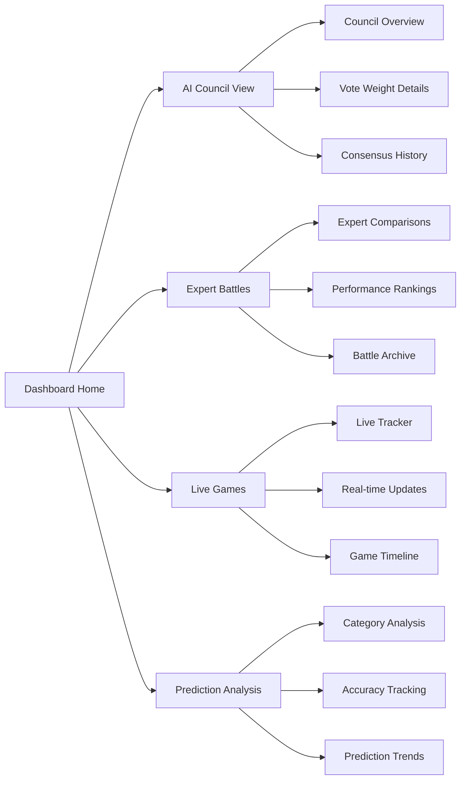
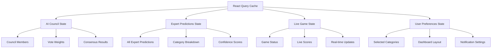
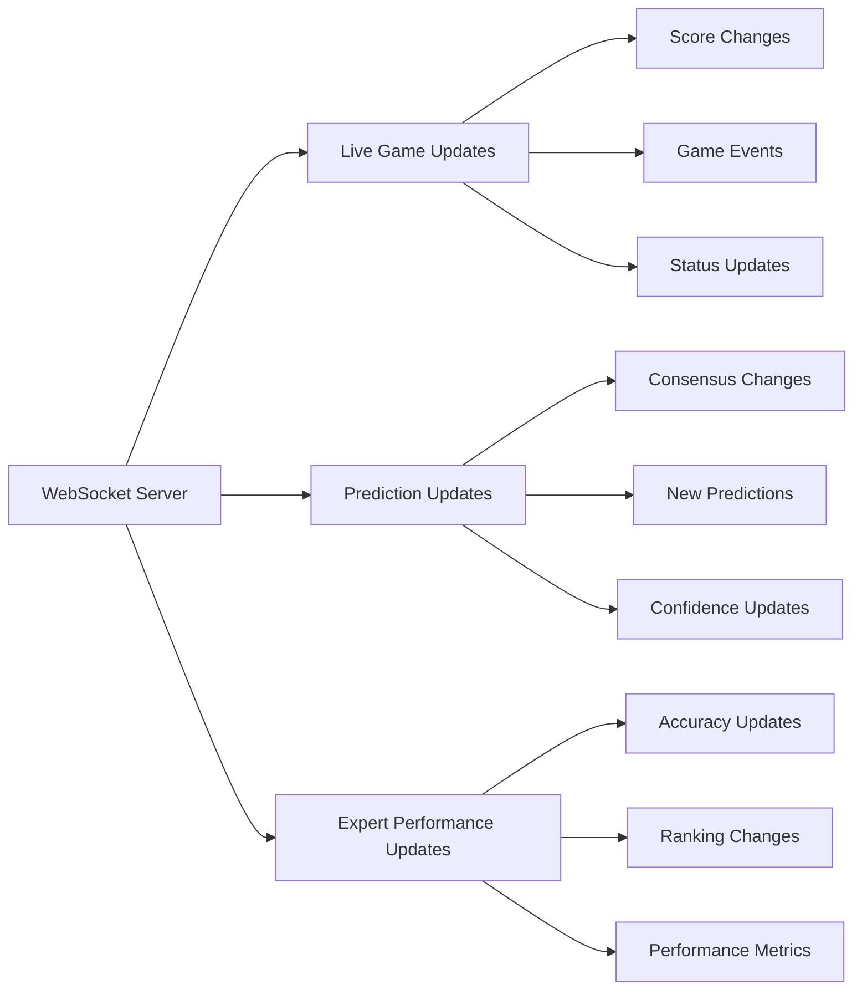
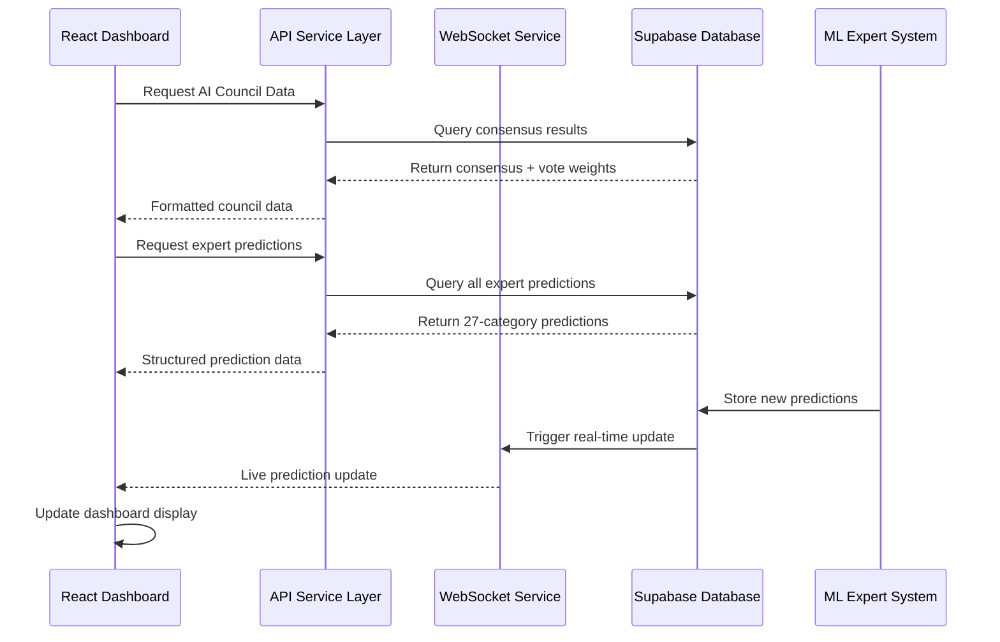
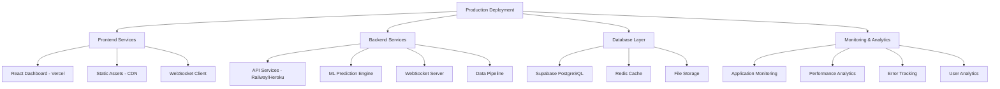
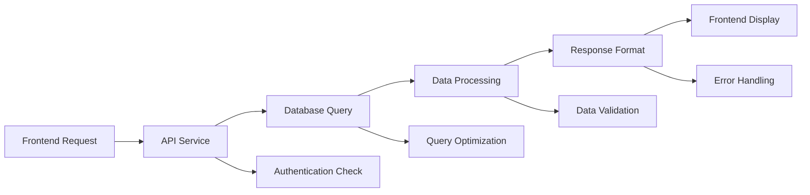
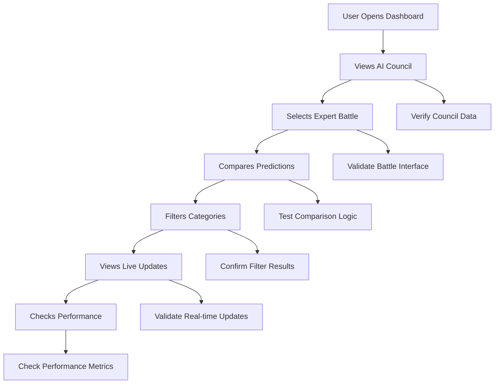

# Frontend Dashboard Enhancement Design

## Overview

This design outlines the comprehensive enhancement of the NFL Prediction Dashboard to display all 27 prediction categories from the AI Expert Competition System, implement AI Council consensus visualization with vote weights, and establish real-time data pipeline integration with production deployment capabilities.

The enhancement transforms the existing React dashboard from a basic prediction display into a sophisticated multi-expert analytics platform that showcases the full breadth of the AI competition framework's capabilities.

## Technology Stack & Dependencies

| Component | Technology | Version | Purpose |
|-----------|------------|---------|---------|
| Frontend Framework | React | 18.3.1 | Component-based UI development |
| Build Tool | Vite | 4.5.0 | Fast development and production builds |
| UI Library | Radix UI | Latest | Accessible component primitives |
| Styling | Tailwind CSS | 3.4.17 | Utility-first CSS framework |
| Data Fetching | TanStack Query | 5.87.4 | Server state management |
| Charts & Visualization | Recharts | 3.2.0 | React-based charting library |
| Animation | Framer Motion | 12.23.12 | Smooth UI transitions |
| Real-time Communication | WebSocket | 8.18.3 | Live data updates |
| Database | Supabase | 2.57.4 | PostgreSQL backend service |
| Icons | Lucide React | 0.544.0 | Icon system |

## Component Architecture

### Enhanced Dashboard Structure

```mermaid
graph TD
    A[NFLDashboard] --> B[AI Council Dashboard]
    A --> C[Expert Competition Panel]
    A --> D[Prediction Categories Grid]
    A --> E[Live Game Monitor]
    A --> F[Expert Battle Comparisons]
    
    B --> B1[Council Member Cards]
    B --> B2[Vote Weight Visualization]
    B --> B3[Consensus Confidence Meters]
    
    C --> C1[Expert Leaderboard]
    C --> C2[Performance Metrics]
    C --> C3[Ranking History]
    
    D --> D1[Game Outcome Grid]
    D --> D2[Betting Markets Grid]
    D --> D3[Live Scenarios Grid]
    D --> D4[Player Props Grid]
    D --> D5[Situational Analysis Grid]
    
    E --> E1[Live Score Tracker]
    E --> E2[Real-time Probability Updates]
    E --> E3[Game Event Timeline]
    
    F --> F1[Head-to-Head Comparisons]
    F --> F2[Expert Disagreement Analysis]
    F --> F3[Accuracy Battle Charts]
```



### Component Hierarchy

#### Enhanced AI Council Dashboard

- **AICouncilDashboard**: Main container for AI Council visualization
  - **CouncilMemberCard**: Individual expert display with vote weight
  - **VoteWeightBreakdown**: Detailed weight component analysis
  - **ConsensusVisualization**: Consensus confidence and agreement levels
  - **CouncilDecisionTimeline**: Historical decision tracking

#### Comprehensive Prediction Display

- **PredictionCategoriesGrid**: 27-category prediction display
  - **GameOutcomePanel**: Winner, scores, margin predictions
  - **BettingMarketsPanel**: Spread, totals, first half outcomes
  - **LiveScenariosPanel**: Real-time probability updates
  - **PlayerPropsPanel**: Individual player performance predictions
  - **SituationalAnalysisPanel**: Contextual factors assessment

#### Expert Competition Interface

- **ExpertBattleComparisons**: Head-to-head expert analysis
  - **ExpertComparisonCard**: Side-by-side expert performance
  - **DisagreementAnalysis**: Category-specific expert conflicts
  - **AccuracyBattleChart**: Visual performance comparisons
  - **SpecializationRadar**: Expert strength visualization

### Props/State Management

#### AI Council Dashboard Props

```typescript
interface AICouncilDashboardProps {
  gameId: string;
  councilMembers: CouncilMember[];
  consensusData: ConsensusResult[];
  voteWeights: VoteWeight[];
  onExpertSelect: (expertId: string) => void;
  refreshInterval: number;
}

interface CouncilMember {
  expertId: string;
  expertName: string;
  overallAccuracy: number;
  recentTrend: 'improving' | 'declining' | 'stable';
  voteWeight: VoteWeight;
  predictions: CategoryPrediction[];
}

interface VoteWeight {
  expertId: string;
  overallWeight: number;
  accuracyComponent: number;
  recentPerformanceComponent: number;
  confidenceComponent: number;
  councilTenureComponent: number;
  normalizedWeight: number;
}
```

#### Prediction Categories Props

```typescript
interface PredictionCategoriesGridProps {
  expertPredictions: ExpertPrediction[];
  consensusResults: ConsensusResult[];
  activeCategoryFilter: PredictionCategoryGroup | 'all';
  onCategorySelect: (categoryId: string) => void;
  showConfidenceIndicators: boolean;
}

interface CategoryPrediction {
  categoryId: string;
  categoryName: string;
  group: PredictionCategoryGroup;
  expertValue: any;
  consensusValue: any;
  confidence: number;
  agreement: number;
  isOutlier: boolean;
}
```

## Routing & Navigation

### Navigation Structure



### Route Configuration

| Route | Component | Purpose |
|-------|-----------|---------|
| `/` | NFLDashboard | Main dashboard with overview |
| `/council` | AICouncilDashboard | AI Council detailed view |
| `/battles` | ExpertBattleComparisons | Expert head-to-head analysis |
| `/live` | LiveGameDashboard | Real-time game tracking |
| `/predictions/:categoryGroup` | CategoryDetailView | Deep dive into category groups |
| `/expert/:expertId` | ExpertDetailView | Individual expert analysis |
| `/admin` | ExpertObservatory | Administrative interface |

## Styling Strategy

### Design System Architecture

#### Color Palette Strategy

| Purpose | Primary | Secondary | Accent | Usage |
|---------|---------|-----------|--------|-------|
| AI Council | Blue (#2563eb) | Navy (#1e40af) | Cyan (#06b6d4) | Council member cards, voting indicators |
| Expert Performance | Green (#16a34a) | Emerald (#059669) | Lime (#65a30d) | Accuracy metrics, performance indicators |
| Prediction Categories | Purple (#9333ea) | Violet (#7c3aed) | Indigo (#6366f1) | Category groupings, consensus displays |
| Live Data | Red (#dc2626) | Orange (#ea580c) | Yellow (#eab308) | Live updates, real-time indicators |
| Neutral | Gray (#6b7280) | Slate (#64748b) | Zinc (#71717a) | Background, text, borders |

#### Component Styling Patterns

```css
/* AI Council Member Card */
.council-member-card {
  @apply bg-gradient-to-br from-blue-50 to-blue-100 
         border-2 border-blue-200 rounded-xl p-6
         hover:shadow-lg transition-all duration-300;
}

/* Vote Weight Indicator */
.vote-weight-bar {
  @apply h-2 bg-gradient-to-r from-blue-400 to-blue-600 
         rounded-full transition-all duration-500;
}

/* Prediction Category Grid Item */
.category-grid-item {
  @apply bg-white border border-gray-200 rounded-lg p-4
         hover:border-purple-300 transition-colors duration-200;
}

/* Consensus Confidence Meter */
.confidence-meter {
  @apply relative h-3 bg-gray-200 rounded-full overflow-hidden;
}
```

#### Responsive Design Strategy

| Breakpoint | Layout | Navigation | Components |
|------------|---------|------------|------------|
| Mobile (<768px) | Single column, stacked cards | Bottom tab bar | Condensed card layouts |
| Tablet (768-1024px) | Two-column grid | Sidebar navigation | Medium card sizes |
| Desktop (>1024px) | Multi-column dashboard | Top navigation + sidebar | Full-featured cards |

## State Management

### React Query Configuration

#### Expert Data Queries

```typescript
// AI Council Data
const useAICouncilData = (gameId: string) => {
  return useQuery({
    queryKey: ['aiCouncil', gameId],
    queryFn: () => fetchAICouncilConsensus(gameId),
    refetchInterval: 30000, // 30 seconds
    staleTime: 15000
  });
};

// Expert Predictions
const useExpertPredictions = (gameId: string) => {
  return useQuery({
    queryKey: ['expertPredictions', gameId],
    queryFn: () => fetchExpertPredictions(gameId),
    refetchInterval: 60000, // 1 minute
    enabled: !!gameId
  });
};

// Live Game Data
const useLiveGameData = (gameId: string) => {
  return useQuery({
    queryKey: ['liveGame', gameId],
    queryFn: () => fetchLiveGameData(gameId),
    refetchInterval: 5000, // 5 seconds
    enabled: !!gameId
  });
};
```

#### State Architecture



### Local State Management

| Component | State Variables | Purpose |
|-----------|----------------|---------|
| AICouncilDashboard | selectedExpert, viewMode, sortOrder | Expert selection and display control |
| PredictionCategoriesGrid | activeFilter, expandedCategory, sortBy | Category filtering and organization |
| ExpertBattleComparisons | selectedExperts, comparisonMetric, timeRange | Expert comparison controls |
| LiveGameDashboard | autoRefresh, selectedGame, notificationSettings | Live data management |

## API Integration Layer

### Supabase Integration Architecture

#### Database Schema Integration

| Table | Purpose | Key Columns |
|-------|---------|-------------|
| experts | Expert metadata | expert_id, name, specialization, performance_metrics |
| expert_predictions | Individual predictions | expert_id, game_id, category_predictions, confidence |
| ai_council_consensus | Council decisions | game_id, consensus_results, vote_weights, timestamp |
| games | Game information | game_id, teams, status, live_data |
| expert_performance | Performance tracking | expert_id, accuracy_by_category, recent_trend |

#### API Service Layer

```typescript
// Supabase Client Configuration
const supabaseClient = createClient(
  process.env.REACT_APP_SUPABASE_URL,
  process.env.REACT_APP_SUPABASE_ANON_KEY
);

// API Service Functions
class PredictionAPIService {
  // Fetch AI Council consensus for a game
  async fetchAICouncilConsensus(gameId: string): Promise<ConsensusResult[]> {
    const { data, error } = await supabaseClient
      .from('ai_council_consensus')
      .select(`
        *,
        consensus_results,
        vote_weights,
        expert_predictions (
          expert_id,
          category_predictions,
          confidence_overall
        )
      `)
      .eq('game_id', gameId)
      .order('created_at', { ascending: false })
      .limit(1);
    
    if (error) throw new Error(error.message);
    return data?.[0] || null;
  }

  // Fetch all expert predictions for category breakdown
  async fetchExpertPredictions(gameId: string): Promise<ExpertPrediction[]> {
    const { data, error } = await supabaseClient
      .from('expert_predictions')
      .select(`
        *,
        experts (
          name,
          specialization,
          performance_metrics
        )
      `)
      .eq('game_id', gameId);
    
    if (error) throw new Error(error.message);
    return data || [];
  }

  // Fetch expert performance for battles
  async fetchExpertPerformance(expertIds: string[]): Promise<ExpertPerformance[]> {
    const { data, error } = await supabaseClient
      .from('expert_performance')
      .select('*')
      .in('expert_id', expertIds);
    
    if (error) throw new Error(error.message);
    return data || [];
  }
}
```

### Real-time Data Pipeline

#### WebSocket Integration



#### Real-time Update Handlers

```typescript
// WebSocket Hook for Live Updates
const useLiveUpdates = (gameId: string) => {
  const queryClient = useQueryClient();
  
  useEffect(() => {
    const ws = new WebSocket(process.env.REACT_APP_WS_URL);
    
    ws.onmessage = (event) => {
      const update = JSON.parse(event.data);
      
      switch (update.type) {
        case 'GAME_UPDATE':
          queryClient.invalidateQueries(['liveGame', gameId]);
          break;
        case 'PREDICTION_UPDATE':
          queryClient.invalidateQueries(['expertPredictions', gameId]);
          break;
        case 'CONSENSUS_UPDATE':
          queryClient.invalidateQueries(['aiCouncil', gameId]);
          break;
      }
    };
    
    return () => ws.close();
  }, [gameId, queryClient]);
};
```

## Data Flow Between Layers

### Frontend to Backend Communication



### Data Transformation Pipeline

#### Expert Prediction Processing

| Stage | Input | Processing | Output |
|-------|-------|------------|---------|
| Raw Data | Database records | Parse prediction JSON, validate categories | Structured ExpertPrediction objects |
| Category Grouping | Individual predictions | Group by PredictionCategoryGroup | Organized category displays |
| Consensus Calculation | Expert predictions + weights | Apply voting algorithm | ConsensusResult objects |
| UI Formatting | Structured data | Apply display formatting, confidence indicators | Renderable components |

#### Real-time Update Flow

| Event Type | Source | Processing | UI Update |
|------------|---------|------------|-----------|
| Game Score Update | ESPN API | Parse score, calculate impact | Live score display, probability updates |
| New Prediction | ML Expert System | Validate prediction, update consensus | Category grid refresh, council update |
| Expert Performance | Accuracy Calculator | Update metrics, recalculate rankings | Leaderboard update, weight adjustments |

## Enhanced Dashboard Features

### AI Council Consensus Display

#### Vote Weight Visualization

- **Weight Component Breakdown**: Visual representation of the 5-component weighting system (Accuracy 35%, Recent Performance 25%, Consistency 20%, Calibration 10%, Specialization 10%)
- **Dynamic Weight Bars**: Animated progress bars showing each expert's relative influence
- **Historical Weight Tracking**: Timeline view of how expert weights change over time
- **Weight Justification Tooltips**: Detailed explanations of why specific weights were assigned

#### Consensus Confidence Indicators

- **Agreement Level Meters**: Visual indicators showing how unified the council is on each prediction
- **Confidence Score Visualization**: Color-coded confidence levels across all 27 categories
- **Outlier Detection**: Highlighting experts whose predictions significantly deviate from consensus
- **Consensus Strength Indicators**: Showing which predictions have strong vs. weak council agreement

### 27-Category Prediction Grid

#### Category Organization Strategy

| Group | Categories | Display Priority | Visual Treatment |
|-------|------------|------------------|------------------|
| Game Outcome | Winner, Exact Scores, Margin | High | Large cards, prominent placement |
| Betting Markets | Spread, Totals, First Half | High | Medium cards, clear odds display |
| Live Scenarios | Win Probability, Next Score | Medium | Real-time updating cards |
| Player Props | QB/RB/WR Statistics | Medium | Compact cards, player photos |
| Situational | Weather, Injuries, Travel | Low | Smaller cards, contextual info |

#### Interactive Features

- **Category Filtering**: Toggle visibility by prediction group
- **Confidence Threshold Filtering**: Show only high-confidence predictions
- **Expert Agreement Filtering**: Display predictions with high/low consensus
- **Drill-down Details**: Click any category for detailed expert breakdown
- **Comparison Mode**: Side-by-side category comparisons across experts

### Expert Battle Comparisons

#### Head-to-Head Analysis Features

- **Accuracy Battle Charts**: Direct performance comparisons between selected experts
- **Category Specialization Radar**: Multi-dimensional view of expert strengths
- **Disagreement Heatmaps**: Visual representation of where experts disagree most
- **Historical Battle Archives**: Past performance in similar matchups
- **Prediction Confidence Comparisons**: Side-by-side confidence level analysis

#### Battle Metrics Dashboard

| Metric | Calculation | Purpose | Display |
|--------|-------------|---------|---------|
| Head-to-Head Record | Win/Loss in direct comparisons | Competitive ranking | W-L record with percentages |
| Category Dominance | Superior performance in specific categories | Specialization identification | Category-specific win rates |
| Consensus Alignment | How often expert agrees with council | Team player vs. contrarian analysis | Alignment percentage |
| Confidence Calibration | Prediction confidence vs. actual accuracy | Overconfidence detection | Calibration scatter plots |

## Production Deployment Architecture

### Deployment Infrastructure



### Auto-scaling Configuration

#### Frontend Scaling

| Component | Service | Scaling Trigger | Configuration |
|-----------|---------|-----------------|---------------|
| React Dashboard | Vercel | Automatic | Edge functions, global CDN |
| Static Assets | Vercel Edge | Traffic-based | Automatic geographic distribution |
| WebSocket Connections | Load Balancer | Connection count | Horizontal pod autoscaling |

#### Backend Scaling

| Service | Platform | Scaling Trigger | Max Instances |
|---------|----------|-----------------|---------------|
| API Services | Railway | CPU > 70% | 10 instances |
| ML Prediction Engine | Railway | Queue depth > 100 | 5 instances |
| WebSocket Server | Railway | Connection count > 1000 | 8 instances |
| Data Pipeline | Railway | Processing lag > 30s | 3 instances |

### Monitoring & Logging Strategy

#### Application Performance Monitoring

| Metric | Tool | Threshold | Alert Action |
|--------|------|-----------|-------------|
| Page Load Time | Vercel Analytics | > 2 seconds | Performance investigation |
| API Response Time | Custom metrics | > 500ms | Backend scaling trigger |
| WebSocket Latency | Socket.io metrics | > 100ms | Connection optimization |
| Error Rate | Sentry | > 1% | Immediate escalation |
| Database Performance | Supabase monitoring | Query time > 1s | Query optimization |

#### Game Day Scaling Preparation

| Time Period | Expected Load | Scaling Action |
|-------------|---------------|----------------|
| Pre-game (2 hours) | 2x normal | Pre-scale backend services |
| Game Start | 5x normal | Maximum instance allocation |
| Halftime | 3x normal | Maintain elevated capacity |
| Post-game (1 hour) | 4x normal | Gradual scale-down |

#### Error Handling & Recovery

| Failure Type | Detection Method | Recovery Action | Fallback Strategy |
|--------------|------------------|-----------------|-------------------|
| API Service Down | Health check failure | Auto-restart, failover | Mock data display |
| Database Connection | Connection timeout | Retry with backoff | Cached data serving |
| WebSocket Disconnection | Heartbeat failure | Automatic reconnection | Polling fallback |
| ML Model Failure | Prediction validation | Fallback to consensus | Historical data usage |

### Security Configuration

#### Authentication & Authorization

| Layer | Method | Configuration |
|-------|--------|---------------|
| Frontend | Supabase Auth | OAuth providers, JWT tokens |
| API Endpoints | Row Level Security | Expert-specific data access |
| Database | RLS Policies | Game and prediction data isolation |
| WebSocket | Token validation | Connection-level authentication |

#### Data Protection

| Data Type | Protection Method | Access Control |
|-----------|-------------------|----------------|
| Expert Predictions | Encryption at rest | Admin and expert-only access |
| User Preferences | Local storage encryption | User-specific isolation |
| API Keys | Environment variables | Service-level separation |
| Sensitive Configs | Vault storage | Deployment-time injection |

## Testing Strategy

### Component Testing

#### AI Council Dashboard Tests

```typescript
interface TestScenarios {
  voteWeightDisplay: {
    description: "Verify vote weight visualization accuracy";
    testCases: [
      "Weight component breakdown displays correctly",
      "Weight bars animate proportionally",
      "Tooltip information matches calculated weights"
    ];
  };
  
  consensusVisualization: {
    description: "Test consensus confidence indicators";
    testCases: [
      "Agreement level meters reflect actual consensus",
      "Confidence scores update in real-time",
      "Outlier detection highlights correctly"
    ];
  };
}
```

#### Prediction Categories Grid Tests

| Component | Test Focus | Coverage Requirements |
|-----------|------------|----------------------|
| CategoryGridItem | Data rendering, interaction | 95% line coverage |
| CategoryFilter | Filtering logic, state management | 90% branch coverage |
| PredictionComparison | Expert vs consensus accuracy | 100% function coverage |
| ConfidenceIndicator | Visual accuracy, threshold handling | 85% line coverage |

### Integration Testing

#### API Integration Tests



#### Real-time Update Tests

| Scenario | Test Data | Expected Behavior |
|----------|-----------|-------------------|
| New Prediction | ML system generates prediction | Dashboard updates within 5 seconds |
| Consensus Change | Council member weight update | Vote visualization reflects change |
| Game Score Update | Live score feed | Win probability updates automatically |
| Expert Performance | Accuracy calculation complete | Leaderboard repositions correctly |

### Performance Testing

#### Load Testing Scenarios

| Scenario | Concurrent Users | Duration | Success Criteria |
|----------|------------------|----------|-----------------|
| Normal Usage | 100 users | 10 minutes | < 2s page load, < 1% errors |
| Game Day Peak | 1000 users | 30 minutes | < 3s page load, < 2% errors |
| Stress Test | 2000 users | 5 minutes | System remains stable |
| Endurance Test | 200 users | 4 hours | No memory leaks, stable performance |

#### Performance Benchmarks

| Metric | Target | Measurement Method |
|--------|--------|--------------------|
| First Contentful Paint | < 1.5s | Lighthouse CI |
| Largest Contentful Paint | < 2.5s | Web Vitals monitoring |
| Cumulative Layout Shift | < 0.1 | Real user monitoring |
| Time to Interactive | < 3s | Performance profiling |

### End-to-End Testing

#### User Journey Tests



#### Critical User Flows

| Flow | Steps | Validation Points |
|------|-------|-------------------|
| View AI Council Consensus | Navigate → Select Game → View Council | Council data loads, weights display correctly |
| Compare Expert Predictions | Select Experts → Choose Categories → View Comparison | Comparison data accurate, visualizations clear |
| Monitor Live Game | Select Live Game → Enable Updates → Track Changes | Real-time updates function, data synchronizes |
| Analyze Expert Performance | Access Leaderboard → Select Expert → View Details | Performance data complete, trends accurate |
