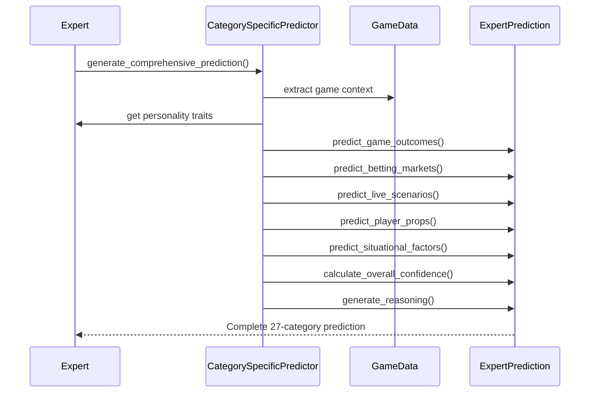
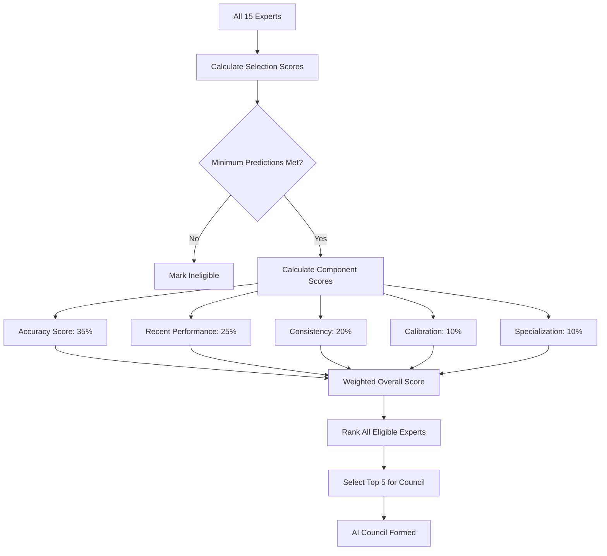
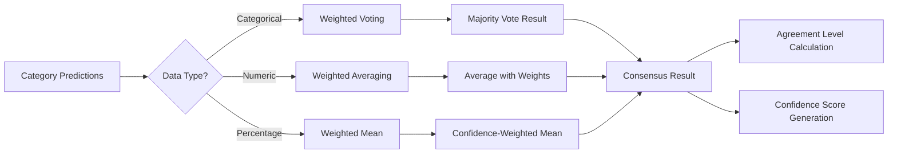
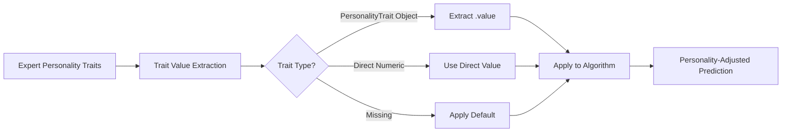

# Comprehensive Prediction Categories Implementation

## Overview

This document defines the implementation strategy for the complete 27-category comprehensive prediction system that is architecturally designed in the codebase. The system transitions from a simplified 18-category testing version to the full production-ready comprehensive prediction framework with proper AI Council consensus mechanisms.

## Architecture

### Prediction Category Framework

The system implements a structured approach to prediction categories through five main groups:

```mermaid
graph TD
    A[Comprehensive Prediction System] --> B[Game Outcome Group]
    A --> C[Betting Market Group]
    A --> D[Live Scenario Group]
    A --> E[Player Props Group]
    A --> F[Situational Analysis Group]
    
    B --> B1[Winner Prediction]
    B --> B2[Exact Score Home]
    B --> B3[Exact Score Away]
    B --> B4[Margin of Victory]
    
    C --> C1[Against the Spread]
    C --> C2[Totals Over/Under]
    C --> C3[First Half Winner]
    C --> C4[Highest Scoring Quarter]
    
    D --> D1[Live Win Probability]
    D --> D2[Next Score Probability]
    D --> D3[Drive Outcome Prediction]
    D --> D4[Fourth Down Decision]
    
    E --> E1[QB Passing Yards]
    E --> E2[QB Touchdowns]
    E --> E3[QB Interceptions]
    E --> E4[RB Rushing Yards]
    E --> E5[RB Touchdowns]
    E --> E6[WR Receiving Yards]
    E --> E7[WR Receptions]
    E --> E8[Fantasy Points Projection]
    
    F --> F1[Weather Impact Score]
    F --> F2[Injury Impact Score]
    F --> F3[Travel Rest Factor]
    F --> F4[Divisional Rivalry Factor]
    F --> F5[Coaching Advantage]
    F --> F6[Home Field Advantage]
    F --> F7[Momentum Factor]
```

### Category Definition Structure

Each prediction category follows a standardized definition model:

| Component | Purpose | Example Values |
|-----------|---------|----------------|
| Category ID | Unique identifier | "winner_prediction", "qb_passing_yards" |
| Category Name | Human-readable name | "Winner Prediction", "QB Passing Yards" |
| Group | Category grouping | GAME_OUTCOME, PLAYER_PROPS |
| Data Type | Value type constraint | CATEGORICAL, NUMERIC, PERCENTAGE |
| Validation Rules | Value constraints | min/max ranges, choice lists |
| Scoring Weight | Accuracy importance | 1.5 for winner, 0.8 for exact score |
| Difficulty Level | Prediction complexity | easy, medium, hard |
| Live Data Requirement | Real-time dependency | true for live scenarios |

### Expert Prediction Generation

The system generates comprehensive predictions through personality-driven algorithms:

## AI Council Selection and Voting System

### Council Selection Criteria

The AI Council selection uses a 5-component weighted scoring system:

| Selection Component | Weight | Purpose |
|-------------------|--------|---------|
| Overall Accuracy | 35% | Historical prediction correctness |
| Recent Performance | 25% | Trending accuracy in evaluation window |
| Consistency | 20% | Prediction reliability and variance |
| Confidence Calibration | 10% | Accuracy of confidence estimates |
| Specialization Strength | 10% | Expert category-specific expertise |

### Dynamic Council Selection Process

### Voting Weight Calculation

Council member voting weights are determined through a 4-component system:

| Vote Weight Component | Weight | Description |
|----------------------|--------|-------------|
| Accuracy Component | 40% | Overall prediction accuracy |
| Recent Performance | 30% | Performance in recent games |
| Confidence Component | 20% | Confidence calibration quality |
| Council Tenure | 10% | Experience in council decisions |

### Consensus Generation Methodology

The consensus system handles different prediction types:

## Category-Specific Implementation

### Game Outcome Predictions (4 Categories)

**Winner Prediction**

- Data Type: Categorical (home, away)
- Algorithm: Personality-adjusted probability model
- Validation: Must be "home" or "away"
- Scoring Weight: 1.5

**Exact Score Predictions**

- Data Type: Numeric (0-70 points)
- Algorithm: Total point distribution with personality bias
- Validation: Non-negative, realistic maximum
- Scoring Weight: 0.8 (high difficulty)

**Margin of Victory**

- Data Type: Numeric (0-50 points)
- Algorithm: Derived from score predictions
- Validation: Non-negative, reasonable maximum
- Scoring Weight: 1.2

### Betting Market Predictions (4 Categories)

**Against the Spread**

- Data Type: Categorical (home, away, push)
- Algorithm: Contrarian tendency vs. consensus
- Validation: Valid spread outcome
- Scoring Weight: 1.4

**Totals Over/Under**

- Data Type: Categorical (over, under, push)
- Algorithm: Score prediction vs. line
- Validation: Valid total outcome
- Scoring Weight: 1.3

### Live Scenario Predictions (4 Categories)

**Live Win Probability**

- Data Type: Percentage (0.0-1.0)
- Algorithm: Dynamic probability with chaos comfort
- Validation: Valid probability range
- Scoring Weight: 0.9
- Live Data Required: Yes

**Next Score Probability**

- Data Type: Categorical (touchdown, field_goal, safety, none)
- Algorithm: Intuition-weighted outcome prediction
- Validation: Valid scoring outcome
- Scoring Weight: 0.8
- Live Data Required: Yes

### Player Props Predictions (8 Categories)

**QB Passing Yards**

- Data Type: Numeric (0-600 yards)
- Algorithm: Game total correlation with optimism adjustment
- Validation: Realistic yardage range
- Scoring Weight: 1.1

**Player Performance Metrics**

- Touchdowns, Interceptions, Rushing/Receiving statistics
- Algorithm: Position-specific performance models
- Validation: Sport-realistic ranges
- Scoring Weights: 0.8-1.0 based on predictability

### Situational Analysis Predictions (7 Categories)

**Weather Impact Score**

- Data Type: Percentage (0.0-1.0)
- Algorithm: Temperature, wind, precipitation analysis
- Validation: Impact probability range
- Scoring Weight: 0.8

**Injury Impact Score**

- Data Type: Percentage (0.0-1.0)
- Algorithm: Starter availability and severity weighting
- Validation: Impact assessment range
- Scoring Weight: 0.9

**Travel/Rest Factor**

- Data Type: Numeric (-0.5 to 0.5)
- Algorithm: Rest days differential and travel distance
- Validation: Reasonable advantage range
- Scoring Weight: 0.6

## Personality-Driven Algorithm Customization

### Expert Personality Traits Integration

The system customizes prediction algorithms based on expert personality traits:

| Personality Trait | Impact on Predictions | Algorithm Adjustment |
|------------------|----------------------|----------------------|
| Risk Tolerance | Extreme vs. conservative picks | Probability amplification factor |
| Analytics Trust | Data vs. intuition weighting | Model confidence vs. gut feeling |
| Contrarian Tendency | Against consensus picks | Public sentiment inverse correlation |
| Optimism Level | Player performance expectations | Statistical output adjustments |
| Chaos Comfort | Live scenario adaptability | Volatility acceptance in live updates |

### Trait Value Application

## Confidence and Reasoning Framework

### Multi-Level Confidence System

The system generates confidence at multiple levels:

1. **Category-Specific Confidence**: Individual prediction confidence per category
2. **Overall Prediction Confidence**: Weighted average of category confidences
3. **Personality-Adjusted Confidence**: Expert confidence trait integration

### Reasoning Generation Components

**Key Factor Identification**

- Weather conditions (impact > 0.5)
- Key injuries (impact > 0.3)
- Divisional rivalry dynamics
- Travel/rest advantages
- Momentum factors

**Personality-Specific Reasoning**

- Analytics-driven experts: Statistical model emphasis
- Intuition-driven experts: Situational awareness focus
- Contrarian experts: Public sentiment opposition
- Risk-tolerant experts: Bold prediction justification

## Data Validation and Quality Assurance

### Validation Rule Framework

Each category implements comprehensive validation:

| Rule Type | Purpose | Examples |
|-----------|---------|----------|
| Range | Numeric boundaries | Temperature: -20 to 120°F |
| Choices | Categorical options | Winner: ["home", "away"] |
| Min/Max | Absolute limits | Score: min=0, max=70 |
| Dependencies | Cross-category logic | Margin derives from scores |

### Quality Metrics

**Prediction Quality Indicators**

- Validation rule compliance rate
- Confidence calibration accuracy
- Category completion percentage
- Cross-category consistency

**Expert Performance Tracking**

- Historical accuracy by category
- Confidence vs. actual outcomes
- Specialization strength measurement
- Trend analysis (improving/declining/stable)

## Testing Strategy

### Unit Testing Coverage

**Category Definition Testing**

- Validation rule enforcement
- Data type constraint verification
- Scoring weight application
- Difficulty level assignment

**Algorithm Testing**

- Personality trait integration
- Game data processing
- Prediction generation completeness
- Confidence calculation accuracy

**Consensus Testing**

- Vote weight calculation
- Consensus result generation
- Agreement level computation
- Tie-breaking mechanisms

### Integration Testing Scenarios

**End-to-End Prediction Flow**

1. Game data input validation
2. Expert prediction generation (all 27 categories)
3. AI Council selection verification
4. Consensus calculation accuracy
5. Output format compliance

**Performance Testing**

- 15 experts × 27 categories prediction speed
- Memory usage with full category system
- Database operation efficiency
- Real-time update capability

## Production Deployment Considerations

### System Performance Optimization

**Prediction Generation Efficiency**

- Parallel expert prediction processing
- Category algorithm optimization
- Memory-efficient data structures
- Caching for repeated calculations

**Database Schema Alignment**

- Category-specific table columns
- Expert prediction storage format
- Historical accuracy tracking tables
- Performance metrics persistence

### Monitoring and Alerting

**System Health Metrics**

- Prediction generation success rate
- Category completion percentage
- Expert availability status
- Consensus calculation time

**Quality Monitoring**

- Accuracy tracking by category
- Confidence calibration monitoring
- Expert performance degradation alerts
- Prediction validation failure tracking
