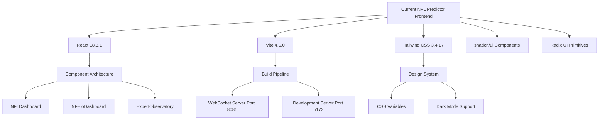
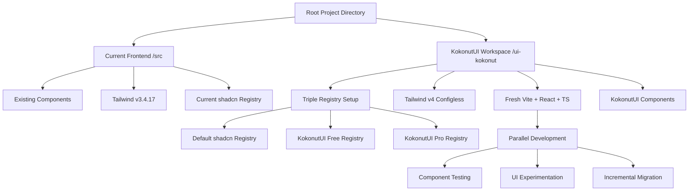
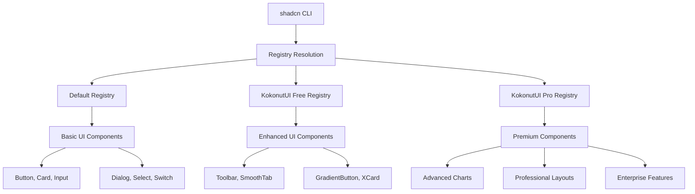
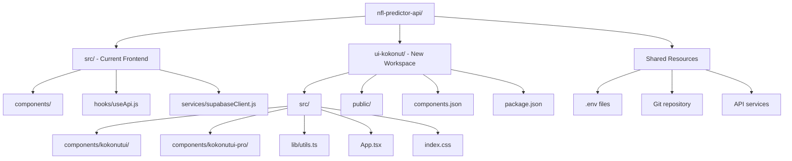
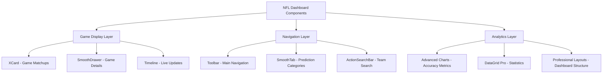
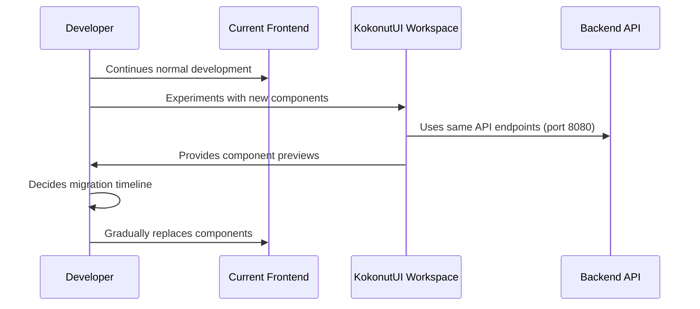
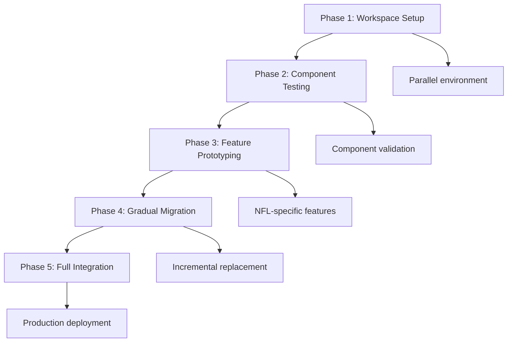
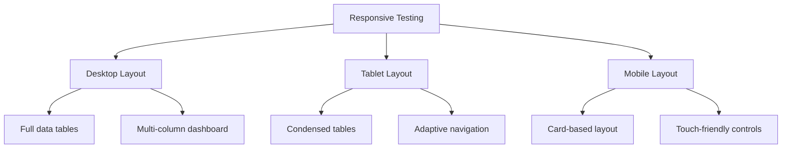
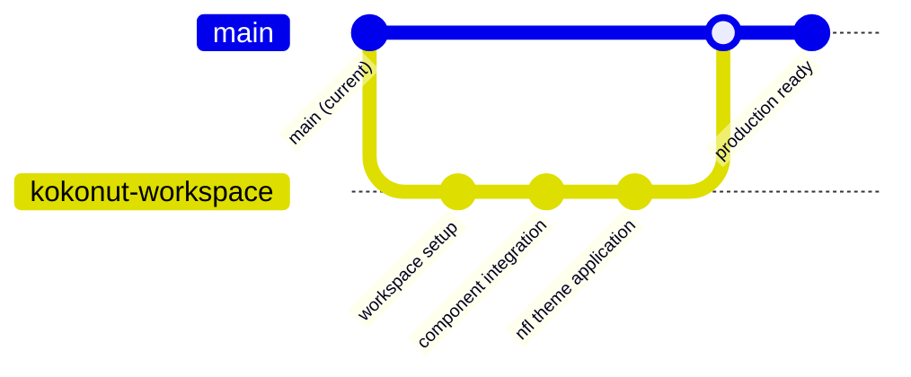
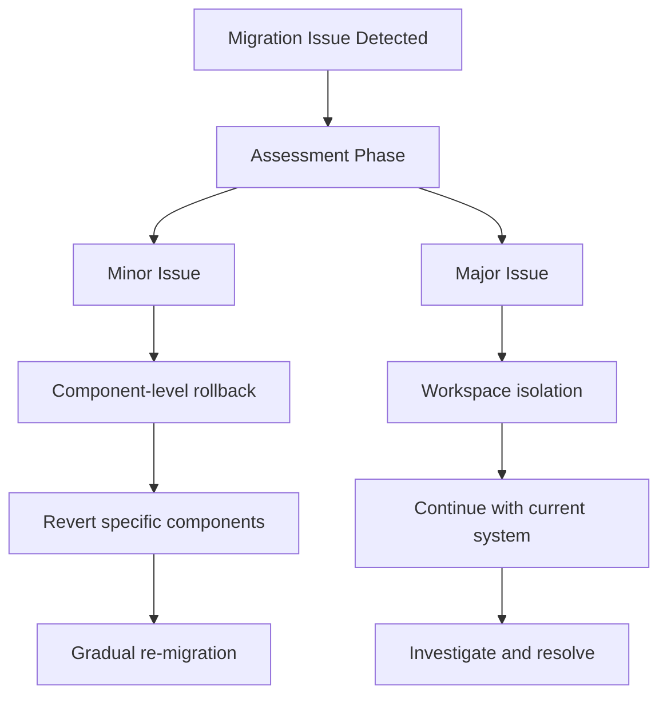

# KokonutUI Workspace Setup Design

## Overview

This design outlines the creation of a parallel KokonutUI workspace alongside the existing NFL Predictor API frontend, enabling incremental migration to modern UI components while preserving the current functional application. The solution establishes a non-destructive pathway for upgrading the frontend technology stack from Tailwind CSS v3 to v4, integrating shadcn/ui with both free KokonutUI and KokonutUI Pro registries.

**Strategic Intent**: Create a parallel development environment that allows experimentation with advanced UI components without disrupting the production-ready NFL prediction dashboard, enabling gradual migration and technology stack modernization with access to premium components.

## Architecture

### Current System Architecture

The existing system operates on a React + Vite + TypeScript foundation with the following characteristics:



### Proposed Parallel Architecture

The new architecture introduces a parallel workspace structure that coexists with the existing system:



### Technology Stack Evolution

| Component | Current System | KokonutUI Workspace |
|-----------|----------------|-------------------|
| React | 18.3.1 | 18.3.1 (maintained) |
| TypeScript | 5.2.2 | 5.2.2 (maintained) |
| Vite | 4.5.0 | Latest (fresh install) |
| Tailwind CSS | v3.4.17 with config | v4 configless |
| shadcn/ui | Default registry only | Triple registry (default + kokonut + pro) |
| Component Library | Radix UI primitives | Enhanced with KokonutUI Pro |
| Development Port | 5173 | Separate port (auto-assigned) |
| API Integration | Port 8080 (FastAPI) | Maintained compatibility |

## Registry Configuration Strategy

### Multi-Registry Architecture

The workspace supports three distinct component registries for maximum flexibility:



### Registry Configuration Schema

```json
{
  "registries": [
    {
      "name": "default",
      "url": "https://ui.shadcn.com"
    },
    {
      "name": "kokonutui", 
      "url": "https://registry.kokonutui.com"
    },
    {
      "name": "@kokonutui-pro",
      "url": "https://kokonutui.pro/api/r/{name}",
      "headers": {
        "X-API-Key": "${KOKO_PRO_TOKEN}"
      }
    }
  ]
}
```

### Environment Variable Management

The Pro registry requires secure token management through environment variables:

| Variable | Purpose | Scope |
|----------|---------|-------|
| `KOKO_PRO_TOKEN` | Authentication for KokonutUI Pro registry | Development & Build |
| `VITE_SUPABASE_URL` | Backend database connection | Maintained from existing |
| `VITE_SUPABASE_ANON_KEY` | Database authentication | Maintained from existing |

## Workspace Structure Design

### Directory Organization Strategy



### File System Layout

```
nfl-predictor-api/
├── src/                          # Current frontend (untouched)
│   ├── components/NFLDashboard.current.jsx
│   ├── hooks/useApi.js
│   ├── services/supabaseClient.js
│   └── ...existing structure
├── ui-kokonut/                   # New parallel workspace
│   ├── src/
│   │   ├── components/
│   │   │   ├── kokonutui/        # Free KokonutUI components
│   │   │   └── kokonutui-pro/    # Pro KokonutUI components
│   │   ├── lib/
│   │   │   └── utils.ts          # cn utility and helpers
│   │   ├── App.tsx               # NFL-themed test application
│   │   ├── main.tsx              # Entry point
│   │   └── index.css             # Tailwind v4 imports
│   ├── public/
│   ├── components.json           # Triple registry configuration
│   ├── package.json              # Workspace dependencies
│   ├── vite.config.ts            # Workspace-specific config
│   ├── .env.local                # Pro token configuration
│   └── tailwind.config.js        # Minimal v4 config
└── package.json                  # Root project (unchanged)
```

## Component Integration Framework

### KokonutUI Component Selection for Sports Analytics

#### Core Interface Components (Free Registry)

- **Toolbar**: Main navigation and controls for dashboard switching
- **SwitchButton**: Toggle between compact/comfortable view modes
- **ActionSearchBar**: Team and game search functionality
- **GradientButton**: Primary action buttons for predictions
- **XCard**: Game card displays with team matchups
- **SmoothTab**: Navigation between prediction categories
- **SmoothDrawer**: Expandable game detail panels

#### Enhanced Analytics Components (Pro Registry)

- **Advanced Charts**: Interactive prediction accuracy visualizations
- **DataGrid Pro**: Comprehensive game statistics tables
- **Timeline Components**: Game progression and live updates
- **Professional Layouts**: Enterprise-grade dashboard structures
- **Custom Animations**: Smooth transitions for real-time data

### Component Mapping Strategy

| Current Component | KokonutUI Replacement | Registry | Enhancement |
|------------------|----------------------|----------|-------------|
| Basic Card | XCard | Free | Visual hierarchy |
| Button | GradientButton | Free | Modern styling |
| Search Input | ActionSearchBar | Free | Enhanced UX |
| Tab Navigation | SmoothTab | Free | Smooth animations |
| Game Details | SmoothDrawer | Free | Expandable panels |
| Charts | Advanced Charts | Pro | Interactive analytics |
| Data Tables | DataGrid Pro | Pro | Professional features |

### NFL-Specific Component Applications



## Development Workflow Design

### Parallel Development Strategy

The workspace enables non-disruptive development through isolated environments:



### Component Testing Workflow

| Phase | Activity | Environment | Validation |
|-------|----------|-------------|------------|
| 1 | Component Installation | ui-kokonut workspace | Successful build |
| 2 | NFL Theme Integration | Test application | Visual consistency |
| 3 | API Connectivity | Backend services | Data flow validation |
| 4 | Responsive Testing | Multiple viewports | Mobile compatibility |
| 5 | Performance Validation | Production build | Load time metrics |

### Migration Pathway Strategy



## Implementation Architecture

### Build Configuration Strategy

The workspace maintains compatibility with existing build processes while introducing modern tooling:

#### Vite Configuration Schema

```typescript
// vite.config.ts structure
{
  plugins: [react()],
  resolve: {
    alias: {
      "@": path.resolve(__dirname, "./src"),
    }
  },
  server: {
    port: "auto-assigned",
    proxy: {
      "/api": "http://localhost:8080"  // Maintain API compatibility
    }
  }
}
```

#### Tailwind v4 Integration Pattern

```css
/* index.css structure */
@import "tailwindcss";
@import "tailwindcss/theme";
@import "tailwindcss/utilities";

/* NFL-specific design tokens */
:root {
  --nfl-primary: theme(colors.blue.600);
  --nfl-secondary: theme(colors.green.500);
  --prediction-accuracy: theme(colors.emerald.400);
}
```

### API Integration Continuity

The workspace maintains seamless integration with existing backend services:

| Service | Current Integration | Workspace Integration |
|---------|-------------------|---------------------|
| FastAPI Backend | Port 8080 | Proxied through Vite |
| WebSocket Server | Port 8081 | Maintained connection |
| Supabase Database | Environment variables | Shared configuration |
| Expert Predictions | useApi.js hook | Compatible data flow |

### Security Configuration Framework

#### Environment Variable Security

```bash
# .env.local structure
KOKO_PRO_TOKEN=50c70146-ba8a-4331-a32f-592dccb7a483
VITE_SUPABASE_URL=${existing_value}
VITE_SUPABASE_ANON_KEY=${existing_value}
```

#### Token Management Strategy

- Pro token stored in workspace-specific .env.local
- Excluded from version control via .gitignore
- Build-time injection for component registry access
- Development-only exposure (not client-side)

## Testing Framework Design

### Component Validation Strategy

The workspace includes comprehensive testing for NFL-specific use cases:

#### Visual Testing Matrix

| Component | Test Scenario | Expected Behavior |
|-----------|---------------|------------------|
| XCard | Game matchup display | Team logos, scores, predictions |
| SmoothTab | Betting categories | Spread, total, moneyline tabs |
| ActionSearchBar | Team search | Real-time filtering |
| Toolbar | Dashboard switching | NFLDashboard ↔ NFEloDashboard |
| Advanced Charts | Prediction accuracy | Interactive data visualization |

#### Responsive Design Validation



### Performance Benchmarking Framework

#### Load Time Optimization Targets

| Metric | Current System | Target Improvement |
|--------|----------------|-------------------|
| Initial Bundle Size | Current baseline | < 20% increase |
| Time to Interactive | Current baseline | Maintained or improved |
| Component Load Time | Current baseline | < 100ms per component |
| Memory Usage | Current baseline | Optimized through tree-shaking |

#### API Integration Performance

- Maintain existing API response times
- Preserve WebSocket connection stability
- Ensure backward compatibility with current hooks
- Validate data flow integrity

## Deployment Integration Design

### Production Readiness Strategy

The workspace design ensures seamless integration with existing deployment infrastructure:

#### Docker Configuration Compatibility

```dockerfile
# Potential Dockerfile.kokonut extension
FROM node:18-alpine
WORKDIR /app/ui-kokonut
COPY ui-kokonut/package*.json ./
RUN npm install
COPY ui-kokonut/ .
RUN npm run build
```

#### Environment Configuration Strategy

| Environment | Configuration | KokonutUI Pro Access |
|-------------|---------------|---------------------|
| Development | .env.local | Full access with token |
| Staging | .env.staging | Limited Pro components |
| Production | .env.production | Licensed Pro components |

### Git Workflow Integration

The workspace maintains compatibility with existing Git practices:

#### Branch Strategy



#### Repository Structure Considerations

- Workspace files included in main repository
- .gitignore updated for workspace-specific excludes
- Pro token excluded from version control
- Component library builds cached appropriately

## Risk Mitigation Framework

### Technical Risk Assessment

| Risk Category | Potential Impact | Mitigation Strategy |
|---------------|------------------|-------------------|
| Registry Availability | Component installation failure | Fallback to cached components |
| Pro Token Expiry | Limited component access | Token renewal procedures |
| Version Conflicts | Build system incompatibility | Isolated workspace dependencies |
| Performance Regression | Slower application load | Performance monitoring benchmarks |

### Rollback Strategy Design



### Operational Continuity Measures

- Current frontend remains fully functional during workspace development
- API services maintain backward compatibility
- Database connections preserved through shared configuration
- WebSocket functionality unaffected by workspace activities

## Integration Pathway Specification

### Component Migration Timeline

#### Phase 1: Foundation (Week 1)

- Workspace environment setup
- Registry configuration with Pro access
- Basic component installation and validation
- NFL theme color scheme integration

#### Phase 2: Core Components (Week 2)

- XCard implementation for game displays
- Toolbar integration for navigation
- ActionSearchBar for team/game search
- SmoothTab for betting category navigation

#### Phase 3: Advanced Features (Week 3)

- SmoothDrawer for game detail expansion
- Advanced Charts for prediction analytics
- Professional layout components
- Responsive design optimization

#### Phase 4: Production Integration (Week 4)

- Component replacement in main application
- Performance optimization and testing
- Production build configuration
- Deployment pipeline integration

### Success Metrics Definition

| Metric Category | Measurement | Success Criteria |
|----------------|-------------|-----------------|
| User Experience | Interface responsiveness | < 100ms interaction delay |
| Visual Quality | Design consistency | 100% component theme alignment |
| Performance | Bundle size impact | < 20% increase from baseline |
| Functionality | Feature parity | All current features preserved |
| Development Efficiency | Component development time | 50% faster component creation |
