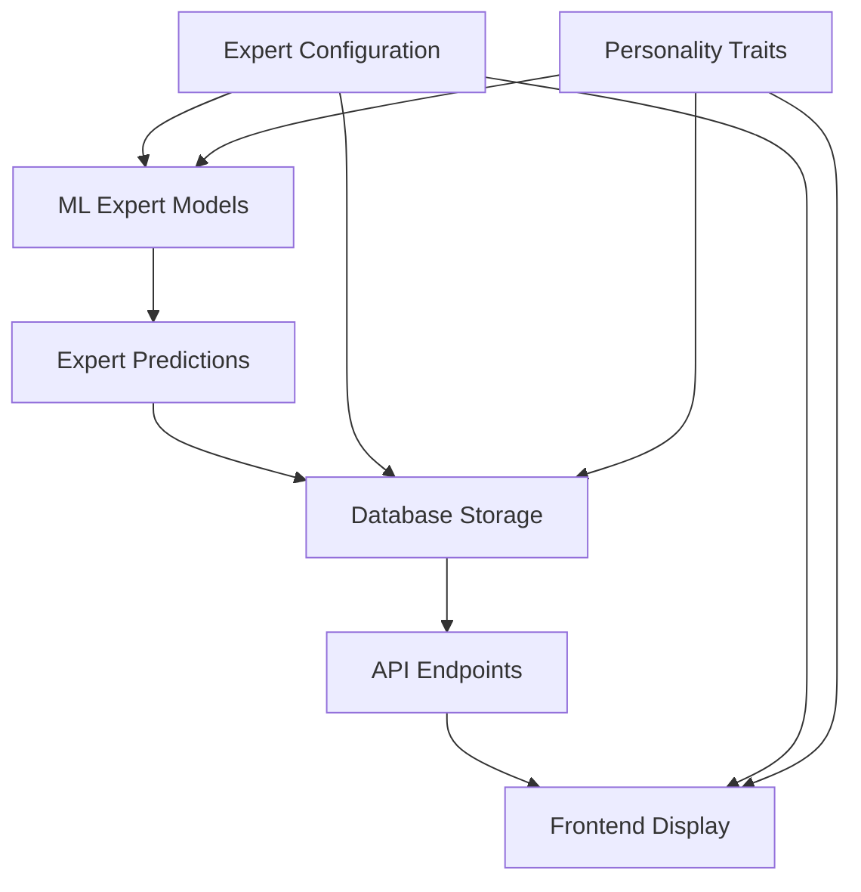

# Expert Naming System Standardization Design

## Overview

The NFL Predictor API system has a critical inconsistency where different components use different expert naming conventions. The backend machine learning models correctly implement the 15 personality-based experts, but the database, frontend, and some service layers use incorrect generic names. This design establishes a unified expert naming standard across all system components.

## Problem Analysis

### Current State Assessment

The system currently has **three different expert naming conventions**:

1. **Correct Backend ML Models**: Use proper personality names (The Analyst, The Gambler, The Rebel, etc.)
2. **Database Storage**: Contains incorrect generic names (The Weather Watcher, The Veteran, etc.)
3. **Frontend Display**: Shows mismatched names from database

### Evidence of Inconsistency

**Database Expert Records:**

- the_weather_watcher → "The Weather Watcher"
- the_veteran → "The Veteran"
- the_chaos_theorist → "The Chaos Theorist"
- the_upset_specialist → "The Upset Specialist"

**Correct Backend Implementation:**

- conservative_analyzer → "The Analyst"
- risk_taking_gambler → "The Gambler"
- contrarian_rebel → "The Rebel"
- value_hunter → "The Hunter"

## Target Expert Architecture

### The 15 Personality-Based Experts

The system should standardize on these expert identities:

| Expert ID | Display Name | Personality Type | Core Trait |
|-----------|--------------|------------------|------------|
| conservative_analyzer | The Analyst | Conservative | Data-driven analysis |
| risk_taking_gambler | The Gambler | Risk-Taking | High-risk opportunities |
| contrarian_rebel | The Rebel | Contrarian | Anti-consensus plays |
| value_hunter | The Hunter | Value-Seeking | Market inefficiencies |
| momentum_rider | The Rider | Momentum | Trend following |
| fundamentalist_scholar | The Scholar | Fundamentalist | Deep research |
| chaos_theory_believer | The Chaos | Randomness | Variance acceptance |
| gut_instinct_expert | The Intuition | Gut-Feel | Instinct-based |
| statistics_purist | The Quant | Statistics | Mathematical models |
| trend_reversal_specialist | The Reversal | Mean-Reversion | Pattern breaks |
| popular_narrative_fader | The Fader | Anti-Narrative | Story resistance |
| sharp_money_follower | The Sharp | Smart Money | Professional tracking |
| underdog_champion | The Underdog | Upset-Seeker | Underdog value |
| consensus_follower | The Consensus | Crowd-Following | Public sentiment |
| market_inefficiency_exploiter | The Exploiter | Inefficiency-Hunting | Edge identification |

### Personality Trait Architecture

Each expert operates with distinct personality characteristics:

**Decision-Making Patterns:**

- Risk Tolerance: conservative, moderate, aggressive
- Analytics Trust: low (0.0-0.4), medium (0.4-0.7), high (0.7-1.0)
- Contrarian Tendency: conformist (0.0-0.3), balanced (0.3-0.7), contrarian (0.7-1.0)
- Optimism Level: pessimistic, realistic, optimistic
- Chaos Comfort: structured, adaptive, chaotic

**Specialization Focus:**

- Core Predictions: game outcomes, spreads, totals
- Player Props: individual performance metrics
- Situational Analysis: context-dependent factors
- Advanced Metrics: complex statistical modeling
- Live Adaptation: real-time adjustments

## Data Consistency Strategy

### Database Schema Alignment

**Current Database Issues:**

- Expert IDs use inconsistent naming (the_weather_watcher vs conservative_analyzer)
- Display names don't match personality framework
- Personality traits lack proper structure

**Target Database Structure:**

```
personality_experts {
  expert_id: string (conservative_analyzer, risk_taking_gambler, etc.)
  name: string (The Analyst, The Gambler, etc.)
  personality_traits: json {
    risk_tolerance: number (0.0-1.0)
    analytics_trust: number (0.0-1.0)
    contrarian_tendency: number (0.0-1.0)
    optimism: number (0.0-1.0)
    chaos_comfort: number (0.0-1.0)
    confidence_level: number (0.0-1.0)
  }
  decision_style: enum (methodical, aggressive, contrarian, value-focused, etc.)
  learning_rate: number
}
```

### Frontend Data Transformation

**Current Frontend Issues:**

- expertPersonalities.ts contains incorrect expert definitions
- Dashboard displays wrong expert names
- Expert selection interface shows mismatched personalities

**Required Frontend Updates:**

- Replace expertPersonalities.ts with correct 15-expert definition
- Update ExpertShowcaseDashboard component mappings
- Align visualization services with proper expert IDs

## System Integration Architecture

### ML Model Integration

**Backend ML Services (Currently Correct):**

- personality_driven_experts.py: Already implements correct experts
- expert_competition framework: Uses proper expert instances
- autonomous_expert_system.py: Correctly initialized experts

**Integration Requirements:**

- Ensure database queries match ML model expert IDs
- Validate API endpoints return consistent expert identifiers
- Maintain expert performance tracking across naming changes

### API Data Flow



**Data Consistency Points:**

1. ML models generate predictions with correct expert IDs
2. Database stores predictions with matching expert identifiers
3. API endpoints serve consistent expert information
4. Frontend displays accurate expert personalities

## Migration Strategy

### Phase 1: Database Standardization

**Database Migration Requirements:**

- Update expert_id values to match ML model conventions
- Standardize expert names to personality-based format
- Restructure personality_traits JSON schema
- Migrate historical prediction data to new expert IDs

**Migration Mapping:**

```
the_weather_watcher → chaos_theory_believer (The Chaos)
the_veteran → conservative_analyzer (The Analyst)
the_chaos_theorist → market_inefficiency_exploiter (The Exploiter)
the_upset_specialist → underdog_champion (The Underdog)
the_gambler → risk_taking_gambler (The Gambler)
the_contrarian → contrarian_rebel (The Rebel)
the_momentum_rider → momentum_rider (The Rider)
```

### Phase 2: Frontend Alignment

**Frontend Component Updates:**

- Replace expertPersonalities.ts data definitions
- Update ExpertShowcaseDashboard expert mapping
- Modify visualization services expert display logic
- Update expert selection interfaces

**Data Transformation Layer:**

- Create expert ID mapping service
- Implement backward compatibility during transition
- Add expert validation utilities
- Ensure consistent expert representation

### Phase 3: API Standardization

**API Endpoint Modifications:**

- Update expert profile endpoints
- Standardize expert performance data format
- Align council selection API responses
- Modify prediction visualization APIs

**Service Layer Updates:**

- Update prediction_visualization_service.py expert mappings
- Align expert_prediction_service.py with standard IDs
- Modify council_selector.py expert references

## Expert Personality Framework

### Personality Trait Specifications

Each expert operates with quantified personality characteristics:

**The Analyst (Conservative)**

- Risk Tolerance: 0.2 (very conservative)
- Analytics Trust: 0.9 (high data dependency)
- Contrarian Tendency: 0.1 (follows consensus)
- Optimism: 0.4 (realistic outlook)
- Chaos Comfort: 0.2 (prefers structure)

**The Gambler (Risk-Taking)**

- Risk Tolerance: 0.9 (high risk acceptance)
- Analytics Trust: 0.3 (intuition-focused)
- Contrarian Tendency: 0.7 (often contrarian)
- Optimism: 0.8 (optimistic outlook)
- Chaos Comfort: 0.9 (thrives in uncertainty)

**The Rebel (Contrarian)**

- Risk Tolerance: 0.6 (moderate risk)
- Analytics Trust: 0.4 (balanced approach)
- Contrarian Tendency: 0.95 (strongly contrarian)
- Optimism: 0.3 (skeptical outlook)
- Chaos Comfort: 0.8 (comfortable with disruption)

### Decision-Making Algorithms

**Personality-Driven Processing:**

- Weight assignment based on personality traits
- Confidence calibration influenced by expert characteristics
- Prediction logic adapted to expert decision style
- Learning rate adjusted to expert adaptability

## Quality Assurance Framework

### Validation Requirements

**Data Consistency Checks:**

- Expert ID consistency across all system components
- Personality trait validation against defined ranges
- Expert name standardization verification
- Performance metric alignment validation

**Integration Testing:**

- ML model prediction consistency
- Database query result validation
- API response format verification
- Frontend display accuracy testing

### Monitoring and Alerting

**System Health Monitoring:**

- Expert prediction volume tracking
- Performance metric consistency monitoring
- API response validation
- Frontend display verification

**Alert Conditions:**

- Expert ID mismatch detection
- Personality trait inconsistency alerts
- Performance data validation failures
- User interface display errors

## Implementation Phases

### Phase 1: Data Foundation (Week 1)

- Database schema migration
- Expert ID standardization
- Personality trait restructuring
- Historical data alignment

### Phase 2: Service Layer (Week 2)

- API endpoint updates
- Service layer modifications
- Expert mapping implementations
- Data transformation utilities

### Phase 3: Frontend Integration (Week 3)

- Component updates
- Data model replacements
- User interface modifications
- Display logic corrections

### Phase 4: Validation & Testing (Week 4)

- End-to-end testing
- Data consistency validation
- Performance verification
- User acceptance testing

## Risk Management

### Potential Risks

**Data Integrity Risks:**

- Historical prediction data corruption during migration
- Expert performance metrics misalignment
- User preference data inconsistency

**System Availability Risks:**

- Temporary service disruption during migration
- API endpoint compatibility issues
- Frontend display failures

### Mitigation Strategies

**Data Protection:**

- Complete database backup before migration
- Staged migration with rollback capabilities
- Data validation at each migration step
- Performance metric preservation verification

**Service Continuity:**

- Blue-green deployment strategy
- API versioning for backward compatibility
- Feature flag management for gradual rollout
- Real-time monitoring during transition

## Testing Strategy

### Validation Scenarios

**Expert Identity Verification:**

- Verify expert IDs match across ML models and database
- Confirm expert names display correctly in frontend
- Validate personality traits consistency
- Test expert selection functionality

**Prediction Consistency:**

- Ensure prediction accuracy attribution to correct experts
- Verify council selection uses proper expert identities
- Validate expert performance tracking
- Test historical data integrity

**User Experience Testing:**

- Expert dashboard display accuracy
- Expert profile information correctness
- Council voting visualization accuracy
- Performance ranking consistency

### Automated Testing Framework

**Unit Tests:**

- Expert ID validation utilities
- Personality trait parsing logic
- Expert mapping functions
- Data transformation accuracy

**Integration Tests:**

- Database query consistency
- API endpoint response validation
- Frontend component rendering
- Expert selection workflows

**End-to-End Tests:**

- Complete expert prediction workflow
- Council selection and voting process
- Expert performance tracking pipeline
- User dashboard navigation flows
