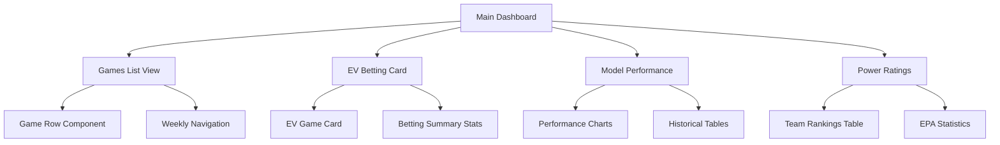
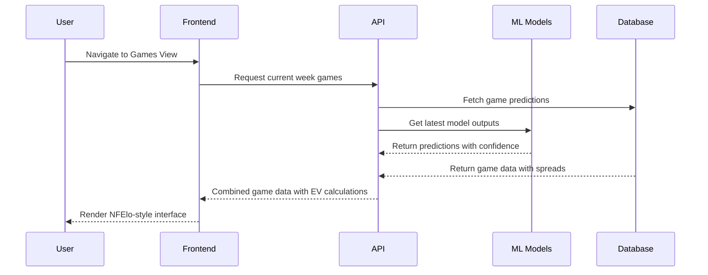
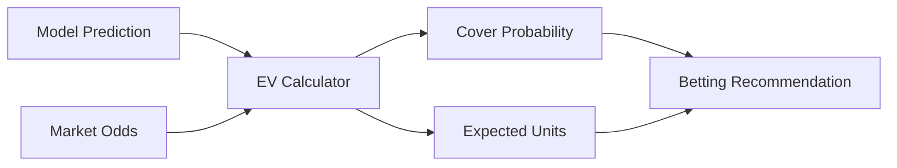
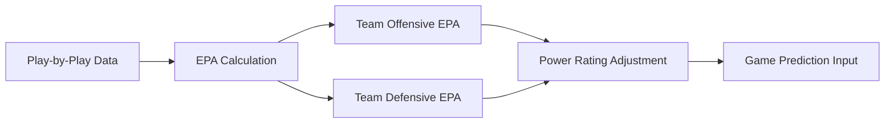

# NFElo-Style Interface Design for NFL Predictor

## Overview

This design document outlines the implementation of an NFElo-inspired interface for the existing NFL Predictor API system. The goal is to create a professional, data-dense betting interface that leverages the current prediction infrastructure while providing users with comprehensive game analysis, model performance metrics, and expected value calculations in a clean, scannable format.

## Architecture

### Component Structure

The interface will be built as a collection of specialized React components within the existing Next.js framework, integrating seamlessly with the current Supabase backend and WebSocket real-time updates.

### Data Flow Architecture

The system will maintain the existing prediction pipeline while adding new presentation layers optimized for the NFElo-style interface.

## Games List Interface

### Game Row Design

Each game will be presented in a horizontal row format displaying:

| Component | Data Elements | Visual Treatment |
|-----------|---------------|------------------|
| Team Info | Logo, Record, Name | Team colors, logo sizing |
| Spread Data | Market line, Model line, Movement | Color coding for value |
| Expected Value | EV percentage, Confidence | Green/red indicators |
| Game Context | Time, Weather, Stadium | Subtle secondary text |

### Data Integration Strategy

The games list will integrate multiple data sources into a unified view:

- **Prediction Engine**: Current model outputs for spread and total predictions
- **Market Data**: Real-time odds from configured sportsbooks
- **Historical Context**: Team performance metrics and head-to-head records
- **Environmental Factors**: Weather conditions and venue information

## Expected Value Betting Card

### EV Calculation Logic

The betting card will implement sophisticated expected value calculations:

### Card Layout Structure

Each high-EV game will be presented as a detailed card containing:

- **Team Matchup**: Visual team representation with records
- **Game Details**: Venue, time, weather, and key player information
- **Quarterback Analysis**: Adjusted ratings and performance metrics
- **Model Recommendation**: Clear betting suggestion with reasoning
- **Value Metrics**: EV percentage, cover probability, and unit recommendations

## Model Performance Dashboard

### Performance Metrics Display

The performance section will showcase model accuracy through multiple dimensions:

| Metric Category | Measurements | Time Periods |
|----------------|--------------|--------------|
| Accuracy | Win percentage, ATS performance | All-time, Current season |
| Value Generation | Unit returns, CLV | By season, Cumulative |
| Prediction Quality | MAE, Line movement correlation | Weekly, Monthly |

### Historical Analysis Tables

Performance data will be presented in sortable, filterable tables showing:

- Season-by-season breakdown of model performance
- Comparison against market closing lines
- Unit return analysis with risk-adjusted metrics
- Prediction error analysis and improvement trends

## Power Ratings System

### Team Ranking Interface

The power ratings will display comprehensive team evaluation through:

- **Core Ratings**: ELO-based power rankings with adjustments
- **Offensive Metrics**: EPA per play, passing and rushing efficiency
- **Defensive Metrics**: Points allowed, EPA against, situational performance
- **Advanced Analytics**: Pythagorean wins, strength of schedule adjustments

### EPA Integration

Expected Points Added metrics will be integrated throughout the interface:

## Real-Time Data Integration

### WebSocket Implementation

The interface will leverage existing WebSocket infrastructure for live updates:

- **Game Status Changes**: Score updates, line movements, weather changes
- **Model Recalculations**: Updated predictions based on new information
- **Market Data Refresh**: Odds updates from multiple sportsbooks
- **Performance Tracking**: Live accuracy calculations during games

### Caching Strategy

Data presentation will implement intelligent caching:

- **Static Data**: Team information, historical records (24-hour cache)
- **Semi-Static Data**: Season statistics, power ratings (4-hour cache)
- **Dynamic Data**: Game predictions, odds (15-minute cache)
- **Live Data**: In-game updates, real-time scores (no cache)

## User Experience Design

### Navigation Structure

The interface will provide intuitive navigation between major sections:

- **Primary Navigation**: Games, Betting Card, Performance, Rankings
- **Secondary Filters**: Week selection, team filtering, bet type selection
- **Quick Actions**: Export predictions, save favorites, share analysis

### Responsive Design Strategy

The layout will adapt across device sizes:

- **Desktop**: Full data tables with comprehensive information
- **Tablet**: Condensed tables with key metrics prioritized
- **Mobile**: Card-based layout with swipe navigation

### Accessibility Considerations

The interface will maintain accessibility standards:

- **Color Independence**: Information conveyed through multiple visual cues
- **Screen Reader Support**: Proper ARIA labels and semantic markup
- **Keyboard Navigation**: Full functionality without mouse interaction
- **High Contrast Mode**: Alternative color schemes for visibility

## Testing Strategy

### Component Testing

Individual components will be tested for:

- **Data Rendering**: Correct display of prediction data
- **Interactive Elements**: Sorting, filtering, and navigation functionality
- **Responsive Behavior**: Layout adaptation across screen sizes
- **Performance**: Rendering speed with large datasets

### Integration Testing

Full system testing will validate:

- **Real-Time Updates**: WebSocket data flow and UI updates
- **Cross-Component Communication**: State management and data sharing
- **API Integration**: Prediction data fetching and error handling
- **User Workflows**: Complete user journeys through the interface
