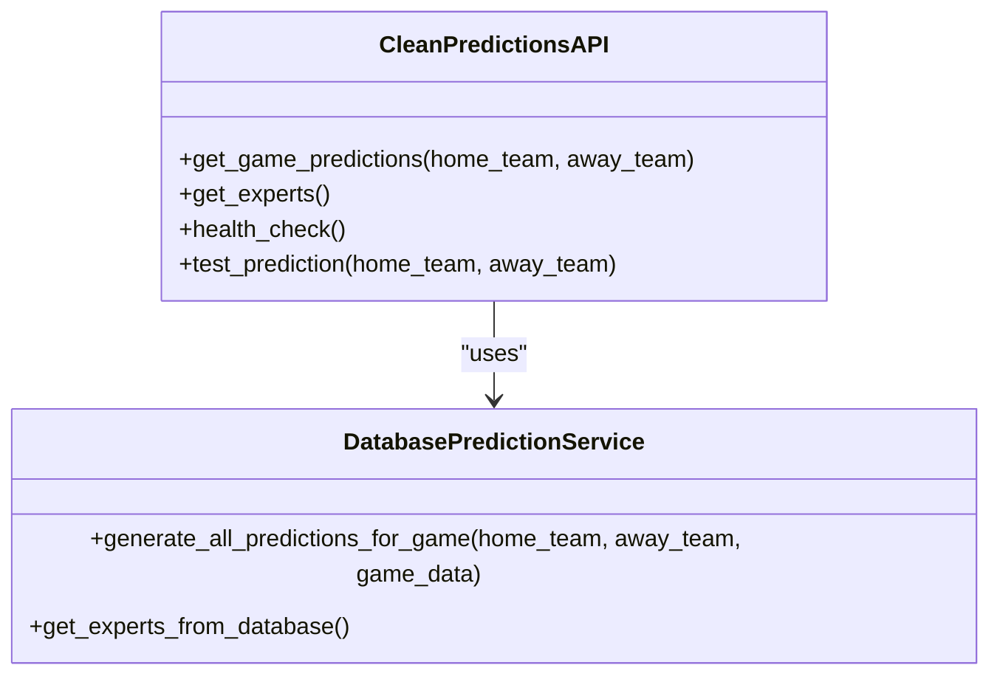
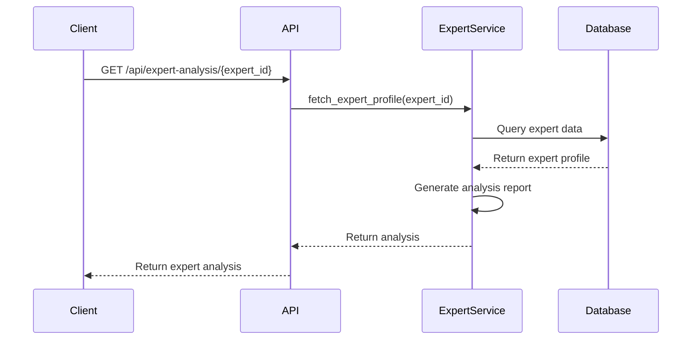
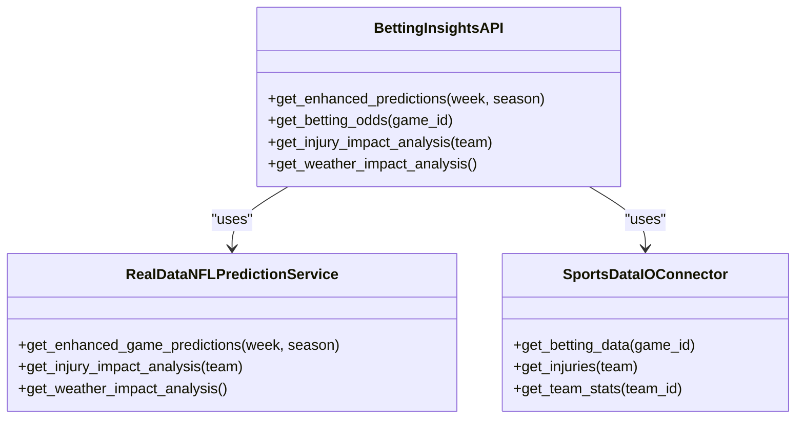
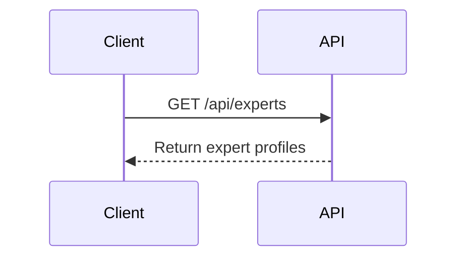
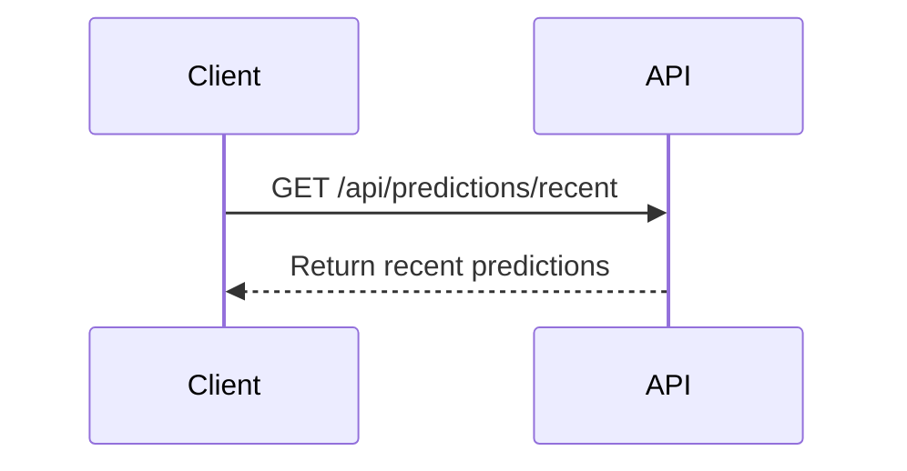
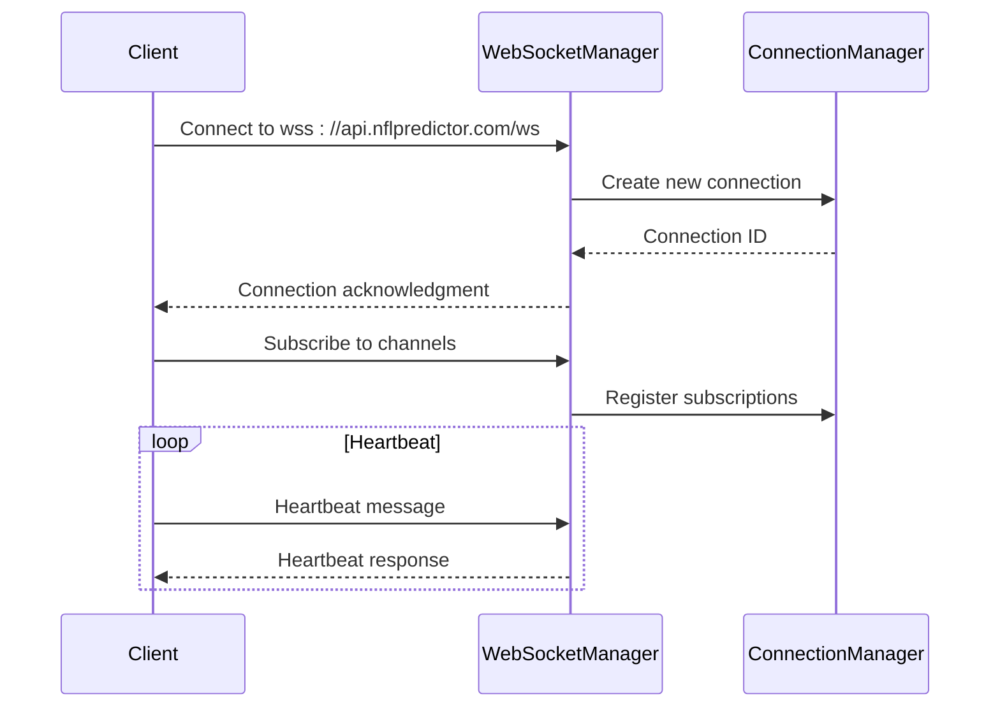
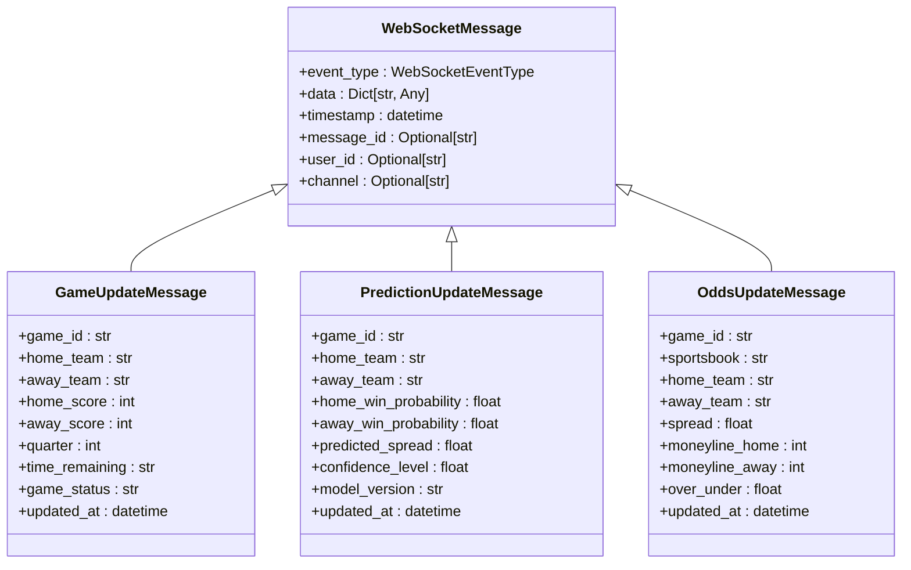
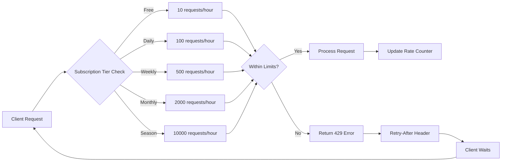
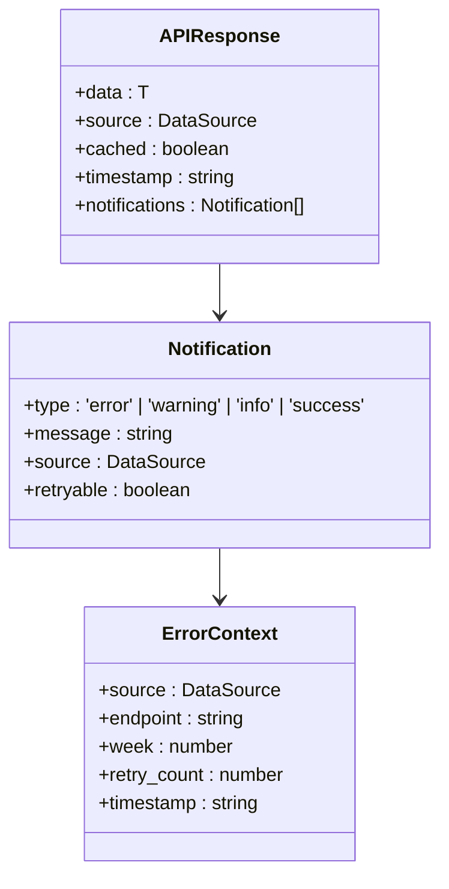
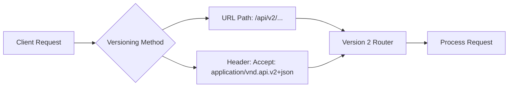

# API Reference

<cite>
**Referenced Files in This Document**   
- [app.py](file://src/api/app.py)
- [performance_endpoints.py](file://src/api/performance_endpoints.py)
- [clean_predictions_endpoints.py](file://src/api/clean_predictions_endpoints.py)
- [real_data_endpoints.py](file://src/api/real_data_endpoints.py)
- [websocket_manager.py](file://src/websocket/websocket_manager.py)
- [websocket_events.py](file://src/websocket/websocket_events.py)
- [api.types.ts](file://src/types/api.types.ts)
- [main_with_access_control.py](file://src/main_with_access_control.py) - *Updated in recent commit*
- [server.ts](file://tests/frontend/mocks/server.ts) - *Added authentication examples*
- [experts.js](file://api/experts.js) - *Added in recent commit*
- [recent.js](file://api/predictions/recent.js) - *Added in recent commit*
</cite>

## Update Summary
**Changes Made**   
- Added authentication and subscription tier details based on new API endpoints
- Updated security considerations with JWT authentication details
- Enhanced rate limiting section with subscription-based rate limits
- Added new API status endpoint information
- Updated client implementation guidelines with authentication flow
- Added authentication request/response examples
- Added new endpoints: `/api/experts` and `/api/predictions/recent`
- Documented new expert data structure and recent predictions format

## Table of Contents
1. [Introduction](#introduction)
2. [REST API Endpoints](#rest-api-endpoints)
3. [WebSocket API](#websocket-api)
4. [Request/Response Examples](#requestresponse-examples)
5. [Rate Limiting and Error Handling](#rate-limiting-and-error-handling)
6. [API Versioning](#api-versioning)
7. [Client Implementation Guidelines](#client-implementation-guidelines)
8. [Security Considerations](#security-considerations)
9. [Performance Optimization](#performance-optimization)

## Introduction
The NFL Predictor API provides comprehensive access to AI-driven football predictions, expert analysis, and real-time game data. The API is built on FastAPI and offers both RESTful and WebSocket interfaces for accessing prediction data, betting insights, and live game updates. The system supports high-performance batch processing, real-time updates, and detailed expert analysis with comprehensive data models. The API now includes JWT-based authentication and subscription tier-based access control.

**Section sources**
- [app.py](file://src/api/app.py#L1-L227)
- [main_with_access_control.py](file://src/main_with_access_control.py#L98-L139)

## REST API Endpoints

### Real-Time Game Predictions
The API provides multiple endpoints for accessing game predictions with varying levels of optimization and detail.

#### Performance-Optimized Predictions
```mermaid
flowchart TD
A[Client Request] --> B{Endpoint Type}
B --> C[/api/v2/performance/predictions/batch]
B --> D[/api/v2/performance/predictions/game/{game_id}]
B --> E[/api/v2/performance/predictions/live]
C --> F[Batch Processing]
D --> G[Single Game]
E --> H[Live Games]
F --> I[Parallel Expert Processing]
G --> I
H --> I
I --> J[Redis Cache Check]
J --> K{Cache Hit?}
K --> |Yes| L[Return Cached Data]
K --> |No| M[Generate Predictions]
M --> N[Store in Cache]
N --> O[Return Response]
```

**Diagram sources**
- [performance_endpoints.py](file://src/api/performance_endpoints.py#L1-L539)

**Section sources**
- [performance_endpoints.py](file://src/api/performance_endpoints.py#L1-L539)

#### Clean Predictions Endpoints
The clean predictions endpoints provide access to verified database-stored predictions with proper expert integration.



**Diagram sources**
- [clean_predictions_endpoints.py](file://src/api/clean_predictions_endpoints.py#L1-L186)

**Section sources**
- [clean_predictions_endpoints.py](file://src/api/clean_predictions_endpoints.py#L1-L186)

### Expert Analysis Endpoints
The API provides comprehensive access to expert analysis and deep dives into prediction methodologies.



**Section sources**
- [expert_deep_dive_endpoints.py](file://src/api/expert_deep_dive_endpoints.py#L1-L100)

### Betting Insights Endpoints
The real data endpoints provide enhanced betting insights with market data integration.



**Diagram sources**
- [real_data_endpoints.py](file://src/api/real_data_endpoints.py#L1-L468)

**Section sources**
- [real_data_endpoints.py](file://src/api/real_data_endpoints.py#L1-L468)

### Live Game Updates Endpoints
The API provides real-time access to live game data and updates.

```mermaid
flowchart LR
A[Client] --> B[/api/real-data/games/current]
A --> C[/api/real-data/predictions/live]
A --> D[/api/real-data/live]
B --> E[SportsDataIOConnector]
C --> F[RealDataNFLPredictionService]
D --> F
E --> G[SportsData.io API]
F --> E
G --> H[Real-time Data]
H --> I[Formatted Response]
I --> A
```

**Section sources**
- [real_data_endpoints.py](file://src/api/real_data_endpoints.py#L1-L468)

### New Experts Endpoint
The new `/api/experts` endpoint provides information about all available prediction experts.



**Section sources**
- [experts.js](file://api/experts.js#L1-L23)

### Recent Predictions Endpoint
The new `/api/predictions/recent` endpoint provides access to recent prediction data.



**Section sources**
- [recent.js](file://api/predictions/recent.js#L1-L35)

## WebSocket API

### Connection Handling
The WebSocket API provides real-time updates for game events, prediction changes, and system notifications.



**Diagram sources**
- [websocket_manager.py](file://src/websocket/websocket_manager.py#L1-L364)
- [websocket_events.py](file://src/websocket/websocket_events.py#L1-L120)

**Section sources**
- [websocket_manager.py](file://src/websocket/websocket_manager.py#L1-L364)
- [websocket_events.py](file://src/websocket/websocket_events.py#L1-L120)

### Message Formats
The WebSocket API uses standardized message formats for different event types.



**Diagram sources**
- [websocket_events.py](file://src/websocket/websocket_events.py#L1-L120)

**Section sources**
- [websocket_events.py](file://src/websocket/websocket_events.py#L1-L120)

### Real-Time Interaction Patterns
The WebSocket API supports various subscription patterns for real-time data.

```mermaid
flowchart TD
A[Client] --> B[Connect to WebSocket]
B --> C{Subscribe to Channels}
C --> D[game_{game_id}]
C --> E[predictions_{game_id}]
C --> F[odds_{game_id}]
C --> G[games]
C --> H[predictions]
C --> I[odds]
D --> J[Receive Game Updates]
E --> K[Receive Prediction Updates]
F --> L[Receive Odds Updates]
G --> M[Receive All Game Updates]
H --> N[Receive All Prediction Updates]
I --> O[Receive All Odds Updates]
```

**Section sources**
- [websocket_manager.py](file://src/websocket/websocket_manager.py#L1-L364)

## Request/Response Examples

### REST API Example: Batch Predictions
```json
{
  "game_ids": ["KC-BAL", "BUF-MIA"],
  "include_experts": true,
  "include_ml": true,
  "expert_count": 15
}
```

Response:
```json
{
  "predictions": [
    {
      "game_id": "KC-BAL",
      "home_team": "KC",
      "away_team": "BAL",
      "home_win_probability": 0.67,
      "away_win_probability": 0.33,
      "predicted_spread": -3.5,
      "confidence_level": 0.85,
      "experts": [
        {
          "expert_id": "1",
          "name": "Statistical Analyst",
          "prediction": "KC",
          "confidence": 0.9
        }
      ]
    }
  ],
  "metadata": {
    "generated_at": "2025-09-16T09:30:34Z",
    "model_version": "2.1.0"
  },
  "performance_metrics": {
    "response_time_ms": 234,
    "total_predictions": 375,
    "cache_hit": true
  }
}
```

**Section sources**
- [performance_endpoints.py](file://src/api/performance_endpoints.py#L1-L539)

### Authentication Example: Login Request
```json
{
  "username": "user@example.com",
  "password": "SecurePassword123!"
}
```

Response:
```json
{
  "access_token": "eyJhbGciOiJIUzI1NiIsInR5cCI6IkpXVCJ9...",
  "refresh_token": "eyJhbGciOiJIUzI1NiIsInR5cCI6IkpXVCJ9...",
  "token_type": "bearer",
  "expires_in": 3600,
  "subscription_tier": "monthly"
}
```

**Section sources**
- [main_with_access_control.py](file://src/main_with_access_control.py#L98-L139)
- [server.ts](file://tests/frontend/mocks/server.ts#L52-L113)

### WebSocket Example: Game Update
```json
{
  "event_type": "game_update",
  "data": {
    "game_id": "KC-BAL",
    "home_team": "KC",
    "away_team": "BAL",
    "home_score": 14,
    "away_score": 7,
    "quarter": 2,
    "time_remaining": "7:32",
    "game_status": "in_progress",
    "updated_at": "2025-09-16T20:15:30Z"
  },
  "timestamp": "2025-09-16T20:15:30Z"
}
```

**Section sources**
- [websocket_events.py](file://src/websocket/websocket_events.py#L1-L120)

### New Endpoint Example: Experts
```json
[
  {
    "expert_id": "1",
    "display_name": "The Analyst",
    "personality": "conservative",
    "avatar_emoji": "📊",
    "accuracy_rate": 0.756,
    "predictions_count": 42
  },
  {
    "expert_id": "2",
    "display_name": "The Gambler",
    "personality": "risk_taking",
    "avatar_emoji": "🎲",
    "accuracy_rate": 0.623,
    "predictions_count": 38
  }
]
```

**Section sources**
- [experts.js](file://api/experts.js#L1-L23)

### New Endpoint Example: Recent Predictions
```json
[
  {
    "game_id": "KC_BUF_2025_W1",
    "date": "2025-01-15T20:20:00Z",
    "home_team": "KC",
    "away_team": "BUF",
    "consensus_winner": "KC",
    "consensus_confidence": 0.72,
    "status": "upcoming",
    "expert_predictions": [
      {
        "expert_name": "The Analyst",
        "avatar_emoji": "📊",
        "prediction": {
          "winner": "KC",
          "confidence": 0.75
        }
      },
      {
        "expert_name": "The Gambler",
        "avatar_emoji": "🎲",
        "prediction": {
          "winner": "BUF",
          "confidence": 0.68
        }
      }
    ]
  }
]
```

**Section sources**
- [recent.js](file://api/predictions/recent.js#L1-L35)

## Rate Limiting and Error Handling

### Rate Limiting Strategy
The API implements subscription-tier-based rate limiting to ensure fair usage and system stability.



The rate limiting is implemented using Redis for distributed rate tracking across multiple instances. Each subscription tier has different rate limits and feature access.

**Section sources**
- [app.py](file://src/api/app.py#L1-L227)
- [middleware/rate_limiting.py](file://src/middleware/rate_limiting.py#L1-L50)
- [main_with_access_control.py](file://src/main_with_access_control.py#L98-L139)

### Error Handling Codes
The API returns standardized error codes for different failure scenarios.



**Diagram sources**
- [api.types.ts](file://src/types/api.types.ts#L1-L57)

**Section sources**
- [api.types.ts](file://src/types/api.types.ts#L1-L57)

## API Versioning
The API uses a versioning strategy with both URL-based and header-based versioning options.



The current version is v2, with v1 endpoints maintained for backward compatibility. The versioning allows for gradual migration to new features and breaking changes.

**Section sources**
- [app.py](file://src/api/app.py#L1-L227)
- [performance_endpoints.py](file://src/api/performance_endpoints.py#L1-L539)

## Client Implementation Guidelines

### REST API Client (Python)
```python
import requests
import asyncio
import aiohttp

class NFLPredictorClient:
    def __init__(self, api_key: str, base_url: str = "https://api.nflpredictor.com"):
        self.api_key = api_key
        self.base_url = base_url
        self.headers = {
            "Authorization": f"Bearer {api_key}",
            "Content-Type": "application/json"
        }
    
    def get_batch_predictions(self, game_ids: list, include_experts: bool = True):
        url = f"{self.base_url}/api/v2/performance/predictions/batch"
        payload = {
            "game_ids": game_ids,
            "include_experts": include_experts,
            "expert_count": 15
        }
        response = requests.get(url, headers=self.headers, params=payload)
        return response.json()
    
    async def get_batch_predictions_async(self, game_ids: list):
        async with aiohttp.ClientSession() as session:
            url = f"{self.base_url}/api/v2/performance/predictions/batch"
            params = {
                "game_ids": ",".join(game_ids),
                "include_experts": "true"
            }
            async with session.get(url, headers=self.headers, params=params) as response:
                return await response.json()
    
    def authenticate(self, username: str, password: str):
        url = f"{self.base_url}/api/auth/login"
        payload = {
            "username": username,
            "password": password
        }
        response = requests.post(url, json=payload)
        if response.status_code == 200:
            data = response.json()
            self.api_key = data["access_token"]
            self.headers["Authorization"] = f"Bearer {self.api_key}"
            return data
        else:
            raise Exception(f"Authentication failed: {response.status_code}")
    
    def get_experts(self):
        url = f"{self.base_url}/api/experts"
        response = requests.get(url, headers=self.headers)
        return response.json()
    
    def get_recent_predictions(self):
        url = f"{self.base_url}/api/predictions/recent"
        response = requests.get(url, headers=self.headers)
        return response.json()
```

**Section sources**
- [performance_endpoints.py](file://src/api/performance_endpoints.py#L1-L539)
- [main_with_access_control.py](file://src/main_with_access_control.py#L98-L139)
- [experts.js](file://api/experts.js#L1-L23)
- [recent.js](file://api/predictions/recent.js#L1-L35)

### REST API Client (JavaScript)
```javascript
class NFLPredictorClient {
    constructor(apiKey, baseUrl = 'https://api.nflpredictor.com') {
        this.apiKey = apiKey;
        this.baseUrl = baseUrl;
        this.headers = {
            'Authorization': `Bearer ${apiKey}`,
            'Content-Type': 'application/json'
        };
    }

    async getBatchPredictions(gameIds, includeExperts = true) {
        const params = new URLSearchParams({
            game_ids: gameIds.join(','),
            include_experts: includeExperts.toString(),
            expert_count: 15
        });

        const response = await fetch(
            `${this.baseUrl}/api/v2/performance/predictions/batch?${params}`,
            { headers: this.headers }
        );

        if (!response.ok) {
            throw new Error(`HTTP error! status: ${response.status}`);
        }

        return await response.json();
    }

    async getLivePredictions() {
        const response = await fetch(
            `${this.baseUrl}/api/v2/performance/predictions/live?week=2`,
            { headers: this.headers }
        );

        return await response.json();
    }
    
    async login(username, password) {
        const response = await fetch(
            `${this.baseUrl}/api/auth/login`,
            {
                method: 'POST',
                headers: {
                    'Content-Type': 'application/json'
                },
                body: JSON.stringify({ username, password })
            }
        );
        
        if (!response.ok) {
            throw new Error(`Login failed: ${response.status}`);
        }
        
        const data = await response.json();
        this.apiKey = data.access_token;
        this.headers.Authorization = `Bearer ${this.apiKey}`;
        return data;
    }
    
    async getExperts() {
        const response = await fetch(
            `${this.baseUrl}/api/experts`,
            { headers: this.headers }
        );
        
        if (!response.ok) {
            throw new Error(`Failed to fetch experts: ${response.status}`);
        }
        
        return await response.json();
    }
    
    async getRecentPredictions() {
        const response = await fetch(
            `${this.baseUrl}/api/predictions/recent`,
            { headers: this.headers }
        );
        
        if (!response.ok) {
            throw new Error(`Failed to fetch recent predictions: ${response.status}`);
        }
        
        return await response.json();
    }
}
```

**Section sources**
- [performance_endpoints.py](file://src/api/performance_endpoints.py#L1-L539)
- [main_with_access_control.py](file://src/main_with_access_control.py#L98-L139)
- [experts.js](file://api/experts.js#L1-L23)
- [recent.js](file://api/predictions/recent.js#L1-L35)

### WebSocket Client (JavaScript)
```javascript
class NFLPredictorWebSocket {
    constructor(apiKey, url = 'wss://api.nflpredictor.com/ws') {
        this.apiKey = apiKey;
        this.url = url;
        this.socket = null;
        this.listeners = new Map();
    }

    async connect() {
        this.socket = new WebSocket(`${this.url}?api_key=${this.apiKey}`);

        this.socket.onopen = () => {
            console.log('Connected to NFL Predictor WebSocket');
            this._sendHeartbeat();
        };

        this.socket.onmessage = (event) => {
            const message = JSON.parse(event.data);
            this._dispatchEvent(message);
        };

        this.socket.onclose = (event) => {
            console.log('WebSocket disconnected', event);
            this._reconnect();
        };

        this.socket.onerror = (error) => {
            console.error('WebSocket error:', error);
        };
    }

    subscribe(channel) {
        if (this.socket && this.socket.readyState === WebSocket.OPEN) {
            this.socket.send(JSON.stringify({
                event_type: 'user_subscription',
                data: { channel }
            }));
        }
    }

    unsubscribe(channel) {
        if (this.socket && this.socket.readyState === WebSocket.OPEN) {
            this.socket.send(JSON.stringify({
                event_type: 'user_unsubscription',
                data: { channel }
            }));
        }
    }

    on(eventType, callback) {
        if (!this.listeners.has(eventType)) {
            this.listeners.set(eventType, new Set());
        }
        this.listeners.get(eventType).add(callback);
    }

    off(eventType, callback) {
        if (this.listeners.has(eventType)) {
            this.listeners.get(eventType).delete(callback);
        }
    }

    _sendHeartbeat() {
        if (this.socket && this.socket.readyState === WebSocket.OPEN) {
            this.socket.send(JSON.stringify({
                event_type: 'heartbeat',
                data: { client_time: new Date().toISOString() }
            }));
            setTimeout(() => this._sendHeartbeat(), 30000); //
        }
    }

    _reconnect() {
        setTimeout(() => {
            this.connect();
        }, 5000);
    }

    _dispatchEvent(message) {
        const eventType = message.event_type;
        if (this.listeners.has(eventType)) {
            this.listeners.get(eventType).forEach(callback => {
                callback(message);
            });
        }
    }
}
```

**Section sources**
- [websocket_manager.py](file://src/websocket/websocket_manager.py#L1-L364)
- [websocket_events.py](file://src/websocket/websocket_events.py#L1-L120)

## Security Considerations
The API implements JWT-based authentication with subscription tier-based access control. API keys should be stored securely and never exposed in client-side code. All sensitive data is transmitted over HTTPS. The system implements rate limiting to prevent abuse and distributed denial-of-service attacks. User data is encrypted at rest and in transit.

**Section sources**
- [main_with_access_control.py](file://src/main_with_access_control.py#L98-L139)
- [app.py](file://src/api/app.py#L1-L227)

## Performance Optimization
The API is optimized for high-performance access with Redis caching, database connection pooling, and parallel processing. The system implements response compression for large datasets and intelligent cache invalidation. Performance monitoring is enabled to track response times and system health. For high-frequency consumers, batch endpoints are recommended to minimize request overhead.

**Section sources**
- [app.py](file://src/api/app.py#L1-L227)
- [performance_endpoints.py](file://src/api/performance_endpoints.py#L1-L539)
- [performance.optimized_prediction_service.py](file://src/performance/optimized_prediction_service.py)
- [performance.database_optimizer.py](file://src/performance/database_optimizer.py)