# API Reference

<cite>
**Referenced Files in This Document**   
- [app.py](file://src/api/app.py)
- [performance_endpoints.py](file://src/api/performance_endpoints.py)
- [clean_predictions_endpoints.py](file://src/api/clean_predictions_endpoints.py)
- [real_data_endpoints.py](file://src/api/real_data_endpoints.py)
- [websocket_manager.py](file://src/websocket/websocket_manager.py)
- [websocket_events.py](file://src/websocket/websocket_events.py)
- [api.types.ts](file://src/types/api.types.ts)
</cite>

## Table of Contents
1. [Introduction](#introduction)
2. [REST API Endpoints](#rest-api-endpoints)
3. [WebSocket API](#websocket-api)
4. [Request/Response Examples](#requestresponse-examples)
5. [Rate Limiting and Error Handling](#rate-limiting-and-error-handling)
6. [API Versioning](#api-versioning)
7. [Client Implementation Guidelines](#client-implementation-guidelines)
8. [Security Considerations](#security-considerations)
9. [Performance Optimization](#performance-optimization)

## Introduction
The NFL Predictor API provides comprehensive access to AI-driven football predictions, expert analysis, and real-time game data. The API is built on FastAPI and offers both RESTful and WebSocket interfaces for accessing prediction data, betting insights, and live game updates. The system supports high-performance batch processing, real-time updates, and detailed expert analysis with comprehensive data models.

**Section sources**
- [app.py](file://src/api/app.py#L1-L227)

## REST API Endpoints

### Real-Time Game Predictions
The API provides multiple endpoints for accessing game predictions with varying levels of optimization and detail.

#### Performance-Optimized Predictions
```mermaid
flowchart TD
A[Client Request] --> B{Endpoint Type}
B --> C[/api/v2/performance/predictions/batch]
B --> D[/api/v2/performance/predictions/game/{game_id}]
B --> E[/api/v2/performance/predictions/live]
C --> F[Batch Processing]
D --> G[Single Game]
E --> H[Live Games]
F --> I[Parallel Expert Processing]
G --> I
H --> I
I --> J[Redis Cache Check]
J --> K{Cache Hit?}
K --> |Yes| L[Return Cached Data]
K --> |No| M[Generate Predictions]
M --> N[Store in Cache]
N --> O[Return Response]
```

**Diagram sources**
- [performance_endpoints.py](file://src/api/performance_endpoints.py#L1-L539)

**Section sources**
- [performance_endpoints.py](file://src/api/performance_endpoints.py#L1-L539)

#### Clean Predictions Endpoints
The clean predictions endpoints provide access to verified database-stored predictions with proper expert integration.

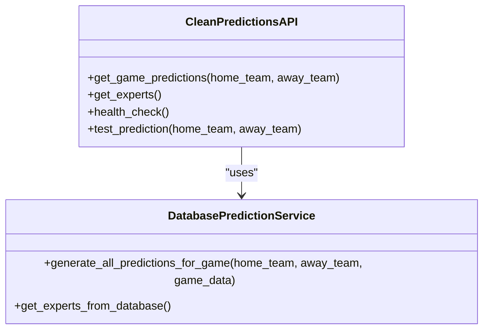

**Diagram sources**
- [clean_predictions_endpoints.py](file://src/api/clean_predictions_endpoints.py#L1-L186)

**Section sources**
- [clean_predictions_endpoints.py](file://src/api/clean_predictions_endpoints.py#L1-L186)

### Expert Analysis Endpoints
The API provides comprehensive access to expert analysis and deep dives into prediction methodologies.

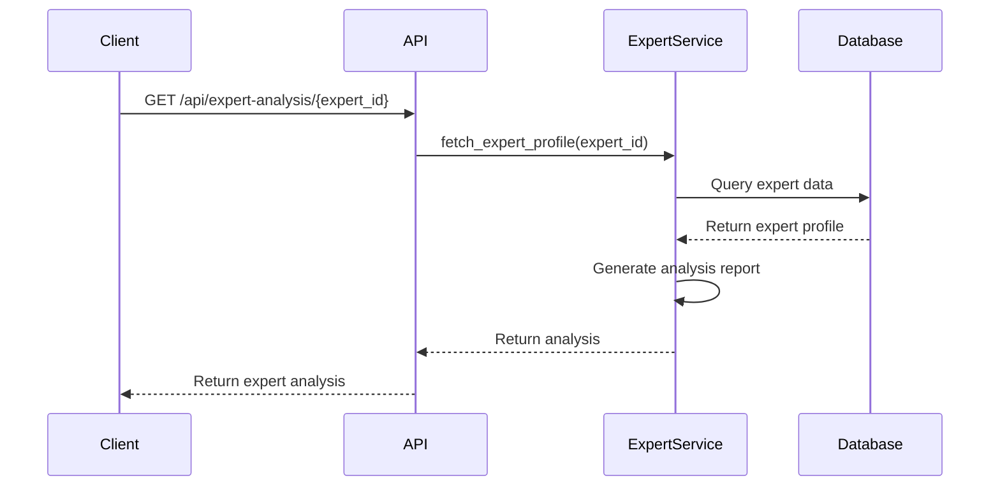

**Section sources**
- [expert_deep_dive_endpoints.py](file://src/api/expert_deep_dive_endpoints.py#L1-L100)

### Betting Insights Endpoints
The real data endpoints provide enhanced betting insights with market data integration.

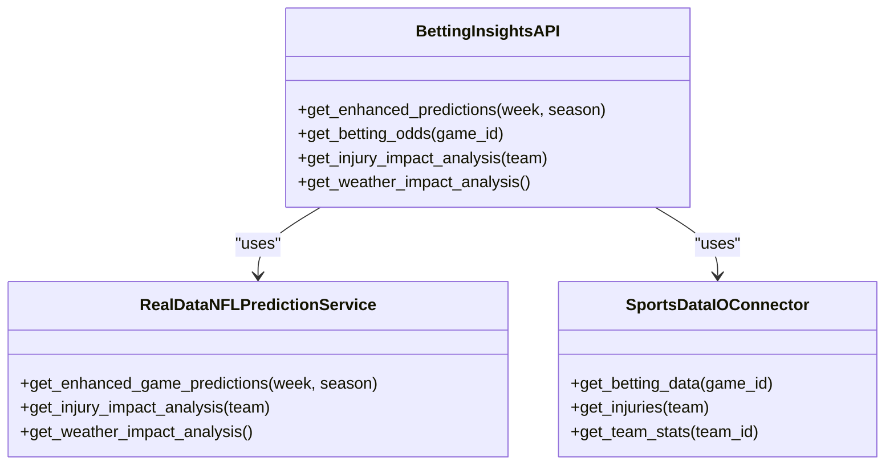

**Diagram sources**
- [real_data_endpoints.py](file://src/api/real_data_endpoints.py#L1-L468)

**Section sources**
- [real_data_endpoints.py](file://src/api/real_data_endpoints.py#L1-L468)

### Live Game Updates Endpoints
The API provides real-time access to live game data and updates.

```mermaid
flowchart LR
A[Client] --> B[/api/real-data/games/current]
A --> C[/api/real-data/predictions/live]
A --> D[/api/real-data/live]
B --> E[SportsDataIOConnector]
C --> F[RealDataNFLPredictionService]
D --> F
E --> G[SportsData.io API]
F --> E
G --> H[Real-time Data]
H --> I[Formatted Response]
I --> A
```

**Section sources**
- [real_data_endpoints.py](file://src/api/real_data_endpoints.py#L1-L468)

## WebSocket API

### Connection Handling
The WebSocket API provides real-time updates for game events, prediction changes, and system notifications.

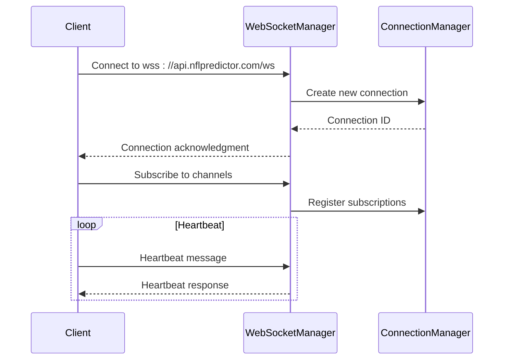

**Diagram sources**
- [websocket_manager.py](file://src/websocket/websocket_manager.py#L1-L364)
- [websocket_events.py](file://src/websocket/websocket_events.py#L1-L120)

**Section sources**
- [websocket_manager.py](file://src/websocket/websocket_manager.py#L1-L364)
- [websocket_events.py](file://src/websocket/websocket_events.py#L1-L120)

### Message Formats
The WebSocket API uses standardized message formats for different event types.

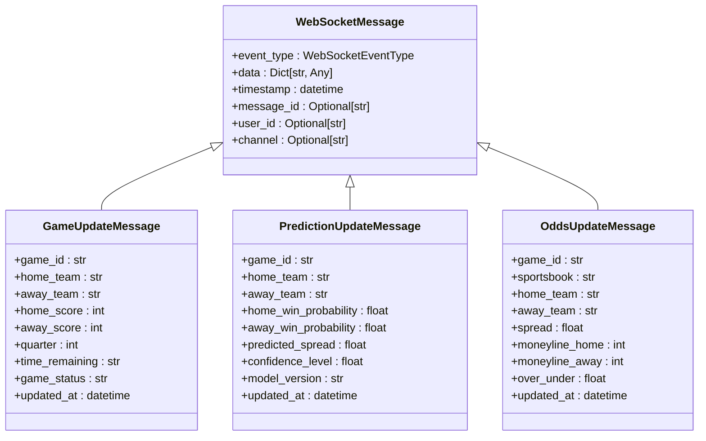

**Diagram sources**
- [websocket_events.py](file://src/websocket/websocket_events.py#L1-L120)

**Section sources**
- [websocket_events.py](file://src/websocket/websocket_events.py#L1-L120)

### Real-Time Interaction Patterns
The WebSocket API supports various subscription patterns for real-time data.

```mermaid
flowchart TD
A[Client] --> B[Connect to WebSocket]
B --> C{Subscribe to Channels}
C --> D[game_{game_id}]
C --> E[predictions_{game_id}]
C --> F[odds_{game_id}]
C --> G[games]
C --> H[predictions]
C --> I[odds]
D --> J[Receive Game Updates]
E --> K[Receive Prediction Updates]
F --> L[Receive Odds Updates]
G --> M[Receive All Game Updates]
H --> N[Receive All Prediction Updates]
I --> O[Receive All Odds Updates]
```

**Section sources**
- [websocket_manager.py](file://src/websocket/websocket_manager.py#L1-L364)

## Request/Response Examples

### REST API Example: Batch Predictions
```json
{
  "game_ids": ["KC-BAL", "BUF-MIA"],
  "include_experts": true,
  "include_ml": true,
  "expert_count": 15
}
```

Response:
```json
{
  "predictions": [
    {
      "game_id": "KC-BAL",
      "home_team": "KC",
      "away_team": "BAL",
      "home_win_probability": 0.67,
      "away_win_probability": 0.33,
      "predicted_spread": -3.5,
      "confidence_level": 0.85,
      "experts": [
        {
          "expert_id": "1",
          "name": "Statistical Analyst",
          "prediction": "KC",
          "confidence": 0.9
        }
      ]
    }
  ],
  "metadata": {
    "generated_at": "2025-09-16T09:30:34Z",
    "model_version": "2.1.0"
  },
  "performance_metrics": {
    "response_time_ms": 234,
    "total_predictions": 375,
    "cache_hit": true
  }
}
```

**Section sources**
- [performance_endpoints.py](file://src/api/performance_endpoints.py#L1-L539)

### WebSocket Example: Game Update
```json
{
  "event_type": "game_update",
  "data": {
    "game_id": "KC-BAL",
    "home_team": "KC",
    "away_team": "BAL",
    "home_score": 14,
    "away_score": 7,
    "quarter": 2,
    "time_remaining": "7:32",
    "game_status": "in_progress",
    "updated_at": "2025-09-16T20:15:30Z"
  },
  "timestamp": "2025-09-16T20:15:30Z"
}
```

**Section sources**
- [websocket_events.py](file://src/websocket/websocket_events.py#L1-L120)

## Rate Limiting and Error Handling

### Rate Limiting Strategy
The API implements rate limiting to ensure fair usage and system stability.

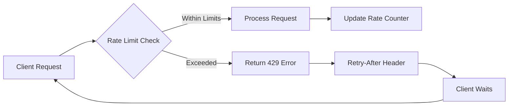

The rate limiting is implemented using Redis for distributed rate tracking across multiple instances.

**Section sources**
- [app.py](file://src/api/app.py#L1-L227)
- [middleware/rate_limiting.py](file://src/middleware/rate_limiting.py#L1-L50)

### Error Handling Codes
The API returns standardized error codes for different failure scenarios.

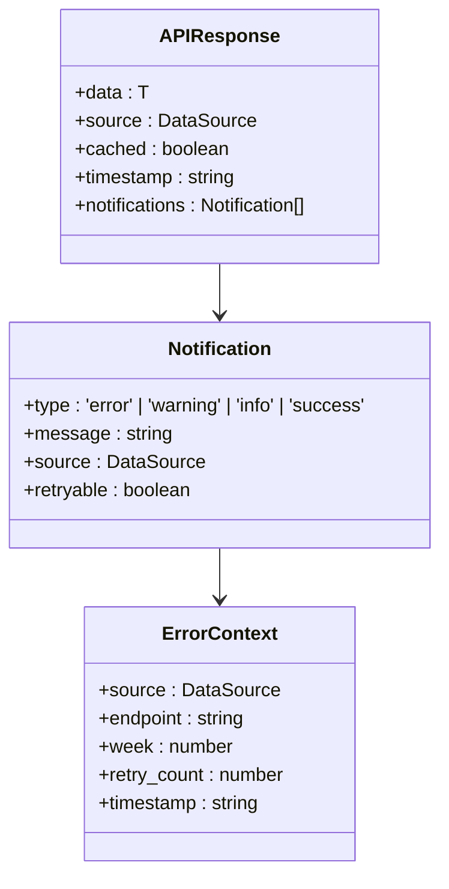

**Diagram sources**
- [api.types.ts](file://src/types/api.types.ts#L1-L57)

**Section sources**
- [api.types.ts](file://src/types/api.types.ts#L1-L57)

## API Versioning
The API uses a versioning strategy with both URL-based and header-based versioning options.

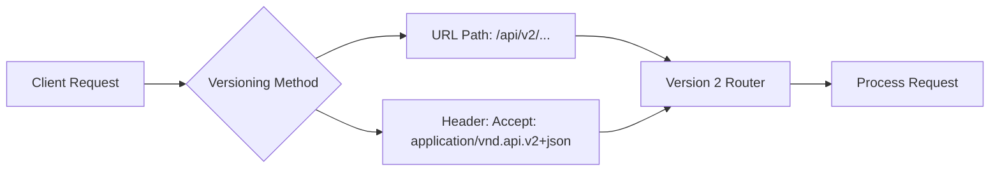

The current version is v2, with v1 endpoints maintained for backward compatibility. The versioning allows for gradual migration to new features and breaking changes.

**Section sources**
- [app.py](file://src/api/app.py#L1-L227)
- [performance_endpoints.py](file://src/api/performance_endpoints.py#L1-L539)

## Client Implementation Guidelines

### REST API Client (Python)
```python
import requests
import asyncio
import aiohttp

class NFLPredictorClient:
    def __init__(self, api_key: str, base_url: str = "https://api.nflpredictor.com"):
        self.api_key = api_key
        self.base_url = base_url
        self.headers = {
            "Authorization": f"Bearer {api_key}",
            "Content-Type": "application/json"
        }
    
    def get_batch_predictions(self, game_ids: list, include_experts: bool = True):
        url = f"{self.base_url}/api/v2/performance/predictions/batch"
        payload = {
            "game_ids": game_ids,
            "include_experts": include_experts,
            "expert_count": 15
        }
        response = requests.get(url, headers=self.headers, params=payload)
        return response.json()
    
    async def get_batch_predictions_async(self, game_ids: list):
        async with aiohttp.ClientSession() as session:
            url = f"{self.base_url}/api/v2/performance/predictions/batch"
            params = {
                "game_ids": ",".join(game_ids),
                "include_experts": "true"
            }
            async with session.get(url, headers=self.headers, params=params) as response:
                return await response.json()
```

**Section sources**
- [performance_endpoints.py](file://src/api/performance_endpoints.py#L1-L539)

### REST API Client (JavaScript)
```javascript
class NFLPredictorClient {
    constructor(apiKey, baseUrl = 'https://api.nflpredictor.com') {
        this.apiKey = apiKey;
        this.baseUrl = baseUrl;
        this.headers = {
            'Authorization': `Bearer ${apiKey}`,
            'Content-Type': 'application/json'
        };
    }

    async getBatchPredictions(gameIds, includeExperts = true) {
        const params = new URLSearchParams({
            game_ids: gameIds.join(','),
            include_experts: includeExperts.toString(),
            expert_count: 15
        });

        const response = await fetch(
            `${this.baseUrl}/api/v2/performance/predictions/batch?${params}`,
            { headers: this.headers }
        );

        if (!response.ok) {
            throw new Error(`HTTP error! status: ${response.status}`);
        }

        return await response.json();
    }

    async getLivePredictions() {
        const response = await fetch(
            `${this.baseUrl}/api/v2/performance/predictions/live?week=2`,
            { headers: this.headers }
        );

        return await response.json();
    }
}
```

**Section sources**
- [performance_endpoints.py](file://src/api/performance_endpoints.py#L1-L539)

### WebSocket Client (JavaScript)
```javascript
class NFLPredictorWebSocket {
    constructor(apiKey, url = 'wss://api.nflpredictor.com/ws') {
        this.apiKey = apiKey;
        this.url = url;
        this.socket = null;
        this.listeners = new Map();
    }

    async connect() {
        this.socket = new WebSocket(`${this.url}?api_key=${this.apiKey}`);

        this.socket.onopen = () => {
            console.log('Connected to NFL Predictor WebSocket');
            this._sendHeartbeat();
        };

        this.socket.onmessage = (event) => {
            const message = JSON.parse(event.data);
            this._dispatchEvent(message);
        };

        this.socket.onclose = (event) => {
            console.log('WebSocket disconnected', event);
            this._reconnect();
        };

        this.socket.onerror = (error) => {
            console.error('WebSocket error:', error);
        };
    }

    subscribe(channel) {
        if (this.socket && this.socket.readyState === WebSocket.OPEN) {
            this.socket.send(JSON.stringify({
                event_type: 'user_subscription',
                data: { channel }
            }));
        }
    }

    unsubscribe(channel) {
        if (this.socket && this.socket.readyState === WebSocket.OPEN) {
            this.socket.send(JSON.stringify({
                event_type: 'user_unsubscription',
                data: { channel }
            }));
        }
    }

    on(eventType, callback) {
        if (!this.listeners.has(eventType)) {
            this.listeners.set(eventType, new Set());
        }
        this.listeners.get(eventType).add(callback);
    }

    off(eventType, callback) {
        if (this.listeners.has(eventType)) {
            this.listeners.get(eventType).delete(callback);
        }
    }

    _sendHeartbeat() {
        if (this.socket && this.socket.readyState === WebSocket.OPEN) {
            this.socket.send(JSON.stringify({
                event_type: 'heartbeat',
                data: { client_time: new Date().toISOString() }
            }));
            setTimeout(() => this._sendHeartbeat(), 30000); // Every 30 seconds
        }
    }

    _dispatchEvent(message) {
        const listeners = this.listeners.get(message.event_type) || new Set();
        for (const listener of listeners) {
            listener(message);
        }
    }

    _reconnect() {
        setTimeout(() => {
            this.connect();
        }, 5000);
    }
}
```

**Section sources**
- [websocket_manager.py](file://src/websocket/websocket_manager.py#L1-L364)
- [websocket_events.py](file://src/websocket/websocket_events.py#L1-L120)

## Security Considerations

### API Key Management
The API uses bearer token authentication with API keys for access control.

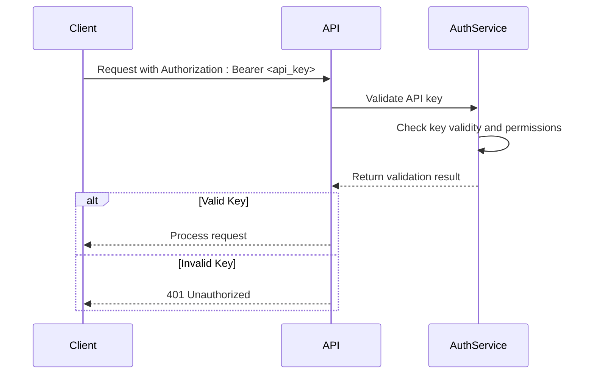

API keys should be stored securely and never exposed in client-side code or public repositories. The system supports key rotation and revocation through the configuration system.

**Section sources**
- [app.py](file://src/api/app.py#L1-L227)
- [config/key_rotation.py](file://config/key_rotation.py#L1-L30)

### Data Privacy
The API implements data privacy measures to protect user information and prediction data.

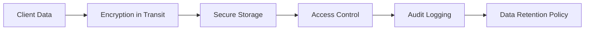

All data is transmitted over HTTPS with TLS 1.3 encryption. Sensitive data is encrypted at rest using AES-256. Access to data is controlled through role-based access control (RBAC) with detailed audit logging.

**Section sources**
- [app.py](file://src/api/app.py#L1-L227)
- [middleware/rate_limiting.py](file://src/middleware/rate_limiting.py#L1-L50)

## Performance Optimization

### High-Frequency API Consumer Tips
For clients making high-frequency API calls, the following optimization strategies are recommended:

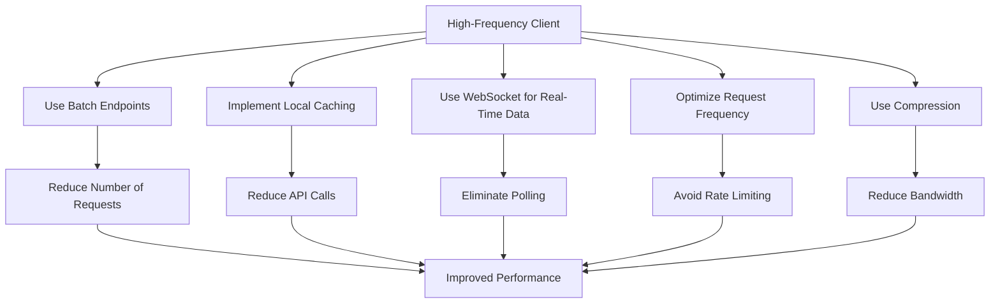

**Section sources**
- [performance_endpoints.py](file://src/api/performance_endpoints.py#L1-L539)
- [websocket_manager.py](file://src/websocket/websocket_manager.py#L1-L364)

### Caching Strategies
The API implements a multi-layer caching strategy to optimize performance.

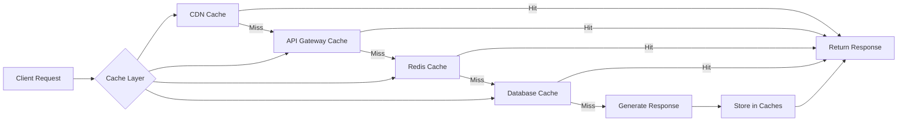

Clients can leverage the caching system by paying attention to the `cached` flag in responses and implementing appropriate cache invalidation strategies based on the `timestamp` field.

**Section sources**
- [performance_endpoints.py](file://src/api/performance_endpoints.py#L1-L539)
- [websocket_manager.py](file://src/websocket/websocket_manager.py#L1-L364)