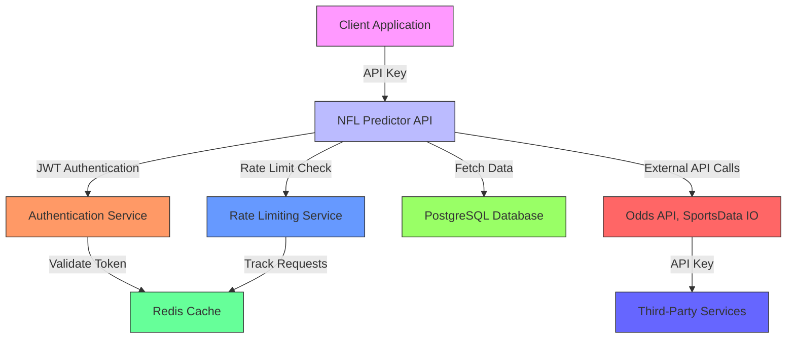

# Authentication

<cite>
**Referenced Files in This Document**   
- [app.py](file://src/api/app.py)
- [production.py](file://config/production.py)
- [main_with_access_control.py](file://src/main_with_access_control.py)
- [rate_limiting.py](file://src/middleware/rate_limiting.py)
</cite>

## Table of Contents
1. [Introduction](#introduction)
2. [Security Model Overview](#security-model-overview)
3. [CORS Configuration](#cors-configuration)
4. [API Key Management](#api-key-management)
5. [Access Control Implementation](#access-control-implementation)
6. [Production Security Settings](#production-security-settings)
7. [Rate Limiting System](#rate-limiting-system)
8. [Best Practices](#best-practices)
9. [Credential Rotation and Auditing](#credential-rotation-and-auditing)

## Introduction
The NFL Predictor API implements a comprehensive security framework to protect sensitive data and ensure authorized access to prediction services. This documentation details the authentication and authorization mechanisms, including API key management, CORS policies, and access control across endpoints. The system is designed to provide secure access while maintaining high performance and reliability for users accessing NFL prediction data.

**Section sources**
- [app.py](file://src/api/app.py#L1-L50)
- [main_with_access_control.py](file://src/main_with_access_control.py#L1-L50)

## Security Model Overview
The NFL Predictor API employs a multi-layered security model that combines API key authentication, CORS policy enforcement, and role-based access control. The system uses JWT (JSON Web Tokens) for user authentication, enabling stateless verification of user identity across distributed components. Subscription tiers determine access levels, with different feature sets available based on user plans (free, daily, weekly, monthly, season).

The architecture separates public endpoints from protected resources, ensuring that sensitive operations require proper authentication and authorization. The system logs all access attempts and implements comprehensive monitoring to detect and respond to potential security threats. External identity providers are integrated through API keys that authenticate with third-party sports data services.

**Diagram sources**
- [app.py](file://src/api/app.py#L95-L109)
- [main_with_access_control.py](file://src/main_with_access_control.py#L98-L139)

**Section sources**
- [app.py](file://src/api/app.py#L1-L226)
- [main_with_access_control.py](file://src/main_with_access_control.py#L1-L190)

## CORS Configuration
The API implements CORS (Cross-Origin Resource Sharing) policies through FastAPI's CORSMiddleware, configured in `src/api/app.py`. During development, the configuration allows all origins (`allow_origins=["*"]`), methods, and headers to facilitate testing across different environments. This permissive setting is intended for development purposes only and includes a comment noting that it should be properly configured for production.

In production environments, the CORS policy is strictly controlled through environment variables defined in `config/production.py`. The `SecurityConfig` class manages CORS origins, converting the `CORS_ORIGINS` environment variable into a list of allowed domains. The system validation explicitly checks for wildcard origins in production, raising a configuration error if `*` is detected, as this represents a security risk.

The