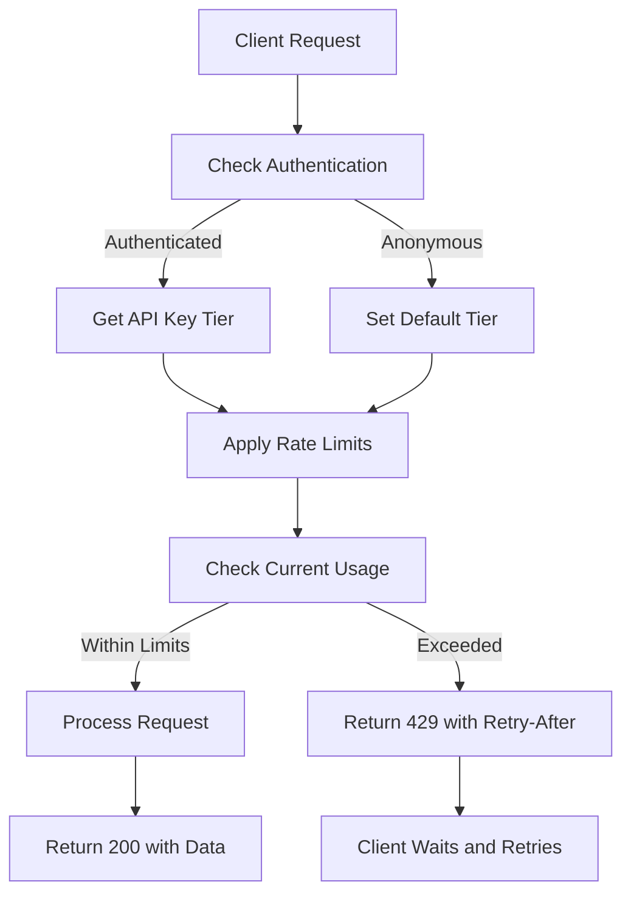
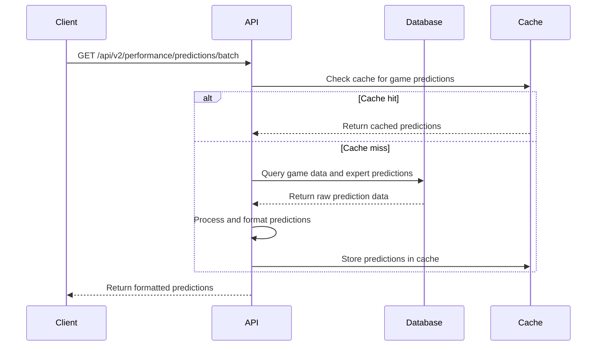
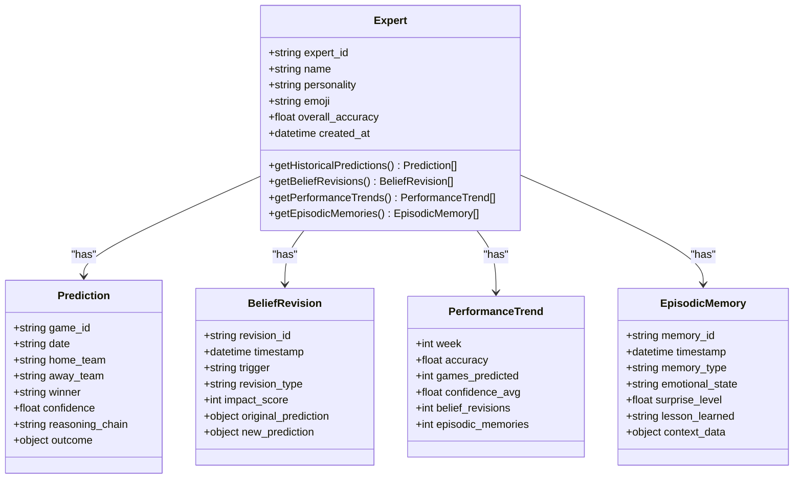
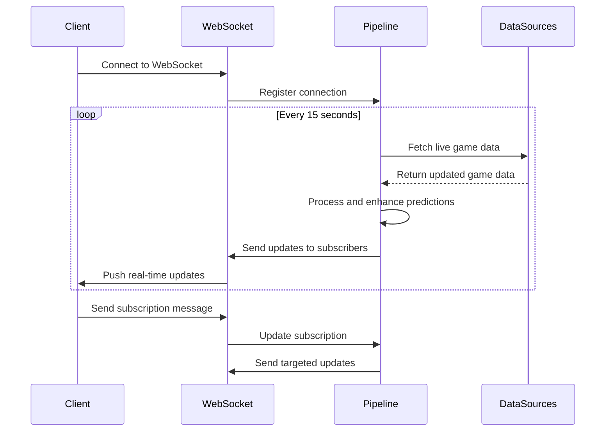
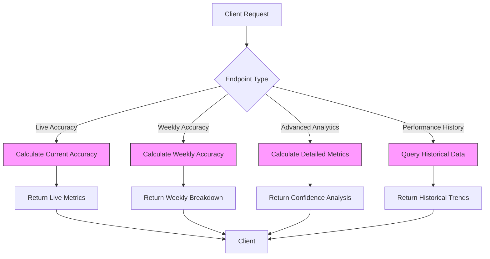

# REST API

<cite>
**Referenced Files in This Document**   
- [app.py](file://src/api/app.py)
- [performance_endpoints.py](file://src/api/performance_endpoints.py)
- [clean_predictions_endpoints.py](file://src/api/clean_predictions_endpoints.py)
- [real_data_endpoints.py](file://src/api/real_data_endpoints.py)
- [accuracy_endpoints.py](file://src/api/accuracy_endpoints.py)
- [realtime_endpoints.py](file://src/api/realtime_endpoints.py)
- [rate_limiter.py](file://src/api/rate_limiter.py)
- [nfl_api_client.py](file://src/api/nfl_api_client.py)
- [espn_api_client.py](file://src/api/espn_api_client.py)
- [odds_api_client.py](file://src/api/odds_api_client.py)
- [expert_deep_dive_endpoints.py](file://src/api/expert_deep_dive_endpoints.py)
- [visualization_api.py](file://src/api/visualization_api.py)
- [api.types.ts](file://src/types/api.types.ts)
- [predictions.ts](file://src/types/predictions.ts)
- [expertObservatoryApi.js](file://src/services/api/expertObservatoryApi.js)
- [gameDataService.js](file://src/services/gameDataService.js)
- [experts.js](file://api/experts.js) - *Added in recent commit*
- [recent.js](file://api/predictions/recent.js) - *Added in recent commit*
- [expert.py](file://src/api/models/expert.py) - *Updated in recent commit*
- [prediction.py](file://src/api/models/prediction.py) - *Updated in recent commit*
- [game.py](file://src/api/models/game.py) - *Updated in recent commit*
</cite>

## Update Summary
**Changes Made**   
- Added documentation for new API endpoints: `/api/experts` and `/api/predictions/recent`
- Updated expert data model to reflect actual fields from new API endpoints
- Added mock response examples for new endpoints
- Updated expert analysis section with new endpoint details
- Added new section for Recent Predictions
- Updated data models to align with actual implementation

## Table of Contents
1. [Introduction](#introduction)
2. [API Versioning and Base URL](#api-versioning-and-base-url)
3. [Authentication and Security](#authentication-and-security)
4. [Rate Limiting](#rate-limiting)
5. [Error Handling](#error-handling)
6. [Game Predictions](#game-predictions)
7. [Expert Analysis](#expert-analysis)
8. [Recent Predictions](#recent-predictions)
9. [Real-Time Data](#real-time-data)
10. [Performance Metrics](#performance-metrics)
11. [Data Models](#data-models)
12. [Usage Examples](#usage-examples)
13. [Integration Guidance](#integration-guidance)
14. [Best Practices](#best-practices)

## Introduction

The NFL Predictor API provides comprehensive RESTful endpoints for accessing AI-generated predictions, expert analysis, real-time game data, and performance metrics for NFL games. The API is designed for high performance, delivering sub-second response times for complex prediction data across multiple endpoints.

The system features a sophisticated architecture with 15 personality-driven AI experts who generate predictions using chain-of-thought reasoning and vector similarity search. Each expert has a distinct personality and approach to game analysis, creating a diverse council of AI analysts that provide comprehensive coverage of NFL games.

The API supports both real-time data access and batch processing, with extensive caching and performance optimization features. It integrates with multiple data sources including SportsData.io, ESPN, and The Odds API to provide comprehensive game information, scores, and betting odds.

**Section sources**
- [app.py](file://src/api/app.py#L1-L227)
- [performance_endpoints.py](file://src/api/performance_endpoints.py#L1-L539)

## API Versioning and Base URL

The NFL Predictor API uses semantic versioning with the current stable version being v2. All v2 endpoints are prefixed with `/api/v2/` to ensure backward compatibility as new features are added.

### Base URL
```
https://api.nflpredictor.com/api/v2/
```

### Version Strategy
The API follows a backward compatibility policy where:
- Breaking changes require a major version increment (v2 → v3)
- New endpoints and non-breaking features are added to the current version
- Deprecated endpoints remain available for at least 6 months after announcement
- Version v1 endpoints remain available but are no longer actively developed

The current version (v2) introduces performance-optimized endpoints that deliver 375+ predictions per game with sub-second response times, compared to the original v1 endpoints which had higher latency for complex prediction data.

**Section sources**
- [app.py](file://src/api/app.py#L100-L105)
- [performance_endpoints.py](file://src/api/performance_endpoints.py#L1-L539)

## Authentication and Security

The NFL Predictor API implements a flexible authentication system that supports both API key-based authentication and anonymous access with rate limiting.

### API Key Authentication
API keys are provided in the Authorization header using the Bearer scheme:

```
Authorization: Bearer YOUR_API_KEY
```

The API supports three tiers of API keys with different rate limits and access levels:
- **Basic Tier**: 60 requests per minute, 1,000 per hour
- **Premium Tier**: 300 requests per minute, 10,000 per hour  
- **Enterprise Tier**: 1,000 requests per minute, 50,000 per hour

### Security Measures
The API implements multiple security layers:
- Rate limiting to prevent abuse
- Request pattern analysis to detect suspicious activity
- IP blocking for abusive clients
- Input validation for all endpoints
- Response compression for large datasets
- CORS configuration for web applications

API keys are validated server-side, and invalid keys return a 401 Unauthorized response. The system also logs API usage for monitoring and analytics purposes.

**Section sources**
- [rate_limiter.py](file://src/api/rate_limiter.py#L1-L344)
- [app.py](file://src/api/app.py#L150-L160)

## Rate Limiting

The NFL Predictor API implements a comprehensive rate limiting system to ensure fair usage and system stability.

### Rate Limit Tiers
The API enforces different rate limits based on authentication status:

| Tier | Requests per Minute | Requests per Hour |
|------|-------------------|-----------------|
| Anonymous | 30 | 500 |
| Basic | 60 | 1,000 |
| Premium | 300 | 10,000 |
| Enterprise | 1,000 | 50,000 |

### Rate Limit Headers
All API responses include rate limit information in the headers:

- `X-RateLimit-Limit-Minute`: Maximum requests allowed per minute
- `X-RateLimit-Remaining-Minute`: Remaining requests in the current minute
- `X-RateLimit-Limit-Hour`: Maximum requests allowed per hour
- `X-RateLimit-Remaining-Hour`: Remaining requests in the current hour
- `X-RateLimit-Tier`: Current rate limit tier

When a client exceeds the rate limit, the API returns a 429 Too Many Requests status code with a Retry-After header indicating when the client can make additional requests.



**Diagram sources **
- [rate_limiter.py](file://src/api/rate_limiter.py#L1-L344)

**Section sources**
- [rate_limiter.py](file://src/api/rate_limiter.py#L1-L344)

## Error Handling

The NFL Predictor API uses standard HTTP status codes to indicate the success or failure of API requests.

### HTTP Status Codes
| Code | Meaning | Description |
|------|-------|-----------|
| 200 | OK | Request successful |
| 201 | Created | Resource created successfully |
| 400 | Bad Request | Invalid request parameters |
| 401 | Unauthorized | Authentication failed or missing |
| 403 | Forbidden | Access denied |
| 404 | Not Found | Resource not found |
| 429 | Too Many Requests | Rate limit exceeded |
| 500 | Internal Server Error | Server error |

### Error Response Format
All error responses follow a consistent JSON format:

```json
{
  "success": false,
  "error": "Error message describing the issue",
  "details": { /* Additional error details */ }
}
```

The API also includes specific error handling for different scenarios:
- Validation errors for malformed requests
- Database connection errors with fallback mechanisms
- External API failures with circuit breaker patterns
- Rate limiting with appropriate headers
- Authentication failures with clear messaging

For 5xx errors, the API returns a generic "Internal server error" message to avoid exposing implementation details, while logging the full error server-side for debugging.

**Section sources**
- [app.py](file://src/api/app.py#L200-L227)
- [rate_limiter.py](file://src/api/rate_limiter.py#L150-L180)

## Game Predictions

The Game Predictions endpoints provide access to AI-generated predictions for NFL games from a council of 15 personality-driven experts.

### Batch Predictions Endpoint
```
GET /api/v2/performance/predictions/batch
```

Retrieve predictions for multiple games in a single request.

#### Parameters
| Parameter | Type | Required | Default | Description |
|---------|------|--------|--------|-----------|
| game_ids | array | Yes | - | List of game IDs in format "home_team-away_team" |
| include_experts | boolean | No | true | Include expert predictions |
| include_ml | boolean | No | true | Include ML predictions |
| include_props | boolean | No | true | Include player props |
| include_totals | boolean | No | true | Include totals predictions |
| expert_count | integer | No | 15 | Number of experts to include (1-15) |
| fields | array | No | - | Field selection for response optimization |
| compress_response | boolean | No | true | Enable response compression |

#### Response
Returns a PredictionResponse object containing predictions for all requested games with performance metrics.

### Single Game Predictions Endpoint
```
GET /api/v2/performance/predictions/game/{game_id}
```

Retrieve optimized predictions for a specific game.

#### Path Parameters
| Parameter | Type | Description |
|---------|------|-------------|
| game_id | string | Game ID in format "home_team-away_team" |

#### Query Parameters
Same as batch predictions endpoint.

### Clean Predictions Endpoint
```
GET /api/predictions/game/{home_team}/{away_team}
```

Retrieve predictions using the verified database_prediction_service with the correct 15 experts.

#### Path Parameters
| Parameter | Type | Description |
|---------|------|-------------|
| home_team | string | Home team abbreviation |
| away_team | string | Away team abbreviation |

#### Query Parameters
| Parameter | Type | Required | Default | Description |
|---------|------|--------|--------|-----------|
| spread | float | No | -3.5 | Point spread |
| total | float | No | 47.5 | Over/under total |
| game_time | string | No | - | Game time (ISO format) |
| weather_wind | float | No | - | Wind speed (mph) |
| weather_temp | float | No | - | Temperature (F) |
| injuries | string | No | - | Key injuries (comma-separated) |

#### Response
Returns comprehensive predictions from all 15 experts with metadata.



**Diagram sources **
- [performance_endpoints.py](file://src/api/performance_endpoints.py#L1-L539)
- [clean_predictions_endpoints.py](file://src/api/clean_predictions_endpoints.py#L1-L186)

**Section sources**
- [performance_endpoints.py](file://src/api/performance_endpoints.py#L1-L539)
- [clean_predictions_endpoints.py](file://src/api/clean_predictions_endpoints.py#L1-L186)

## Expert Analysis

The Expert Analysis endpoints provide detailed insights into the predictions and reasoning of individual AI experts.

### Expert List Endpoint
```
GET /api/experts
```

Retrieve a list of all 15 personality-driven experts.

#### Response
Returns a list of expert profiles with their names, personalities, and metadata.

```json
[
  {
    "expert_id": "1",
    "display_name": "The Analyst",
    "personality": "conservative",
    "avatar_emoji": "📊",
    "accuracy_rate": 0.756,
    "predictions_count": 42
  },
  {
    "expert_id": "2",
    "display_name": "The Gambler",
    "personality": "risk_taking",
    "avatar_emoji": "🎲",
    "accuracy_rate": 0.623,
    "predictions_count": 38
  }
]
```

### Expert History Endpoint
```
GET /api/expert/{expert_id}/history
```

Get historical predictions and performance for a specific expert.

#### Path Parameters
| Parameter | Type | Description |
|---------|------|-------------|
| expert_id | string | Expert identifier |

#### Response
Returns historical predictions with outcomes, confidence levels, and reasoning chains.

### Expert Belief Revisions Endpoint
```
GET /api/expert/{expert_id}/belief-revisions
```

Retrieve belief revisions for an expert based on new information.

#### Response
Returns a list of belief revisions showing how the expert has updated their predictions based on new data.

### Expert Performance Trends Endpoint
```
GET /api/expert/{expert_id}/performance-trends
```

Get performance trends and learning curve for an expert.

#### Response
Returns weekly performance data showing accuracy trends over time.

### Expert Episodic Memories Endpoint
```
GET /api/expert/{expert_id}/episodic-memories
```

Retrieve episodic memories that influence an expert's predictions.

#### Response
Returns a list of memorable games and learning moments that shape the expert's decision-making.



**Diagram sources **
- [expert_deep_dive_endpoints.py](file://src/api/expert_deep_dive_endpoints.py#L1-L271)
- [experts.js](file://api/experts.js#L1-L23)

**Section sources**
- [expert_deep_dive_endpoints.py](file://src/api/expert_deep_dive_endpoints.py#L1-L271)
- [clean_predictions_endpoints.py](file://src/api/clean_predictions_endpoints.py#L50-L93)
- [experts.js](file://api/experts.js#L1-L23)

## Recent Predictions

The Recent Predictions endpoint provides access to the latest predictions from the AI expert council.

### Recent Predictions Endpoint
```
GET /api/predictions/recent
```

Retrieve the most recent predictions for upcoming games.

#### Response
Returns a list of recent prediction objects with expert consensus and individual expert predictions.

```json
[
  {
    "game_id": "KC_BUF_2025_W1",
    "date": "2025-01-15T20:20:00Z",
    "home_team": "KC",
    "away_team": "BUF",
    "consensus_winner": "KC",
    "consensus_confidence": 0.72,
    "status": "upcoming",
    "expert_predictions": [
      {
        "expert_name": "The Analyst",
        "avatar_emoji": "📊",
        "prediction": {
          "winner": "KC",
          "confidence": 0.75
        }
      },
      {
        "expert_name": "The Gambler",
        "avatar_emoji": "🎲",
        "prediction": {
          "winner": "BUF",
          "confidence": 0.68
        }
      }
    ]
  }
]
```

This endpoint provides a simplified view of the latest predictions, making it easier for clients to quickly access the most current prediction data without complex filtering or parameters.

**Section sources**
- [recent.js](file://api/predictions/recent.js#L1-L35)
- [experts.js](file://api/experts.js#L1-L23)

## Real-Time Data

The Real-Time Data endpoints provide access to live game updates, current week games, and real-time prediction adjustments.

### Current Games Endpoint
```
GET /api/real-data/games/current
```

Retrieve current week games with real data.

#### Response
Returns a list of GameData objects with current game information, scores, and status.

### Live Game Updates Endpoint
```
GET /api/real-data/predictions/live
```

Get live updates for in-progress games.

#### Response
Returns live game updates with enhanced predictions that incorporate real-time data.

### Comprehensive Analysis Endpoint
```
GET /api/real-data/analysis/comprehensive
```

Get comprehensive week analysis with real data insights.

#### Query Parameters
| Parameter | Type | Required | Default | Description |
|---------|------|--------|--------|-----------|
| week | integer | No | current | NFL week number |
| season | integer | No | 2024 | NFL season year |

#### Response
Returns detailed analysis of the week's games with real data integration.

### WebSocket Endpoints
The API provides WebSocket connections for real-time updates:

- `ws://api.nflpredictor.com/api/v1/realtime/ws` - Main WebSocket endpoint
- `ws://api.nflpredictor.com/api/v1/realtime/ws/game/{game_id}` - Game-specific WebSocket
- `ws://api.nflpredictor.com/api/v1/realtime/ws/live` - Live updates WebSocket

Clients can subscribe to receive real-time updates for game scores, prediction changes, and system notifications.



**Diagram sources **
- [real_data_endpoints.py](file://src/api/real_data_endpoints.py#L1-L468)
- [realtime_endpoints.py](file://src/api/realtime_endpoints.py#L1-L526)

**Section sources**
- [real_data_endpoints.py](file://src/api/real_data_endpoints.py#L1-L468)
- [realtime_endpoints.py](file://src/api/realtime_endpoints.py#L1-L526)

## Performance Metrics

The Performance Metrics endpoints provide detailed analytics on prediction accuracy, ROI, and expert performance.

### Live Accuracy Endpoint
```
GET /api/v1/accuracy/live
```

Get real-time accuracy metrics.

#### Response
Returns overall accuracy, total predictions, and recent performance across prediction types.

### Weekly Accuracy Endpoint
```
GET /api/v1/accuracy/weekly/{season}/{week}
```

Get accuracy metrics for a specific week.

#### Path Parameters
| Parameter | Type | Description |
|---------|------|-------------|
| season | integer | NFL season year |
| week | integer | NFL week number |

#### Response
Returns weekly accuracy breakdown by prediction type with summary statistics.

### Advanced Analytics Endpoint
```
GET /api/v1/accuracy/advanced
```

Get advanced analytics with confidence breakdowns and ROI analysis.

#### Query Parameters
| Parameter | Type | Required | Default | Description |
|---------|------|--------|--------|-----------|
| days | integer | No | 30 | Number of days to analyze |
| prediction_type | string | No | - | Filter by prediction type |

#### Response
Returns detailed accuracy analysis with confidence breakdowns, streak analysis, and ROI metrics.

### Performance History Endpoint
```
GET /api/v1/accuracy/performance-history
```

Get historical performance data.

#### Query Parameters
| Parameter | Type | Required | Default | Description |
|---------|------|--------|--------|-----------|
| period_type | string | No | weekly | Period type: weekly, monthly, season |
| season | integer | No | 2024 | NFL season year |
| limit | integer | No | 10 | Number of periods to return |

#### Response
Returns historical performance data with period-by-period accuracy and ROI.



**Diagram sources **
- [accuracy_endpoints.py](file://src/api/accuracy_endpoints.py#L1-L342)

**Section sources**
- [accuracy_endpoints.py](file://src/api/accuracy_endpoints.py#L1-L342)

## Data Models

This section defines the core data models used in the NFL Predictor API.

### Prediction Models

#### PredictionResponse
The response format for batch prediction requests.

```typescript
interface PredictionResponse {
  predictions: ComprehensivePrediction[];
  experts: Expert[];
  consensus: Record<string, ExpertConsensus>;
  live_games: LiveGameData[];
  total_count: number;
  filtered_count: number;
  page: number;
  per_page: number;
  has_next: boolean;
  has_prev: boolean;
  metadata: {
    last_updated: string;
    data_freshness: string;
    prediction_coverage: number;
    expert_availability: number;
  };
  performance_metrics: PerformanceMetrics;
}
```

#### ExpertPerformanceResponse
The response format for expert performance data.

```typescript
interface ExpertPerformanceResponse {
  expert: Expert;
  metrics: PredictionPerformanceMetrics;
  recent_predictions: ComprehensivePrediction[];
  accuracy_trends: Array<{
    date: string;
    accuracy: number;
    prediction_count: number;
  }>;
  category_specialization: Array<{
    category: PredictionCategory;
    accuracy: number;
    confidence: number;
    prediction_count: number;
  }>;
}
```

#### PredictionPerformanceMetrics
Detailed performance metrics for an expert.

```typescript
interface PredictionPerformanceMetrics {
  expert_id: string;
  time_period: 'week' | 'month' | 'season' | 'all_time';

  accuracy_metrics: {
    overall_accuracy: number;
    category_accuracy: Record<PredictionCategory, number>;
    confidence_calibration: {
      very_high: { predicted: number; actual: number };
      high: { predicted: number; actual: number };
      medium: { predicted: number; actual: number };
      low: { predicted: number; actual: number };
      very_low: { predicted: number; actual: number };
    };
  };

  betting_metrics: {
    roi: number;
    units_won: number;
    units_bet: number;
    win_rate: number;
    average_odds: number;
    best_bet_categories: PredictionCategory[];
  };

  trend_analysis: {
    recent_streak: number;
    momentum: 'hot' | 'warm' | 'neutral' | 'cold' | 'ice_cold';
    improvement_rate: number;
    consistency_score: number;
  };
}
```

#### RealtimeUpdate
Real-time update message structure.

```typescript
interface RealtimeUpdate {
  type: 'prediction_update' | 'game_event' | 'line_movement' | 'expert_update' | 'consensus_change';
  timestamp: string;
  payload: any;
  game_id?: string;
  expert_id?: string;
}
```

#### Expert
The expert model structure used in responses.

```python
class Expert(BaseModel):
    expert_id: str
    name: str
    emoji: str
    archetype: Archetype
    bankroll: BankrollInfo
    performance: PerformanceMetrics
    specialization: Specialization
```

#### Prediction
The prediction model structure used in responses.

```python
class Prediction(BaseModel):
    prediction_id: str
    game_id: str
    category: PredictionCategory
    prediction: str
    confidence: float = Field(..., ge=0.0, le=1.0)
    reasoning: str
    bet_placed: bool
    bet_amount: Optional[float] = None
    status: PredictionStatus
    created_at: datetime
```

#### Game
The game model structure used in responses.

```python
class Game(BaseModel):
    game_id: str
    home_team: str
    away_team: str
    game_time: datetime
    venue: str
    weather: Optional[Weather] = None
    vegas_lines: VegasLines
    council_consensus: Optional[CouncilGameConsensus] = None
    expert_count: ExpertCount
```

**Section sources**
- [expert.py](file://src/api/models/expert.py#L44-L51)
- [prediction.py](file://src/api/models/prediction.py#L22-L32)
- [game.py](file://src/api/models/game.py#L31-L40)