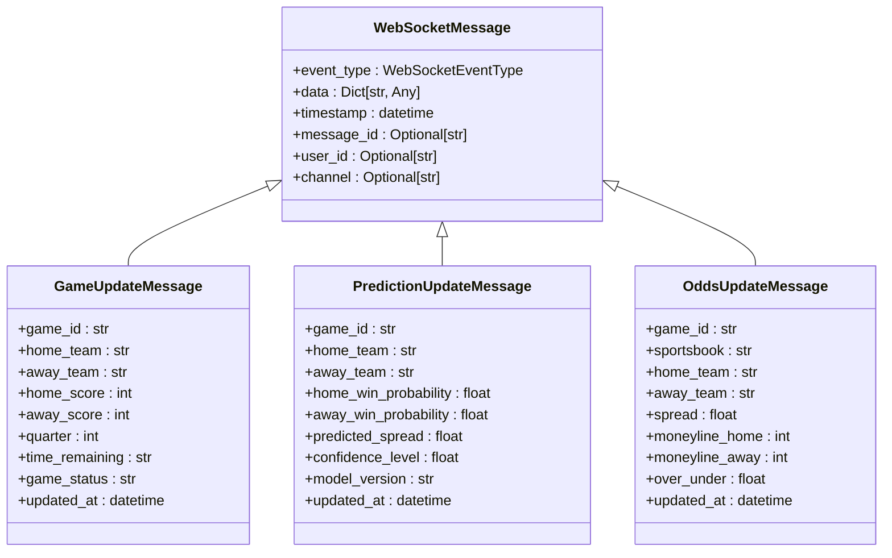
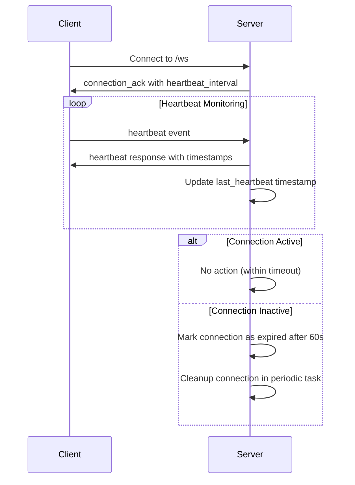

# WebSocket API

<cite>
**Referenced Files in This Document**   
- [websocket_events.py](file://src/websocket/websocket_events.py)
- [websocket_manager.py](file://src/websocket/websocket_manager.py)
- [websocket_handlers.py](file://src/websocket/websocket_handlers.py)
- [websocket_api.py](file://src/api/websocket_api.py)
- [realtime_endpoints.py](file://src/api/realtime_endpoints.py)
- [test-websocket.js](file://scripts/test-websocket.js)
</cite>

## Table of Contents
1. [Introduction](#introduction)
2. [Connection Lifecycle](#connection-lifecycle)
3. [Message Formats and Event Types](#message-formats-and-event-types)
4. [Subscription Model](#subscription-model)
5. [Client Implementation Examples](#client-implementation-examples)
6. [Error Handling and Heartbeat Mechanisms](#error-handling-and-heartbeat-mechanisms)
7. [Scalability Considerations](#scalability-considerations)
8. [Monitoring and Debugging](#monitoring-and-debugging)
9. [API Endpoints for WebSocket Management](#api-endpoints-for-websocket-management)

## Introduction
The WebSocket API in the NFL Predictor system enables real-time communication between the server and clients, delivering live updates for games, predictions, and odds. This documentation details the architecture, message formats, connection management, and integration patterns for the WebSocket-based real-time communication system. The implementation is built on FastAPI's WebSocket support and provides a robust foundation for delivering time-sensitive NFL data to clients with minimal latency.

## Connection Lifecycle
The WebSocket connection lifecycle in the NFL Predictor API follows a standardized process from handshake to disconnection. Clients initiate connections via the `/ws` endpoint with optional `user_id` and `token` query parameters for identification and authentication. Upon connection, the server performs a handshake by sending a `connection_ack` event containing the connection ID, server time, supported events, and heartbeat interval. The system supports reconnection strategies through persistent connection IDs and automatic resubscription to previously joined channels when clients reconnect with the same user ID. Connections are maintained until explicitly closed by the client or terminated due to heartbeat timeouts (60 seconds by default). The connection manager automatically cleans up expired connections through periodic background tasks that run every 60 seconds.

**Section sources**
- [websocket_manager.py](file://src/websocket/websocket_manager.py#L150-L200)
- [websocket_handlers.py](file://src/websocket/websocket_handlers.py#L15-L50)

## Message Formats and Event Types
The WebSocket system uses standardized JSON message formats with a consistent structure across all event types. Each message contains an `event_type`, `data` payload, `timestamp`, optional `message_id`, `user_id`, and `channel`. The event types are defined in the `WebSocketEventType` enum and categorized into game events, prediction events, odds events, system events, and user events. Game events include `game_started`, `game_ended`, `game_update`, and `score_update`. Prediction events include `prediction_update` and `prediction_refresh`. The system also supports `heartbeat` and `error` events for connection monitoring and error reporting. Message payloads are validated using Pydantic models to ensure data integrity and consistency across the system.

**Diagram sources**
- [websocket_events.py](file://src/websocket/websocket_events.py#L30-L119)

**Section sources**
- [websocket_events.py](file://src/websocket/websocket_events.py#L1-L119)

## Subscription Model
Clients can subscribe to specific data channels using the subscription model implemented in the WebSocket system. The API supports both general channels (e.g., "games", "predictions", "odds") and game-specific channels (e.g., "game_2024_week1_KC_BUF"). Clients can send `user_subscription` events with a channel parameter to subscribe, and `user_unsubscription` events to unsubscribe. Specialized WebSocket endpoints like `/ws/games`, `/ws/odds`, and `/ws/predictions` automatically subscribe clients to their respective channels upon connection. The game-specific endpoint `/ws/game/{game_id}` automatically subscribes clients to all relevant channels for a particular game, including game updates, odds, and predictions. The connection manager maintains a mapping of channels to active connections, enabling efficient message broadcasting to all subscribers of a channel.

**Section sources**
- [websocket_manager.py](file://src/websocket/websocket_manager.py#L250-L300)
- [websocket_handlers.py](file://src/websocket/websocket_handlers.py#L100-L120)

## Client Implementation Examples
The WebSocket API can be implemented in various programming languages. For JavaScript clients, the native WebSocket API can be used to establish connections and handle real-time messages. Python clients can utilize libraries like `websockets` or `requests` with WebSocket support. Clients should implement reconnection logic with exponential backoff to handle temporary network issues. Upon connection, clients should listen for the `connection_ack` event to confirm successful handshake, then send subscription messages for desired channels. Message handlers should be implemented for each event type of interest, with proper error handling for malformed messages. The test script in `test-websocket.js` provides a working example of a JavaScript client that connects, subscribes to channels, sends heartbeats, and validates server responses.

**Section sources**
- [test-websocket.js](file://scripts/test-websocket.js#L1-L114)
- [websocket_handlers.py](file://src/websocket/websocket_handlers.py#L15-L50)

## Error Handling and Heartbeat Mechanisms
The WebSocket system implements comprehensive error handling and connection monitoring through heartbeat mechanisms. The server automatically detects and logs errors during message sending, marking connections as inactive when transmission fails. Clients are expected to send `heartbeat` events periodically, which the server acknowledges with a timestamped response. The server also monitors connection health by tracking the last heartbeat time for each connection, considering connections expired if no heartbeat is received within 60 seconds. The system broadcasts `error` events for significant issues and `notification` events for system alerts. Client-side implementations should handle WebSocket errors, disconnections, and implement reconnection logic. The server gracefully handles unexpected client disconnections through try-finally blocks that ensure proper cleanup of connection state.

**Diagram sources**
- [websocket_manager.py](file://src/websocket/websocket_manager.py#L300-L360)

**Section sources**
- [websocket_manager.py](file://src/websocket/websocket_manager.py#L300-L364)
- [websocket_events.py](file://src/websocket/websocket_events.py#L25-L30)

## Scalability Considerations
The WebSocket implementation includes several scalability features to handle high connection volumes and efficient message broadcasting. The connection manager uses dictionaries and sets for O(1) lookup and insertion operations when managing connections, subscriptions, and channels. Message broadcasting is optimized by maintaining channel-to-connection mappings, allowing targeted delivery rather than iterating through all connections. The system employs background tasks for periodic cleanup of expired connections, preventing memory leaks. Connection statistics are available through the `/api/websocket/stats` endpoint, providing insights into total connections, users, and channel distribution. The architecture supports horizontal scaling through stateless WebSocket endpoints that could be distributed across multiple instances with shared state (e.g., Redis) in a production environment. Message sending operations are designed to fail gracefully if individual connections are unresponsive, preventing cascading failures.

**Section sources**
- [websocket_manager.py](file://src/websocket/websocket_manager.py#L200-L300)
- [websocket_api.py](file://src/api/websocket_api.py#L200-L250)

## Monitoring and Debugging
The WebSocket system provides multiple tools for monitoring and debugging real-time communication. The `get_stats` method in the connection manager exposes detailed connection statistics, including total connections, users, and channel subscriptions. The test script `test-websocket.js` serves as both a functional test and debugging tool, validating the end-to-end WebSocket workflow. Server-side logging captures connection events, message transmissions, and errors with appropriate severity levels. The system includes a test broadcast endpoint that can be used to verify WebSocket functionality in production environments. Developers can monitor connection lifecycle events, subscription changes, and message delivery through structured logs. For production monitoring, the system could be integrated with external observability tools to track connection rates, message throughput, and error patterns over time.

**Section sources**
- [websocket_manager.py](file://src/websocket/websocket_manager.py#L340-L360)
- [test-websocket.js](file://scripts/test-websocket.js#L1-L114)

## API Endpoints for WebSocket Management
The system exposes REST API endpoints for managing and interacting with the WebSocket infrastructure. The `/api/websocket` prefix contains endpoints for triggering various types of updates through WebSocket broadcasts. The `/game-update` endpoint accepts game data and broadcasts it to relevant channels. Similarly, `/odds-update` and `/prediction-update` endpoints trigger broadcasts for odds and prediction changes. The `/system-notification` endpoint allows administrators to send notifications to all connected clients or specific channels. A `/stats` endpoint provides real-time connection statistics, and a `/test-broadcast` endpoint enables verification of the WebSocket broadcasting functionality. These REST-to-WebSocket bridges allow other system components to publish real-time updates without direct WebSocket dependencies, promoting loose coupling and maintainability.

**Section sources**
- [websocket_api.py](file://src/api/websocket_api.py#L1-L257)
- [realtime_endpoints.py](file://src/api/realtime_endpoints.py#L300-L400)