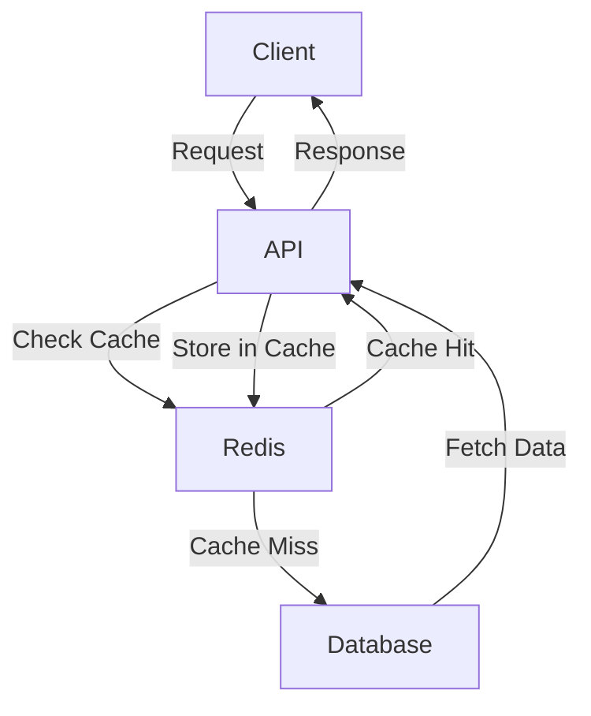
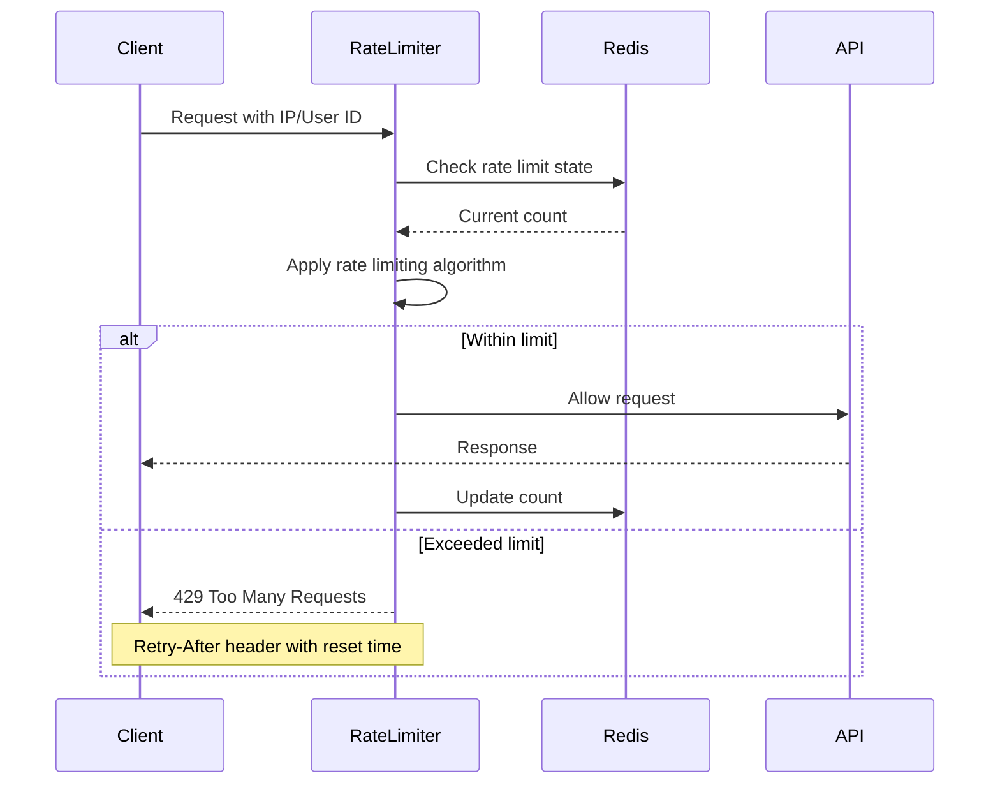
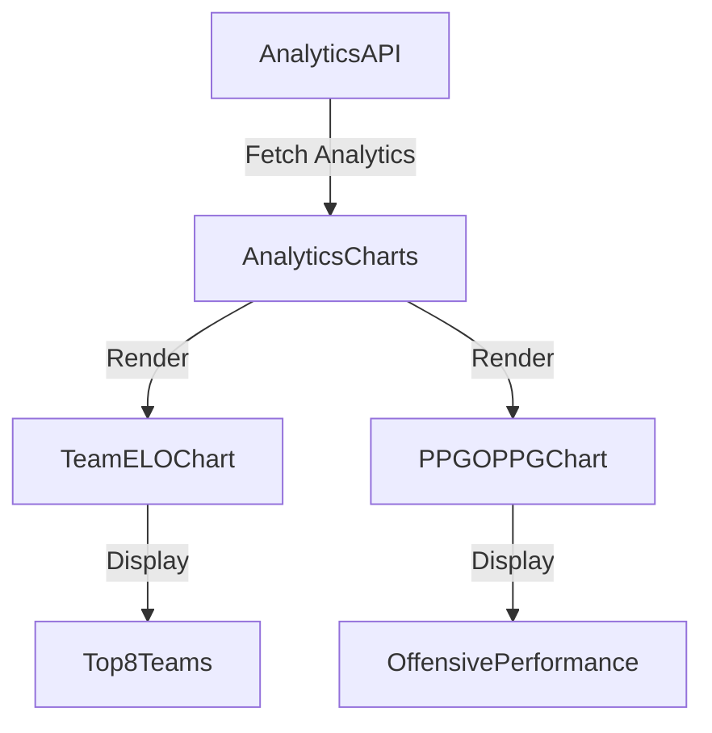

# Analytics API Endpoints

<cite>
**Referenced Files in This Document**   
- [api_endpoints.py](file://src/analytics/api_endpoints.py)
- [AnalyticsCharts.jsx](file://src/components/dashboard/AnalyticsCharts.jsx)
- [performance_endpoints.py](file://src/api/performance_endpoints.py)
- [cache_manager.py](file://src/cache/cache_manager.py)
- [rate_limiting.py](file://src/middleware/rate_limiting.py)
- [trend_analyzer.py](file://src/ml/performance_tracking/trend_analyzer.py)
- [accuracy_tracker.py](file://src/ml/performance_tracking/accuracy_tracker.py)
- [redis_config.py](file://config/redis_config.py)
</cite>

## Table of Contents
1. [Introduction](#introduction)
2. [Core Analytics Endpoints](#core-analytics-endpoints)
3. [Data Aggregation and Processing](#data-aggregation-and-processing)
4. [Caching Strategy](#caching-strategy)
5. [Rate Limiting](#rate-limiting)
6. [Frontend Integration](#frontend-integration)
7. [Client Implementation Guidelines](#client-implementation-guidelines)
8. [Performance Optimization](#performance-optimization)
9. [Example API Responses](#example-api-responses)
10. [Health and Monitoring](#health-and-monitoring)

## Introduction

The Analytics API provides comprehensive performance metrics, trend analysis, and expert accuracy tracking for the NFL prediction system. These endpoints aggregate data from the prediction system and machine learning models to generate insights such as expert win rates, category-specific accuracy trends, and historical performance benchmarks. The API is designed for high-performance access to analytics data with robust caching, rate limiting, and optimization features.

The analytics system integrates with the prediction models to track expert performance across multiple categories including winner prediction, against the spread, totals over/under, and player props. It provides both real-time and historical analysis of expert accuracy, trend detection, and performance comparisons.

**Section sources**
- [api_endpoints.py](file://src/analytics/api_endpoints.py#L1-L655)
- [accuracy_tracker.py](file://src/ml/performance_tracking/accuracy_tracker.py#L1-L614)

## Core Analytics Endpoints

The Analytics API provides several endpoints for accessing performance metrics and expert accuracy data. All endpoints are secured with API token authentication and follow REST conventions with JSON request and response payloads.

### Value Bets Endpoint
The `/api/v1/analytics/value-bets` endpoint identifies value betting opportunities using the Kelly Criterion. It analyzes true probabilities versus sportsbook odds to find profitable bets.

**HTTP Method**: POST  
**URL Pattern**: `/api/v1/analytics/value-bets`  
**Authentication**: Required (API token in Authorization header)  
**Request Schema**: `ValueBetRequest` with game_id, true_probabilities, odds_data, and bankroll  
**Response Schema**: Array of `ValueBetResponse` objects with recommended stakes, expected value, and risk levels

### Arbitrage Detection Endpoint
The `/api/v1/analytics/arbitrage` endpoint detects arbitrage opportunities across multiple sportsbooks by identifying guaranteed profit opportunities through strategic betting on all outcomes.

**HTTP Method**: POST  
**URL Pattern**: `/api/v1/analytics/arbitrage`  
**Authentication**: Required  
**Request Schema**: `ArbitrageRequest` with game_id and odds_matrix  
**Response Schema**: Array of `ArbitrageResponse` objects with profit margins, stake distribution, and guaranteed profit amounts

### Line Movement Analysis Endpoint
The `/api/v1/analytics/line-movement` endpoint analyzes how betting lines change over time and detects indicators of professional betting patterns (sharp money).

**HTTP Method**: POST  
**URL Pattern**: `/api/v1/analytics/line-movement`  
**Authentication**: Required  
**Request Schema**: `LineMovementRequest` with game_id and historical_odds  
**Response Schema**: Array of `LineMovementResponse` objects with opening/current lines, movement percentages, and sharp money indicators

### ROI Analysis Endpoint
The `/api/v1/analytics/roi-analysis` endpoint calculates historical return on investment by various groupings such as bet type, sportsbook, or selection.

**HTTP Method**: POST  
**URL Pattern**: `/api/v1/analytics/roi-analysis`  
**Authentication**: Required  
**Request Schema**: `ROIRequest` with bet_history and group_by parameter  
**Response Schema**: ROI analysis results with performance metrics grouped by the specified dimension

### Public vs. Money Analysis Endpoint
The `/api/v1/analytics/public-vs-money` endpoint analyzes the relationship between public betting percentage and actual money distribution to identify contrarian opportunities and consensus plays.

**HTTP Method**: POST  
**URL Pattern**: `/api/v1/analytics/public-vs-money`  
**Authentication**: Required  
**Request Schema**: Array of betting data objects  
**Response Schema**: Analysis results with summary statistics and identified opportunities

### Bankroll Management Endpoint
The `/api/v1/analytics/bankroll-management` endpoint provides personalized bankroll management recommendations based on risk tolerance and betting history.

**HTTP Method**: POST  
**URL Pattern**: `/api/v1/analytics/bankroll-management`  
**Authentication**: Required  
**Request Schema**: `BankrollRequest` with bankroll, risk_tolerance, and optional betting_history  
**Response Schema**: Bankroll management strategy recommendations

**Section sources**
- [api_endpoints.py](file://src/analytics/api_endpoints.py#L1-L655)

## Data Aggregation and Processing

The analytics endpoints aggregate data from multiple sources within the prediction system to generate comprehensive insights. The data processing pipeline combines prediction outcomes, expert performance metrics, and ML model outputs to create meaningful analytics.

### Expert Accuracy Tracking
The system uses the `AccuracyTracker` class to monitor and calculate category-specific accuracy metrics for expert models. It records prediction outcomes and evaluates correctness based on category-specific criteria:

- **Categorical predictions** (winner, ATS, totals): Exact match evaluation
- **Exact score predictions**: Correct if within 3 points
- **Margin of victory**: Correct if within 7 points
- **Player statistics**: Correct if within 20% or 25 yards
- **Count statistics**: Correct if within 1 of actual value
- **Score/factor predictions**: Correct if within 20% of range

The tracker maintains comprehensive profiles for each expert, including overall accuracy, category-specific performance, confidence calibration, and specialization scores.

### Trend Analysis
The `TrendAnalyzer` class implements advanced performance trajectory detection using statistical methods. It analyzes expert performance over time to identify improving, stable, or declining trends with confidence levels.

Key features of the trend analysis:
- Weighted linear regression with timestamp-based weighting
- Statistical significance testing (p-values)
- R-squared goodness-of-fit measurement
- Momentum scoring for recent acceleration/deceleration
- Volatility calculation
- Trend strength scoring (0.0 to 1.0)

The system classifies trends into five categories: strongly improving, improving, stable, declining, and strongly declining, with high, moderate, or low confidence levels.

### Performance Benchmarking
The system provides benchmarking capabilities through the performance endpoints, allowing clients to evaluate the system's ability to handle high-volume prediction requests. The benchmarking endpoint tests response times, prediction throughput, and cache efficiency under various load conditions.

**Section sources**
- [accuracy_tracker.py](file://src/ml/performance_tracking/accuracy_tracker.py#L1-L614)
- [trend_analyzer.py](file://src/ml/performance_tracking/trend_analyzer.py#L1-L625)

## Caching Strategy

The analytics system implements a comprehensive caching strategy using Redis to optimize performance and reduce database load. The caching infrastructure provides low-latency access to frequently requested analytics data.

### Redis Configuration
The system uses Redis as the primary caching layer with configurable TTL (time-to-live) settings. The default cache TTL is 30 minutes, with automatic cleanup of expired entries.



**Diagram sources**
- [cache_manager.py](file://src/cache/cache_manager.py#L1-L430)
- [redis_config.py](file://config/redis_config.py#L1-L10)

### Cache Manager Implementation
The `CacheManager` class provides Redis-based caching with in-memory fallback and health monitoring. Key features include:

- Cache key generation with parameter hashing for long parameter strings
- TTL-based expiration (30 minutes default)
- In-memory cache fallback when Redis is unavailable
- Automatic cleanup of expired entries
- Size limiting with LRU (least recently used) eviction
- Cache warming capabilities
- Pattern-based invalidation

The cache manager supports multiple cache operations:
- `get(key)`: Retrieve cached data with metadata
- `set(key, data, source, ttl_minutes)`: Store data in cache
- `delete(key)`: Remove specific entry
- `invalidate_pattern(pattern)`: Invalidate entries matching pattern
- `warm_cache(data_fetcher, keys_to_warm)`: Pre-populate cache with popular data

### Cache Key Structure
Cache keys follow a consistent naming convention: `nfl_predictor:{prefix}:{parameters}`. For analytics data, common prefixes include:
- `value_bets:*` - Value bet calculations
- `arbitrage:*` - Arbitrage opportunities
- `line_movement:*` - Line movement analysis
- `roi_analysis:*` - ROI calculations
- `bankroll_mgmt:*` - Bankroll management strategies

**Section sources**
- [cache_manager.py](file://src/cache/cache_manager.py#L1-L430)

## Rate Limiting

The analytics API implements comprehensive rate limiting to ensure fair usage and system stability. The rate limiting system uses multiple strategies and scopes to provide granular control over API access.

### Rate Limiting Strategies
The system supports four rate limiting algorithms:

1. **Sliding Window**: Tracks requests over a rolling time window
2. **Fixed Window**: Counts requests in fixed time intervals
3. **Token Bucket**: Uses a token-based system with refill rate
4. **Leaky Bucket**: Models requests as water filling a bucket with constant leak rate

### Rate Limiting Rules
The system enforces multiple rate limiting rules with different scopes:

- **Global**: 10,000 requests per hour across all users
- **Per-IP**: 1,000 requests per hour per IP address
- **Per-User**: 5,000 requests per hour per authenticated user
- **Real-time endpoints**: 600 requests per 5 minutes
- **WebSocket connections**: 10 connections per minute



**Diagram sources**
- [rate_limiting.py](file://src/middleware/rate_limiting.py#L1-L780)

### Rate Limit Headers
The API includes rate limiting information in response headers:
- `X-RateLimit-Limit`: Maximum requests allowed
- `X-RateLimit-Remaining`: Remaining requests in current window
- `X-RateLimit-Reset`: Time when limit resets (Unix timestamp)
- `X-RateLimit-Rule`: Name of the rate limiting rule applied
- `Retry-After`: Seconds to wait before retrying (when applicable)

### Dynamic Adjustment
The rate limiting system includes dynamic adjustment based on system load. Under high load, limits may be temporarily reduced to protect system stability. The system also supports burst allowances and grace periods for first-time users.

**Section sources**
- [rate_limiting.py](file://src/middleware/rate_limiting.py#L1-L780)

## Frontend Integration

The analytics data is integrated with frontend components to provide visual representations of performance metrics and trends. The primary integration point is the `AnalyticsCharts.jsx` component.

### AnalyticsCharts Component
The `AnalyticsCharts` React component renders visualizations of analytics data using Recharts. It displays two main charts:

1. **Team ELO Bar Chart**: Shows the top 8 teams by ELO rating
2. **PPG vs OPPG Area Chart**: Compares points per game (PPG) and opponent points per game (OPPG) for offensive performance analysis



**Diagram sources**
- [AnalyticsCharts.jsx](file://src/components/dashboard/AnalyticsCharts.jsx#L1-L162)

### Data Flow
The frontend data flow follows this pattern:
1. Component receives analytics data as props
2. Data is processed using useMemo for performance optimization
3. Charts are rendered with responsive containers
4. Custom styling is applied using CSS variables for theme consistency

The component uses React's useMemo hook to sort and slice the analytics data, ensuring efficient re-renders when data changes.

### WebSocket Integration
Clients can subscribe to performance updates through WebSocket connections. The system provides real-time notifications for:
- New value betting opportunities
- Arbitrage detection
- Significant line movements
- Expert performance updates

The notification system supports multiple channels including email, SMS, webhooks, and in-app alerts.

**Section sources**
- [AnalyticsCharts.jsx](file://src/components/dashboard/AnalyticsCharts.jsx#L1-L162)
- [api_endpoints.py](file://src/analytics/api_endpoints.py#L1-L655)

## Client Implementation Guidelines

### Authentication
All analytics endpoints require authentication using API tokens. Clients must include the token in the Authorization header:

```
Authorization: Bearer <API_TOKEN>
```

Demo tokens are available for testing, but production usage requires registered API keys.

### Error Handling
Clients should handle the following HTTP status codes:
- **401 Unauthorized**: Invalid or missing authentication token
- **400 Bad Request**: Invalid request parameters
- **429 Too Many Requests**: Rate limit exceeded
- **500 Internal Server Error**: Server-side error

When a 429 response is received, clients should respect the Retry-After header and implement exponential backoff for retries.

### Pagination for Large Datasets
For endpoints that return large datasets, the system automatically applies pagination. Clients can control pagination through query parameters:
- `limit`: Number of items per page (default: 50, maximum: 100)
- `offset`: Number of items to skip
- `page`: Page number (alternative to offset)

### Data Subscription
Clients can subscribe to real-time analytics updates using the live alerts endpoints:

```python
# Start monitoring for live opportunities
POST /api/v1/analytics/live-alerts/start
{
    "monitoring_games": ["KC-BAL", "BUF-MIA"],
    "alert_thresholds": {
        "value_bet_ev": 0.05,
        "arbitrage_profit": 0.02
    }
}
```

Subscriptions run as background tasks that check for new opportunities every minute and send notifications when thresholds are met.

**Section sources**
- [api_endpoints.py](file://src/analytics/api_endpoints.py#L1-L655)

## Performance Optimization

### High-Performance Endpoints
The system provides optimized endpoints in the `/api/v2/performance` namespace for high-frequency analytics queries. These endpoints feature:
- Sub-second response times
- Redis caching with 5-minute TTL
- Parallel processing of requests
- Response compression (gzip)
- Field selection to reduce payload size
- Database connection pooling

### Batch Processing
For high-volume requests, clients