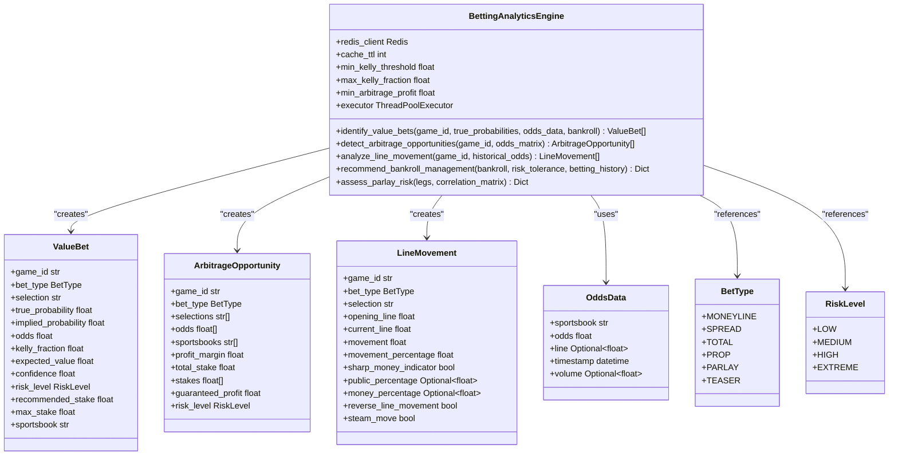
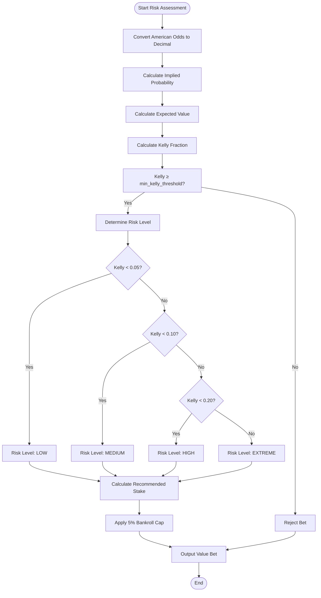
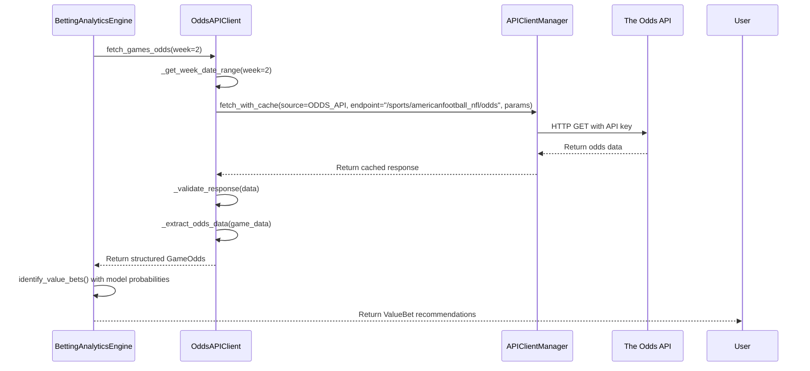

# Betting Engine

<cite>
**Referenced Files in This Document**   
- [betting_engine.py](file://src/analytics/betting_engine.py)
- [odds_api_client.py](file://src/api/odds_api_client.py)
- [api_endpoints.py](file://src/analytics/api_endpoints.py)
</cite>

## Table of Contents
1. [Introduction](#introduction)
2. [Core Algorithms](#core-algorithms)
3. [Value Bet Identification](#value-bet-identification)
4. [Risk Assessment and Expected Value](#risk-assessment-and-expected-value)
5. [Confidence-Based Wager Sizing](#confidence-based-wager-sizing)
6. [Integration with Odds API Client](#integration-with-odds-api-client)
7. [Configuration Options](#configuration-options)
8. [False Positive and Overfitting Indicators](#false-positive-and-overfitting-indicators)
9. [Troubleshooting Guide](#troubleshooting-guide)

## Introduction

The Betting Analytics Engine is a sophisticated system designed to identify profitable betting opportunities by comparing model-generated predictions against market odds. The engine analyzes prediction data across multiple dimensions including spreads, totals, and moneyline probabilities to detect value bets, arbitrage opportunities, and line movement patterns. It integrates with the Odds API client to retrieve real-time market data and applies advanced algorithms for risk assessment, expected value calculation, and confidence-based wager sizing. The system provides comprehensive bankroll management recommendations and supports various stake sizing strategies based on risk tolerance levels.

**Section sources**
- [betting_engine.py](file://src/analytics/betting_engine.py#L1-L50)

## Core Algorithms

The Betting Analytics Engine employs several key algorithms to identify value betting opportunities and assess risk. The primary algorithm is the Kelly Criterion, which calculates the optimal fraction of bankroll to wager based on the edge between true probability and implied probability from market odds. The engine also implements expected value calculation to quantify the profitability of potential bets. For arbitrage detection, the system analyzes odds across multiple sportsbooks to identify guaranteed profit opportunities. Line movement analysis tracks how betting lines change over time, detecting patterns that indicate sharp money or steam moves. The engine uses Redis for caching to improve performance and reduce API calls.

**Diagram sources **
- [betting_engine.py](file://src/analytics/betting_engine.py#L105-L1046)

## Value Bet Identification

The engine identifies value betting opportunities by comparing model-generated true probabilities against market-implied probabilities derived from sportsbook odds. The process begins with the `identify_value_bets` method, which takes game identifiers, true probabilities from prediction models, and odds data from multiple sportsbooks. The engine converts American odds to decimal format and calculates implied probabilities. It then applies the Kelly Criterion to determine the optimal bet size when the true probability exceeds the implied probability. The system filters out opportunities below the minimum Kelly threshold (0.01) and sorts results by expected value. Value bets are cached in Redis to avoid redundant calculations and improve response times.

**Section sources**
- [betting_engine.py](file://src/analytics/betting_engine.py#L179-L259)

## Risk Assessment and Expected Value

Risk assessment in the Betting Analytics Engine is multi-faceted, incorporating Kelly Criterion fractions, expected value calculations, and confidence metrics. The `calculate_expected_value` method computes the mathematical expectation of a bet by considering both potential winnings and losses weighted by their respective probabilities. The engine categorizes risk levels based on Kelly fractions: LOW (below 0.05), MEDIUM (0.05-0.10), HIGH (0.10-0.20), and EXTREME (above 0.20). The system also implements safety caps, ensuring recommended stakes never exceed 5% of the bankroll regardless of Kelly calculations. For parlays and teasers, the engine assesses risk by considering leg correlations and calculates adjusted probabilities accordingly.

**Diagram sources **
- [betting_engine.py](file://src/analytics/betting_engine.py#L148-L177)
- [betting_engine.py](file://src/analytics/betting_engine.py#L211-L236)

## Confidence-Based Wager Sizing

The engine implements confidence-based wager sizing through a combination of the Kelly Criterion and risk tolerance adjustments. The `recommend_bankroll_management` method provides personalized recommendations based on user-defined risk tolerance (conservative, medium, aggressive). For conservative profiles, the system applies a 0.25 Kelly multiplier with a maximum bet percentage of 2%, while aggressive profiles use a 0.75 multiplier with up to 5% of bankroll per bet. The engine dynamically adjusts these parameters based on historical performance, increasing bet sizes for consistently profitable strategies and reducing them during losing periods. The system also considers daily risk limits and stop-loss thresholds to prevent catastrophic losses.

**Section sources**
- [betting_engine.py](file://src/analytics/betting_engine.py#L680-L759)

## Integration with Odds API Client

The Betting Analytics Engine integrates with the Odds API Client to retrieve real-time market odds for NFL games. The `OddsAPIClient` fetches data from The Odds API, parsing responses to extract spreads, totals, and moneylines from multiple sportsbooks. The client handles authentication, response validation, and team name standardization, converting full team names to standard abbreviations. It implements caching through the client manager to minimize API calls and rate limit usage. The betting engine uses this data to compare model predictions against market odds, flagging discrepancies that indicate value opportunities. The integration supports fetching odds for specific weeks and filtering by market type (spreads, totals, or moneylines).

**Diagram sources **
- [odds_api_client.py](file://src/api/odds_api_client.py#L225-L279)
- [betting_engine.py](file://src/analytics/betting_engine.py#L179-L259)

## Configuration Options

The Betting Analytics Engine provides several configurable parameters to customize its behavior according to user preferences and risk profiles. Key configuration options include `min_kelly_threshold` (default 0.01), which sets the minimum Kelly fraction required to consider a bet; `max_kelly_fraction` (default 0.25), which caps the maximum recommended bet size; and `min_arbitrage_profit` (default 0.01), which defines the minimum profit margin for arbitrage opportunities. The engine also supports risk tolerance levels (conservative, medium, aggressive) that adjust Kelly multipliers and maximum bet percentages. Bankroll management configurations include daily risk limits, stop-loss thresholds, and rebalancing rules based on profit or loss percentages