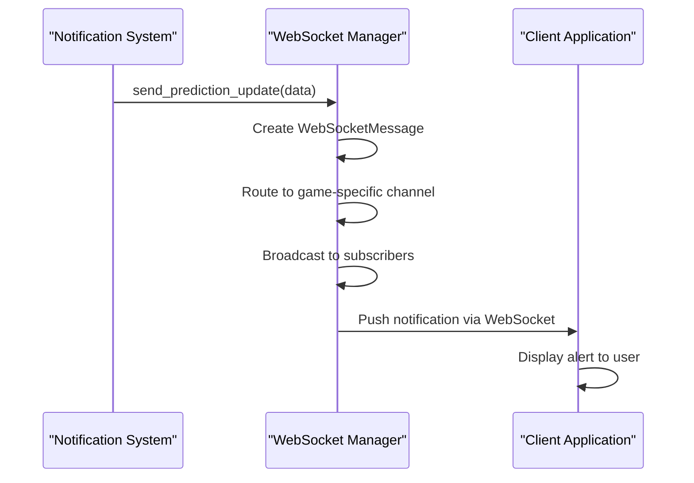
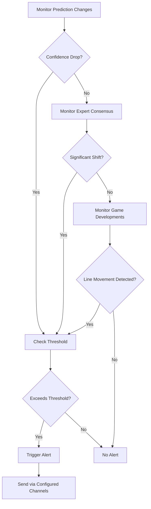

# Notification System

<cite>
**Referenced Files in This Document**   
- [notification_system.py](file://src/analytics/notification_system.py)
- [websocket_manager.py](file://src/websocket/websocket_manager.py)
- [predictions.ts](file://src/types/predictions.ts)
- [api_endpoints.py](file://src/analytics/api_endpoints.py)
- [prediction_monitor.py](file://src/monitoring/prediction_monitor.py)
- [betting_engine.py](file://src/analytics/betting_engine.py)
</cite>

## Table of Contents
1. [Introduction](#introduction)
2. [Event-Driven Architecture](#event-driven-architecture)
3. [Notification Triggering Mechanisms](#notification-triggering-mechanisms)
4. [Configuration and Delivery Channels](#configuration-and-delivery-channels)
5. [Integration with Real-Time Pipeline](#integration-with-real-time-pipeline)
6. [Prioritization and Deduplication](#prioritization-and-deduplication)
7. [Troubleshooting Guide](#troubleshooting-guide)
8. [Performance Considerations](#performance-considerations)

## Introduction
The Notification System is a critical component of the NFL Predictor API that delivers real-time alerts to users based on significant changes in predictions, expert consensus, and live game developments. This system monitors various data points including prediction confidence levels, expert performance metrics, and real-time game events to identify betting opportunities and important shifts in analysis. Using an event-driven architecture with WebSocket connections, the system pushes notifications to clients immediately when threshold-based triggers are met, ensuring users receive timely information for decision-making.

**Section sources**
- [notification_system.py](file://src/analytics/notification_system.py#L1-L580)
- [websocket_manager.py](file://src/websocket/websocket_manager.py#L1-L363)

## Event-Driven Architecture
The notification system employs an event-driven architecture that leverages WebSocket connections to deliver real-time updates to clients. The system uses a publish-subscribe pattern where clients subscribe to specific channels (such as game-specific updates, prediction changes, or expert performance) and receive notifications when relevant events occur.

The WebSocketManager class manages all active connections and handles message broadcasting to subscribed clients. When a significant event occurs—such as a prediction update, game event, line movement, expert update, or consensus change—the system creates a RealtimeUpdate message with the appropriate type, timestamp, data payload, affected predictions, and severity level. This message is then pushed to all subscribed clients through their WebSocket connections, enabling immediate delivery without requiring clients to poll for updates.

**Diagram sources**
- [websocket_manager.py](file://src/websocket/websocket_manager.py#L333-L342)
- [predictions.ts](file://src/types/predictions.ts#L263-L269)

**Section sources**
- [websocket_manager.py](file://src/websocket/websocket_manager.py#L228-L359)
- [predictions.ts](file://src/types/predictions.ts#L263-L269)

## Notification Triggering Mechanisms
The system monitors multiple data streams to trigger notifications based on predefined thresholds and significant changes. These triggers include prediction confidence drops, expert consensus shifts, and real-time game developments that indicate valuable betting opportunities.

Threshold-based triggering is implemented through the ThresholdManager class, which defines critical thresholds for various metrics such as accuracy, confidence calibration, error rate, drift score, and response time. When any metric crosses its defined threshold, an alert is generated. For example, if an expert's accuracy drops below 0.5 (50%), an emergency-level alert is triggered. Similarly, if the confidence calibration score falls below 0.5, indicating poor calibration between predicted and actual outcomes, a critical alert is generated.

The betting engine also identifies value betting opportunities by comparing true probabilities (from the prediction models) with implied probabilities (from sportsbook odds). When the true probability significantly exceeds the implied probability, indicating positive expected value, a value bet alert is triggered. The system uses the Kelly Criterion to calculate optimal stake sizes and only triggers alerts when the Kelly fraction exceeds the minimum threshold of 0.01.

**Diagram sources**
- [prediction_monitor.py](file://src/monitoring/prediction_monitor.py#L202-L258)
- [betting_engine.py](file://src/analytics/betting_engine.py#L179-L259)

**Section sources**
- [prediction_monitor.py](file://src/monitoring/prediction_monitor.py#L202-L258)
- [betting_engine.py](file://src/analytics/betting_engine.py#L179-L259)

## Configuration and Delivery Channels
Users