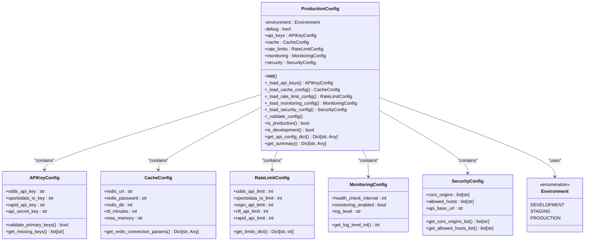
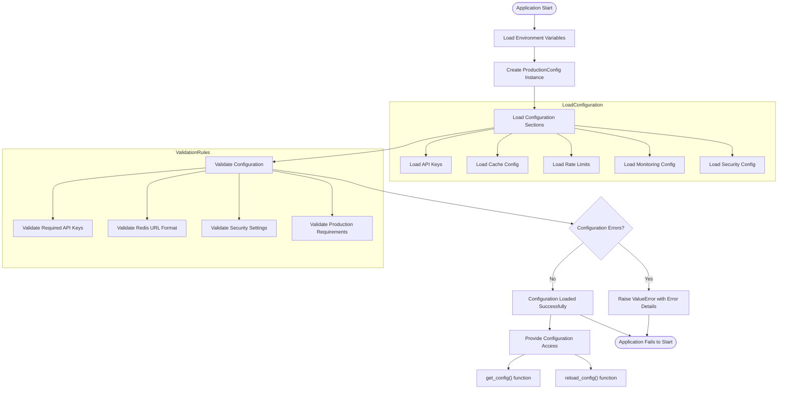

# Environment Configuration

<cite>
**Referenced Files in This Document**   
- [production.py](file://config/production.py)
- [config.toml](file://supabase/config.toml)
- [docker-compose.prod.yml](file://docker-compose.prod.yml)
- [Dockerfile](file://Dockerfile)
- [production_deployment.py](file://config/production_deployment.py)
- [PRODUCTION_SETUP_GUIDE.md](file://PRODUCTION_SETUP_GUIDE.md)
- [SUPABASE_SETUP.md](file://SUPABASE_SETUP.md)
</cite>

## Table of Contents
1. [Configuration Architecture](#configuration-architecture)
2. [Environment-Specific Configuration Files](#environment-specific-configuration-files)
3. [Configuration Loading and Validation](#configuration-loading-and-validation)
4. [Supabase Integration Configuration](#supabase-integration-configuration)
5. [Production Environment Settings](#production-environment-settings)
6. [Local Development Configuration](#local-development-configuration)
7. [Environment Variable Management](#environment-variable-management)
8. [Docker and CI/CD Integration](#docker-and-cicd-integration)
9. [Common Configuration Pitfalls](#common-configuration-pitfalls)

## Configuration Architecture

The NFL Predictor API implements a hierarchical configuration architecture that supports multiple environments with appropriate defaults and validation. The system uses environment variables as the primary configuration mechanism, with Python classes providing type safety and validation. Configuration is organized into logical sections including API keys, caching, rate limiting, monitoring, and security settings.

The configuration system follows the principle of least surprise by providing sensible defaults for development environments while enforcing strict validation in production. Environment-specific settings are managed through environment variables, allowing for consistent configuration across different deployment targets without code changes.

**Diagram sources**
- [production.py](file://config/production.py#L1-L310)

**Section sources**
- [production.py](file://config/production.py#L1-L310)

## Environment-Specific Configuration Files

The NFL Predictor API maintains distinct configuration files for different environments, with a clear separation between development, staging, and production settings. The primary configuration file `config/production.py` serves as the foundation for all environments, defining the structure and default values for configuration parameters.

For production deployments, the system uses `docker-compose.prod.yml` which specifies container settings optimized for production, including resource limits, health checks, and security configurations. This file defines the complete production stack with the API service, Redis cache, and Nginx reverse proxy, each configured with production-appropriate settings.

The Supabase integration is configured through `supabase/config.toml`, which contains settings for local development. This file includes port configurations for the API, database, and Studio interface, along with authentication settings and storage limits. Notably, the file includes environment variables for Supabase credentials that are referenced using the `env()` syntax, allowing for secure credential management.

Additional configuration files include environment-specific Docker Compose files and deployment scripts that orchestrate the complete deployment process. The `PRODUCTION_SETUP_GUIDE.md` provides comprehensive documentation for production configuration, while `SUPABASE_SETUP.md` details the Supabase-specific setup requirements.

**Section sources**
- [production.py](file://config/production.py#L1-L310)
- [config.toml](file://supabase/config.toml#L1-L162)
- [docker-compose.prod.yml](file://docker-compose.prod.yml#L1-L75)
- [PRODUCTION_SETUP_GUIDE.md](file://PRODUCTION_SETUP_GUIDE.md#L1-L285)
- [SUPABASE_SETUP.md](file://SUPABASE_SETUP.md#L1-L346)

## Configuration Loading and Validation

Configuration loading in the NFL Predictor API follows a systematic approach that prioritizes environment variables while providing sensible defaults. The `ProductionConfig` class in `config/production.py` serves as the central configuration manager, loading values from environment variables during initialization. The configuration system uses a layered approach where each configuration section (API keys, cache, rate limiting, etc.) is loaded through dedicated methods that extract values from environment variables with appropriate defaults.

The configuration validation process is comprehensive and occurs during initialization. In production environments, the system validates that required API keys are present, Redis URL format is correct, and security settings meet production requirements. For example, the system checks that CORS origins do not include wildcard (*) in production and that the API base URL uses HTTPS. These validations prevent common configuration errors that could lead to security vulnerabilities or service disruptions.

The configuration system also provides utility methods for accessing configuration data in different formats. The `get_api_config_dict()` method returns a dictionary suitable for client managers, while `get_summary()` provides a comprehensive overview of the current configuration state for logging and debugging purposes. This design allows components throughout the application to access configuration data in the format that best suits their needs.

**Diagram sources**
- [production.py](file://config/production.py#L126-L310)

**Section sources**
- [production.py](file://config/production.py#L126-L310)

## Supabase Integration Configuration

The Supabase integration in the NFL Predictor API is configured through multiple mechanisms that work together to provide a robust database connection. The `supabase/config.toml` file contains local development configuration, specifying ports for the API (54321), database (54322), and Studio (54323) services. This configuration enables local development with Supabase CLI, allowing developers to run a complete Supabase environment locally.

For production environments, Supabase configuration is managed through environment variables rather than the config file. The system uses `SUPABASE_URL`, `SUPABASE_ANON_KEY`, and `SUPABASE_SERVICE_ROLE_KEY` environment variables to establish connections to the remote Supabase instance. These values are loaded by the configuration system and used to create database connections throughout the application.

The integration also includes database optimization settings that are specifically tuned