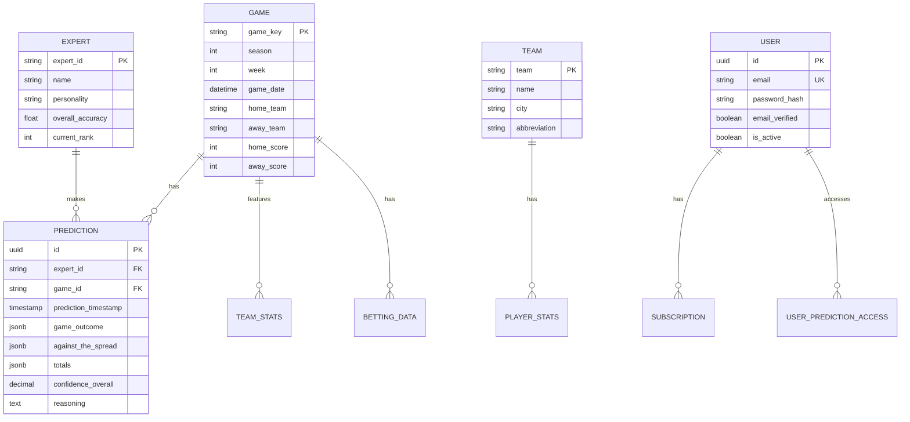
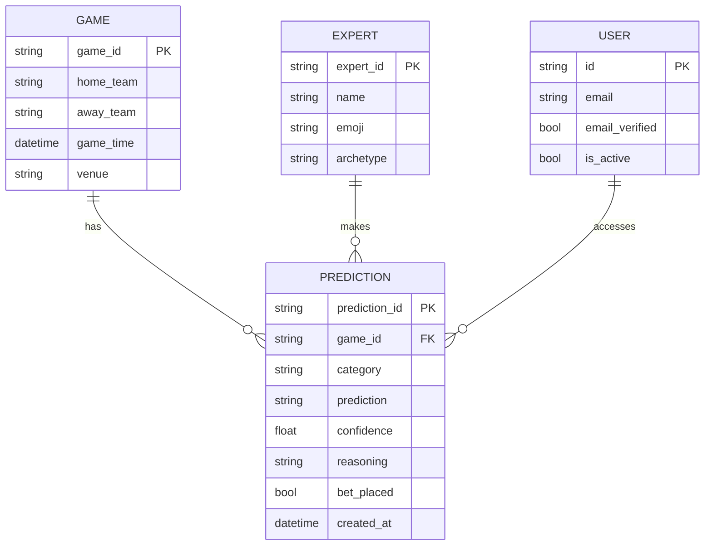

# Core Data Entities

<cite>
**Referenced Files in This Document**   
- [src/database/models.py](file://src/database/models.py)
- [src/database/models/historical_games.py](file://src/database/models/historical_games.py)
- [src/api/models/game.py](file://src/api/models/game.py)
- [src/api/models/expert.py](file://src/api/models/expert.py)
- [src/api/models/prediction.py](file://src/api/models/prediction.py)
- [supabase/migrations/20250116_expert_competition_tables.sql](file://supabase/migrations/20250116_expert_competition_tables.sql)
</cite>

## Table of Contents
1. [Introduction](#introduction)
2. [Entity Overview](#entity-overview)
3. [Game Entity](#game-entity)
4. [Team Entity](#team-entity)
5. [Prediction Entity](#prediction-entity)
6. [Expert Entity](#expert-entity)
7. [User Entity](#user-entity)
8. [Entity Relationships](#entity-relationships)
9. [Common Query Patterns](#common-query-patterns)
10. [Data Validation and Constraints](#data-validation-and-constraints)
11. [Sample JSON Representations](#sample-json-representations)
12. [Conclusion](#conclusion)

## Introduction
This document provides comprehensive documentation for the core data entities in the NFL Predictor API: Game, Team, Prediction, Expert, and User. The system is designed to track NFL games, expert predictions, user subscriptions, and performance metrics for a sophisticated prediction platform. The data model supports both historical analysis and real-time prediction workflows, with a focus on accuracy tracking, expert competition, and user engagement. The entities are implemented using SQLAlchemy ORM with PostgreSQL as the primary database backend, leveraging advanced features like JSONB columns, UUID primary keys, and vector embeddings for pattern matching.

## Entity Overview
The NFL Predictor API centers around five core entities that form the foundation of the prediction system. The Game entity represents NFL matchups with comprehensive details including teams, schedules, and game conditions. The Team entity captures team-specific information and performance metrics. The Prediction entity stores forecasts made by expert models across various categories such as point spreads, totals, and moneylines. The Expert entity represents the AI prediction models that compete to provide the most accurate forecasts, each with distinct personalities and specializations. The User entity manages platform users, their authentication credentials, subscription status, and access rights. These entities are interconnected through well-defined relationships that enable complex queries for prediction accuracy analysis, expert performance tracking, and user experience personalization.

## Game Entity
The Game entity represents NFL matchups and serves as the central reference point for predictions. In the database, games are stored in the `historical_games` table with a comprehensive schema that captures both basic game information and advanced metrics. Key attributes include the game identifier (game_key), season and week information, home and away teams, game date and time, stadium details, weather conditions, and final scores. The entity also includes derived metrics such as total points, point differential, and game pace that are valuable for machine learning models. The Game entity is implemented as the `HistoricalGame` class in SQLAlchemy ORM with appropriate indexes on season, week, and game date for efficient querying. Data integrity is enforced through constraints that ensure scores are non-negative and seasons are realistic (≥ 2000). The entity supports temporal queries through created_at and updated_at timestamps and is optimized for historical analysis with specialized indexes on team statistics and betting data.

**Section sources**
- [src/database/models/historical_games.py](file://src/database/models/historical_games.py#L15-L116)

## Team Entity
The Team entity captures information about NFL teams and their performance in individual games. Each team's performance is tracked through the `team_stats` table, which contains detailed offensive and defensive metrics for every game. Key attributes include basic statistics like points, first downs, and total yards, as well as more advanced metrics such as expected points added (EPA), success rate, and time of possession. The entity also tracks red zone and third-down efficiency, which are critical indicators of team performance. For machine learning purposes, the model includes calculated fields like yards_per_play and points_per_drive. The Team entity is implemented as the `TeamStats` class in SQLAlchemy ORM and is linked to the Game entity through a foreign key relationship. Data validation ensures that all statistical values are non-negative through check constraints. The entity supports both real-time analysis and historical trend identification, with indexes optimized for queries by team, game, and performance metrics.

**Section sources**
- [src/database/models/historical_games.py](file://src/database/models/historical_games.py#L118-L200)

## Prediction Entity
The Prediction entity stores forecasts made by expert models across multiple categories. Predictions are stored in the `expert_predictions_comprehensive` table with a rich schema that captures not only the prediction itself but also confidence levels, reasoning, and contextual information. Key attributes include the expert_id, game_id, prediction timestamp, and multiple prediction types such as game outcome, against-the-spread, totals, and player props. Each prediction includes confidence scores, detailed reasoning, and key factors that influenced the forecast. The entity also stores vector embeddings (prediction_embedding and context_embedding) that enable similarity searches for pattern recognition. After games are completed, actual results are recorded along with points earned and accuracy scores. The Prediction entity is implemented to support the expert competition system, with indexes optimized for retrieval by expert, game, and timestamp. The use of JSONB columns allows for flexible storage of complex prediction data while maintaining query performance.

**Section sources**
- [supabase/migrations/20250116_expert_competition_tables.sql](file://supabase/migrations/20250116_expert_competition_tables.sql#L35-L85)

## Expert Entity
The Expert entity represents the AI prediction models that compete within the system. Experts are stored in the `expert_models` table with attributes that capture both performance metrics and behavioral characteristics. Key attributes include the expert_id, name, personality type, specializations, total predictions, correct predictions, overall accuracy, and leaderboard score. The entity also tracks ranking information with current_rank and peak_rank fields. Each expert has a status field that indicates whether they are active, suspended, or retired from competition. The schema supports the expert competition system by including fields for performance by category, head-to-head records, and learning patterns. Experts can specialize in specific areas such as weather impact, injury analysis, or line movement, which is captured in the specializations array field. The entity is optimized for leaderboard calculations with indexes on leaderboard_score and current_rank, enabling efficient ranking updates and performance analysis.

**Section sources**
- [supabase/migrations/20250116_expert_competition_tables.sql](file://supabase/migrations/20250116_expert_competition_tables.sql#L1-L33)

## User Entity
The User entity manages platform users and their associated data. Users are stored in the `users` table with core attributes including a UUID primary key, email address (enforced as unique), password hash, and profile information. The entity supports authentication through password_hash and session management through relationships with the UserSession table. Additional attributes include email_verified status, active status, creation and update timestamps, and last login time. The User entity is connected to several related entities through relationships: subscriptions (via Subscription), administrative privileges (via AdminUser), affiliate program participation (via Affiliate), and referral tracking (via Referral). Data integrity is maintained through unique constraints on email addresses and appropriate indexes on frequently queried fields. The entity supports the platform's business model by tracking subscription status, free access grants, and payment history, enabling personalized user experiences based on access level and engagement.

**Section sources**
- [src/database/models.py](file://src/database/models.py#L58-L82)

## Entity Relationships
The core entities in the NFL Predictor API are interconnected through well-defined relationships that enable comprehensive analysis of predictions and performance. The Game entity serves as the central hub, with Predictions linked to specific games through the game_id foreign key. Each Prediction is associated with an Expert through the expert_id foreign key, creating a many-to-one relationship where multiple predictions can be made by the same expert across different games. Experts have performance metrics tracked in related tables like expert_category_performance and expert_leaderboard_history, establishing one-to-many relationships for detailed performance analysis. Users interact with the system through subscriptions and prediction access records, with the User entity connected to Subscription and UserPredictionAccess entities. The Team entity is linked to Game through home_team and away_team fields, with detailed team statistics stored in the team_stats table. These relationships enable complex queries such as retrieving all predictions for a specific game, analyzing an expert's performance history, or identifying user engagement patterns across different prediction categories.

**Diagram sources**
- [src/database/models/historical_games.py](file://src/database/models/historical_games.py)
- [supabase/migrations/20250116_expert_competition_tables.sql](file://supabase/migrations/20250116_expert_competition_tables.sql)

## Common Query Patterns
The data model supports several common query patterns essential for the NFL Predictor API's functionality. To retrieve all predictions for a specific game, the system joins the expert_predictions_comprehensive table with expert_models using the game_id filter, enabling display of all expert forecasts for user consumption. For retrieving expert performance history, queries aggregate data from expert_predictions_comprehensive and expert_category_performance tables, grouping by expert_id and category to calculate accuracy metrics over time. Another frequent pattern involves fetching the current leaderboard by querying expert_models ordered by leaderboard_score with status = 'active', often joined with recent performance views for up-to-date rankings. Game-centric queries typically start with historical_games and join with team_stats, player_stats, and betting_data to provide comprehensive game previews. User-specific queries often involve joining users with subscriptions and user_prediction_access to determine access rights and engagement metrics. The schema is optimized for these patterns with appropriate indexes on game_id, expert_id, prediction_timestamp, and composite keys for multi-attribute queries.

**Section sources**
- [src/database/models/historical_games.py](file://src/database/models/historical_games.py)
- [supabase/migrations/20250116_expert_competition_tables.sql](file://supabase/migrations/20250116_expert_competition_tables.sql)

## Data Validation and Constraints
The data model implements comprehensive validation rules and constraints to ensure data integrity across all entities. For the Game entity, check constraints enforce that home_score and away_score are non-negative, and that seasons are realistic (≥ 2000). The Team entity includes similar constraints ensuring that statistical values like points and total_yards are non-negative. The Prediction entity uses PostgreSQL's JSONB data type with application-level validation to ensure prediction structures are consistent, while confidence values are constrained between 0.0 and 1.0. The Expert entity enforces data integrity through a primary key constraint on expert_id and a unique index on the combination of expert1_id and expert2_id in the head-to-head records table. The User entity maintains uniqueness through a unique constraint on the email field and uses UUIDs for primary keys to prevent enumeration attacks. All timestamp fields use server defaults for created_at and automatic updates for updated_at, ensuring consistent temporal tracking. The schema also includes foreign key constraints with appropriate ON DELETE actions to maintain referential integrity across related entities.

**Section sources**
- [src/database/models/historical_games.py](file://src/database/models/historical_games.py#L100-L105)
- [supabase/migrations/20250116_expert_competition_tables.sql](file://supabase/migrations/20250116_expert_competition_tables.sql)

## Sample JSON Representations
The API exposes the core entities through standardized JSON representations that provide consistent data structures for clients. A Game object includes the game_id, home_team, away_team, game_time, venue, weather conditions, Vegas lines, and council consensus predictions. The Expert representation contains the expert_id, name, emoji, archetype, bankroll information, performance metrics, and specialization details. Prediction objects include the prediction_id, game_id, category, prediction text, confidence score, reasoning, bet placement status, and creation timestamp. User representations focus on profile information with id, email, verification status, and subscription details. These JSON schemas are defined using Pydantic models in the API layer, ensuring type safety and validation. The representations are designed to be comprehensive yet efficient, including only the fields necessary for client-side rendering while maintaining consistency across endpoints. This approach enables rich client experiences with predictable data structures while minimizing payload size through selective field inclusion.

**Diagram sources**
- [src/api/models/game.py](file://src/api/models/game.py)
- [src/api/models/expert.py](file://src/api/models/expert.py)
- [src/api/models/prediction.py](file://src/api/models/prediction.py)

## Conclusion
The core data entities of the NFL Predictor API form a robust foundation for a sophisticated prediction platform that combines historical analysis with real-time forecasting. The Game, Team, Prediction, Expert, and User entities are thoughtfully designed with comprehensive attributes, well-defined relationships, and strict data integrity constraints. The implementation leverages SQLAlchemy ORM effectively to bridge the object-relational gap while maintaining database performance through strategic indexing and PostgreSQL-specific features like JSONB and vector types. The schema supports the platform's key use cases including expert competition, prediction accuracy tracking, and personalized user experiences. By separating concerns between historical data storage, expert performance tracking, and user management, the data model enables scalable growth and complex analytical capabilities. The comprehensive documentation of entities, relationships, and query patterns provides a clear roadmap for developers and analysts working with the system.