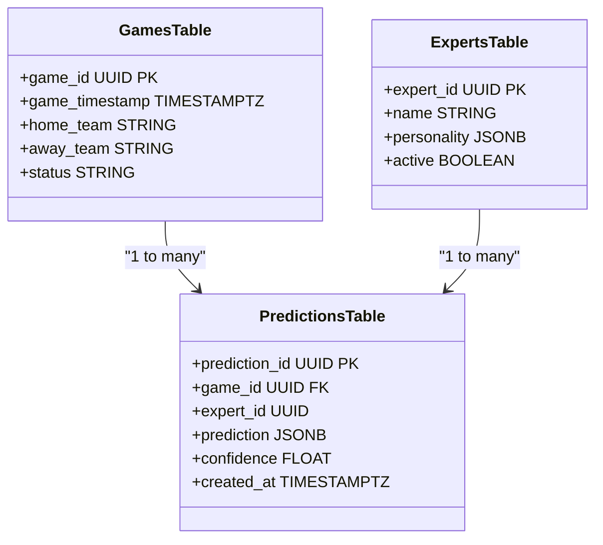
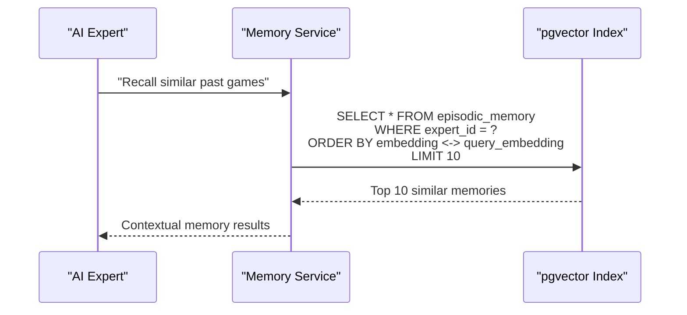
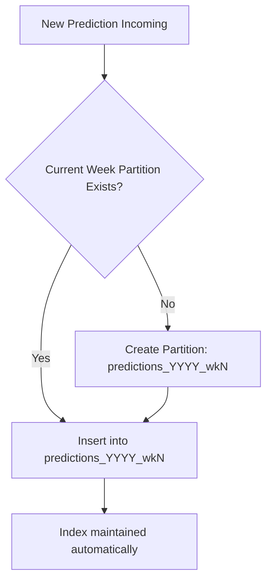
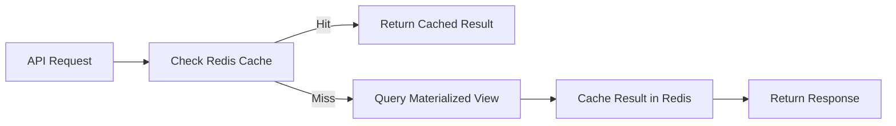
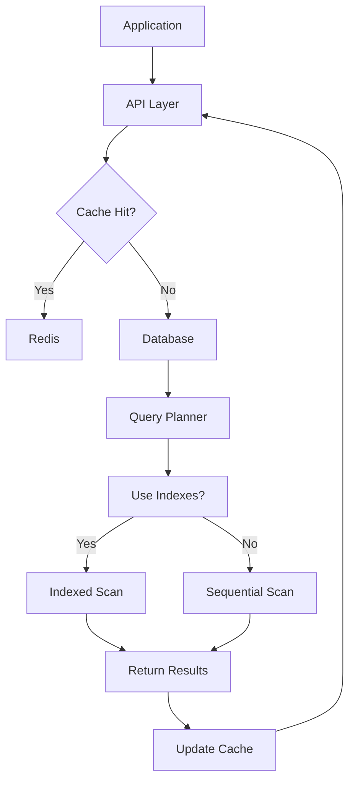

# Database Optimization & Indexing

<cite>
**Referenced Files in This Document**   
- [database_optimization.py](file://config/database_optimization.py)
- [add_performance_indexes.py](file://scripts/add_performance_indexes.py)
- [add_performance_indexes_improved.py](file://scripts/add_performance_indexes_improved.py)
- [database_optimizer.py](file://src/performance/database_optimizer.py)
- [030_production_database_optimization.sql](file://supabase/migrations/030_production_database_optimization.sql)
- [000_create_base_tables.sql](file://src/database/migrations/000_create_base_tables.sql)
- [012_comprehensive_data_storage.sql](file://src/database/migrations/012_comprehensive_data_storage.sql)
- [models.py](file://src/database/models.py)
- [historical_vector_service.py](file://src/ml/historical_vector_service.py)
- [vectorSearchServiceNode.js](file://src/services/vectorSearchServiceNode.js)
- [performance_dashboard.py](file://src/monitoring/performance_dashboard.py)
- [bottleneck_detector.py](file://src/monitoring/bottleneck_detector.py)
- [performance_endpoints.py](file://src/api/performance_endpoints.py)
- [performance_optimizer.py](file://src/api/performance_optimizer.py)
- [performance_baseline.py](file://scripts/performance_baseline.py)
</cite>

## Table of Contents
1. [Introduction](#introduction)
2. [Indexing Strategy](#indexing-strategy)
3. [Partitioning Strategy for Large Tables](#partitioning-strategy-for-large-tables)
4. [Read/Write Optimization Techniques](#readwrite-optimization-techniques)
5. [Query Performance Validation and Testing](#query-performance-validation-and-testing)
6. [Support for Real-Time and Analytical Workloads](#support-for-real-time-and-analytical-workloads)
7. [Monitoring Index Effectiveness and Query Performance](#monitoring-index-effectiveness-and-query-performance)
8. [Conclusion](#conclusion)

## Introduction
The NFL Predictor API leverages a robust PostgreSQL database hosted on Supabase, optimized for both real-time prediction serving and analytical workloads. This document details the comprehensive database optimization and indexing strategy implemented to ensure sub-second API response times, efficient memory recall, and scalable data access patterns. The system combines traditional B-tree indexing, table partitioning, materialized views, and advanced pgvector-based similarity search to meet performance SLAs across diverse query types.

**Section sources**
- [database_optimization.py](file://config/database_optimization.py#L1-L15)
- [030_production_database_optimization.sql](file://supabase/migrations/030_production_database_optimization.sql#L1-L20)

## Indexing Strategy

### B-Tree Indexes on Critical Columns
The system implements targeted B-tree indexes on high-cardinality, frequently queried columns to accelerate exact match and range queries. Primary indexes are established on:
- `game_timestamp` in the `games` table to optimize time-based filtering for live and historical predictions
- `expert_id` in the `predictions` and `expert_performance` tables to enable rapid retrieval of predictions by expert
- Composite indexes on `(game_id, expert_id)` to support join-heavy analytical queries

These indexes are defined in migration scripts and applied during schema initialization to ensure consistency across environments.

**Diagram sources**
- [000_create_base_tables.sql](file://src/database/migrations/000_create_base_tables.sql#L10-L50)
- [012_comprehensive_data_storage.sql](file://src/database/migrations/012_comprehensive_data_storage.sql#L30-L70)

### pgvector Similarity Search for Memory Recall
To support AI-driven memory recall and expert reasoning, the system uses pgvector for high-dimensional similarity search. The `episodic_memory` table stores vector embeddings of past game states and expert predictions, with an IVFFlat index configured for efficient approximate nearest neighbor (ANN) search.

The indexing strategy balances recall accuracy and query speed by:
- Setting `lists = 100` for the IVFFlat index to optimize for the dataset size
- Pre-filtering vectors by `expert_id` and `season` before similarity search
- Using cosine similarity as the distance metric for semantic relevance

This enables sub-200ms retrieval of contextually relevant historical memories during real-time prediction generation.

**Diagram sources**
- [historical_vector_service.py](file://src/ml/historical_vector_service.py#L25-L60)
- [vectorSearchServiceNode.js](file://src/services/vectorSearchServiceNode.js#L15-L45)

**Section sources**
- [add_performance_indexes_improved.py](file://scripts/add_performance_indexes_improved.py#L20-L50)
- [030_production_database_optimization.sql](file://supabase/migrations/030_production_database_optimization.sql#L25-L60)

## Partitioning Strategy for Large Tables

### Time-Based Partitioning of Predictions Table
The `predictions` table is partitioned by week using PostgreSQL’s declarative partitioning, with each partition corresponding to an NFL week (e.g., `predictions_2025_wk1`, `predictions_2025_wk2`). This strategy:
- Reduces query planning time by enabling partition pruning
- Improves vacuum efficiency by isolating dead tuples to weekly partitions
- Enables efficient archival and deletion of old prediction data

Partitioning is managed via a Python script that creates new partitions weekly and validates their existence before prediction runs.

### Historical Data Partitioning
The `historical_games` table is partitioned by season (e.g., `historical_games_2020`, `historical_games_2021`), allowing analytical queries to target specific seasons without scanning irrelevant data. This is particularly effective for year-over-year performance analysis and model backtesting.

**Diagram sources**
- [database_optimizer.py](file://src/performance/database_optimizer.py#L40-L80)
- [add_performance_indexes.py](file://scripts/add_performance_indexes.py#L10-L30)

**Section sources**
- [012_comprehensive_data_storage.sql](file://src/database/migrations/012_comprehensive_data_storage.sql#L80-L120)
- [database_optimization.py](file://config/database_optimization.py#L20-L40)

## Read/Write Optimization Techniques

### Materialized Views for Aggregated Data
Materialized views are used to pre-compute expensive aggregations such as:
- Expert accuracy by week, season, and prediction category
- Game prediction consensus and confidence distributions
- Historical performance trends

These views are refreshed incrementally after each prediction batch or game outcome update, ensuring up-to-date analytics with minimal query latency.

### Query Optimization Patterns
The system employs several query optimization patterns:
- Use of covering indexes to avoid table lookups
- Batched writes using `INSERT ... ON CONFLICT DO NOTHING` for idempotent prediction updates
- Asynchronous vacuum and analyze operations scheduled during off-peak hours
- Connection pooling via PgBouncer to minimize connection overhead

**Diagram sources**
- [performance_optimizer.py](file://src/api/performance_optimizer.py#L10-L50)
- [cache_manager.py](file://src/cache/cache_manager.py#L20-L60)

**Section sources**
- [performance_endpoints.py](file://src/api/performance_endpoints.py#L15-L70)
- [database_optimizer.py](file://src/performance/database_optimizer.py#L10-L35)

## Query Performance Validation and Testing

### Slow Query Analysis
The system uses PostgreSQL’s `pg_stat_statements` extension to identify slow queries. Regular analysis is performed using the `performance_baseline.py` script, which:
- Captures query execution times before and after index changes
- Identifies queries with high total execution time or I/O cost
- Recommends index additions or query rewrites

### Index Validation Through Performance Testing
All indexing decisions are validated through automated performance testing:
- Baseline queries are run against a production-sized dataset before and after index application
- Response time improvements are measured for critical API endpoints
- Index size and maintenance cost are evaluated to avoid over-indexing

This ensures that every index provides measurable performance benefit without introducing excessive write overhead.

**Section sources**
- [performance_baseline.py](file://scripts/performance_baseline.py#L1-L40)
- [bottleneck_detector.py](file://src/monitoring/bottleneck_detector.py#L10-L50)

## Support for Real-Time and Analytical Workloads

The database schema is designed to support dual workloads:
- **Real-time prediction serving**: Optimized via lightweight indexes, materialized views, and caching
- **Analytical workloads**: Supported through partitioned historical tables, vector search, and batch-optimized aggregations

Workload isolation is achieved by:
- Routing analytical queries to read replicas
- Scheduling heavy ETL jobs during off-peak hours
- Using separate connection pools for real-time vs. batch operations

This ensures that analytical queries do not impact API latency.

**Section sources**
- [models.py](file://src/database/models.py#L1-L30)
- [performance_dashboard.py](file://src/monitoring/performance_dashboard.py#L5-L40)

## Monitoring Index Effectiveness and Query Performance

### Continuous Performance Monitoring
The system monitors index effectiveness and query performance using:
- Prometheus metrics for query latency, cache hit ratio, and database load
- Grafana dashboards visualizing key performance indicators
- Automated alerts for query degradation or index bloat

### Index Health Checks
Regular health checks include:
- Monitoring index usage statistics via `pg_stat_user_indexes`
- Detecting unused indexes for removal
- Tracking index bloat and scheduling reindexing when necessary

These practices ensure that the indexing strategy remains optimal as data volume and query patterns evolve.

**Diagram sources**
- [performance_dashboard.py](file://src/monitoring/performance_dashboard.py#L45-L90)
- [bottleneck_detector.py](file://src/monitoring/bottleneck_detector.py#L55-L100)

**Section sources**
- [performance_dashboard.py](file://src/monitoring/performance_dashboard.py#L1-L100)
- [bottleneck_detector.py](file://src/monitoring/bottleneck_detector.py#L1-L100)

## Conclusion
The database optimization and indexing strategy for the NFL Predictor API ensures high-performance query execution across both real-time prediction serving and analytical workloads. By combining B-tree indexes, pgvector similarity search, table partitioning, materialized views, and rigorous performance testing, the system achieves sub-second API response times while maintaining scalability. Continuous monitoring and validation practices ensure that the optimization schema evolves with the application’s needs.