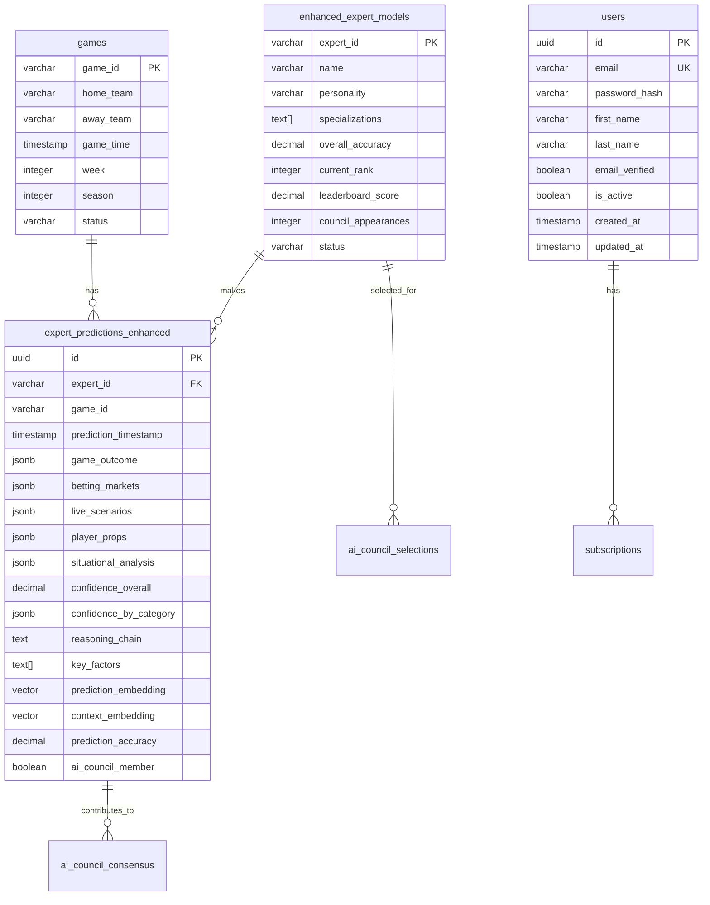
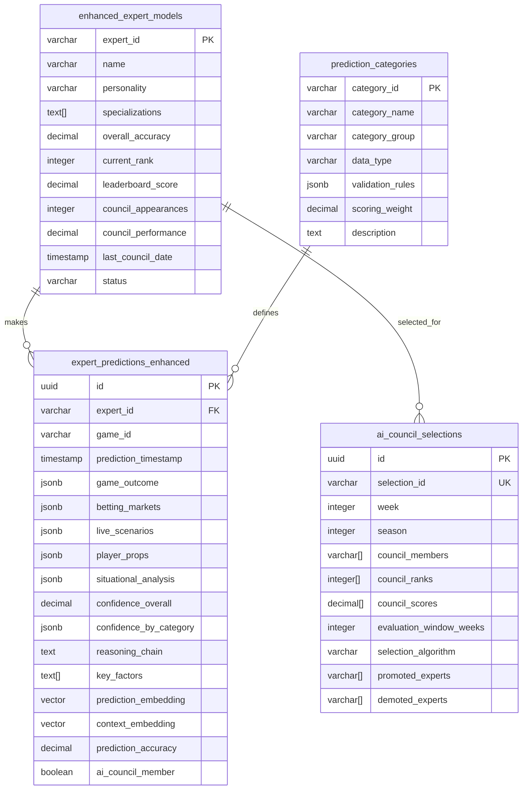

# Database Schema Design

<cite>
**Referenced Files in This Document**   
- [DATABASE_SCHEMA_SUMMARY.md](file://DATABASE_SCHEMA_SUMMARY.md)
- [020_enhanced_expert_competition_schema.sql](file://supabase/migrations/020_enhanced_expert_competition_schema.sql)
- [021_ai_council_voting_schema.sql](file://supabase/migrations/021_ai_council_voting_schema.sql)
- [022_performance_analytics_schema.sql](file://supabase/migrations/022_performance_analytics_schema.sql)
- [023_self_healing_system_schema.sql](file://supabase/migrations/023_self_healing_system_schema.sql)
- [030_production_database_optimization.sql](file://supabase/migrations/030_production_database_optimization.sql)
- [010_episodic_memory_system.sql](file://src/database/migrations/010_episodic_memory_system.sql)
- [011_enhanced_game_data.sql](file://src/database/migrations/011_enhanced_game_data.sql)
- [008_personality_experts.sql](file://src/database/migrations/008_personality_experts.sql)
- [models.py](file://src/database/models.py)
</cite>

## Table of Contents
1. [Introduction](#introduction)
2. [Core Entities and Relationships](#core-entities-and-relationships)
3. [Expert Competition System](#expert-competition-system)
4. [AI Council Voting and Consensus](#ai-council-voting-and-consensus)
5. [Performance Analytics and Tracking](#performance-analytics-and-tracking)
6. [Self-Healing and Adaptation System](#self-healing-and-adaptation-system)
7. [Episodic Memory and Learning](#episodic-memory-and-learning)
8. [Game Data and Prediction Verification](#game-data-and-prediction-verification)
9. [Data Access Patterns and ORM Mappings](#data-access-patterns-and-orm-mappings)
10. [Indexes and Performance Optimization](#indexes-and-performance-optimization)
11. [Row Level Security and Access Control](#row-level-security-and-access-control)
12. [Data Lifecycle and Retention](#data-lifecycle-and-retention)
13. [Migration Management](#migration-management)
14. [Sample Queries and Access Patterns](#sample-queries-and-access-patterns)
15. [Conclusion](#conclusion)

## Introduction

The NFL Predictor API database schema is designed as a comprehensive system for managing AI-powered sports predictions with 15 competing expert models and an AI Council voting mechanism. The schema supports complex prediction workflows, performance tracking, autonomous learning, and real-time analytics. This documentation provides a detailed overview of the database structure, focusing on the core entities, their relationships, and the specialized systems that enable the platform's advanced functionality.

The database is built on PostgreSQL with Supabase, leveraging advanced features such as JSONB for flexible data storage, pgvector for similarity search, and Row Level Security (RLS) for access control. The schema is organized into several interconnected systems: expert competition, AI Council voting, performance analytics, self-healing mechanisms, and episodic memory. Each system is designed to support specific aspects of the prediction workflow, from initial prediction generation to post-game analysis and expert adaptation.

**Section sources**
- [DATABASE_SCHEMA_SUMMARY.md](file://DATABASE_SCHEMA_SUMMARY.md#L1-L232)

## Core Entities and Relationships

The database schema centers around several core entities that represent the fundamental components of the prediction system. These include experts, predictions, games, and users, each with specialized attributes and relationships that support the platform's functionality.

The **enhanced_expert_models** table serves as the central entity for the 15 personality-driven experts, storing their performance metrics, rankings, and algorithmic state. Each expert is uniquely identified by an expert_id and has attributes such as name, personality, specializations, and performance metrics including overall_accuracy, leaderboard_score, and current_rank. The table also tracks AI Council participation through attributes like council_appearances and last_council_date.

Predictions are stored in the **expert_predictions_enhanced** table, which captures comprehensive predictions across 25+ categories for each game. Each prediction is linked to an expert and game, with detailed data stored in JSONB fields for game_outcome, betting_markets, live_scenarios, player_props, and situational_analysis. The table also includes confidence scores, reasoning chains, and vector embeddings for similarity search.

The **games** table stores information about NFL games, including team identifiers, game time, and status. This table is referenced by predictions and other game-related data. The schema also includes user management through the **users** table, which handles authentication, profile information, and subscription status.

Relationships between these entities are established through foreign key constraints. Experts make predictions on games, with each prediction linked to both an expert and a game. The AI Council system creates additional relationships, with council members selected from the pool of experts and their votes aggregated into consensus predictions.



**Diagram sources **
- [020_enhanced_expert_competition_schema.sql](file://supabase/migrations/020_enhanced_expert_competition_schema.sql#L1-L694)
- [models.py](file://src/database/models.py#L1-L403)

**Section sources**
- [020_enhanced_expert_competition_schema.sql](file://supabase/migrations/020_enhanced_expert_competition_schema.sql#L1-L694)
- [models.py](file://src/database/models.py#L1-L403)

## Expert Competition System

The expert competition system forms the foundation of the NFL Predictor API, managing 15 distinct AI experts with unique personalities and decision-making styles. This system is implemented through a comprehensive schema that tracks expert performance, rankings, and participation in the AI Council.

The **enhanced_expert_models** table is the central component of this system, storing detailed information about each expert. Experts are characterized by their personality (e.g., analytical, aggressive, contrarian) and specializations in specific prediction categories. The table tracks multi-dimensional performance metrics, including overall_accuracy, confidence_calibration, consistency_score, and specialization_strength. These metrics are used to calculate a leaderboard_score that determines the expert's current_rank.

The system supports dynamic AI Council selection through the **ai_council_selections** table, which records weekly selections of the top 5 experts based on their performance. Each selection includes the council_members, their ranks, and scores, along with selection criteria such as evaluation_window_weeks and selection_algorithm. The table also tracks promotions and demotions, providing a historical record of council composition changes.

For comprehensive predictions, the **expert_predictions_enhanced** table captures predictions across 25+ categories, organized into five main groups: game_outcome, betting_markets, live_scenarios, player_props, and situational_analysis. Each prediction includes confidence scores, reasoning chains, and key factors that influenced the prediction. The table also stores vector embeddings (prediction_embedding and context_embedding) that enable similarity-based searches for historical prediction matching.

The system includes a **prediction_categories** table that defines all prediction categories with their data types, validation rules, and scoring weights. This table ensures consistency across predictions and provides metadata for each category, including descriptions and validation rules.



**Diagram sources **
- [020_enhanced_expert_competition_schema.sql](file://supabase/migrations/020_enhanced_expert_competition_schema.sql#L1-L694)

**Section sources**
- [020_enhanced_expert_competition_schema.sql](file://supabase/migrations/020_enhanced_expert_competition_schema.sql#L1-L694)

## AI Council Voting and Consensus

The AI Council voting system implements a sophisticated weighted voting mechanism that combines predictions from the top 5 experts into a consensus prediction. This system is designed to leverage the strengths of individual experts while mitigating their weaknesses through a transparent and explainable consensus process.

The **vote_weight_components** table stores the calculation of vote weights for each expert in each game, based on a four-component formula: category_accuracy_score (40%), overall_performance_score (30%), recent_trend_score (20%), and confidence_calibration_score (10%). Each weight calculation includes detailed component scores and the final normalized_weight used in voting.

Individual expert votes are recorded in the **expert_council_votes** table, which captures votes across multiple categories (game_outcome_vote, betting_market_vote, player_props_vote, situational_vote). Each vote includes confidence scores, reasoning, and weight information. The table supports voting rounds (initial, revised, final) and tracks vote revisions, allowing for iterative consensus building.

The consensus building process is managed by the **consensus_building_process** table, which records the complete workflow from initial votes to final consensus. This includes the council composition, consensus algorithm configuration, initial votes analysis, and final consensus results. The table tracks disagreement scores and controversial categories, providing transparency into areas of expert disagreement.

The final consensus predictions are stored in the **ai_council_consensus** table, which contains the weighted consensus results, confidence levels, and disagreement analysis. The table also includes natural language explanations generated for transparency, with fields for executive_summary, detailed_reasoning, and key_factors_explanation. The consensus predictions are linked to the individual expert votes that contributed to them.

Disagreement detection and analysis are handled by the **expert_disagreements** table, which identifies and analyzes areas of significant disagreement among council members. This table tracks disagreement severity, expert positions, and resolution methods, providing insights into controversial predictions.

```mermaid
erDiagram
  vote_weight_components {
    uuid id PK
    varchar expert_id FK
    varchar game_id
    timestamp calculation_timestamp
    decimal category_accuracy_score
    decimal overall_performance_score
    decimal recent_trend_score
    decimal confidence_calibration_score
    decimal raw_weight
    decimal normalized_weight
    integer weight_rank
  }

  expert_council_votes {
    uuid id PK
    varchar vote_id UK
    varchar expert_id FK
    varchar game_id
    varchar voting_round
    timestamp vote_timestamp
    jsonb game_outcome_vote
    jsonb betting_market_vote
    jsonb player_props_vote
    jsonb situational_vote
    decimal vote_confidence_overall
    jsonb vote_confidence_by_category
    decimal vote_weight
    jsonb weight_components
    text vote_reasoning
    text[] key_factors
    text[] disagreement_factors
    varchar original_vote_id FK
    integer council_position
    boolean is_final_vote
  }

  consensus_building_process {
    uuid id PK
    varchar process_id UK
    varchar game_id
    timestamp process_start_timestamp
    timestamp process_end_timestamp
    varchar[] council_members
    decimal[] council_weights
    integer[] council_ranks
    decimal minimum_agreement_threshold
    varchar disagreement_resolution_method
    jsonb initial_votes
    decimal initial_disagreement_score
    text[] controversial_categories
    jsonb