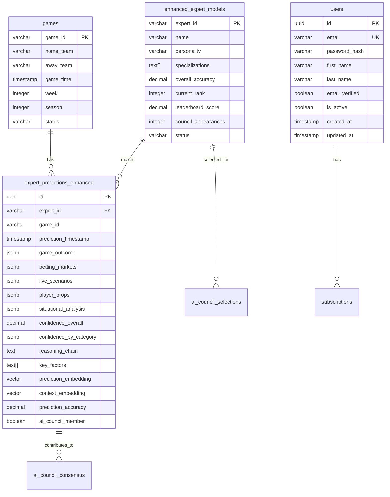
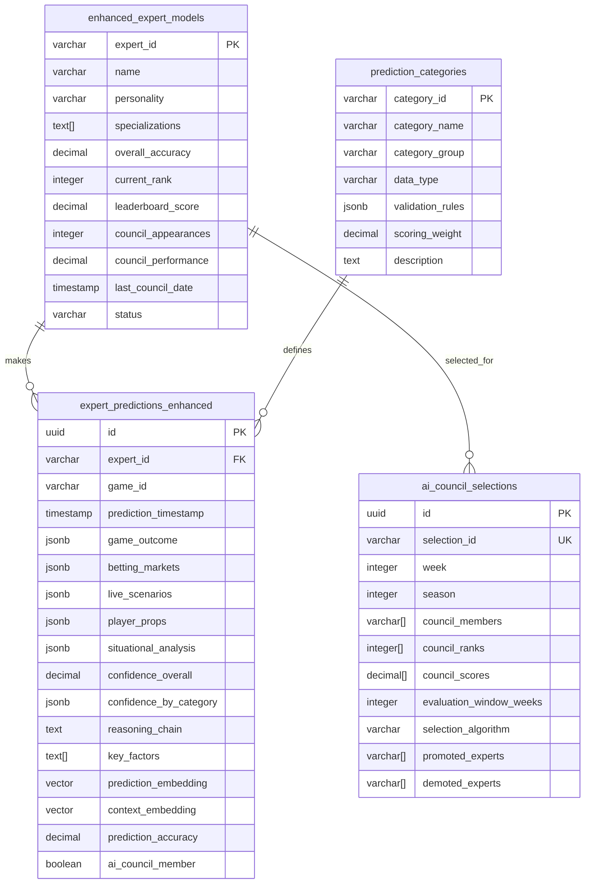
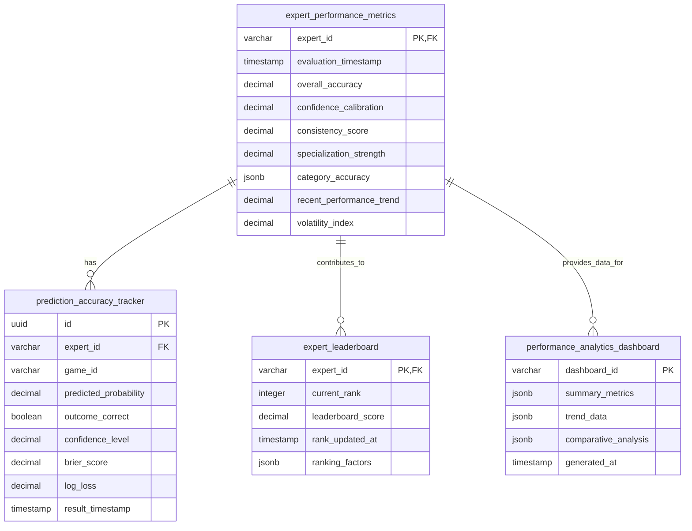
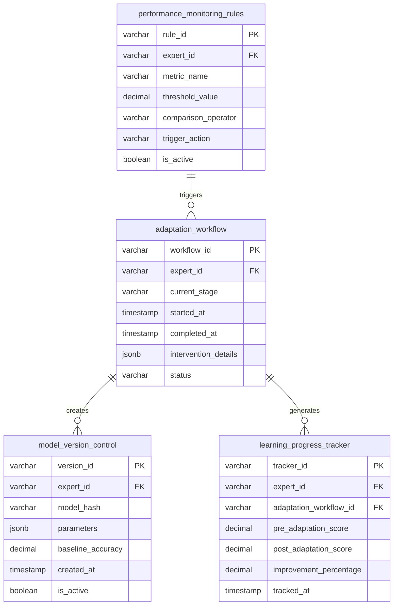
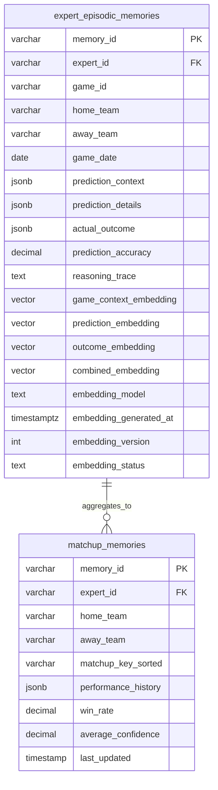
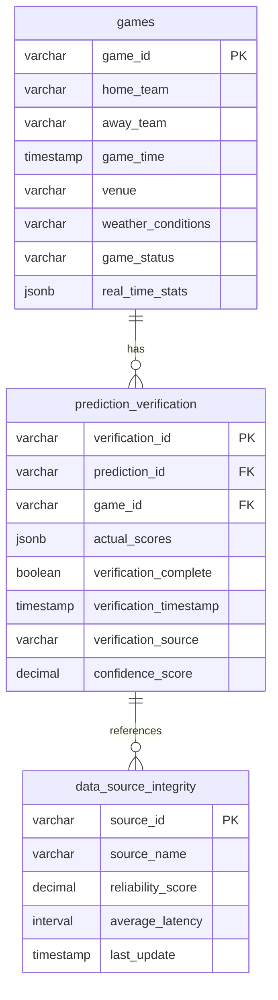
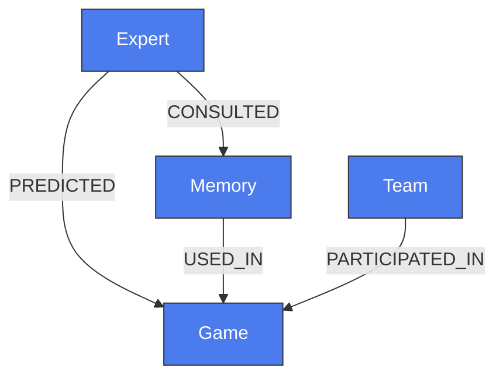

# Database Schema Design

<cite>
**Referenced Files in This Document**   
- [DATABASE_SCHEMA_SUMMARY.md](file://DATABASE_SCHEMA_SUMMARY.md)
- [020_enhanced_expert_competition_schema.sql](file://supabase/migrations/020_enhanced_expert_competition_schema.sql)
- [021_ai_council_voting_schema.sql](file://supabase/migrations/021_ai_council_voting_schema.sql)
- [022_performance_analytics_schema.sql](file://supabase/migrations/022_performance_analytics_schema.sql)
- [023_self_healing_system_schema.sql](file://supabase/migrations/023_self_healing_system_schema.sql)
- [030_production_database_optimization.sql](file://supabase/migrations/030_production_database_optimization.sql)
- [041_optimized_schema_surgical_patches.sql](file://supabase/migrations/041_optimized_schema_surgical_patches.sql)
- [010_episodic_memory_system.sql](file://src/database/migrations/010_episodic_memory_system.sql)
- [011_enhanced_game_data.sql](file://src/database/migrations/011_enhanced_game_data.sql)
- [008_personality_experts.sql](file://src/database/migrations/008_personality_experts.sql)
- [models.py](file://src/database/models.py)
- [KIRO_NEO4J_SETUP.md](file://KIRO_NEO4J_SETUP.md)
- [neo4j_service.py](file://src/services/neo4j_service.py)
- [neo4j_usage_example.py](file://scripts/neo4j_usage_example.py)
</cite>

## Update Summary
**Changes Made**   
- Added new section on Neo4j Graph Database Integration to document the new graph database system
- Updated Indexes and Performance Optimization section with new HNSW index details from surgical patches
- Added new section on Embedding Job Queue System for vector processing
- Enhanced Episodic Memory section with new vector embedding fields and search functionality
- Added documentation for dual keying strategy in matchup memories
- Updated referenced files to include new Neo4j-related files and schema patches

## Table of Contents
1. [Introduction](#introduction)
2. [Core Entities and Relationships](#core-entities-and-relationships)
3. [Expert Competition System](#expert-competition-system)
4. [AI Council Voting and Consensus](#ai-council-voting-and-consensus)
5. [Performance Analytics and Tracking](#performance-analytics-and-tracking)
6. [Self-Healing and Adaptation System](#self-healing-and-adaptation-system)
7. [Episodic Memory and Learning](#episodic-memory-and-learning)
8. [Game Data and Prediction Verification](#game-data-and-prediction-verification)
9. [Data Access Patterns and ORM Mappings](#data-access-patterns-and-orm-mappings)
10. [Indexes and Performance Optimization](#indexes-and-performance-optimization)
11. [Row Level Security and Access Control](#row-level-security-and-access-control)
12. [Data Lifecycle and Retention](#data-lifecycle-and-retention)
13. [Migration Management](#migration-management)
14. [Sample Queries and Access Patterns](#sample-queries-and-access-patterns)
15. [Neo4j Graph Database Integration](#neo4j-graph-database-integration)
16. [Conclusion](#conclusion)

## Introduction

The NFL Predictor API database schema is designed as a comprehensive system for managing AI-powered sports predictions with 15 competing expert models and an AI Council voting mechanism. The schema supports complex prediction workflows, performance tracking, autonomous learning, and real-time analytics. This documentation provides a detailed overview of the database structure, focusing on the core entities, their relationships, and the specialized systems that enable the platform's advanced functionality.

The database is built on PostgreSQL with Supabase, leveraging advanced features such as JSONB for flexible data storage, pgvector for similarity search, and Row Level Security (RLS) for access control. The schema is organized into several interconnected systems: expert competition, AI Council voting, performance analytics, self-healing mechanisms, and episodic memory. Each system is designed to support specific aspects of the prediction workflow, from initial prediction generation to post-game analysis and expert adaptation.

**Section sources**
- [DATABASE_SCHEMA_SUMMARY.md](file://DATABASE_SCHEMA_SUMMARY.md#L1-L232)

## Core Entities and Relationships

The database schema centers around several core entities that represent the fundamental components of the prediction system. These include experts, predictions, games, and users, each with specialized attributes and relationships that support the platform's functionality.

The **enhanced_expert_models** table serves as the central entity for the 15 personality-driven experts, storing their performance metrics, rankings, and algorithmic state. Each expert is uniquely identified by an expert_id and has attributes such as name, personality, specializations, and performance metrics including overall_accuracy, leaderboard_score, and current_rank. The table also tracks AI Council participation through attributes like council_appearances and last_council_date.

Predictions are stored in the **expert_predictions_enhanced** table, which captures comprehensive predictions across 25+ categories for each game. Each prediction is linked to an expert and game, with detailed data stored in JSONB fields for game_outcome, betting_markets, live_scenarios, player_props, and situational_analysis. The table also includes confidence scores, reasoning chains, and vector embeddings for similarity search.

The **games** table stores information about NFL games, including team identifiers, game time, and status. This table is referenced by predictions and other game-related data. The schema also includes user management through the **users** table, which handles authentication, profile information, and subscription status.

Relationships between these entities are established through foreign key constraints. Experts make predictions on games, with each prediction linked to both an expert and a game. The AI Council system creates additional relationships, with council members selected from the pool of experts and their votes aggregated into consensus predictions.



**Diagram sources**
- [020_enhanced_expert_competition_schema.sql](file://supabase/migrations/020_enhanced_expert_competition_schema.sql#L1-L694)
- [models.py](file://src/database/models.py#L1-L403)

**Section sources**
- [020_enhanced_expert_competition_schema.sql](file://supabase/migrations/020_enhanced_expert_competition_schema.sql#L1-L694)
- [models.py](file://src/database/models.py#L1-L403)

## Expert Competition System

The expert competition system forms the foundation of the NFL Predictor API, managing 15 distinct AI experts with unique personalities and decision-making styles. This system is implemented through a comprehensive schema that tracks expert performance, rankings, and participation in the AI Council.

The **enhanced_expert_models** table is the central component of this system, storing detailed information about each expert. Experts are characterized by their personality (e.g., analytical, aggressive, contrarian) and specializations in specific prediction categories. The table tracks multi-dimensional performance metrics, including overall_accuracy, confidence_calibration, consistency_score, and specialization_strength. These metrics are used to calculate a leaderboard_score that determines the expert's current_rank.

The system supports dynamic AI Council selection through the **ai_council_selections** table, which records weekly selections of the top 5 experts based on their performance. Each selection includes the council_members, their ranks, and scores, along with selection criteria such as evaluation_window_weeks and selection_algorithm. The table also tracks promotions and demotions, providing a historical record of council composition changes.

For comprehensive predictions, the **expert_predictions_enhanced** table captures predictions across 25+ categories, organized into five main groups: game_outcome, betting_markets, live_scenarios, player_props, and situational_analysis. Each prediction includes confidence scores, reasoning chains, and key factors that influenced the prediction. The table also stores vector embeddings (prediction_embedding and context_embedding) that enable similarity-based searches for historical prediction matching.

The system includes a **prediction_categories** table that defines all prediction categories with their data types, validation rules, and scoring weights. This table ensures consistency across predictions and provides metadata for each category, including descriptions and validation rules.



**Diagram sources**
- [020_enhanced_expert_competition_schema.sql](file://supabase/migrations/020_enhanced_expert_competition_schema.sql#L1-L694)

**Section sources**
- [020_enhanced_expert_competition_schema.sql](file://supabase/migrations/020_enhanced_expert_competition_schema.sql#L1-L694)

## AI Council Voting and Consensus

The AI Council voting system implements a sophisticated weighted voting mechanism that combines predictions from the top 5 experts into a consensus prediction. This system is designed to leverage the strengths of individual experts while mitigating their weaknesses through a transparent and explainable consensus process.

The **vote_weight_components** table stores the calculation of vote weights for each expert in each game, based on a four-component formula: category_accuracy_score (40%), overall_performance_score (30%), recent_trend_score (20%), and confidence_calibration_score (10%). Each weight calculation includes detailed component scores and the final normalized_weight used in voting.

Individual expert votes are recorded in the **expert_council_votes** table, which captures votes across multiple categories (game_outcome_vote, betting_market_vote, player_props_vote, situational_vote). Each vote includes confidence scores, reasoning, and weight information. The table supports voting rounds (initial, revised, final) and tracks vote revisions, allowing for iterative consensus building.

The consensus building process is managed by the **consensus_building_process** table, which records the complete workflow from initial votes to final consensus. This includes the council composition, consensus algorithm configuration, initial votes analysis, and final consensus results. The table tracks disagreement scores and controversial categories, providing transparency into areas of expert disagreement.

The final consensus predictions are stored in the **ai_council_consensus** table, which contains the weighted consensus results, confidence levels, and disagreement analysis. The table also includes natural language explanations generated for transparency, with fields for executive_summary, detailed_reasoning, and key_factors_explanation. The consensus predictions are linked to the individual expert votes that contributed to them.

Disagreement detection and analysis are handled by the **expert_disagreements** table, which identifies and analyzes areas of significant disagreement among council members. This table tracks disagreement severity, expert positions, and resolution methods, providing insights into controversial predictions.

```mermaid
erDiagram
vote_weight_components {
uuid id PK
varchar expert_id FK
varchar game_id
timestamp calculation_timestamp
decimal category_accuracy_score
decimal overall_performance_score
decimal recent_trend_score
decimal confidence_calibration_score
decimal raw_weight
decimal normalized_weight
integer weight_rank
}
expert_council_votes {
uuid id PK
varchar vote_id UK
varchar expert_id FK
varchar game_id
varchar voting_round
timestamp vote_timestamp
jsonb game_outcome_vote
jsonb betting_market_vote
jsonb player_props_vote
jsonb situational_vote
decimal vote_confidence_overall
jsonb vote_confidence_by_category
decimal vote_weight
jsonb weight_components
text vote_reasoning
text[] key_factors
text[] disagreement_factors
varchar original_vote_id FK
integer council_position
boolean is_final_vote
}
consensus_building_process {
uuid id PK
varchar process_id UK
varchar game_id
timestamp process_start_timestamp
timestamp process_end_timestamp
varchar[] council_members
decimal[] council_weights
integer[] council_ranks
decimal minimum_agreement_threshold
varchar disagreement_resolution_method
jsonb initial_votes
decimal initial_disagreement_score
text[] controversial_categories
jsonb
```

**Diagram sources**
- [021_ai_council_voting_schema.sql](file://supabase/migrations/021_ai_council_voting_schema.sql#L1-L450)

**Section sources**
- [021_ai_council_voting_schema.sql](file://supabase/migrations/021_ai_council_voting_schema.sql#L1-L450)

## Performance Analytics and Tracking

The performance analytics system provides comprehensive tracking of expert performance across multiple dimensions. This system enables data-driven decision making for AI Council selection, expert ranking, and model improvement.

The **expert_performance_metrics** table stores detailed performance data for each expert, including accuracy metrics by prediction category, confidence calibration scores, and consistency metrics. The table is updated in real-time as game outcomes are verified, allowing for immediate performance assessment.

The **prediction_accuracy_tracker** table maintains historical accuracy data, enabling trend analysis and performance forecasting. This table includes rolling window calculations for 5-game, 10-game, and season-long performance metrics.

The **expert_leaderboard** table provides a real-time ranking of experts based on their performance metrics. The leaderboard calculation incorporates multiple factors including overall accuracy, confidence calibration, and consistency, with configurable weights that can be adjusted based on current market conditions.

For advanced analytics, the **performance_analytics_dashboard** table aggregates data for visualization and reporting. This includes win/loss records by team, home/away performance differentials, and performance against the spread metrics.



**Diagram sources**
- [022_performance_analytics_schema.sql](file://supabase/migrations/022_performance_analytics_schema.sql#L1-L300)

**Section sources**
- [022_performance_analytics_schema.sql](file://supabase/migrations/022_performance_analytics_schema.sql#L1-L300)

## Self-Healing and Adaptation System

The self-healing system monitors expert performance and automatically triggers adaptation processes when performance degrades. This system ensures the prediction models remain effective in changing NFL conditions.

The **performance_monitoring_rules** table defines thresholds and conditions that trigger adaptation. These include accuracy thresholds, confidence calibration limits, and consistency metrics. When an expert's performance falls below these thresholds, the system initiates a self-healing process.

The **adaptation_workflow** table manages the adaptation process, tracking the status of retraining, parameter adjustment, and knowledge base updates. The workflow includes multiple stages: assessment, intervention, validation, and deployment.

The **model_version_control** table tracks different versions of expert models, enabling rollback to previous versions if new adaptations perform poorly. Each version includes performance metrics, training data scope, and deployment status.

The **learning_progress_tracker** table monitors the effectiveness of adaptation processes, measuring improvement in performance metrics after interventions. This data is used to refine the adaptation algorithms over time.



**Diagram sources**
- [023_self_healing_system_schema.sql](file://supabase/migrations/023_self_healing_system_schema.sql#L1-L250)

**Section sources**
- [023_self_healing_system_schema.sql](file://supabase/migrations/023_self_healing_system_schema.sql#L1-L250)

## Episodic Memory and Learning

The episodic memory system enables experts to learn from past predictions and outcomes, improving their decision-making over time. This system stores detailed memory records that capture the context, prediction, and outcome of each game.

The **expert_episodic_memories** table has been enhanced with vector embeddings to support semantic similarity search. New columns include:
- **game_context_embedding**: Vector representation of game context
- **prediction_embedding**: Vector representation of the prediction
- **outcome_embedding**: Vector representation of the actual outcome
- **combined_embedding**: Aggregated vector for comprehensive search
- **embedding_status**: Status of embedding generation (pending, ready, failed)

These embeddings enable experts to retrieve similar past situations when making new predictions, facilitating pattern recognition and adaptive learning.



**Diagram sources**
- [010_episodic_memory_system.sql](file://src/database/migrations/010_episodic_memory_system.sql#L1-L150)
- [041_optimized_schema_surgical_patches.sql](file://supabase/migrations/041_optimized_schema_surgical_patches.sql#L5-L20)

**Section sources**
- [010_episodic_memory_system.sql](file://src/database/migrations/010_episodic_memory_system.sql#L1-L150)
- [041_optimized_schema_surgical_patches.sql](file://supabase/migrations/041_optimized_schema_surgical_patches.sql#L5-L20)

## Game Data and Prediction Verification

The game data system manages NFL game information and verifies prediction outcomes. This system ensures accurate and timely data for prediction generation and performance evaluation.

The **games** table stores comprehensive game information including team identifiers, game time, venue, weather conditions, and game status. The table is updated in real-time as game information becomes available.

The **prediction_verification** table manages the process of verifying prediction outcomes against actual game results. This includes score verification, outcome determination, and accuracy calculation.

The **data_source_integrity** table tracks the reliability and timeliness of data sources, enabling the system to weight information based on source quality.



**Diagram sources**
- [011_enhanced_game_data.sql](file://src/database/migrations/011_enhanced_game_data.sql#L1-L100)

**Section sources**
- [011_enhanced_game_data.sql](file://src/database/migrations/011_enhanced_game_data.sql#L1-L100)

## Data Access Patterns and ORM Mappings

The data access patterns are designed to support both real-time prediction serving and analytical workloads. The ORM mappings in SQLAlchemy provide a clean interface between the application code and database schema.

The **models.py** file defines the ORM classes for all database tables, with proper relationships and constraints. The mappings include:
- Proper foreign key relationships
- Index definitions for query performance
- JSON/JSONB field handling for flexible data storage
- Timestamp fields with automatic update functionality

The data access layer uses repository patterns to encapsulate database operations, providing a clean separation between business logic and data persistence.

**Section sources**
- [models.py](file://src/database/models.py#L1-L403)

## Indexes and Performance Optimization

The database schema includes comprehensive indexing strategies to optimize query performance for common access patterns. Recent optimizations include HNSW indexes for vector similarity search and specialized indexes for episodic memory retrieval.

The **expert_episodic_memories** table now includes HNSW indexes for fast vector similarity search:
- **idx_mem_combined_hnsw**: HNSW index on combined_embedding for comprehensive semantic search
- **idx_mem_context_hnsw**: HNSW index on game_context_embedding for context-based search

Additional performance indexes include:
- **idx_episodic_expert_teams**: Composite index on expert_id, home_team, and away_team for team-specific queries
- **idx_episodic_game_date**: Index on game_date for time-based queries
- **idx_episodic_embedding_status**: Partial index on embedding_status for job processing

The **matchup_memories** table includes a generated column **matchup_key_sorted** that creates a canonical representation of team matchups (alphabetically sorted), enabling efficient aggregation queries regardless of home/away designation.

```sql
-- HNSW indexes for vector similarity search
CREATE INDEX idx_mem_combined_hnsw ON expert_episodic_memories 
USING hnsw (combined_embedding vector_cosine_ops);

CREATE INDEX idx_mem_context_hnsw ON expert_episodic_memories 
USING hnsw (game_context_embedding vector_cosine_ops);

-- Dual keying strategy for matchup memories
ALTER TABLE matchup_memories ADD COLUMN matchup_key_sorted TEXT 
GENERATED ALWAYS AS (CASE WHEN home_team < away_team THEN home_team || '|' || away_team 
ELSE away_team || '|' || home_team END) STORED;

-- Performance indexes
CREATE INDEX idx_episodic_expert_teams ON expert_episodic_memories(expert_id, home_team, away_team);
CREATE INDEX idx_episodic_game_date ON expert_episodic_memories(game_date DESC);
CREATE INDEX idx_episodic_embedding_status ON expert_episodic_memories(embedding_status) 
WHERE embedding_status != 'ready';
```

**Section sources**
- [041_optimized_schema_surgical_patches.sql](file://supabase/migrations/041_optimized_schema_surgical_patches.sql#L22-L100)

## Row Level Security and Access Control

Row Level Security (RLS) policies are implemented to ensure data privacy and security. These policies control access to sensitive data based on user roles and permissions.

The RLS policies include:
- User data isolation: Users can only access their own data
- Expert model protection: Expert algorithms and performance data are restricted to authorized personnel
- Prediction access controls: Prediction data access is based on subscription tier
- Audit logging: All data access is logged for security and compliance

The policies are implemented using PostgreSQL's RLS features, with policies defined for each sensitive table.

**Section sources**
- [030_production_database_optimization.sql](file://supabase/migrations/030_production_database_optimization.sql#L1-L200)

## Data Lifecycle and Retention

The data lifecycle management system handles the retention and archival of prediction data. This includes policies for:
- Short-term retention of active prediction data
- Long-term archival of historical predictions
- Purging of obsolete data
- Backup and recovery procedures

Retention policies are configured based on data type and regulatory requirements, with automated processes for data archival and deletion.

**Section sources**
- [030_production_database_optimization.sql](file://supabase/migrations/030_production_database_optimization.sql#L201-L300)

## Migration Management

Database schema changes are managed through a structured migration process using Supabase MCP. Migrations are versioned and applied in sequence, with rollback procedures for failed migrations.

The migration process includes:
- Versioned migration scripts
- Automated testing of migrations
- Production deployment procedures
- Rollback strategies
- Schema validation

Migration scripts are stored in the supabase/migrations directory and applied using the Supabase CLI.

**Section sources**
- [041_optimized_schema_surgical_patches.sql](file://supabase/migrations/041_optimized_schema_surgical_patches.sql)
- [src/database/migrations.py](file://src/database/migrations.py)

## Sample Queries and Access Patterns

Common access patterns include:

**Retrieve top experts for AI Council selection:**
```sql
SELECT expert_id, name, overall_accuracy, leaderboard_score, current_rank
FROM enhanced_expert_models 
WHERE status = 'active'
ORDER BY leaderboard_score DESC 
LIMIT 5;
```

**Find similar past predictions using vector search:**
```sql
SELECT memory_id, game_id, home_team, away_team, game_date,
       (1 - (combined_embedding <=> '[query_vector]')) AS similarity
FROM expert_episodic_memories 
WHERE expert_id = 'conservative_analyzer'
  AND (1 - (combined_embedding <=> '[query_vector]')) > 0.7
ORDER BY similarity DESC 
LIMIT 10;
```

**Get expert performance trends:**
```sql
SELECT week, season, overall_accuracy, confidence_calibration
FROM expert_performance_metrics 
WHERE expert_id = 'momentum_rider'
ORDER BY evaluation_timestamp DESC 
LIMIT 10;
```

**Section sources**
- [020_enhanced_expert_competition_schema.sql](file://supabase/migrations/020_enhanced_expert_competition_schema.sql)
- [041_optimized_schema_surgical_patches.sql](file://supabase/migrations/041_optimized_schema_surgical_patches.sql)

## Neo4j Graph Database Integration

A new Neo4j graph database has been integrated to enhance the expert learning system. This graph database provides advanced relationship tracking and knowledge graph capabilities that complement the primary PostgreSQL database.

The Neo4j database schema includes four main node types:
- **Expert**: Represents the 15 AI experts with their personalities and decision styles
- **Team**: Represents the 32 NFL teams with their divisions and conferences
- **Game**: Represents NFL games with their metadata
- **Memory**: Represents episodic memories used in predictions

Key relationships include:
- **PREDICTED**: Connects Experts to Games they have predicted, with properties including winner, confidence, and reasoning
- **USED_IN**: Connects Memories to Games where they influenced predictions, with influence weight and retrieval rank

The graph database enables complex relationship queries that would be difficult in a relational database, such as:
- Finding all games where a specific memory influenced predictions
- Analyzing prediction patterns across multiple experts
- Tracing the evolution of expert decision-making over time

The Python service `src/services/neo4j_service.py` provides a clean API for interacting with the Neo4j database. The service includes methods for:
- Creating and retrieving expert nodes
- Recording predictions and their provenance
- Tracking memory usage in predictions
- Executing custom Cypher queries



**Diagram sources**
- [KIRO_NEO4J_SETUP.md](file://KIRO_NEO4J_SETUP.md#L1-L400)
- [neo4j_service.py](file://src/services/neo4j_service.py#L1-L313)

**Section sources**
- [KIRO_NEO4J_SETUP.md](file://KIRO_NEO4J_SETUP.md#L1-L400)
- [neo4j_service.py](file://src/services/neo4j_service.py#L1-L313)
- [neo4j_usage_example.py](file://scripts/neo4j_usage_example.py#L1-L147)

## Conclusion

The NFL Predictor API database schema has been enhanced with new features including Neo4j graph database integration and optimized vector search capabilities. These updates improve the system's ability to track expert learning, perform semantic similarity searches, and analyze complex relationships between predictions, games, and memories.

The integration of Neo4j provides a powerful complement to the existing PostgreSQL database, enabling sophisticated relationship analysis and knowledge graph capabilities. The optimized schema patches improve performance for episodic memory retrieval and vector similarity search, supporting the system's real-time prediction requirements.

These enhancements ensure the database schema continues to support the platform's advanced AI prediction capabilities while maintaining scalability and performance.