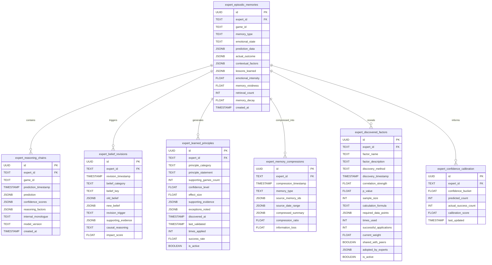

# Episodic Memory System Schema

<cite>
**Referenced Files in This Document**   
- [010_episodic_memory_system.sql](file://src/database/migrations/010_episodic_memory_system.sql)
- [episodic_memory_manager.py](file://src/ml/episodic_memory_manager.py)
- [expert_memory_service.py](file://src/ml/expert_memory_service.py)
- [personality_driven_experts.py](file://src/ml/personality_driven_experts.py)
- [001_enable_pgvector.sql](file://src/database/migrations/001_enable_pgvector.sql)
- [002_vector_search_functions.sql](file://src/database/migrations/002_vector_search_functions.sql)
- [supabase_historical_service.py](file://src/ml/supabase_historical_service.py)
- [memory_enabled_expert_service.py](file://src/ml/memory_enabled_expert_service.py)
- [expert_memory_integration.py](file://src/ml/expert_memory_integration.py)
</cite>

## Table of Contents
1. [Introduction](#introduction)
2. [Core Memory Tables](#core-memory-tables)
3. [Memory Session Structure](#memory-session-structure)
4. [Agent Experience Records](#agent-experience-records)
5. [Recall Triggers and Retrieval](#recall-triggers-and-retrieval)
6. [Context Vectors and Relevance Scoring](#context-vectors-and-relevance-scoring)
7. [pgvector Integration](#pgvector-integration)
8. [Reasoning Chain Storage](#reasoning-chain-storage)
9. [Belief Revision System](#belief-revision-system)
10. [Learned Principles and Memory Compression](#learned-principles-and-memory-compression)
11. [Query Examples](#query-examples)
12. [Schema Evolution](#schema-evolution)
13. [Performance Considerations](#performance-considerations)

## Introduction
The episodic memory system database schema captures the contextual decision-making history of 15 personality-driven AI experts in the NFL prediction system. This schema enables autonomous learning by storing detailed records of predictions, outcomes, reasoning processes, and emotional responses. The system uses pgvector for similarity-based memory retrieval, allowing experts to learn from past experiences and adapt their decision-making strategies. The database captures not just what predictions were made, but why they were made, how experts felt about outcomes, and what lessons were learned. This comprehensive memory system enables the AI experts to evolve their algorithms while preserving their core personality traits, creating a sophisticated learning framework that mimics human cognitive processes.

**Section sources**
- [010_episodic_memory_system.sql](file://src/database/migrations/010_episodic_memory_system.sql#L1-L50)
- [episodic_memory_manager.py](file://src/ml/episodic_memory_manager.py#L1-L100)

## Core Memory Tables
The episodic memory system consists of several interconnected tables that capture different aspects of expert decision-making and learning. The primary table, `expert_episodic_memories`, stores individual game experiences with emotional encoding and lesson extraction. This table captures the immediate reactions and insights from each prediction outcome. Complementing this is the `expert_reasoning_chains` table, which documents the detailed thought processes behind each prediction, including the factors considered, their weights, and confidence levels. The `expert_belief_revisions` table tracks how experts change their minds over time, recording the causal chains that lead to belief updates. These core tables work together to create a comprehensive record of each expert's cognitive journey, enabling sophisticated pattern recognition and adaptive learning.

**Diagram sources **
- [010_episodic_memory_system.sql](file://src/database/migrations/010_episodic_memory_system.sql#L1-L440)

## Memory Session Structure
The memory session structure is centered around the `expert_episodic_memories` table, which captures individual game experiences with rich contextual metadata. Each memory record includes a unique identifier, expert ID, game ID, memory type, emotional state, and detailed prediction data. The system uses a UUID primary key for each memory, ensuring global uniqueness across distributed systems. The memory type field categorizes experiences into types such as prediction outcomes, pattern recognition events, upset detections, consensus deviations, learning moments, and failure analyses. Emotional states are encoded to capture the expert's affective response, including euphoria, satisfaction, disappointment, devastation, surprise, confusion, and vindication. This emotional encoding allows the system to weight memories differently based on their emotional intensity, with more vivid experiences having greater influence on future decisions.

The table also includes fields for memory characteristics such as emotional intensity (0-1 scale), memory vividness (0-1 scale), retrieval count, and memory decay. These fields enable the system to model the psychological phenomenon of memory consolidation, where frequently accessed memories become stronger and more resistant to decay. The memory decay field starts at 1.0 and decreases over time unless the memory is retrieved, simulating the natural forgetting process. When a memory is retrieved, its retrieval count increases and its memory decay value is boosted, reinforcing the memory. This dynamic system creates a realistic model of human memory, where important or frequently recalled experiences remain strong over time while less significant ones fade.

**Section sources**
- [010_episodic_memory_system.sql](file://src/database/migrations/010_episodic_memory_system.sql#L180-L220)
- [episodic_memory_manager.py](file://src/ml/episodic_memory_manager.py#L100-L126)

## Agent Experience Records
Agent experience records are stored in the `expert_episodic_memories` table and capture the complete context of each prediction experience. The system records not only the prediction and actual outcome but also the contextual factors that influenced the decision, such as weather conditions, injury reports, line movements, and public sentiment. These contextual factors are stored as JSONB data, allowing for flexible schema evolution and efficient querying. The lessons learned from each experience are also recorded, providing a mechanism for explicit knowledge extraction from individual events. These lessons are categorized by type, such as injury impact, weather effects, home field advantage, momentum shifts, coaching decisions, roster changes, motivation factors, and statistical patterns.

The experience records include a reasoning chain that documents the expert's internal monologue during the decision-making process. This chain captures the key factors considered, their relative weights, and the confidence in each factor