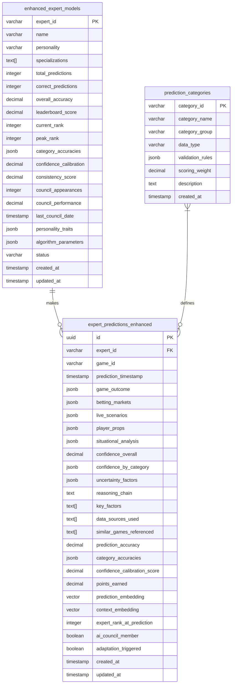
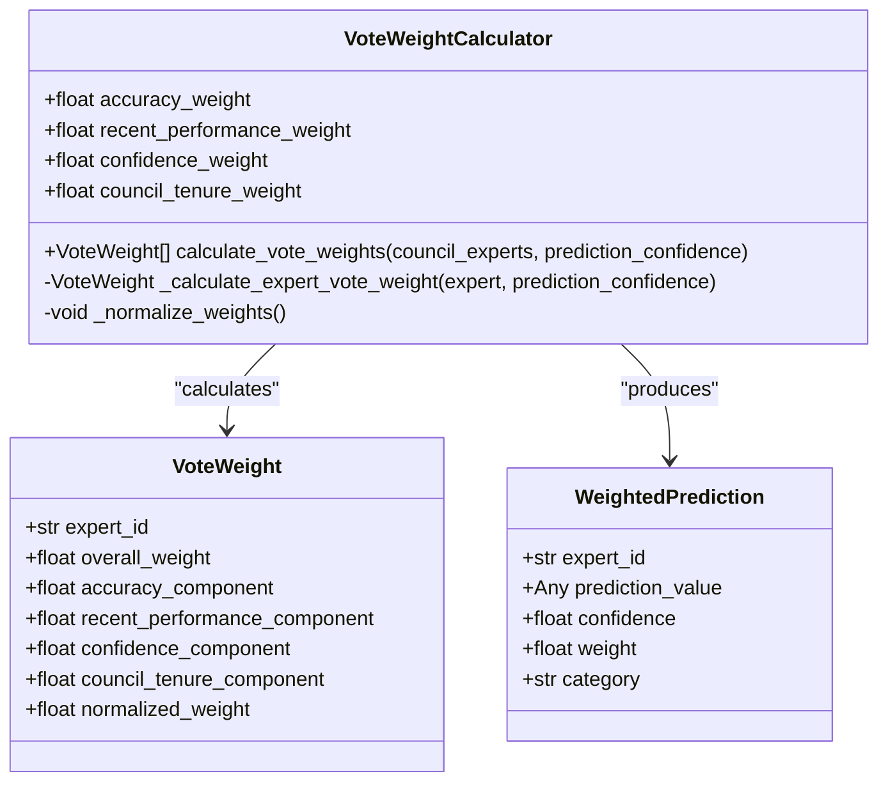

# Expert Competition & Voting Schema

<cite>
**Referenced Files in This Document**   
- [020_enhanced_expert_competition_schema.sql](file://supabase/migrations/020_enhanced_expert_competition_schema.sql)
- [021_ai_council_voting_schema.sql](file://supabase/migrations/021_ai_council_voting_schema.sql)
- [022_performance_analytics_schema.sql](file://supabase/migrations/022_performance_analytics_schema.sql)
- [023_self_healing_system_schema.sql](file://supabase/migrations/023_self_healing_system_schema.sql)
- [20250116_expert_competition_tables.sql](file://supabase/migrations/20250116_expert_competition_tables.sql)
- [voting_consensus.py](file://src/ml/expert_competition/voting_consensus.py)
- [competition_framework.py](file://src/ml/expert_competition/competition_framework.py)
- [explanation_generator.py](file://src/ml/expert_competition/explanation_generator.py)
- [historical_performance_tracking.py](file://src/ml/testing/historical_performance_tracking.py)
</cite>

## Table of Contents
1. [Introduction](#introduction)
2. [Core Data Model](#core-data-model)
3. [Voting Mechanism Implementation](#voting-mechanism-implementation)
4. [Consensus Building Process](#consensus-building-process)
5. [Performance Analytics and Tracking](#performance-analytics-and-tracking)
6. [Self-Healing and Adaptation System](#self-healing-and-adaptation-system)
7. [Query Examples](#query-examples)
8. [Transparency and Decision-Making](#transparency-and-decision-making)
9. [Conclusion](#conclusion)

## Introduction

The Expert Competition & Voting Schema documents the comprehensive database structure and implementation details for an AI council system where 15 personality-driven experts contribute predictions across 27 categories. This system implements an ensemble decision-making process that combines individual expert predictions through a weighted voting mechanism to produce consensus outcomes. The schema supports the entire lifecycle of expert competition, from individual predictions and voting records to consensus calculation and performance tracking. It enables transparency into the decision-making process and supports a self-healing learning system that adapts based on performance metrics.

**Section sources**
- [020_enhanced_expert_competition_schema.sql](file://supabase/migrations/020_enhanced_expert_competition_schema.sql#L1-L50)
- [021_ai_council_voting_schema.sql](file://supabase/migrations/021_ai_council_voting_schema.sql#L1-L50)

## Core Data Model

The core data model consists of several interconnected tables that store information about experts, their predictions, voting records, and performance metrics. The schema is designed to support the ensemble decision-making process where 15 personality-driven experts contribute predictions across multiple categories.

The `enhanced_expert_models` table stores comprehensive information about each expert, including their personality, specializations, performance metrics, and ranking information. Each expert is identified by a unique `expert_id` and has attributes such as overall accuracy, leaderboard score, current rank, and status. The table also includes category-specific performance data and AI council participation statistics.

The `expert_predictions_enhanced` table stores individual predictions from each expert for specific games. Each prediction includes data across multiple categories such as game outcome, betting markets, player props, and situational analysis. The table captures not only the prediction values but also confidence scores, reasoning chains, and key factors considered. It includes vector embeddings for similarity analysis and performance tracking metrics that are updated after game completion.

The `prediction_categories` table defines the 27 prediction categories used in the system, organized into groups such as game outcome, betting market, player props, and situational analysis. Each category has a specific data type, validation rules, and scoring weight, ensuring consistency across predictions.

**Diagram sources**
- [020_enhanced_expert_competition_schema.sql](file://supabase/migrations/020_enhanced_expert_competition_schema.sql#L24-L100)
- [020_enhanced_expert_competition_schema.sql](file://supabase/migrations/020_enhanced_expert_competition_schema.sql#L306-L350)
- [020_enhanced_expert_competition_schema.sql](file://supabase/migrations/020_enhanced_expert_competition_schema.sql#L104-L150)

**Section sources**
- [020_enhanced_expert_competition_schema.sql](file://supabase/migrations/020_enhanced_expert_competition_schema.sql#L24-L462)
- [020_enhanced_expert_competition_schema.sql](file://supabase/migrations/020_enhanced_expert_competition_schema.sql#L104-L150)

## Voting Mechanism Implementation

The voting mechanism implementation is centered around the weighted voting system that determines the influence of each expert in the AI Council. The system calculates vote weights based on multiple performance factors, ensuring that more accurate and consistent experts have greater influence on the final consensus.

The `vote_weight_components` table stores the detailed calculation of vote weights for each expert and game combination. The weight calculation follows a formula that combines four components: category accuracy score (40% weight), overall performance score (30% weight), recent trend score (20% weight), and confidence calibration score (10% weight). Each component is stored with its detailed data, allowing for transparency in how the final weight is derived.

The `expert_council_votes` table records individual votes from council members, capturing not only their predictions but also their confidence levels, reasoning, and weight information. Each vote includes the expert's rank at the time of voting and whether it is a final vote. The table supports vote revisions, allowing experts to update their predictions with justification for the changes.

The voting weight calculation is implemented in the `VoteWeightCalculator` class, which combines multiple performance metrics to determine each expert's influence. The calculation considers the expert's overall accuracy, recent performance trend, prediction confidence, and council tenure. The weights are normalized to sum to 1.0, ensuring a proper weighted average in the consensus calculation.

**Diagram sources**
- [021_ai_council_voting_schema.sql](file://supabase/migrations/021_ai_council_voting_schema.sql#L15-L65)
- [021_ai_council_voting_schema.sql](file://supabase/migrations/021_ai_council_voting_schema.sql#L146-L195)
- [voting_consensus.py](file://src/ml/expert_competition/voting_consensus.py#L45-L109)

**Section sources**
- [021_ai_council_voting_schema.sql](file://supabase/migrations/021_ai_council