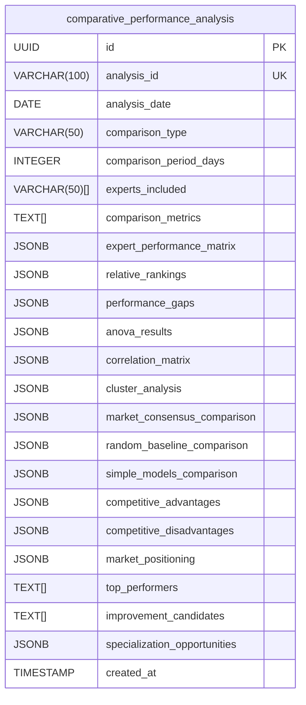

# Performance Analytics Schema

<cite>
**Referenced Files in This Document**   
- [022_performance_analytics_schema.sql](file://supabase/migrations/022_performance_analytics_schema.sql)
- [accuracy_tracker.py](file://src/ml/performance_tracking/accuracy_tracker.py)
- [trend_analyzer.py](file://src/ml/performance_tracking/trend_analyzer.py)
- [adaptation_engine.py](file://src/ml/self_healing/adaptation_engine.py)
- [performance_decline_detector.py](file://src/ml/self_healing/performance_decline_detector.py)
</cite>

## Table of Contents
1. [Introduction](#introduction)
2. [Core Tables](#core-tables)
3. [Accuracy Tracking](#accuracy-tracking)
4. [Performance Trend Analysis](#performance-trend-analysis)
5. [Category-Specific Performance](#category-specific-performance)
6. [Confidence Calibration](#confidence-calibration)
7. [Comparative Analysis](#comparative-analysis)
8. [Ranking System](#ranking-system)
9. [Real-Time Dashboard Views](#real-time-dashboard-views)
10. [Analytics Functions](#analytics-functions)
11. [Integration with Self-Healing System](#integration-with-self-healing-system)
12. [Example Queries](#example-queries)
13. [Data Aggregation and Retention](#data-aggregation-and-retention)

## Introduction

The Performance Analytics Schema provides a comprehensive framework for tracking, analyzing, and reporting on the accuracy and performance of expert prediction models in the NFL prediction system. This schema enables detailed monitoring of prediction outcomes across multiple dimensions including game winner, against-the-spread (ATS), and totals predictions. The system supports the betting engine's risk assessment by providing reliable accuracy metrics and enables the self-healing system's adaptation logic through trend detection and performance decline alerts. The schema is designed to capture both granular prediction outcomes and aggregated performance metrics across various time periods and categories.

**Section sources**
- [022_performance_analytics_schema.sql](file://supabase/migrations/022_performance_analytics_schema.sql#L1-L50)

## Core Tables

The performance analytics schema consists of seven primary tables that work together to provide comprehensive performance tracking:

- **accuracy_tracking_detailed**: Stores multi-dimensional accuracy metrics for experts across different time periods and prediction categories
- **performance_trend_analysis**: Tracks performance trajectories and trend detection for experts
- **category_performance_analysis**: Analyzes performance in specific prediction categories
- **confidence_calibration_analysis**: Measures how well confidence estimates match actual accuracy
- **comparative_performance_analysis**: Enables peer comparison and benchmarking against market consensus
- **ranking_system_detailed**: Maintains expert rankings based on composite performance scores
- **prediction_outcomes**: (Referenced in code) Stores individual prediction outcomes for detailed analysis

These tables are interconnected through expert_id references and support time-series analysis of performance metrics.

**Section sources**
- [022_performance_analytics_schema.sql](file://supabase/migrations/022_performance_analytics_schema.sql#L32-L475)

## Accuracy Tracking

The `accuracy_tracking_detailed` table provides comprehensive accuracy metrics for expert predictions. It tracks overall accuracy as well as category-specific accuracy for game outcomes, point spreads, totals, and player props. The schema captures accuracy across different game contexts including favorites vs. underdogs, close games vs. blowouts, and special situations like primetime or divisional games.

For each tracking period (daily, weekly, monthly, seasonal), the table records:
- Total predictions and correct predictions
- Overall accuracy with confidence intervals
- Advanced metrics like Brier score and log loss
- Streak analysis (current and longest streaks)
- Trend analysis compared to previous periods

This granular tracking enables the system to identify performance patterns and calculate accuracy rates across different prediction categories, which is essential for the betting engine's risk assessment.

```mermaid
erDiagram
accuracy_tracking_detailed {
UUID id PK
VARCHAR(50) expert_id FK
VARCHAR(50) tracking_period
DATE period_start
DATE period_end
INTEGER total_predictions
INTEGER correct_predictions
DECIMAL(6,5) overall_accuracy
DECIMAL(6,5) game_outcome_accuracy
DECIMAL(6,5) spread_accuracy
DECIMAL(6,5) total_accuracy
DECIMAL(6,5) brier_score
INTEGER current_correct_streak
INTEGER current_incorrect_streak
VARCHAR(20) accuracy_trend
TIMESTAMP created_at
TIMESTAMP updated_at
}
```

**Diagram sources**
- [022_performance_analytics_schema.sql](file://supabase/migrations/022_performance_analytics_schema.sql#L34-L150)

## Performance Trend Analysis

The `performance_trend_analysis` table detects and quantifies performance trends for expert models. It uses statistical methods to identify whether an expert's performance is improving, declining, or remaining stable. The analysis includes trend direction, strength, duration, and statistical significance.

Key metrics tracked include:
- Trend direction (improving, declining, stable, volatile)
- Performance velocity and acceleration
- Projected future performance with confidence intervals
- Volatility analysis and risk-adjusted performance
- Seasonal patterns and day-of-week performance

The trend analysis supports the self-healing system by identifying experts experiencing performance decline, triggering adaptation protocols when necessary. The system uses rolling averages and regression analysis to detect trends with statistical significance.

```mermaid
erDiagram
performance_trend_analysis {
UUID id PK
VARCHAR(50) expert_id FK
DATE analysis_date
VARCHAR(50) analysis_type
VARCHAR(20) trend_direction
DECIMAL(6,5) trend_strength
INTEGER trend_duration_days
DECIMAL(6,5) trend_significance
DECIMAL(6,5) performance_velocity
DECIMAL(6,5) performance_acceleration
DECIMAL(6,5) projected_performance
DECIMAL(6,5) confidence_in_projection
DECIMAL(6,5) performance_volatility
VARCHAR(20) volatility_trend
DECIMAL(6,5) risk_adjusted_performance
JSONB seasonal_pattern
JSONB monthly_performance
JSONB day_of_week_performance
DECIMAL(6,5) r_squared
DECIMAL(6,5) p_value
DECIMAL(6,5) confidence_interval_lower
DECIMAL(6,5) confidence_interval_upper
INTEGER data_points_analyzed
VARCHAR(50) analysis_method
JSONB analysis_parameters
TIMESTAMP created_at
}
```

**Diagram sources**
- [022_performance_analytics_schema.sql](file://supabase/migrations/022_performance_analytics_schema.sql#L152-L228)

## Category-Specific Performance

The `category_performance_analysis` table provides detailed analysis of expert performance in specific prediction categories. This enables specialization analysis to identify experts with particular strengths in certain types of predictions.

For each expert and category combination, the table tracks:
- Category-specific accuracy and improvement
- Relative performance compared to peer average
- Percentile ranking among peers
- Specialization strength and consistency
- Context-specific performance (early vs. late season, high-stakes games)
- Statistical significance of specialization

This analysis helps the system identify which experts should be weighted more heavily for specific prediction categories, improving overall prediction quality. The specialization analysis also supports the AI Council's expert selection process.

```mermaid
erDiagram
category_performance_analysis {
UUID id PK
VARCHAR(50) expert_id FK
VARCHAR(50) category_id
VARCHAR(50) analysis_period
DATE period_start
DATE end_date
INTEGER category_predictions
INTEGER category_correct
DECIMAL(6,5) category_accuracy
DECIMAL(6,5) category_improvement
DECIMAL(6,5) peer_average_accuracy
DECIMAL(5,2) percentile_rank
INTEGER category_ranking
DECIMAL(6,5) specialization_strength
DECIMAL(6,5) specialization_consistency
VARCHAR(20) specialization_trend
DECIMAL(6,5) high_confidence_accuracy
DECIMAL(6,5) low_confidence_accuracy
DECIMAL(6,5) difficult_prediction_accuracy
DECIMAL(6,5) early_season_accuracy
DECIMAL(6,5) late_season_accuracy
DECIMAL(6,5) high_stakes_accuracy
DECIMAL(6,5) statistical_significance
DECIMAL(6,5) confidence_interval
BOOLEAN sample_size_adequacy
TEXT[] strengths
TEXT[] weaknesses
TEXT[] improvement_opportunities
TIMESTAMP created_at
}
```

**Diagram sources**
- [022_performance_analytics_schema.sql](file://supabase/migrations/022_performance_analytics_schema.sql#L230-L325)

## Confidence Calibration

The `confidence_calibration_analysis` table measures how well an expert's confidence estimates match their actual prediction accuracy. Proper calibration is critical for the betting engine to accurately assess risk and determine optimal bet sizing.

The schema uses confidence binning to analyze calibration across different confidence levels (10-20%, 20-30%, etc.). For each bin, it tracks:
- Number of predictions
- Actual accuracy rate
- Over/under confidence analysis

Overall calibration metrics include:
- Calibration score (higher is better)
- Calibration slope and intercept
- Overconfidence and underconfidence scores
- Reliability and resolution scores

The calibration analysis helps identify experts who are consistently overconfident or underconfident, allowing the system to adjust their confidence estimates appropriately.

```mermaid
erDiagram
confidence_calibration_analysis {
UUID id PK
VARCHAR(50) expert_id FK
VARCHAR(50) analysis_period
DATE period_start
DATE period_end
DECIMAL(6,5) overall_calibration_score
DECIMAL(6,5) calibration_slope
DECIMAL(6,5) calibration_intercept
DECIMAL(6,5) calibration_r_squared
JSONB confidence_bin_10_20
JSONB confidence_bin_20_30
JSONB confidence_bin_30_40
JSONB confidence_bin_40_50
JSONB confidence_bin_50_60
JSONB confidence_bin_60_70
JSONB confidence_bin_70_80
JSONB confidence_bin_80_90
JSONB confidence_bin_90_100
DECIMAL(6,5) overconfidence_score
DECIMAL(6,5) underconfidence_score
VARCHAR(20) confidence_bias
VARCHAR(20) calibration_trend
DECIMAL(6,5) calibration_volatility
DECIMAL(6,5) recent_calibration_change
DECIMAL(6,5) game_outcome_calibration
DECIMAL(6,5) spread_calibration
DECIMAL(6,5) total_calibration
DECIMAL(6,5) player_props_calibration
DECIMAL(6,5) situational_calibration
DECIMAL(6,5) reliability_score
DECIMAL(6,5) resolution_score
DECIMAL(6,5) uncertainty_score
TIMESTAMP created_at
}
```

**Diagram sources**
- [022_performance_analytics_schema.sql](file://supabase/migrations/022_performance_analytics_schema.sql#L327-L425)

## Comparative Analysis

The `comparative_performance_analysis` table enables comprehensive comparison of expert performance against peers, market consensus, and baseline models. This comparative analysis helps identify competitive advantages and opportunities for improvement.

The table supports three main comparison types:
- **Peer comparison**: Performance relative to other experts
- **Historical comparison**: Performance against past performance
- **Market comparison**: Performance against market consensus and random baselines

Key analysis components include:
- Expert performance matrix
- Relative rankings and performance gaps
- ANOVA results and correlation matrix
- Cluster analysis to identify performance groups
- Competitive advantages and disadvantages
- Market positioning analysis

This comparative framework allows the system to identify top performers and improvement candidates, supporting strategic decisions about expert weighting and selection.



**Diagram sources**
- [022_performance_analytics_schema.sql](file://supabase/migrations/022_performance_analytics_schema.sql#L427-L475)

## Ranking System

The