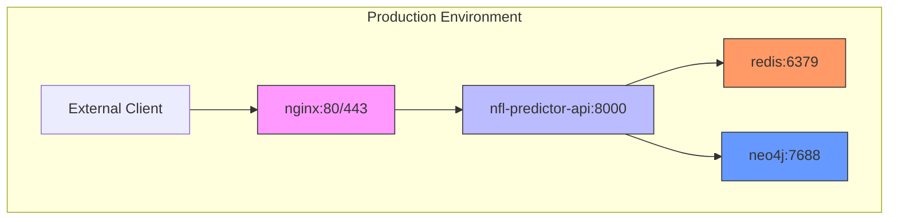
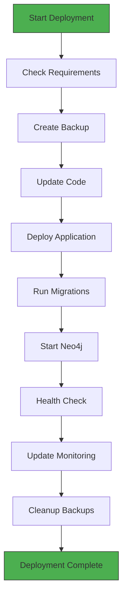
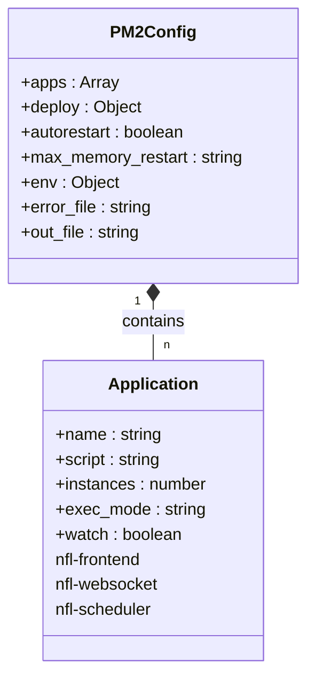

# Deployment & Operations

<cite>
**Referenced Files in This Document**   
- [docker-compose.prod.yml](file://docker-compose.prod.yml)
- [docker-compose.neo4j.yml](file://docker-compose.neo4j.yml) - *Updated in recent commit*
- [deploy.sh](file://deploy.sh)
- [ecosystem.config.js](file://ecosystem.config.js)
- [production.py](file://config/production.py)
- [production_deployment.py](file://config/production_deployment.py)
- [PRODUCTION_SETUP_GUIDE.md](file://PRODUCTION_SETUP_GUIDE.md)
- [Dockerfile](file://Dockerfile)
- [nginx.conf](file://nginx.conf)
- [scripts/neo4j_usage_example.py](file://scripts/neo4j_usage_example.py) - *Added in recent commit*
- [src/services/neo4j_service.py](file://src/services/neo4j_service.py) - *New component*
- [KIRO_NEO4J_SETUP.md](file://KIRO_NEO4J_SETUP.md) - *New documentation*
</cite>

## Update Summary
**Changes Made**   
- Added new section on Neo4j Graph Database Integration
- Updated Docker-based deployment architecture to include Neo4j service
- Added Neo4j-specific deployment automation details
- Updated production setup procedures to include Neo4j initialization
- Enhanced monitoring and maintenance section with Neo4j health checks
- Added Neo4j to disaster recovery and backup strategy
- Updated environment configuration to include Neo4j settings

## Table of Contents
1. [Docker-Based Deployment Architecture](#docker-based-deployment-architecture)
2. [Neo4j Graph Database Integration](#neo4j-graph-database-integration)
3. [Production Deployment Automation](#production-deployment-automation)
4. [PM2 Process Management](#pm2-process-management)
5. [Production Setup Procedures](#production-setup-procedures)
6. [Monitoring and Maintenance](#monitoring-and-maintenance)
7. [Scaling Strategies](#scaling-strategies)
8. [Disaster Recovery and Backup](#disaster-recovery-and-backup)
9. [Zero-Downtime Deployment](#zero-downtime-deployment)
10. [Environment Configuration Integration](#environment-configuration-integration)

## Docker-Based Deployment Architecture

The NFL Predictor API utilizes a Docker-based container orchestration architecture with docker-compose for production deployments. The system consists of four primary services: the main API application, Redis caching layer, Nginx reverse proxy, and Neo4j graph database for expert learning tracking.



**Diagram sources**
- [docker-compose.prod.yml](file://docker-compose.prod.yml#L1-L208)
- [docker-compose.neo4j.yml](file://docker-compose.neo4j.yml#L1-L47)

**Section sources**
- [docker-compose.prod.yml](file://docker-compose.prod.yml#L1-L208)
- [Dockerfile](file://Dockerfile#L1-L63)
- [nginx.conf](file://nginx.conf)
- [docker-compose.neo4j.yml](file://docker-compose.neo4j.yml#L1-L47)

### Service Configuration

The production Docker Compose configuration defines four services with specific production-grade settings:

- **nfl-predictor-api**: Built from the Dockerfile with production context, exposed on port 8000, configured with health checks and environment-specific settings
- **redis**: Password-protected Redis instance with 512MB memory limit and LRU eviction policy for optimal caching performance
- **nginx**: Reverse proxy handling SSL termination, rate limiting, and static file serving with security headers
- **neo4j**: Graph database for tracking expert learning, predictions, and memory influence with 2GB heap size and APOC/GDS plugins enabled

All services run on a shared bridge network with appropriate restart policies and volume mounts for log persistence.

## Neo4j Graph Database Integration

The NFL Predictor API now integrates Neo4j as a graph database to track expert learning progression, prediction provenance, and memory influence on decisions.

```mermaid
classDiagram
class Neo4jService {
+uri : string
+user : string
+password : string
+connect() : Driver
+close() : void
+execute_query(query) : List[Dict]
+execute_write(query) : Dict
+get_expert(id) : Dict
+list_experts() : List[Dict]
+get_team(id) : Dict
+list_teams() : List[Dict]
+create_game(game_id) : Dict
+record_prediction(expert_id, game_id) : Dict
+get_expert_predictions(expert_id) : List[Dict]
+record_memory_usage(memory_id, game_id) : Dict
+get_prediction_provenance(expert_id, game_id) : List[Dict]
+health_check() : boolean
}
class Expert {
-id : string
-name : string
-personality : string
-decision_style : string
}
class Team {
-id : string
-name : string
-division : string
-conference : string
}
class Game {
-id : string
-home_team : string
-away_team : string
-season : int
-week : int
-date : date
}
class Memory {
-id : string
-type : string
-content : string
}
Neo4jService "1" *-- "n" Expert : manages
Neo4jService "1" *-- "n" Team : manages
Neo4jService "1" *-- "n" Game : manages
Neo4jService "1" *-- "n" Memory : manages
Expert "1" --> "n" Prediction : makes
Memory "1" --> "n" Prediction : influences
```



**Diagram sources**
- [src/services/neo4j_service.py](file://src/services/neo4j_service.py#L13-L300)
- [docker-compose.neo4j.yml](file://docker-compose.neo4j.yml#L1-L47)

**Section sources**
- [docker-compose.neo4j.yml](file://docker-compose.neo4j.yml#L1-L47)
- [src/services/neo4j_service.py](file://src/services/neo4j_service.py#L13-L300)
- [scripts/neo4j_usage_example.py](file://scripts/neo4j_usage_example.py#L1-L148)
- [KIRO_NEO4J_SETUP.md](file://KIRO_NEO4J_SETUP.md#L1-L401)

### Neo4j Service Architecture

The Neo4j integration provides a comprehensive graph-based system for tracking expert learning and prediction provenance:

- **Expert Nodes**: 15 expert personalities with attributes for name, personality type, and decision style
- **Team Nodes**: 32 NFL teams with division and conference information
- **Game Nodes**: Historical and upcoming games with season, week, and date information
- **Memory Nodes**: Episodic memories that influence predictions with content and type classification

### Relationship Types

The system tracks complex relationships between entities:

- **PREDICTED**: Links experts to games they've predicted, with properties for winner, confidence, and reasoning
- **USED_IN**: Links memories to games where they influenced predictions, with influence weight and retrieval rank
- **TEAM_MATCHUP**: Historical relationships between teams with win/loss records and performance metrics

### Service Implementation

The `Neo4jService` class provides a comprehensive interface for interacting with the graph database:

- **Connection Management**: Handles connection pooling and health checks
- **Query Execution**: Supports both read and write operations with parameterized queries
- **Expert Operations**: Methods to retrieve, list, and analyze expert nodes
- **Team Operations**: Methods to retrieve teams and filter by division
- **Game Operations**: Methods to create game nodes and record predictions
- **Memory Tracking**: Methods to record memory usage and retrieve prediction provenance

### Usage Example

```python
from services.neo4j_service import get_neo4j_service

# Initialize service
neo4j = get_neo4j_service()

# Health check
if neo4j.health_check():
    print("✓ Neo4j connection healthy")

# Record a prediction
prediction_result = neo4j.record_prediction(
    expert_id="conservative_analyzer",
    game_id="KC_BUF_2024_W10",
    winner="KC",
    confidence=0.72,
    win_probability=0.65,
    reasoning="Chiefs home field advantage and defensive strength"
)

# Track memory influence
neo4j.record_memory_usage(
    memory_id="mem_12345",
    game_id="KC_BUF_2024_W10",
    expert_id="weather_specialist",
    influence_weight=0.85,
    retrieval_rank=1
)
```

## Production Deployment Automation

The deployment process is automated through a comprehensive shell script that handles the complete production deployment lifecycle, ensuring consistency and reliability across deployments.



**Diagram sources**
- [deploy.sh](file://deploy.sh#L1-L196)

**Section sources**
- [deploy.sh](file://deploy.sh#L1-L196)
- [scripts/deploy.sh](file://scripts/deploy.sh#L1-L248)

### Deployment Script Workflow

The `deploy.sh` script implements a robust deployment workflow with the following stages:

1. **Requirements Verification**: Validates Docker, Docker Compose, and environment file presence
2. **Backup Creation**: Archives current database and configuration files before deployment
3. **Code Update**: Pulls the latest code from the main branch
4. **Application Deployment**: Stops existing containers, builds new images, and starts services
5. **Database Migration**: Executes schema changes after service startup
6. **Neo4j Initialization**: Starts Neo4j service and verifies connection
7. **Health Validation**: Performs connectivity tests to ensure service availability
8. **Monitoring Update**: Restarts monitoring services to apply configuration changes
9. **Backup Cleanup**: Removes older backups to manage disk space

The script includes comprehensive error handling, logging, and colored output for improved operational visibility.

## PM2 Process Management

The Node.js services within the NFL Predictor API ecosystem are managed using PM2, a production process manager that ensures application stability and high availability.



**Diagram sources**
- [ecosystem.config.js](file://ecosystem.config.js#L1-L93)

**Section sources**
- [ecosystem.config.js](file://ecosystem.config.js#L1-L93)

### PM2 Configuration Structure

The `ecosystem.config.js` file defines three primary applications managed by PM2:

- **nfl-frontend**: Serves the frontend application with 1GB memory limit for automatic restart
- **nfl-websocket**: Manages WebSocket connections with 500MB memory limit
- **nfl-scheduler**: Handles data scheduling tasks with cron-based restart every 30 minutes

Each application includes dedicated log files, environment-specific configurations, and automatic restart capabilities. The configuration also includes deployment settings for both production and staging environments, enabling seamless deployment workflows.

## Production Setup Procedures

The production setup process follows a structured sequence of steps to ensure proper configuration and deployment of the NFL Predictor API system.

### Initial Environment Configuration

Before deployment, the production environment must be properly configured:

```bash
# Copy environment template
cp .env.production.template .env.production

# Edit with actual values
nano .env.production

# Make deployment script executable
chmod +x deploy.sh
```

The environment file requires configuration of database URLs, API keys, cache settings, and security parameters as specified in the production configuration.

### Database Initialization

Database setup involves applying migrations and optimization scripts:

```bash
# Apply database migrations
supabase db push

# Apply production optimization
psql -f supabase/migrations/030_production_database_optimization.sql

# Start Neo4j service
docker-compose -f docker-compose.neo4j.yml up -d
```

### Deployment Execution

The complete deployment is initiated by running the deployment script:

```bash
./deploy.sh
```

Expected output includes:
```
🚀 Starting production deployment...
[INFO] Checking deployment requirements...
SUCCESS: All requirements satisfied
[INFO] Creating backup...
SUCCESS: Backup created at /backups/backup_20250916_091306
...
🎉 Deployment completed successfully!
```

**Section sources**
- [PRODUCTION_SETUP_GUIDE.md](file://PRODUCTION_SETUP_GUIDE.md#L1-L285)
- [production_deployment.py](file://config/production_deployment.py#L1-L697)

## Monitoring and Maintenance

The production system includes comprehensive monitoring capabilities to ensure service reliability and performance.

### Health Check Endpoints

The system exposes health check endpoints monitored by both Docker and external services:

- `/health`: Basic service availability check
- `/metrics`: Prometheus-compatible metrics endpoint
- Database connection pool monitoring
- Redis cache availability checks
- Neo4j graph database health check

### Performance Monitoring

Key performance metrics are tracked through integrated monitoring:

- API request rates and error percentages
- Database query performance and connection pool usage
- Cache hit/miss ratios and memory utilization
- Memory and CPU usage of containerized services
- Neo4j query performance and memory utilization

### Maintenance Tasks

Regular maintenance tasks are scheduled to ensure system health:

- Daily: Refresh materialized views, update table statistics, clean old data
- Weekly: Comprehensive VACUUM ANALYZE, index usage analysis
- Monthly: Query optimization review, security patch updates
- Continuous: Neo4j graph database maintenance and index optimization

**Section sources**
- [PRODUCTION_SETUP_GUIDE.md](file://PRODUCTION_SETUP_GUIDE.md#L1-L285)
- [monitoring.yml](file://monitoring.yml)

## Scaling Strategies

The architecture supports scaling to handle high-traffic periods and increased load.

### Horizontal Scaling

The system can be scaled horizontally by:

- Deploying multiple API instances behind the Nginx load balancer
- Implementing Redis clustering for distributed caching
- Using database read replicas for analytics queries
- Adding Neo4j causal cluster for high availability

### Resource Optimization

Performance optimization techniques include:

- Connection pooling with configurable min/max sizes
- Category-specific database indexing for 27 prediction categories
- Time-series optimization for recent performance queries
- Composite and partial indexes for complex query patterns
- Neo4j vector search optimization with HNSW indexes

### Traffic Management

Nginx provides rate limiting to manage API consumption:

- 10 requests per second for general API endpoints
- 5 requests per second for authentication endpoints
- Gzip compression for reduced bandwidth usage
- Static asset caching with long expiration times

**Section sources**
- [PRODUCTION_SETUP_GUIDE.md](file://PRODUCTION_SETUP_GUIDE.md#L1-L285)
- [nginx.conf](file://nginx.conf)

## Disaster Recovery and Backup

The system implements robust backup and recovery procedures to ensure data integrity and availability.

### Backup Strategy

Automated backups include:

- Daily database snapshots
- Neo4j graph database backups
- Configuration file versioning
- 30-day retention policy
- Monitoring of backup success/failure

### Recovery Procedures

Disaster recovery capabilities include:

- Point-in-time database recovery
- Neo4j graph database recovery from backups
- Expert model state restoration
- Performance analytics rebuild
- Configuration rollback mechanisms

### Security Measures

Security best practices are implemented throughout the system:

- Row Level Security (RLS) for database access control
- Environment variable protection
- API key rotation schedule
- SSL certificate management
- Neo4j authentication and authorization

**Section sources**
- [PRODUCTION_SETUP_GUIDE.md](file://PRODUCTION_SETUP_GUIDE.md#L1-L285)
- [config/production.py](file://config/production.py#L1-L310)

## Zero-Downtime Deployment

The deployment architecture supports zero-downtime deployments through careful orchestration of service updates.

### Deployment Sequence

The zero-downtime process follows these steps:

1. New containers are built with updated code
2. New services are started alongside existing ones
3. Health checks verify new service readiness
4. Traffic is routed to new services
5. Old services are gracefully terminated

### Container Lifecycle

Docker container lifecycle management ensures smooth transitions:

- `restart: unless-stopped` policy maintains service availability
- Health checks prevent traffic routing to unhealthy containers
- Proper signal handling through dumb-init in the Dockerfile
- Gradual rollout with start_period allowing for initialization

**Section sources**
- [docker-compose.prod.yml](file://docker-compose.prod.yml#L1-L208)
- [Dockerfile](file://Dockerfile#L1-L63)

## Environment Configuration Integration

The production environment configuration is seamlessly integrated across all system components.

### Configuration Hierarchy

The configuration system follows a layered approach:

- Environment variables set in `.env.production`
- Python configuration classes in `production.py` that validate settings
- Docker Compose injecting environment variables into containers
- Runtime configuration loading and validation

### Security Configuration

Production security settings enforce best practices:

- HTTPS enforcement for API base URLs
- Specific domain restrictions for CORS origins
- Password-protected Redis access
- JWT secret key for API authentication
- Neo4j authentication with secure password

### Performance Configuration

Performance-related settings are centrally managed:

- Database connection pooling (10-50 connections)
- Query timeout settings (60 seconds)
- Cache TTL (30 minutes by default)
- Memory limits for Redis (512MB)
- Neo4j heap size (2GB) and page cache (1GB)

**Section sources**
- [config/production.py](file://config/production.py#L1-L310)
- [config/production_deployment.py](file://config/production_deployment.py#L1-L697)
- [.env.production.template](file://config/production_deployment.py#L1-L697)