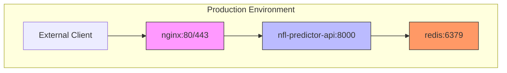
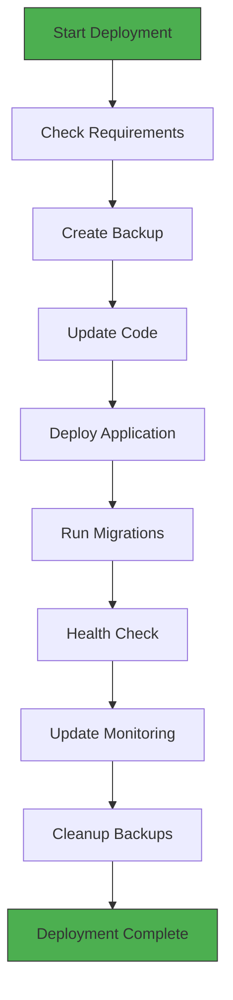

# Deployment & Operations

<cite>
**Referenced Files in This Document**   
- [docker-compose.prod.yml](file://docker-compose.prod.yml)
- [deploy.sh](file://deploy.sh)
- [ecosystem.config.js](file://ecosystem.config.js)
- [production.py](file://config/production.py)
- [production_deployment.py](file://config/production_deployment.py)
- [PRODUCTION_SETUP_GUIDE.md](file://PRODUCTION_SETUP_GUIDE.md)
- [Dockerfile](file://Dockerfile)
- [nginx.conf](file://nginx.conf)
</cite>

## Table of Contents
1. [Docker-Based Deployment Architecture](#docker-based-deployment-architecture)
2. [Production Deployment Automation](#production-deployment-automation)
3. [PM2 Process Management](#pm2-process-management)
4. [Production Setup Procedures](#production-setup-procedures)
5. [Monitoring and Maintenance](#monitoring-and-maintenance)
6. [Scaling Strategies](#scaling-strategies)
7. [Disaster Recovery and Backup](#disaster-recovery-and-backup)
8. [Zero-Downtime Deployment](#zero-downtime-deployment)
9. [Environment Configuration Integration](#environment-configuration-integration)

## Docker-Based Deployment Architecture

The NFL Predictor API utilizes a Docker-based container orchestration architecture with docker-compose for production deployments. The system consists of three primary services: the main API application, Redis caching layer, and Nginx reverse proxy.



**Diagram sources**
- [docker-compose.prod.yml](file://docker-compose.prod.yml#L1-L75)

**Section sources**
- [docker-compose.prod.yml](file://docker-compose.prod.yml#L1-L75)
- [Dockerfile](file://Dockerfile#L1-L63)
- [nginx.conf](file://nginx.conf)

### Service Configuration

The production Docker Compose configuration defines three services with specific production-grade settings:

- **nfl-predictor-api**: Built from the Dockerfile with production context, exposed on port 8000, configured with health checks and environment-specific settings
- **redis**: Password-protected Redis instance with 256MB memory limit and LRU eviction policy for optimal caching performance
- **nginx**: Reverse proxy handling SSL termination, rate limiting, and static file serving with security headers

All services run on a shared bridge network with appropriate restart policies and volume mounts for log persistence.

## Production Deployment Automation

The deployment process is automated through a comprehensive shell script that handles the complete production deployment lifecycle, ensuring consistency and reliability across deployments.



**Diagram sources**
- [deploy.sh](file://deploy.sh#L1-L196)

**Section sources**
- [deploy.sh](file://deploy.sh#L1-L196)
- [scripts/deploy.sh](file://scripts/deploy.sh#L1-L248)

### Deployment Script Workflow

The `deploy.sh` script implements a robust deployment workflow with the following stages:

1. **Requirements Verification**: Validates Docker, Docker Compose, and environment file presence
2. **Backup Creation**: Archives current database and configuration files before deployment
3. **Code Update**: Pulls the latest code from the main branch
4. **Application Deployment**: Stops existing containers, builds new images, and starts services
5. **Database Migration**: Executes schema changes after service startup
6. **Health Validation**: Performs connectivity tests to ensure service availability
7. **Monitoring Update**: Restarts monitoring services to apply configuration changes
8. **Backup Cleanup**: Removes older backups to manage disk space

The script includes comprehensive error handling, logging, and colored output for improved operational visibility.

## PM2 Process Management

The Node.js services within the NFL Predictor API ecosystem are managed using PM2, a production process manager that ensures application stability and high availability.


**Diagram sources**
- [ecosystem.config.js](file://ecosystem.config.js#L1-L93)

**Section sources**
- [ecosystem.config.js](file://ecosystem.config.js#L1-L93)

### PM2 Configuration Structure

The `ecosystem.config.js` file defines three primary applications managed by PM2:

- **nfl-frontend**: Serves the frontend application with 1GB memory limit for automatic restart
- **nfl-websocket**: Manages WebSocket connections with 500MB memory limit
- **nfl-scheduler**: Handles data scheduling tasks with cron-based restart every 30 minutes

Each application includes dedicated log files, environment-specific configurations, and automatic restart capabilities. The configuration also includes deployment settings for both production and staging environments, enabling seamless deployment workflows.

## Production Setup Procedures

The production setup process follows a structured sequence of steps to ensure proper configuration and deployment of the NFL Predictor API system.

### Initial Environment Configuration

Before deployment, the production environment must be properly configured:

```bash
# Copy environment template
cp .env.production.template .env.production

# Edit with actual values
nano .env.production

# Make deployment script executable
chmod +x deploy.sh
```

The environment file requires configuration of database URLs, API keys, cache settings, and security parameters as specified in the production configuration.

### Database Initialization

Database setup involves applying migrations and optimization scripts:

```bash
# Apply database migrations
supabase db push

# Apply production optimization
psql -f supabase/migrations/030_production_database_optimization.sql
```

### Deployment Execution

The complete deployment is initiated by running the deployment script:

```bash
./deploy.sh
```

Expected output includes:
```
🚀 Starting production deployment...
[INFO] Checking deployment requirements...
SUCCESS: All requirements satisfied
[INFO] Creating backup...
SUCCESS: Backup created at /backups/backup_20250916_091306
...
🎉 Deployment completed successfully!
```

**Section sources**
- [PRODUCTION_SETUP_GUIDE.md](file://PRODUCTION_SETUP_GUIDE.md#L1-L285)
- [production_deployment.py](file://config/production_deployment.py#L1-L631)

## Monitoring and Maintenance

The production system includes comprehensive monitoring capabilities to ensure service reliability and performance.

### Health Check Endpoints

The system exposes health check endpoints monitored by both Docker and external services:

- `/health`: Basic service availability check
- `/metrics`: Prometheus-compatible metrics endpoint
- Database connection pool monitoring
- Redis cache availability checks

### Performance Monitoring

Key performance metrics are tracked through integrated monitoring:

- API request rates and error percentages
- Database query performance and connection pool usage
- Cache hit/miss ratios and memory utilization
- Memory and CPU usage of containerized services

### Maintenance Tasks

Regular maintenance tasks are scheduled to ensure system health:

- Daily: Refresh materialized views, update table statistics, clean old data
- Weekly: Comprehensive VACUUM ANALYZE, index usage analysis
- Monthly: Query optimization review, security patch updates

**Section sources**
- [PRODUCTION_SETUP_GUIDE.md](file://PRODUCTION_SETUP_GUIDE.md#L1-L285)
- [monitoring.yml](file://monitoring.yml)

## Scaling Strategies

The architecture supports scaling to handle high-traffic periods and increased load.

### Horizontal Scaling

The system can be scaled horizontally by:

- Deploying multiple API instances behind the Nginx load balancer
- Implementing Redis clustering for distributed caching
- Using database read replicas for analytics queries

### Resource Optimization

Performance optimization techniques include:

- Connection pooling with configurable min/max sizes
- Category-specific database indexing for 27 prediction categories
- Time-series optimization for recent performance queries
- Composite and partial indexes for complex query patterns

### Traffic Management

Nginx provides rate limiting to manage API consumption:

- 10 requests per second for general API endpoints
- 5 requests per second for authentication endpoints
- Gzip compression for reduced bandwidth usage
- Static asset caching with long expiration times

**Section sources**
- [PRODUCTION_SETUP_GUIDE.md](file://PRODUCTION_SETUP_GUIDE.md#L1-L285)
- [nginx.conf](file://nginx.conf)

## Disaster Recovery and Backup

The system implements robust backup and recovery procedures to ensure data integrity and availability.

### Backup Strategy

Automated backups include:

- Daily database snapshots
- Configuration file versioning
- 30-day retention policy
- Monitoring of backup success/failure

### Recovery Procedures

Disaster recovery capabilities include:

- Point-in-time database recovery
- Expert model state restoration
- Performance analytics rebuild
- Configuration rollback mechanisms

### Security Measures

Security best practices are implemented throughout the system:

- Row Level Security (RLS) for database access control
- Environment variable protection
- API key rotation schedule
- SSL certificate management

**Section sources**
- [PRODUCTION_SETUP_GUIDE.md](file://PRODUCTION_SETUP_GUIDE.md#L1-L285)
- [config/production.py](file://config/production.py#L1-L310)

## Zero-Downtime Deployment

The deployment architecture supports zero-downtime deployments through careful orchestration of service updates.

### Deployment Sequence

The zero-downtime process follows these steps:

1. New containers are built with updated code
2. New services are started alongside existing ones
3. Health checks verify new service readiness
4. Traffic is routed to new services
5. Old services are gracefully terminated

### Container Lifecycle

Docker container lifecycle management ensures smooth transitions:

- `restart: unless-stopped` policy maintains service availability
- Health checks prevent traffic routing to unhealthy containers
- Proper signal handling through dumb-init in the Dockerfile
- Gradual rollout with start_period allowing for initialization

**Section sources**
- [docker-compose.prod.yml](file://docker-compose.prod.yml#L1-L75)
- [Dockerfile](file://Dockerfile#L1-L63)

## Environment Configuration Integration

The production environment configuration is seamlessly integrated across all system components.

### Configuration Hierarchy

The configuration system follows a layered approach:

- Environment variables set in `.env.production`
- Python configuration classes in `production.py` that validate settings
- Docker Compose injecting environment variables into containers
- Runtime configuration loading and validation

### Security Configuration

Production security settings enforce best practices:

- HTTPS enforcement for API base URLs
- Specific domain restrictions for CORS origins
- Password-protected Redis access
- JWT secret key for API authentication

### Performance Configuration

Performance-related settings are centrally managed:

- Database connection pooling (10-50 connections)
- Query timeout settings (60 seconds)
- Cache TTL (30 minutes by default)
- Memory limits for Redis (256MB)

**Section sources**
- [config/production.py](file://config/production.py#L1-L310)
- [config/production_deployment.py](file://config/production_deployment.py#L1-L631)
- [.env.production.template](file://config/production_deployment.py#L1-L631)