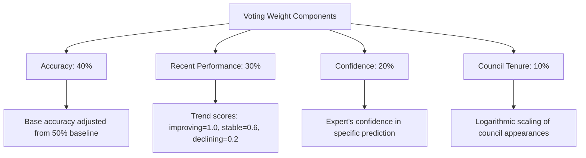
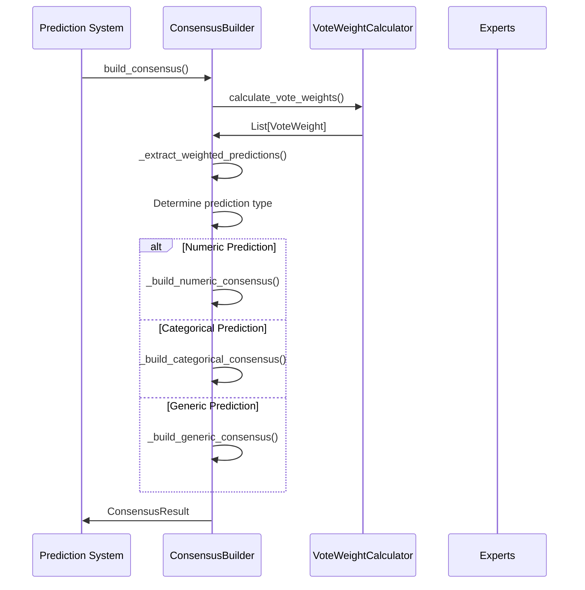
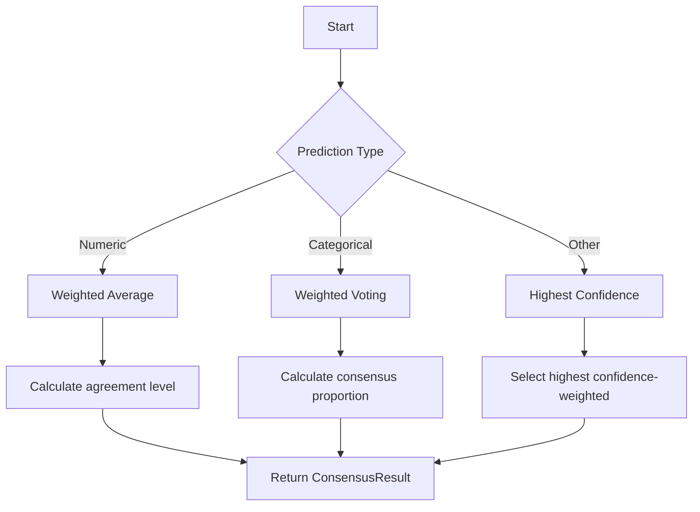
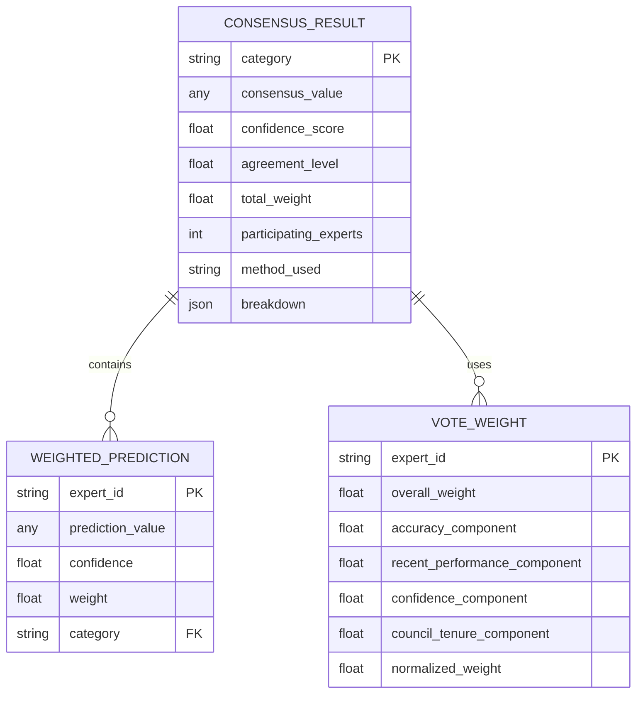
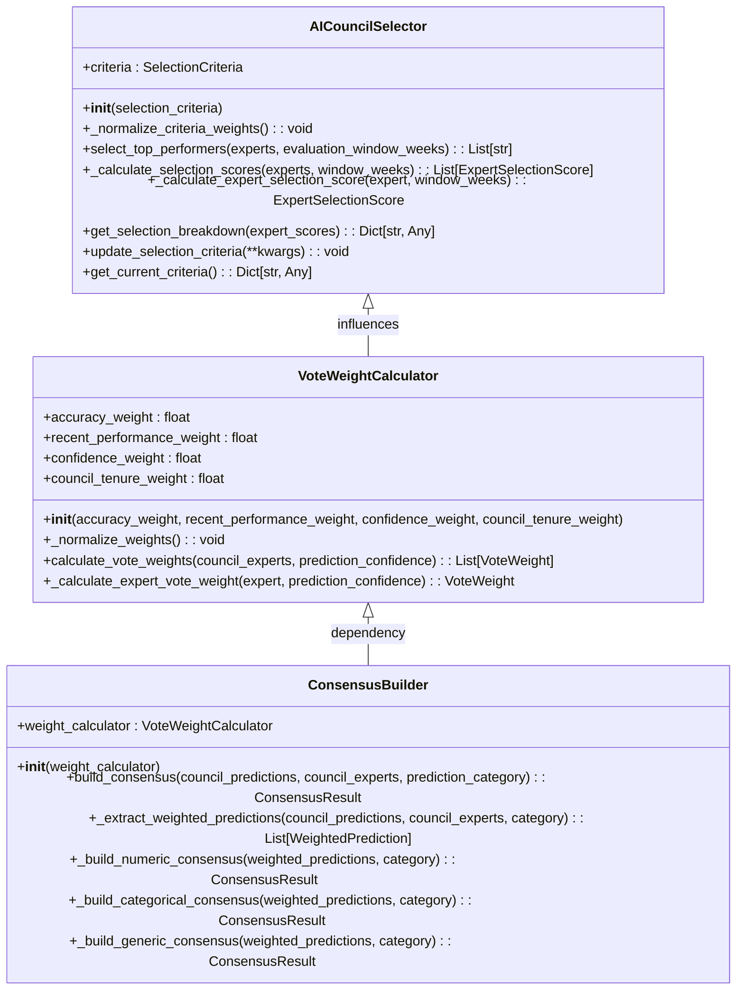

# AI Council Voting System

<cite>
**Referenced Files in This Document**   
- [voting_consensus.py](file://src/ml/expert_competition/voting_consensus.py)
- [council_selector.py](file://src/ml/expert_competition/council_selector.py)
- [expert.py](file://src/api/models/expert.py)
- [aiCouncil.ts](file://src/types/aiCouncil.ts)
- [predictions.ts](file://src/types/predictions.ts)
</cite>

## Table of Contents
1. [Introduction](#introduction)
2. [Council Selection Mechanism](#council-selection-mechanism)
3. [Voting Weight Calculation](#voting-weight-calculation)
4. [Consensus Building Process](#consensus-building-process)
5. [Prediction Category Handling](#prediction-category-handling)
6. [Confidence and Agreement Metrics](#confidence-and-agreement-metrics)
7. [Configuration and Tuning](#configuration-and-tuning)
8. [Troubleshooting Common Issues](#troubleshooting-common-issues)
9. [Integration with Expert Predictions](#integration-with-expert-predictions)

## Introduction
The AI Council voting system determines consensus predictions through a sophisticated weighted voting mechanism that combines expert performance history and contextual factors. The system selects top-performing experts for each prediction category and calculates their voting weights based on multiple performance dimensions. This document details the implementation of the voting algorithms, council selection process, and integration between individual expert predictions and final consensus outputs.

## Council Selection Mechanism

The AI Council dynamically selects the top 5 experts for each prediction cycle based on comprehensive performance metrics. The selection process evaluates experts across five key dimensions with configurable weights:

- Accuracy (35% weight)
- Recent performance (25% weight)
- Consistency (20% weight)
- Confidence calibration (10% weight)
- Specialization strength (10% weight)

Experts must have made at least 10 predictions within the evaluation window (default: 4 weeks) to be eligible. The system calculates a composite score for each expert and selects the top performers. When fewer than 5 eligible experts are available, the system supplements with the highest-scoring ineligible experts to maintain council size.

The selection process includes sophisticated scoring mechanisms:
- Accuracy scoring uses non-linear scaling to differentiate between performance levels
- Recent performance considers trend indicators and momentum factors
- Specialization scoring identifies experts with strong category-specific performance

**Section sources**
- [council_selector.py](file://src/ml/expert_competition/council_selector.py#L76-L118)
- [council_selector.py](file://src/ml/expert_competition/council_selector.py#L138-L178)
- [council_selector.py](file://src/ml/expert_competition/council_selector.py#L180-L211)

## Voting Weight Calculation

The voting system implements a multi-factor weight calculation that determines each expert's influence on the final consensus. The VoteWeightCalculator class computes weights based on four components:



**Diagram sources**
- [voting_consensus.py](file://src/ml/expert_competition/voting_consensus.py#L45-L166)

The weight calculation process:
1. Each component is calculated as a weighted contribution
2. Overall weights are normalized to sum to 1.0
3. Experts with no valid metrics receive equal default weights

Accuracy contributes 40% of the weight, calculated as the deviation from a 50% baseline. Recent performance (30%) uses trend indicators with scores for improving (1.0), stable (0.6), and declining (0.2) performance. Prediction confidence (20%) incorporates the expert's self-assessed confidence in their prediction. Council tenure (10%) uses logarithmic scaling to provide diminishing returns for repeated participation.

**Section sources**
- [voting_consensus.py](file://src/ml/expert_competition/voting_consensus.py#L110-L166)
- [voting_consensus.py](file://src/ml/expert_competition/voting_consensus.py#L77-L108)

## Consensus Building Process

The ConsensusBuilder class processes weighted votes to determine the final prediction using different algorithms based on prediction type. The process follows a three-stage workflow:



**Diagram sources**
- [voting_consensus.py](file://src/ml/expert_competition/voting_consensus.py#L174-L220)

The consensus building process:
1. Extract predictions and confidences from all council members
2. Calculate voting weights based on expert performance
3. Apply appropriate consensus algorithm based on prediction data type
4. Generate comprehensive result with confidence and agreement metrics

The system handles three prediction types with specialized algorithms:
- Numeric predictions use weighted averages
- Categorical predictions use weighted voting
- Generic predictions select the highest confidence-weighted option

**Section sources**
- [voting_consensus.py](file://src/ml/expert_competition/voting_consensus.py#L174-L220)
- [voting_consensus.py](file://src/ml/expert_competition/voting_consensus.py#L222-L273)

## Prediction Category Handling

The voting system applies different consensus algorithms based on the prediction category and data type. The category mapping includes:

| Prediction Category | Data Type | Consensus Method |
|-------------------|----------|-----------------|
| winner_prediction | string | Weighted voting |
| exact_score_home | numeric | Weighted average |
| exact_score_away | numeric | Weighted average |
| against_the_spread | string | Weighted voting |
| totals_over_under | string | Weighted voting |
| margin_of_victory | numeric | Weighted average |
| qb_passing_yards | numeric | Weighted average |
| qb_touchdowns | numeric | Weighted average |

For numeric predictions, the system calculates a weighted average using the formula:
```
consensus_value = Σ(value × weight) / Σ(weight)
```

The agreement level is calculated as the inverse of the coefficient of variation, providing a measure of prediction convergence. For categorical predictions, the system counts weighted votes for each option and selects the highest-weighted category.



**Diagram sources**
- [voting_consensus.py](file://src/ml/expert_competition/voting_consensus.py#L306-L389)
- [voting_consensus.py](file://src/ml/expert_competition/voting_consensus.py#L391-L467)

**Section sources**
- [voting_consensus.py](file://src/ml/expert_competition/voting_consensus.py#L306-L389)
- [voting_consensus.py](file://src/ml/expert_competition/voting_consensus.py#L391-L467)

## Confidence and Agreement Metrics

The system generates comprehensive metrics to evaluate the reliability of consensus predictions. The ConsensusResult includes:

- **Confidence score**: Weighted average of individual expert confidences
- **Agreement level**: Measure of consensus strength among experts
- **Method used**: Algorithm applied for consensus determination
- **Breakdown**: Detailed analysis of individual predictions

For numeric predictions, the agreement level is calculated as:
```
agreement_level = 1 - (std_dev / mean) if mean ≠ 0 else 1.0
```

This represents the inverse of the coefficient of variation, with higher values indicating greater consensus. For categorical predictions, the agreement level is the proportion of total weight supporting the consensus choice.

The confidence score combines individual expert confidences weighted by their voting influence. This provides a more accurate measure of prediction reliability than simple averaging, as it accounts for the credibility of each contributing expert.



**Diagram sources**
- [voting_consensus.py](file://src/ml/expert_competition/voting_consensus.py#L34-L43)
- [aiCouncil.ts](file://src/types/aiCouncil.ts#L38-L49)

**Section sources**
- [voting_consensus.py](file://src/ml/expert_competition/voting_consensus.py#L38-L42)
- [voting_consensus.py](file://src/ml/expert_competition/voting_consensus.py#L391-L467)

## Configuration and Tuning

The voting system provides configurable parameters to adjust behavior without code changes. Key configuration options include:

### Voting Weight Configuration
- `accuracy_weight`: Weight for accuracy component (default: 0.40)
- `recent_performance_weight`: Weight for recent performance (default: 0.30)
- `confidence_weight`: Weight for prediction confidence (default: 0.20)
- `council_tenure_weight`: Weight for council tenure (default: 0.10)

### Council Selection Configuration
- `accuracy_weight`: Weight for accuracy in selection (default: 0.35)
- `recent_performance_weight`: Weight for recent performance (default: 0.25)
- `consistency_weight`: Weight for consistency (default: 0.20)
- `calibration_weight`: Weight for confidence calibration (default: 0.10)
- `specialization_weight`: Weight for specialization (default: 0.10)
- `evaluation_window_weeks`: Historical window for evaluation (default: 4)
- `minimum_predictions`: Minimum predictions for eligibility (default: 10)

The system automatically normalizes weights if they don't sum to 1.0, ensuring mathematical validity. Configuration changes can be applied dynamically through the `update_selection_criteria` method, which validates and normalizes new parameters.



**Diagram sources**
- [voting_consensus.py](file://src/ml/expert_competition/voting_consensus.py#L45-L166)
- [council_selector.py](file://src/ml/expert_competition/council_selector.py#L49-L436)

**Section sources**
- [council_selector.py](file://src/ml/expert_competition/council_selector.py#L407-L423)
- [council_selector.py](file://src/ml/expert_competition/council_selector.py#L425-L436)

## Troubleshooting Common Issues

### Deadlock Prevention
The system includes multiple safeguards against deadlock conditions:
- Fallback to equal weights when weight calculation fails
- Default council selection when fewer than 5 experts are available
- Error handling with meaningful fallbacks for all consensus methods

When no valid predictions are available, the system returns a consensus result with null values and appropriate error messages in the breakdown. This prevents cascading failures while maintaining system integrity.

### Unexpected Consensus Outcomes
Common causes of unexpected outcomes include:
- **Weight imbalance**: Verify that voting weights sum to 1.0
- **Data quality issues**: Check expert performance metrics for accuracy
- **Confidence miscalibration**: Monitor confidence vs. actual accuracy
- **Specialization mismatch**: Ensure experts are selected for appropriate categories

Diagnostic tools include:
- `get_selection_breakdown()`: Detailed analysis of council selection
- Consensus result breakdowns: Individual prediction details
- Logging at INFO level for selection and weighting processes

### Performance Optimization
The system is designed for efficiency with:
- Asynchronous council selection
- Batch processing of multiple predictions
- Caching of expert metrics
- Normalized calculations to prevent floating-point errors

Monitoring key metrics helps identify issues:
- Average agreement level below 0.5 indicates poor consensus
- Confidence scores consistently above 0.8 may indicate overconfidence
- Frequent fallback to default weights suggests data quality issues

**Section sources**
- [voting_consensus.py](file://src/ml/expert_competition/voting_consensus.py#L174-L220)
- [council_selector.py](file://src/ml/expert_competition/council_selector.py#L76-L118)
- [voting_consensus.py](file://src/ml/expert_competition/voting_consensus.py#L469-L536)

## Integration with Expert Predictions

The voting system integrates with individual expert predictions through a well-defined interface. The process begins with expert predictions that include:

- Prediction values for specific categories
- Confidence scores (overall or by category)
- Metadata about prediction context

The system extracts prediction values using a category mapping that translates category names to attribute names. For example, 'winner_prediction' maps to the winner_prediction attribute on the prediction object.

The integration handles different prediction formats:
- Object attributes (using hasattr and getattr)
- Dictionary keys (using dict.get)
- Fallback to default confidence values when not specified

The weighted prediction process combines expert predictions with their calculated voting weights to produce the final consensus. This integration ensures that the collective wisdom of the AI Council is properly weighted by each expert's demonstrated performance and credibility.

**Section sources**
- [voting_consensus.py](file://src/ml/expert_competition/voting_consensus.py#L275-L304)
- [voting_consensus.py](file://src/ml/expert_competition/voting_consensus.py#L222-L273)
- [predictions.ts](file://src/types/predictions.ts#L27-L49)