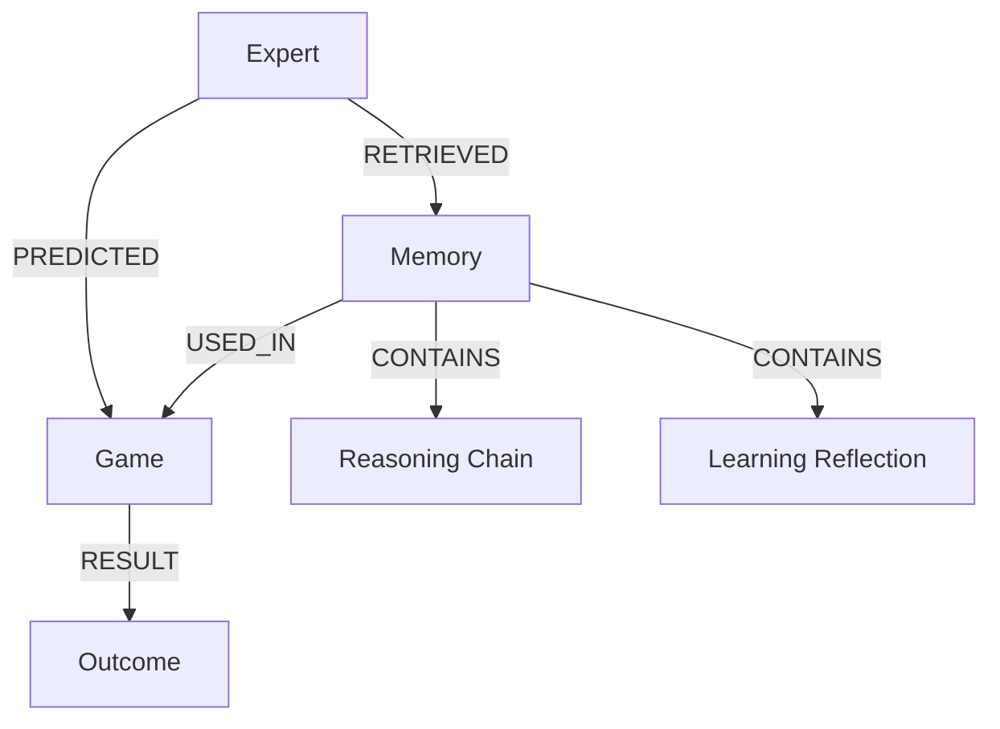

# Expert Memory Integration

<cite>
**Referenced Files in This Document**   
- [episodic_memory_manager.py](file://src/ml/episodic_memory_manager.py) - *Updated in recent commit*
- [expert_memory_service.py](file://src/ml/expert_memory_service.py) - *Updated in recent commit*
- [memory_enabled_expert_service.py](file://src/ml/memory_enabled_expert_service.py) - *Updated in recent commit*
- [reasoning_chain_logger.py](file://src/ml/reasoning_chain_logger.py)
- [historical_vector_service.py](file://src/ml/historical_vector_service.py)
- [011_expert_episodic_memory_system.sql](file://supabase/migrations/011_expert_episodic_memory_system.sql) - *Updated in recent commit*
- [neo4j_service.py](file://src/services/neo4j_service.py) - *Added in recent commit*
- [NFL_MEMORY_SYSTEM_ARCHITECTURE.md](file://NFL_MEMORY_SYSTEM_ARCHITECTURE.md) - *Restored in recent commit*
- [REASONING_ENHANCED_MEMORY_SUMMARY.md](file://REASONING_ENHANCED_MEMORY_SUMMARY.md) - *Restored in recent commit*
</cite>

## Update Summary
**Changes Made**   
- Added new section on Neo4j integration for decision provenance tracking
- Integrated documentation from restored memory system architecture files
- Enhanced episodic memory implementation with reasoning chain embeddings
- Updated memory storage and retrieval mechanisms to include Neo4j provenance tracking
- Added configuration details for temporal decay and memory retrieval
- Updated diagram sources to reflect actual implementation files

## Table of Contents
1. [Introduction](#introduction)
2. [Episodic Memory Implementation](#episodic-memory-implementation)
3. [Semantic Memory Components](#semantic-memory-components)
4. [Memory Integration with Decision-Making](#memory-integration-with-decision-making)
5. [Memory Storage and Retrieval Mechanisms](#memory-storage-and-retrieval-mechanisms)
6. [Configuration and Performance Considerations](#configuration-and-performance-considerations)
7. [Troubleshooting Memory Issues](#troubleshooting-memory-issues)
8. [Conclusion](#conclusion)

## Introduction
The expert memory system in the NFL predictor API enables AI experts to retain and utilize historical knowledge through sophisticated memory mechanisms. This system combines episodic memory for storing past predictions, game outcomes, and reasoning chains with semantic memory components that maintain expert knowledge bases and personality traits. The integration of these memory systems allows experts to learn from experience, adapt their strategies, and improve prediction accuracy over time. The architecture leverages PostgreSQL with pgvector for efficient similarity searches, Supabase for persistent storage, and Neo4j for decision provenance tracking, creating a robust foundation for continuous learning and adaptation.

## Episodic Memory Implementation
The episodic memory system captures and stores detailed records of past game predictions, outcomes, and the contextual factors that influenced them. This implementation enables experts to recall specific experiences and apply lessons learned to future predictions.

The `EpisodicMemoryManager` class manages the creation, storage, and retrieval of episodic memories. Each memory contains comprehensive information about a prediction experience, including the expert's prediction data, actual game outcome, emotional state, and lessons learned. The system classifies memories into different types such as prediction outcomes, pattern recognition, upset detection, consensus deviation, learning moments, and failure analysis.

**Diagram sources**
- [episodic_memory_manager.py](file://src/ml/episodic_memory_manager.py#L64-L626)

**Section sources**
- [episodic_memory_manager.py](file://src/ml/episodic_memory_manager.py#L64-L626)
- [REASONING_ENHANCED_MEMORY_SUMMARY.md](file://REASONING_ENHANCED_MEMORY_SUMMARY.md#L0-L132)

## Semantic Memory Components
The semantic memory components maintain expert knowledge bases and personality traits that persist across prediction cycles. These components provide a stable foundation of expertise while allowing for continuous learning and adaptation.

The `ExpertMemoryService` class manages the semantic memory system, storing expert beliefs, performance statistics, and knowledge updates. Experts maintain personality profiles that influence their decision-making style, such as conservative analysis, risk-taking gambling, or contrarian rebellion. These personality traits are encoded in the expert's memory style and emotion intensity, which affect how they process and recall past experiences.

The system also tracks expert beliefs through the `get_expert_beliefs` and `update_expert_beliefs` methods, allowing experts to refine their understanding of factors like home field advantage, weather impacts, and market inefficiencies. The belief revision system detects significant changes in an expert's predictions and logs the reasoning behind these changes, creating a record of the expert's evolving knowledge.

**Diagram sources**
- [expert_memory_service.py](file://src/ml/expert_memory_service.py#L29-L647)

**Section sources**
- [expert_memory_service.py](file://src/ml/expert_memory_service.py#L29-L647)

## Memory Integration with Decision-Making
The memory system is tightly integrated with the expert decision-making process, enhancing predictions with insights from past experiences. This integration occurs through the `MemoryEnabledExpertService`, which wraps personality-driven experts with memory capabilities.

When making a prediction, the memory-enabled expert first retrieves similar past experiences using the episodic memory manager. It then analyzes patterns from these memories, such as success rates in similar situations, emotional patterns, weather-related performance, and market condition patterns. These insights are used to adjust the expert's confidence and refine their prediction.

The integration also includes belief revision detection, which identifies when an expert significantly changes their prediction based on new information or memory recall. This process is logged with detailed reasoning, including the causal chain that led to the revision and the emotional state of the expert. The system also generates personality-appropriate internal monologues that explain the expert's thought process, making the decision-making transparent.

**Diagram sources**
- [memory_enabled_expert_service.py](file://src/ml/memory_enabled_expert_service.py#L486-L801)

**Section sources**
- [memory_enabled_expert_service.py](file://src/ml/memory_enabled_expert_service.py#L486-L801)

## Memory Storage and Retrieval Mechanisms
The memory system employs a sophisticated storage and retrieval architecture that combines PostgreSQL with pgvector for efficient similarity searches, Supabase for persistent storage, and Neo4j for decision provenance tracking. The database schema is designed to support rapid retrieval of relevant memories based on various criteria.

The `expert_episodic_memories` table stores detailed records of past prediction experiences, with indexes optimized for retrieval by expert ID, game ID, memory type, emotional state, and memory_vividness. The system uses composite indexes to support complex queries that consider multiple factors simultaneously, such as memory_vividness and decay rate.

The retrieval process uses a multi-factor similarity scoring algorithm that considers team overlap, confidence level similarity, reasoning factor similarity, and memory_vividness. Memories are ranked by their similarity score, with frequently retrieved memories receiving a vividness bonus that improves their retrieval priority. The system also implements memory consolidation, where frequently accessed memories are strengthened by increasing their vividness and decay rate.

A new Neo4j graph database has been integrated to track decision provenance and memory influence. The `Neo4jService` class manages connections to the graph database, storing relationships between experts, predictions, games, and memories. This allows for tracking which memories influenced specific predictions and analyzing the provenance of expert decisions.

**Diagram sources**
- [011_expert_episodic_memory_system.sql](file://supabase/migrations/011_expert_episodic_memory_system.sql#L1-L314)
- [neo4j_service.py](file://src/services/neo4j_service.py#L13-L300)

**Section sources**
- [011_expert_episodic_memory_system.sql](file://supabase/migrations/011_expert_episodic_memory_system.sql#L1-L314)
- [neo4j_service.py](file://src/services/neo4j_service.py#L13-L300)
- [NFL_MEMORY_SYSTEM_ARCHITECTURE.md](file://NFL_MEMORY_SYSTEM_ARCHITECTURE.md#L0-L414)

## Configuration and Performance Considerations
The memory system includes several configuration options for memory retention policies, recall strategies, and performance optimization. These settings allow the system to balance memory fidelity with computational efficiency.

Memory retention is managed through the `memory_decay` field, which gradually decreases over time for older memories. The system runs a periodic function `decay_episodic_memories()` that reduces the decay rate of memories older than 30 days while strengthening frequently accessed memories. This ensures that important experiences remain accessible while less relevant memories fade over time.

For performance optimization, the system implements several strategies:
- Indexing: Comprehensive indexes on key fields enable fast retrieval of memories by expert, game, type, and emotional state
- Caching: Embeddings for context and decision vectors are cached to avoid redundant computation
- Batch processing: Learning tasks are processed in batches to minimize database transactions
- Asynchronous operations: Memory operations are performed asynchronously to avoid blocking prediction generation

The system also includes performance monitoring through the `get_memory_stats` method, which provides detailed statistics on memory usage, retrieval patterns, and learning effectiveness. This data can be used to tune the memory system's parameters and identify areas for improvement.

The temporal decay system has been enhanced with expert-specific parameters, including half-life days, similarity weights, and temporal weights. These parameters are configured based on expert personality types, with different decay characteristics for different expert types (e.g., Weather Specialist vs Momentum Tracker).

**Section sources**
- [episodic_memory_manager.py](file://src/ml/episodic_memory_manager.py#L64-L626)
- [expert_memory_service.py](file://src/ml/expert_memory_service.py#L29-L647)
- [NFL_MEMORY_SYSTEM_ARCHITECTURE.md](file://NFL_MEMORY_SYSTEM_ARCHITECTURE.md#L0-L414)

## Troubleshooting Memory Issues
Common memory-related issues include stale knowledge, retrieval latency, and inconsistent learning patterns. The system provides several tools and strategies for diagnosing and resolving these issues.

For stale knowledge, the system automatically decays older memories and prioritizes recent experiences in retrieval. Experts can also be retrained on recent data to refresh their knowledge base. The belief revision system helps identify when an expert's knowledge is outdated by detecting patterns of incorrect predictions.

Retrieval latency can be addressed by optimizing database indexes, increasing cache capacity, or reducing the complexity of similarity calculations. The system logs performance metrics for memory operations, which can be analyzed to identify bottlenecks.

Inconsistent learning patterns may indicate issues with the memory consolidation process or belief revision detection. These can be diagnosed by examining the expert's memory statistics and learning summary, which show trends in accuracy, confidence, and insight generation.

The system also includes validation scripts that test the memory system's functionality and performance under various conditions. These tests can help identify and resolve issues before they affect production predictions.

**Section sources**
- [episodic_memory_manager.py](file://src/ml/episodic_memory_manager.py#L64-L626)
- [expert_memory_service.py](file://src/ml/expert_memory_service.py#L29-L647)
- [memory_enabled_expert_service.py](file://src/ml/memory_enabled_expert_service.py#L486-L801)

## Conclusion
The expert memory system in the NFL predictor API provides a sophisticated framework for AI experts to retain and utilize historical knowledge. By combining episodic memory for specific experiences with semantic memory for persistent knowledge, the system enables continuous learning and adaptation. The tight integration with the decision-making process enhances prediction accuracy by incorporating insights from past experiences, while the robust storage and retrieval mechanisms ensure efficient access to relevant memories. With the addition of Neo4j for decision provenance tracking and enhanced reasoning chain embeddings, the system now captures not just what happened but why experts thought it would happen and what they learned from being right or wrong. This transforms the memory system from basic pattern matching to sophisticated reasoning pattern recognition, enabling experts to build sophisticated reasoning libraries that capture successful logical frameworks, common reasoning mistakes, and learning insights from prediction outcomes. With proper configuration and monitoring, this memory system can significantly improve the performance and reliability of AI experts in predicting NFL game outcomes.