# Expert System Architecture

<cite>
**Referenced Files in This Document**   
- [autonomous_expert_system.py](file://src/ml/autonomous_expert_system.py)
- [personality_driven_experts.py](file://src/ml/personality_driven_experts.py)
- [episodic_memory_manager.py](file://src/ml/episodic_memory_manager.py)
- [expert_memory_integration.py](file://src/ml/expert_memory_integration.py)
- [voting_consensus.py](file://src/ml/expert_competition/voting_consensus.py)
- [performance_evaluator.py](file://src/ml/expert_competition/performance_evaluator.py)
- [adaptation_engine.py](file://src/ml/self_healing/adaptation_engine.py)
</cite>

## Table of Contents
1. [Introduction](#introduction)
2. [Core Expert System Architecture](#core-expert-system-architecture)
3. [Personality-Driven Expert Design](#personality-driven-expert-design)
4. [Memory Integration System](#memory-integration-system)
5. [Expert Council Voting Mechanism](#expert-council-voting-mechanism)
6. [Performance Tracking and Self-Healing](#performance-tracking-and-self-healing)
7. [Configuration and Extensibility](#configuration-and-extensibility)

## Introduction
The AI Expert System forms the core of the prediction engine, comprising 15 autonomous experts with distinct personality profiles that influence their decision-making approaches. This system leverages personality-driven analysis rather than domain specialization, ensuring all experts have equal access to data while interpreting it through unique cognitive lenses. The architecture integrates persistent memory, learning from past predictions, and a self-healing mechanism that adapts expert parameters based on performance. This document details the comprehensive system design, including expert lifecycle management, memory retention, consensus algorithms, and configuration options for extending the system.

## Core Expert System Architecture

The autonomous expert system orchestrates 15 personality-driven experts through a centralized framework that manages their lifecycle, memory integration, and collaborative prediction processes. Each expert operates as an independent agent with specialized decision-making characteristics while sharing access to universal game data. The system connects to Supabase for persistent storage of expert states, predictions, and performance metrics, enabling long-term learning and evolution.

The architecture follows a modular design where experts generate predictions based on their personality profiles, which are then aggregated through a weighted voting mechanism to produce consensus outcomes. The system maintains active prediction tracking and processes game results to trigger learning cycles, allowing experts to evolve their strategies based on real-world outcomes. This closed-loop system enables continuous improvement through experience-based learning and peer knowledge sharing.

```mermaid
graph TD
A[Autonomous Expert System] --> B[15 Personality Experts]
B --> C[Conservative Analyzer]
B --> D[Risk-Taking Gambler]
B --> E[Contrarian Rebel]
B --> F[Value Hunter]
B --> G[Momentum Rider]
B --> H[Fundamentalist Scholar]
B --> I[Chaos Theory Believer]
B --> J[Gut Instinct Expert]
B --> K[Statistics Purist]
B --> L[Trend Reversal Specialist]
B --> M[Popular Narrative Fader]
B --> N[Sharp Money Follower]
B --> O[Underdog Champion]
B --> P[Consensus Follower]
B --> Q[Market Inefficiency Exploiter]
A --> R[Supabase Integration]
R --> S[Expert States]
R --> T[Performance Metrics]
R --> U[Prediction History]
A --> V[Memory Service]
A --> W[Learning Coordinator]
A --> X[Consensus Engine]
```



**Diagram sources**
- [autonomous_expert_system.py](file://src/ml/autonomous_expert_system.py#L1-L364)

**Section sources**
- [autonomous_expert_system.py](file://src/ml/autonomous_expert_system.py#L1-L364)

## Personality-Driven Expert Design

The system implements 15 distinct expert personalities, each with unique decision-making approaches and specialized knowledge domains encoded through personality traits. These experts are designed around the principle of universal data access, where all agents receive identical information about games, weather, injuries, and market data, but interpret it through different cognitive frameworks. This approach ensures fair competition based on analytical style rather than information advantage.

Each expert is defined by a PersonalityProfile containing multiple PersonalityTrait dimensions such as risk_tolerance, analytics_trust, contrarian_tendency, and confidence_level. These traits exist on a 0.0 to 1.0 scale and influence how the expert weights various factors in their decision-making process. For example, the Conservative Analyzer exhibits low risk tolerance (0.2) and high analytics trust (0.9), leading to cautious, data-driven predictions, while the Risk-Taking Gambler demonstrates high risk tolerance (0.9) and low market trust (0.3), favoring contrarian positions in volatile situations.

The experts follow a standardized processing pipeline: they receive universal game data, process it through their personality lens to generate weighted interpretations, synthesize prediction components, and produce final outcomes with reasoning explanations. This consistent framework allows for meaningful comparison of different decision-making styles while maintaining the unique character of each expert.

```mermaid
classDiagram
    class PersonalityProfile {
        +traits: Dict[str, PersonalityTrait]
        +decision_style: str
        +confidence_level: float
        +learning_rate: float
    }
    
    class PersonalityTrait {
        +name: str
        +value: float
        +stability: float
        +influence_weight: float
    }
    
    class UniversalGameData {
        +home_team: str
        +away_team: str
        +game_time: str
        +location: str
        +weather: Dict[str, Any]
        +injuries: Dict[str, List[Dict]]
        +team_stats: Dict[str, Dict]
        +line_movement: Dict[str, Any]
        +public_betting: Dict[str, Any]
        +recent_news: List[Dict]
        +head_to_head: Dict[str, Any]
        +coaching_info: Dict[str, Any]
    }
    
    class PersonalityDrivenExpert {
        +expert_id: str
        +name: str
        +personality: PersonalityProfile
        +memory: ExpertMemoryDatabase
        +memory_service: ExpertMemoryService
        +tools_cache: Dict[str, Any]
        +loaded_weights: Optional[Dict[str, Any]]
        +weekly_performance: List[Dict[str, Any]]
        +decision_history: List[Dict[str, Any]]
        +make_personality_driven_prediction(universal_data: UniversalGameData): Dict[str, Any]
        +evolve_personality(results: List[Dict]):