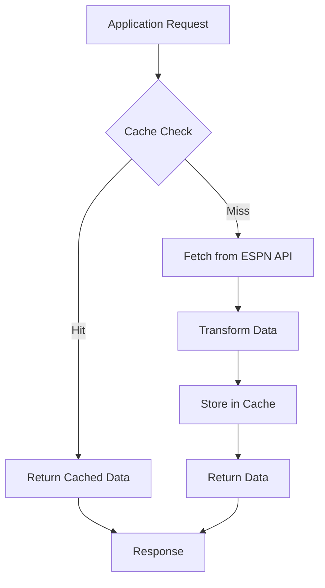
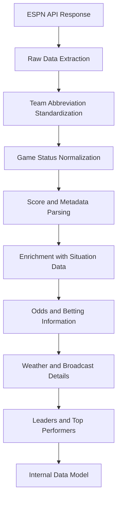
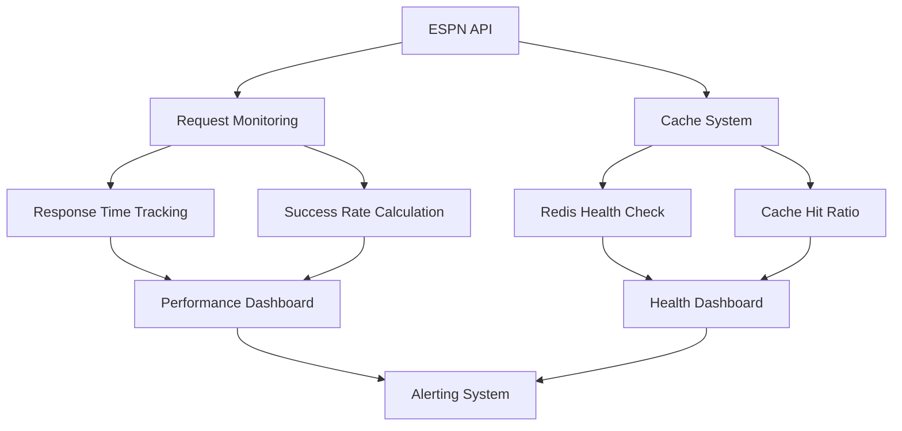

# ESPN API Integration

<cite>
**Referenced Files in This Document**   
- [espn_api_client.py](file://src/api/espn_api_client.py)
- [cache_manager.py](file://src/cache/cache_manager.py)
- [espnDataTransformer.js](file://src/utils/espnDataTransformer.js)
- [real_data_endpoints.py](file://src/api/real_data_endpoints.py)
- [live_data_manager.py](file://src/api/live_data_manager.py)
- [key_rotation.py](file://config/key_rotation.py)
- [health_monitor.py](file://src/cache/health_monitor.py)
</cite>

## Table of Contents
1. [Introduction](#introduction)
2. [ESPN API Client Implementation](#espn-api-client-implementation)
3. [Caching Mechanisms](#caching-mechanisms)
4. [Data Transformation Pipeline](#data-transformation-pipeline)
5. [Error Handling and Resilience](#error-handling-and-resilience)
6. [Live Game Updates Integration](#live-game-updates-integration)
7. [Authentication and Key Management](#authentication-and-key-management)
8. [Monitoring and Health Checks](#monitoring-and-health-checks)
9. [Fallback Strategies](#fallback-strategies)

## Introduction
The ESPN API integration serves as a critical fallback data source for the NFL Predictor API, providing real-time game scores, play-by-play data, and game metadata when primary paid APIs are unavailable. This integration ensures continuous data flow for the prediction engine, maintaining system reliability during high-traffic periods or when premium API services experience outages. The implementation follows a layered architecture with intelligent caching, robust error handling, and seamless data transformation to normalize ESPN's response format into the internal data model used by the prediction system.

## ESPN API Client Implementation

The ESPN API client implementation provides a structured interface for fetching NFL game data from ESPN's public API endpoints. The client is designed as a fallback source within a multi-tiered data acquisition strategy, where paid APIs like SportsData.io and The Odds API serve as primary sources.

The `ESPNAPIClient` class handles various types of requests including fetching games by week, team schedules, live scores, and standings. Each method follows a consistent pattern of request construction, response validation, and data extraction. The client uses the `APIClientManager` to handle HTTP requests with built-in caching capabilities, reducing redundant API calls and improving performance.

Key endpoints include:
- Scoreboard endpoint for weekly games and live scores
- Team-specific schedule endpoints
- Standings endpoint for league information

The client implements comprehensive data parsing logic to extract game information such as team abbreviations, scores, game status, and metadata. It includes standardization functions to convert ESPN's team abbreviations to the internal format used by the prediction system, ensuring consistency across different data sources.

**Section sources**
- [espn_api_client.py](file://src/api/espn_api_client.py#L1-L480)

## Caching Mechanisms

The caching system implements a multi-layered approach to optimize API usage and improve response times for the ESPN integration. The cache manager provides Redis-based caching with in-memory fallback, ensuring data availability even when the Redis service is temporarily unavailable.

Cache entries include metadata such as timestamp, TTL (time-to-live), and source information, allowing for intelligent cache invalidation and freshness checks. The default TTL for ESPN data is set to 30 minutes, with shorter durations for live score data (2 minutes) to ensure timely updates while reducing API load.

The cache key generation system creates consistent keys based on request parameters, preventing duplicate entries and enabling efficient cache lookups. For ESPN data, keys are generated using the data type, week number, and year, ensuring proper separation of cached content.

Cache warming functionality proactively populates the cache with frequently accessed data, reducing latency during peak usage periods. The system automatically cleans up expired entries and enforces size limits to prevent memory bloat.

**Diagram sources**
- [cache_manager.py](file://src/cache/cache_manager.py#L1-L431)
- [espn_api_client.py](file://src/api/espn_api_client.py#L1-L480)

**Section sources**
- [cache_manager.py](file://src/cache/cache_manager.py#L1-L431)
- [espn_api_client.py](file://src/api/espn_api_client.py#L1-L480)

## Data Transformation Pipeline

The data transformation pipeline converts ESPN's API response format into the internal data model used by the NFL Predictor system. This process ensures consistency across different data sources and prepares the data for consumption by the prediction engine.

The transformation occurs in multiple stages, beginning with raw data extraction from ESPN's JSON response. The pipeline parses game events, competitions, and competitors to extract essential information such as team names, scores, game status, and metadata. Special attention is given to normalizing team abbreviations, which vary between data sources.

The JavaScript transformer `transformESPNGame` enriches the basic game data with additional context including situation data (down, distance, possession), odds information, weather conditions, broadcast details, and player leaders. For completed games, it calculates cover results based on the final score and point spread.

The transformation process handles various edge cases such as missing data, inconsistent formatting, and API changes. It includes validation checks to ensure data integrity and logs warnings for any parsing issues, allowing for monitoring and troubleshooting.

**Diagram sources**
- [espnDataTransformer.js](file://src/utils/espnDataTransformer.js#L1-L106)
- [espn_api_client.py](file://src/api/espn_api_client.py#L1-L480)

**Section sources**
- [espnDataTransformer.js](file://src/utils/espnDataTransformer.js#L1-L106)
- [espn_api_client.py](file://src/api/espn_api_client.py#L1-L480)

## Error Handling and Resilience

The ESPN API integration implements comprehensive error handling to ensure system resilience in the face of API limitations and network issues. The system handles various error conditions including rate limiting, timeouts, malformed responses, and service outages.

When an API request fails, the system logs detailed error information including the request parameters, response status, and error message. This facilitates troubleshooting and monitoring of integration health. The error handling strategy includes exponential backoff for retryable errors, preventing overwhelming the ESPN API with repeated failed requests.

The response validation system checks the structure of incoming data before processing, rejecting malformed responses that could cause downstream issues. For partially valid responses, the system attempts to extract usable data while logging warnings about parsing failures.

Network-related errors such as timeouts and connection failures trigger automatic fallback to cached data when available. If no cached data exists, the system may attempt alternative data sources before ultimately failing with a descriptive error message.

The integration includes circuit breaker patterns to prevent cascading failures during prolonged API outages. When an API source is detected as unhealthy, the system temporarily stops sending requests to allow for recovery.

**Section sources**
- [espn_api_client.py](file://src/api/espn_api_client.py#L1-L480)
- [live_data_manager.py](file://src/api/live_data_manager.py#L1-L619)

## Live Game Updates Integration

The live game updates integration processes real-time data from ESPN and incorporates it into the prediction engine. The system fetches live scores at regular intervals, with a shorter cache TTL (2 minutes) to ensure timely updates.

The live data manager orchestrates the integration, prioritizing data sources based on reliability and data richness. When primary paid APIs are available, they are used as the primary source; ESPN serves as a fallback when these services are unavailable or rate-limited.

Live game data is processed through the same transformation pipeline as historical data, ensuring consistency in the internal data model. The prediction engine consumes this data to update predictions in real-time, reflecting current game conditions such as score, time remaining, and possession.

The system includes mechanisms to detect and handle rapid changes in game state, such as scoring plays or turnovers, ensuring the prediction engine receives timely updates. WebSocket notifications inform client applications of significant game events, enabling real-time user experiences.

**Section sources**
- [live_data_manager.py](file://src/api/live_data_manager.py#L1-L619)
- [espn_api_client.py](file://src/api/espn_api_client.py#L1-L480)

## Authentication and Key Management

The ESPN API integration utilizes ESPN's public API endpoints, which do not require authentication or API keys. This makes ESPN a reliable fallback option when authenticated services experience key-related issues.

For the broader data integration system, key management is handled through environment variables and a dedicated key rotation system. The `key_rotation.py` module manages API key lifecycle, including rotation, validation, and fallback to backup keys when primary keys are exhausted or invalidated.

The system monitors API key usage and automatically rotates keys when approaching rate limits. It maintains multiple keys for each service provider, allowing seamless transitions between keys without service interruption.

Authentication setup involves configuring environment variables with API keys for paid services, while ESPN integration requires no additional configuration. The system validates key availability during startup and provides clear error messages when required keys are missing.

**Section sources**
- [key_rotation.py](file://config/key_rotation.py#L1-L35)
- [live_data_manager.py](file://src/api/live_data_manager.py#L1-L619)

## Monitoring and Health Checks

The integration includes comprehensive monitoring and health check capabilities to ensure reliable operation. The cache health monitor tracks Redis connectivity, memory usage, and cache hit rates, providing early warning of potential performance issues.

Health check endpoints expose the status of all data sources, including ESPN, showing whether each service is available and responsive. These endpoints are used by external monitoring systems to detect and alert on integration problems.

The system logs detailed metrics for each API request, including response time, success rate, and data source used. These metrics are aggregated to identify trends and potential issues before they impact users.

Monitoring dashboards display real-time information about API usage, cache performance, and prediction accuracy, enabling proactive maintenance and optimization.

**Diagram sources**
- [health_monitor.py](file://src/cache/health_monitor.py#L1-L89)
- [live_data_manager.py](file://src/api/live_data_manager.py#L1-L619)

**Section sources**
- [health_monitor.py](file://src/cache/health_monitor.py#L1-L89)
- [real_data_endpoints.py](file://src/api/real_data_endpoints.py#L1-L468)

## Fallback Strategies

The system implements a sophisticated fallback strategy to maintain prediction continuity when ESPN data is unavailable. The live data manager prioritizes data sources, attempting primary paid APIs first, then secondary paid services, and finally public APIs like ESPN.

When all external data sources fail, the system falls back to historical data and cached predictions. The prediction engine uses historical performance patterns and team statistics to generate estimates, maintaining functionality even during extended API outages.

The fallback strategy includes graceful degradation of features, where rich data elements like player props and advanced statistics may be temporarily unavailable while core prediction functionality remains operational.

For extended outages, the system can switch to a read-only mode, serving stale but valid predictions based on the last known data state. This ensures users continue to receive value from the service while minimizing the impact of external dependencies.

**Section sources**
- [live_data_manager.py](file://src/api/live_data_manager.py#L1-L619)
- [espn_api_client.py](file://src/api/espn_api_client.py#L1-L480)