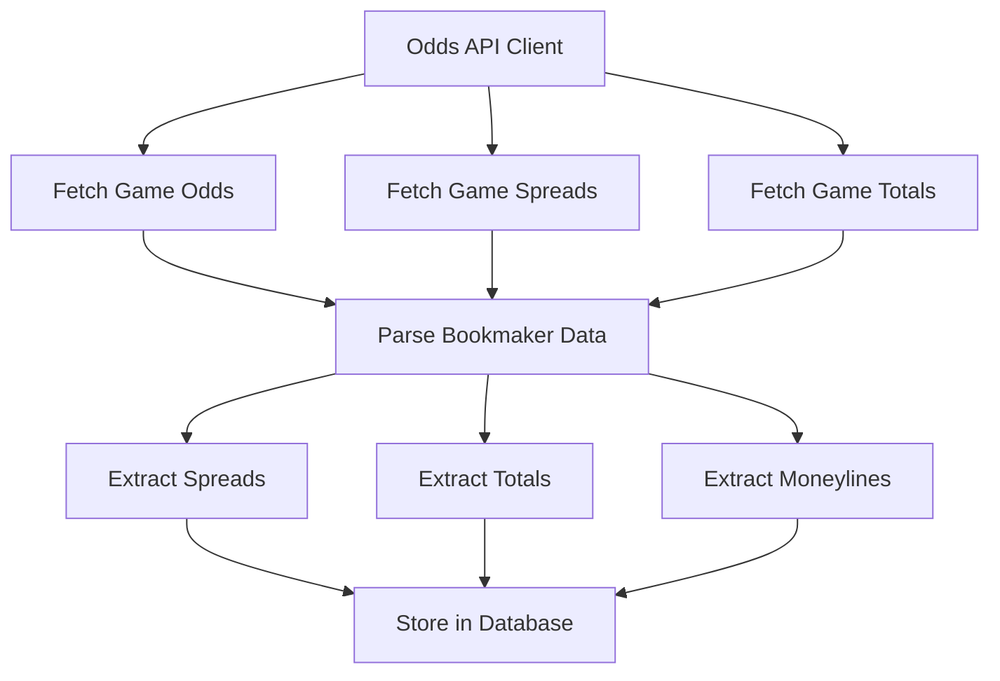
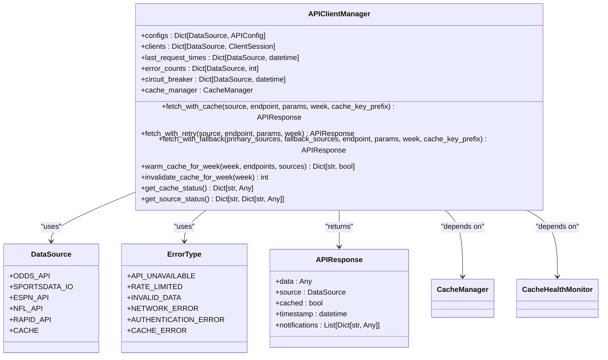
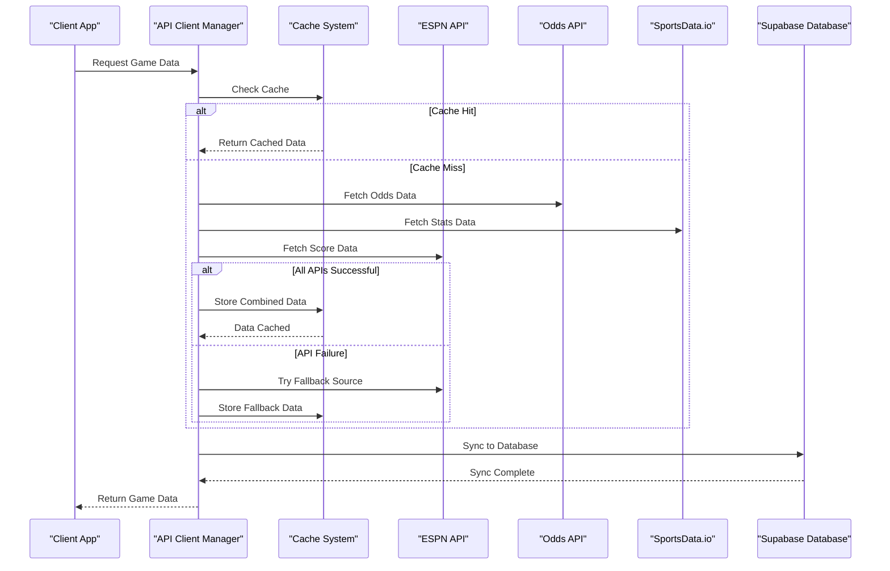

# External Integrations

<cite>
**Referenced Files in This Document**   
- [espn_api_client.py](file://src/api/espn_api_client.py)
- [odds_api_client.py](file://src/api/odds_api_client.py)
- [sportsdata_io_client.py](file://src/api/sportsdata_io_client.py)
- [client_manager.py](file://src/api/client_manager.py)
- [nfl_api_client.py](file://src/api/nfl_api_client.py)
- [rapidapi_nfl_client.py](file://src/api/rapidapi_nfl_client.py)
- [comprehensive_nfl_fetcher.py](file://src/data/comprehensive_nfl_fetcher.py)
- [espn_accurate_fetcher.py](file://src/data/espn_accurate_fetcher.py)
- [ODDS_API_INTEGRATION.md](file://src/docs/ODDS_API_INTEGRATION.md)
- [fetch_espn_games.js](file://scripts/fetch_espn_games.js)
</cite>

## Table of Contents
1. [ESPN API Integration](#espn-api-integration)
2. [Odds API Integration](#odds-api-integration)
3. [SportsData.io Integration](#sportsdataio-integration)
4. [API Client Management](#api-client-management)
5. [Data Normalization and Transformation](#data-normalization-and-transformation)
6. [Reliability and Fallback Strategies](#reliability-and-fallback-strategies)
7. [Data Storage and Pipeline Integration](#data-storage-and-pipeline-integration)

## ESPN API Integration

The ESPN API client serves as a primary source for real-time NFL game data, scores, and play-by-play information. The `ESPNAPIClient` class in `espn_api_client.py` provides comprehensive functionality for fetching game data, team schedules, live scores, and standings. The client uses ESPN's public API endpoints to retrieve accurate game information, with special attention to data validation and error handling.

Key features of the ESPN API integration include:
- **Game Data Fetching**: Retrieves game information for specific weeks using the scoreboard endpoint
- **Team Schedule Access**: Provides team-specific schedule information
- **Live Score Updates**: Fetches current live scores with short cache TTL for real-time updates
- **Standings Information**: Retrieves current NFL standings for additional prediction context

The client implements robust data validation through the `_validate_response` method and handles ESPN's specific data structure, including team abbreviation standardization and game status parsing. The integration uses caching with a 2-minute TTL for live data to balance freshness and performance.

**Section sources**
- [espn_api_client.py](file://src/api/espn_api_client.py#L1-L480)

## Odds API Integration

The Odds API integration leverages The Odds API to incorporate betting lines from multiple providers for comparative analysis. The `OddsAPIClient` class in `odds_api_client.py` fetches NFL game odds, spreads, totals, and moneylines from various bookmakers including DraftKings, FanDuel, BetMGM, Caesars, and PointsBet.

The integration provides several specialized endpoints:
- **Comprehensive Game Odds**: Fetches all betting markets (moneyline, spreads, totals) for specified weeks
- **Spread-Specific Data**: Optimized endpoint for retrieving only spread betting lines
- **Total-Specific Data**: Optimized endpoint for retrieving over/under totals

The client handles the transformation of full team names to standard abbreviations and extracts detailed odds information from multiple bookmakers. It also provides usage information through the `get_usage_info` method, which returns rate limit details and available endpoints.

The integration is documented in `ODDS_API_INTEGRATION.md`, which confirms the successful implementation with real API key authentication and database storage in Supabase. The service supports auto-sync functionality with 10-minute intervals and includes comprehensive quota monitoring to prevent exceeding the 500-request monthly limit.

**Diagram sources**
- [odds_api_client.py](file://src/api/odds_api_client.py#L1-L389)
- [ODDS_API_INTEGRATION.md](file://src/docs/ODDS_API_INTEGRATION.md#L1-L169)

**Section sources**
- [odds_api_client.py](file://src/api/odds_api_client.py#L1-L389)
- [ODDS_API_INTEGRATION.md](file://src/docs/ODDS_API_INTEGRATION.md#L1-L169)

## SportsData.io Integration

The SportsData.io client provides access to player prop bets, DFS salaries, and fantasy projections. The `SportsDataIOClient` class in `sportsdata_io_client.py` fetches comprehensive NFL data including player props, DFS salary information, and player statistics.

Key integration points include:
- **Player Prop Bets**: Retrieves player prop bets for passing yards, rushing yards, receiving yards, receptions, touchdowns, and fantasy points
- **DFS Salary Data**: Fetches DFS salary and projection data for fantasy player analysis
- **Player Statistics**: Retrieves player statistics for generating prop bet predictions

The client implements enum-based classification for prop types and player positions, ensuring consistent data handling. It includes specialized data extraction methods for both prop bets and fantasy player data, with confidence calculations based on line movement. The integration supports multiple data formats and provides API information through the `get_api_info` method.

**Section sources**
- [sportsdata_io_client.py](file://src/api/sportsdata_io_client.py#L1-L430)

## API Client Management

The API client management system, implemented in `client_manager.py`, provides a unified interface for handling multiple data sources with failover logic. The `APIClientManager` class manages primary and fallback API clients with comprehensive error handling, retry logic, and cache integration.

Key features of the client manager include:
- **Multiple Data Sources**: Supports Odds API, SportsData.io, ESPN API, NFL API, and RapidAPI
- **Failover Logic**: Implements primary/fallback source routing with circuit breaker pattern
- **Rate Limiting**: Handles rate limiting with configurable limits for each source
- **Retry Logic**: Implements exponential backoff retry strategy with configurable parameters
- **Cache Integration**: Uses cache-first strategy with freshness validation

The manager includes sophisticated error classification and handling, with specific error types for API unavailability, rate limiting, invalid data, network errors, and authentication issues. It also implements circuit breaker functionality that activates after three consecutive failures, providing a 5-minute cooldown period.

The client manager integrates with the cache system through `CacheManager` and `CacheHealthMonitor`, allowing for health-based cache usage decisions. It provides comprehensive status information through the `get_source_status` method and supports cache warming for improved performance.

**Diagram sources**
- [client_manager.py](file://src/api/client_manager.py#L1-L625)

**Section sources**
- [client_manager.py](file://src/api/client_manager.py#L1-L625)

## Data Normalization and Transformation

The system implements comprehensive data normalization across different providers through specialized fetchers and transformers. The `ComprehensiveNFLFetcher` in `comprehensive_nfl_fetcher.py` integrates multiple data sources, with a critical focus on data accuracy.

A key innovation is the hybrid approach to game scores:
- **ESPN for Accurate Scores**: Uses ESPN's official API as the primary source for final game scores
- **SportsData.io for Stats and Odds**: Uses SportsData.io for statistics, odds, and other supplementary data

This approach addresses known accuracy issues with SportsData.io's game scores while leveraging its comprehensive statistical data. The `ESPNAccurateFetcher` provides both API-based and manual verified score retrieval, with the manual method serving as a fallback when the API is unavailable.

The data transformation process includes:
- **Team Abbreviation Standardization**: Maps various team name formats to standard abbreviations
- **Data Structure Conversion**: Converts ESPN's format to SportsData.io format for compatibility
- **Comprehensive Aggregation**: Combines data from multiple sources into a unified intelligence package

The `get_comprehensive_game_data` method orchestrates the aggregation of all NFL data, including games, team statistics, injuries, betting odds, news, advanced metrics, and player data, providing a complete intelligence package for predictions.

**Section sources**
- [comprehensive_nfl_fetcher.py](file://src/data/comprehensive_nfl_fetcher.py#L1-L419)
- [espn_accurate_fetcher.py](file://src/data/espn_accurate_fetcher.py#L1-L94)

## Reliability and Fallback Strategies

The system implements robust reliability measures and fallback strategies to ensure continuous operation during API outages. The multi-layered approach combines client-side failover, caching strategies, and data consistency mechanisms.

Key reliability features include:
- **Primary/Fallback Source Routing**: Uses `fetch_with_fallback` to attempt primary sources first, then fallback sources
- **Circuit Breaker Pattern**: Prevents repeated calls to failing services with 5-minute cooldown periods
- **Stale Data Fallback**: Serves stale cache data when APIs are unavailable, with appropriate warnings
- **Comprehensive Health Monitoring**: Tracks cache health metrics including hit rate, miss rate, and error rate

The fallback strategy prioritizes data sources based on reliability and accuracy:
1. **Primary**: Odds API and SportsData.io for comprehensive data
2. **Fallback**: ESPN API and NFL API for basic game information
3. **Last Resort**: Cached data with appropriate user notifications

The system also implements cache warming through the `warm_cache_for_week` method, pre-fetching data for improved response times. Cache invalidation is handled through the `invalidate_cache_for_week` method, allowing for fresh data when needed.

**Section sources**
- [client_manager.py](file://src/api/client_manager.py#L1-L625)
- [comprehensive_nfl_fetcher.py](file://src/data/comprehensive_nfl_fetcher.py#L1-L419)

## Data Storage and Pipeline Integration

External data is seamlessly integrated into the prediction pipeline and stored in the database through a well-defined process. The system uses Supabase as the primary database, with specific schema modifications to accommodate odds data.

Key integration points include:
- **Database Schema**: Migration `003_add_odds_data_to_games.sql` adds odds data to games table
- **Odds History Table**: Stores individual odds records per sportsbook and bet type
- **Consensus Odds**: Calculates median values across bookmakers for unified predictions
- **Team Name Mapping**: Maps full team names to standard abbreviations for consistency

The data pipeline is orchestrated through various scripts, including `fetch_espn_games.js` which synchronizes ESPN game data with Supabase. The script handles both insertion of new games and updating of existing games, maintaining data consistency across sources.

The integration supports auto-sync functionality with configurable intervals, ensuring data freshness while respecting API rate limits. Quota monitoring is implemented to track API usage and prevent exceeding monthly limits.

**Diagram sources**
- [fetch_espn_games.js](file://scripts/fetch_espn_games.js#L1-L92)
- [client_manager.py](file://src/api/client_manager.py#L1-L625)

**Section sources**
- [fetch_espn_games.js](file://scripts/fetch_espn_games.js#L1-L92)
- [client_manager.py](file://src/api/client_manager.py#L1-L625)
- [ODDS_API_INTEGRATION.md](file://src/docs/ODDS_API_INTEGRATION.md#L1-L169)