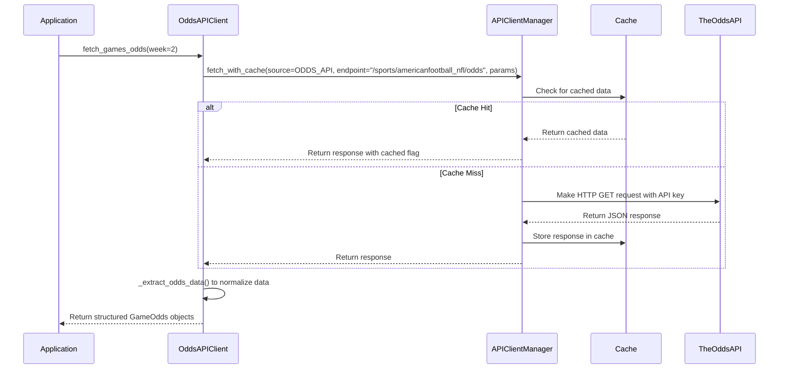
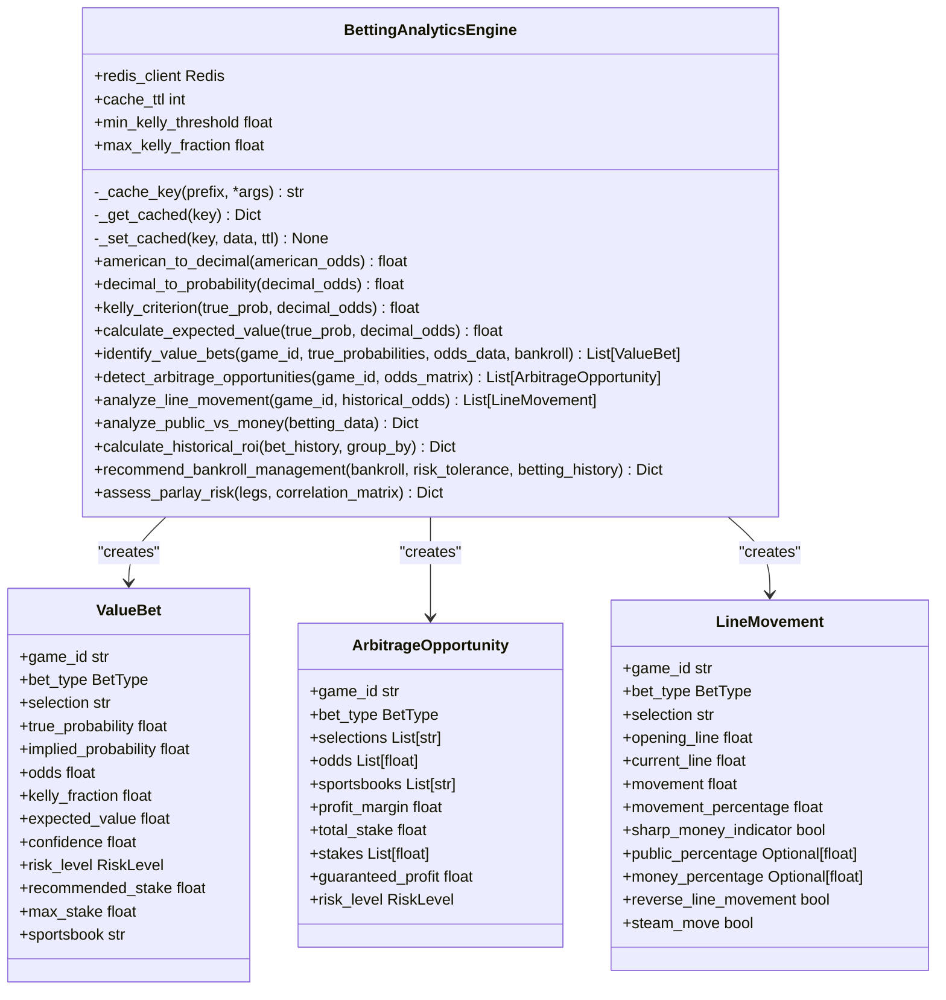

# Odds API Integration

<cite>
**Referenced Files in This Document**   
- [odds_api_client.py](file://src/api/odds_api_client.py)
- [client_manager.py](file://src/api/client_manager.py)
- [003_add_odds_data_to_games.sql](file://src/database/migrations/003_add_odds_data_to_games.sql)
- [betting_engine.py](file://src/analytics/betting_engine.py)
- [ODDS_API_INTEGRATION.md](file://src/docs/ODDS_API_INTEGRATION.md)
</cite>

## Table of Contents
1. [Introduction](#introduction)
2. [Odds Data Fetching and Normalization](#odds-data-fetching-and-normalization)
3. [Odds Comparison Engine and Value Bet Identification](#odds-comparison-engine-and-value-bet-identification)
4. [Configuration and API Management](#configuration-and-api-management)
5. [Integration with AI Expert Council](#integration-with-ai-expert-council)
6. [Data Consistency and Reliability](#data-consistency-and-reliability)
7. [Odds History and Trend Analysis](#odds-history-and-trend-analysis)
8. [Conclusion](#conclusion)

## Introduction

The Odds API integration is a critical component of the NFL prediction platform, enabling the aggregation and analysis of betting lines from multiple sportsbooks. This system provides the foundation for identifying value bets, calculating expected returns, and informing the AI expert council's predictions. The integration leverages The Odds API to fetch real-time NFL game odds, which are then normalized, stored, and analyzed to support data-driven betting recommendations. This document details the implementation of this integration, covering data fetching, normalization, comparison algorithms, configuration options, and integration with the broader prediction system.

## Odds Data Fetching and Normalization

The system fetches odds data from multiple sportsbooks through The Odds API, which provides comprehensive coverage of moneyline, point spread, and over/under betting markets. The `OddsAPIClient` class in `odds_api_client.py` serves as the primary interface for retrieving this data, handling authentication, request construction, and response processing. The client is configured to target NFL games (`americanfootball_nfl`) and retrieve data from US-based bookmakers (`us` regions) for the three primary markets: moneyline (`h2h`), spreads, and totals.

The data fetching process is optimized for specific NFL weeks. The `_get_week_date_range` method calculates the start and end timestamps for a given week, ensuring that only relevant games are retrieved. This temporal filtering is crucial for performance and relevance. The API request is made through the `APIClientManager`, which provides a caching layer to minimize redundant API calls and reduce the consumption of the limited monthly quota (500 requests on the free tier). The `fetch_with_cache` method first checks the Redis cache for existing data before making an external API call, significantly improving response times and efficiency.

Upon receiving the raw API response, the system normalizes the data into a unified format. The `_extract_odds_data` method processes the JSON response, which contains odds from multiple bookmakers (including DraftKings, FanDuel, BetMGM, Caesars, and PointsBet), and structures it into a consistent `GameOdds` object. A key aspect of normalization is the conversion of full team names (e.g., "Buffalo Bills") to standard three-letter abbreviations (e.g., "BUF") using an internal mapping. This ensures consistency with the rest of the application's data model. The extracted data includes detailed information for each bookmaker, such as the home and away spread points and prices, over/under totals and prices, and moneyline odds, all stored in a structured dictionary format for easy access and analysis.

**Diagram sources**
- [odds_api_client.py](file://src/api/odds_api_client.py#L16-L388)
- [client_manager.py](file://src/api/client_manager.py#L300-L400)

**Section sources**
- [odds_api_client.py](file://src/api/odds_api_client.py#L28-L388)
- [client_manager.py](file://src/api/client_manager.py#L300-L400)

## Odds Comparison Engine and Value Bet Identification

The core of the betting analytics system is the `BettingAnalyticsEngine` in `betting_engine.py`, which implements sophisticated algorithms to identify value bets and calculate expected returns. This engine uses the Kelly Criterion, a mathematical formula for optimal bet sizing, to determine the ideal stake for a given opportunity. The Kelly fraction is calculated by comparing the user's "true probability" of an outcome (which can come from the AI expert council's predictions) with the "implied probability" derived from the sportsbook's odds. A value bet is identified when the true probability exceeds the implied probability, indicating a positive expected value.

The engine provides several key analytical functions. The `identify_value_bets` method takes a game ID, a dictionary of true probabilities for each team, and a list of `OddsData` objects from various sportsbooks. It calculates the Kelly fraction and expected value for each available bet, returning a sorted list of `ValueBet` objects. The risk level is automatically assessed based on the Kelly fraction, with higher fractions indicating greater risk. The engine also includes features for detecting arbitrage opportunities, where placing bets on all possible outcomes across different bookmakers guarantees a profit, and for analyzing line movement to identify "sharp money" (bets placed by professional gamblers).

The system is designed to be integrated into the application's workflow. For example, the `recommend_bankroll_management` method provides personalized bankroll management advice based on the user's risk tolerance and historical betting performance. This holistic approach ensures that users are not only presented with betting opportunities but also with the context and tools needed to manage their risk effectively. The entire analytics engine is backed by Redis for caching, which stores the results of computationally expensive analyses to improve performance and reduce redundant calculations.

**Diagram sources**
- [betting_engine.py](file://src/analytics/betting_engine.py#L105-L1046)

**Section sources**
- [betting_engine.py](file://src/analytics/betting_engine.py#L105-L1046)

## Configuration and API Management

The system's configuration is managed through environment variables and a centralized `APIClientManager`. The primary configuration for The Odds API is loaded from the `ODDS_API_KEY` environment variable, which is securely stored and accessed by the `client_manager.py` module. This approach ensures that sensitive API keys are not hardcoded into the source code. The `APIClientManager` is responsible for initializing HTTP client sessions for all data sources, including The Odds API as the primary source and others like SportsData.io and ESPN API as fallbacks.

The configuration includes critical parameters such as the API's base URL, rate limits, request timeouts, and retry logic. The Odds API is configured with a monthly rate limit of 500 requests, which is strictly monitored to prevent overages. The manager implements a robust error handling and retry strategy. If a request fails due to a network error or rate limiting, the system will automatically retry with exponential backoff. A circuit breaker pattern is also employed; after three consecutive failures, the system will temporarily stop making requests to that source for five minutes to prevent cascading failures.

The `APIClientManager` also provides a `fetch_with_fallback` method, which attempts to retrieve data from a list of primary sources and then falls back to a secondary list if the primary sources fail. This ensures high availability of data even if The Odds API experiences an outage. The health of all data sources can be monitored through the `get_source_status` method, which provides real-time information on error counts, circuit breaker status, and rate limiting. This comprehensive management system ensures the reliability and resilience of the odds data pipeline.

**Section sources**
- [client