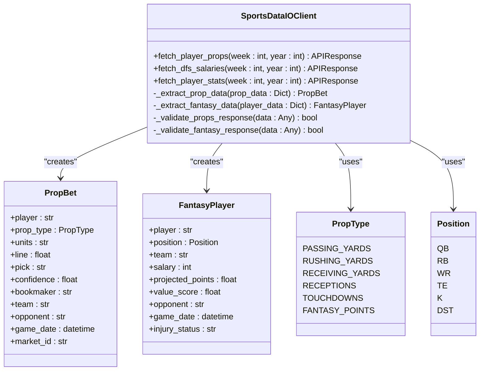
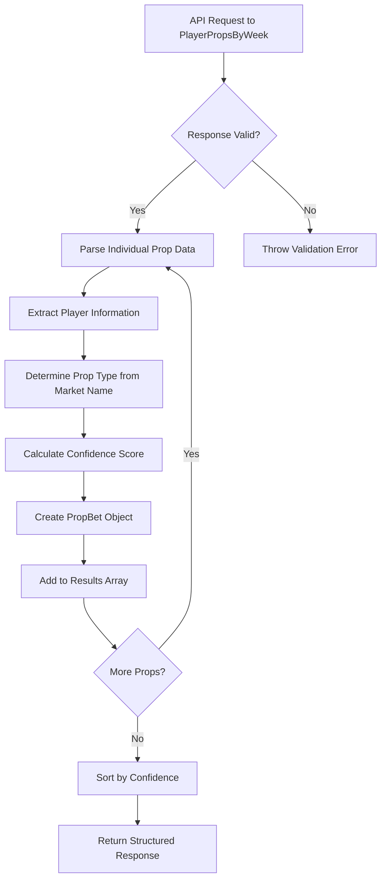
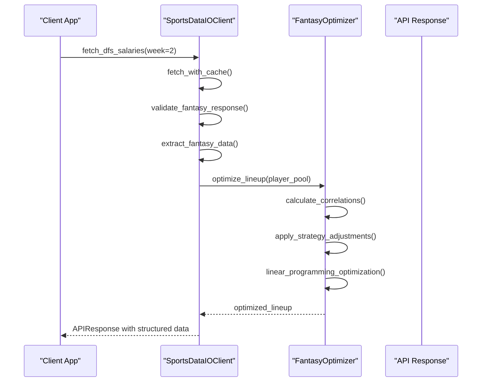

# SportsData.io Integration

<cite>
**Referenced Files in This Document**   
- [sportsdata_io_client.py](file://src/api/sportsdata_io_client.py)
- [client_manager.py](file://src/api/client_manager.py)
- [cache_manager.py](file://src/cache/cache_manager.py)
- [fantasy_optimizer.py](file://src/ml/fantasy_optimizer.py)
- [player_props_engine.py](file://src/ml/player_props_engine.py)
- [prediction_api.py](file://src/ml/prediction_api.py)
</cite>

## Table of Contents
1. [Introduction](#introduction)
2. [SportsDataIOClient Overview](#sportsdataioclient-overview)
3. [Player Prop Data Processing](#player-prop-data-processing)
4. [Fantasy Data Extraction and Optimization](#fantasy-data-extraction-and-optimization)
5. [Data Validation and Quality Assurance](#data-validation-and-quality-assurance)
6. [Rate Limit Management and Error Recovery](#rate-limit-management-and-error-recovery)
7. [Caching Strategy](#caching-strategy)
8. [Integration with Prediction Models](#integration-with-prediction-models)
9. [Conclusion](#conclusion)

## Introduction
The SportsData.io integration provides a comprehensive solution for accessing player prop bets, DFS salaries, and fantasy projections for NFL games. This documentation details the architecture and implementation of the SportsDataIOClient, which serves as the primary interface for retrieving and processing sports data. The system is designed to support fantasy optimization, expert predictions, and machine learning model training through robust data extraction, validation, and caching mechanisms.

**Section sources**
- [sportsdata_io_client.py](file://src/api/sportsdata_io_client.py#L1-L50)

## SportsDataIOClient Overview
The SportsDataIOClient class serves as the primary interface for interacting with the SportsData.io API. It provides methods for fetching player props, DFS salaries, and player statistics for NFL games. The client is initialized with an APIClientManager that handles HTTP requests, rate limiting, and error recovery.

The client supports multiple data types through dedicated methods:
- `fetch_player_props()`: Retrieves player prop bets including passing yards, rushing yards, receptions, and touchdowns
- `fetch_dfs_salaries()`: Obtains DFS salary and projection data from DraftKings and FanDuel
- `fetch_player_stats()`: Fetches historical player statistics used for prediction modeling

The client uses a standardized API response format and includes comprehensive error handling for network issues, rate limiting, and data validation failures.

**Diagram sources **
- [sportsdata_io_client.py](file://src/api/sportsdata_io_client.py#L66-L429)

**Section sources**
- [sportsdata_io_client.py](file://src/api/sportsdata_io_client.py#L66-L429)

## Player Prop Data Processing
The SportsDataIOClient extracts player prop bet data from the SportsData.io API and transforms it into structured PropBet objects. The data extraction process begins with a call to the PlayerPropsByWeek endpoint, which returns raw prop data for all players in a given week.

The `_extract_prop_data()` method parses the API response and creates PropBet objects with the following fields:
- Player name and team information
- Prop type (passing yards, rushing yards, receptions, touchdowns)
- Betting line and over/under pick
- Confidence score based on line movement analysis
- Bookmaker information and game date

The system determines the prop type by analyzing the market name in the API response. For example, "Passing Yards" markets are identified by checking for "passing" and "yard" in the market name. The confidence score is calculated using a base confidence of 0.55 with an additional factor based on the absolute value of the betting line (higher lines receive higher confidence).

**Diagram sources **
- [sportsdata_io_client.py](file://src/api/sportsdata_io_client.py#L166-L205)

**Section sources**
- [sportsdata_io_client.py](file://src/api/sportsdata_io_client.py#L166-L205)

## Fantasy Data Extraction and Optimization
The SportsDataIOClient retrieves DFS salary and projection data through the DfsSlatesByWeek endpoint. This data is processed by the `_extract_fantasy_data()` method, which creates structured FantasyPlayer objects containing salary information, projected points, and value metrics.

The fantasy optimization engine uses this data to construct optimal DFS lineups. The FantasyOptimizer class implements advanced algorithms for lineup construction, including:
- Linear programming optimization for maximum projected points within salary constraints
- Greedy optimization as a fallback when advanced libraries are unavailable
- Multiple lineup generation with different strategies (cash, GPP, contrarian)

The optimizer considers various factors when constructing lineups:
- Salary cap constraints ($50,000 for DraftKings)
- Roster requirements (1 QB, 2-3 RB, 3-4 WR, 1-2 TE, 1 FLEX, 1 DST)
- Player correlations and stacking opportunities
- Ownership percentages for leverage plays
- Weather and game environment factors

**Diagram sources **
- [sportsdata_io_client.py](file://src/api/sportsdata_io_client.py#L248-L290)
- [fantasy_optimizer.py](file://src/ml/fantasy_optimizer.py#L23-L600)

**Section sources**
- [sportsdata_io_client.py](file://src