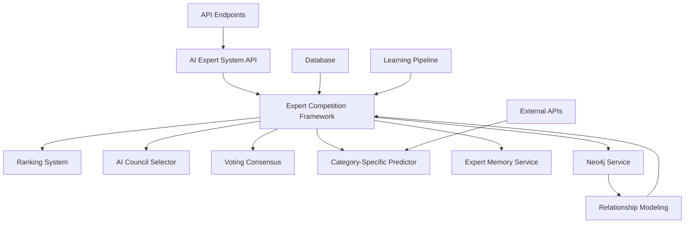
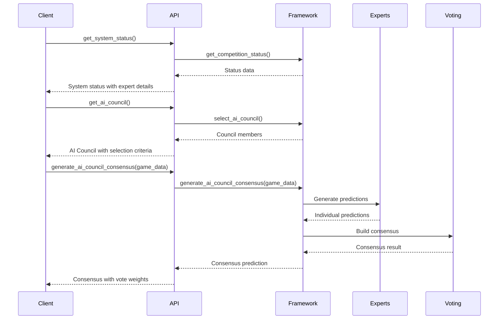
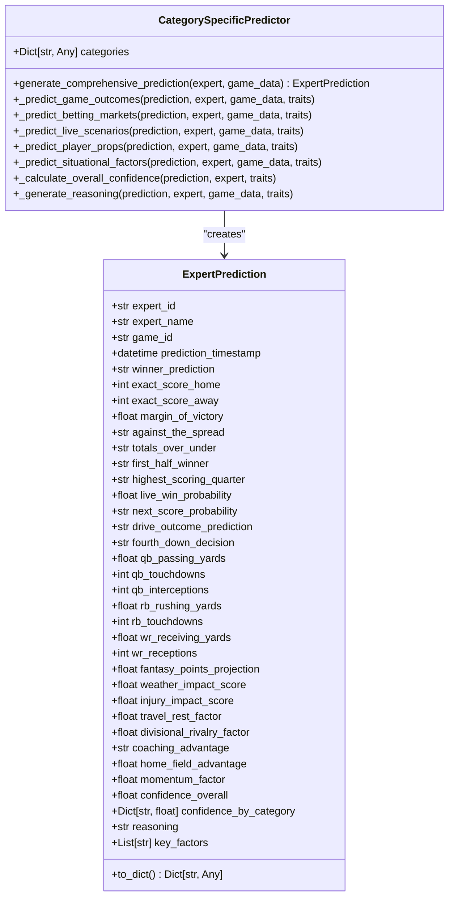
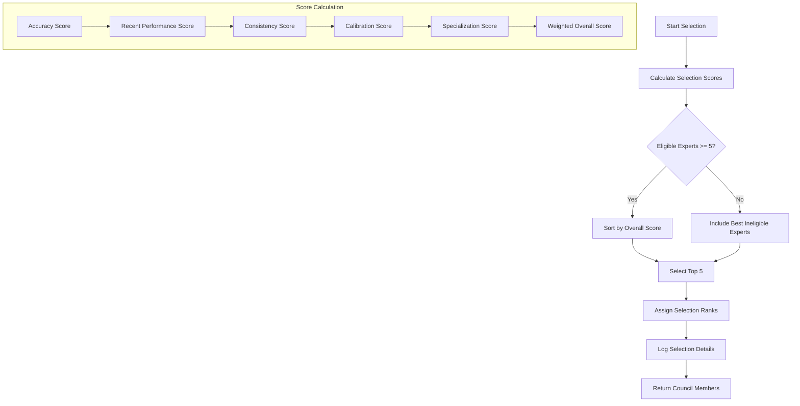
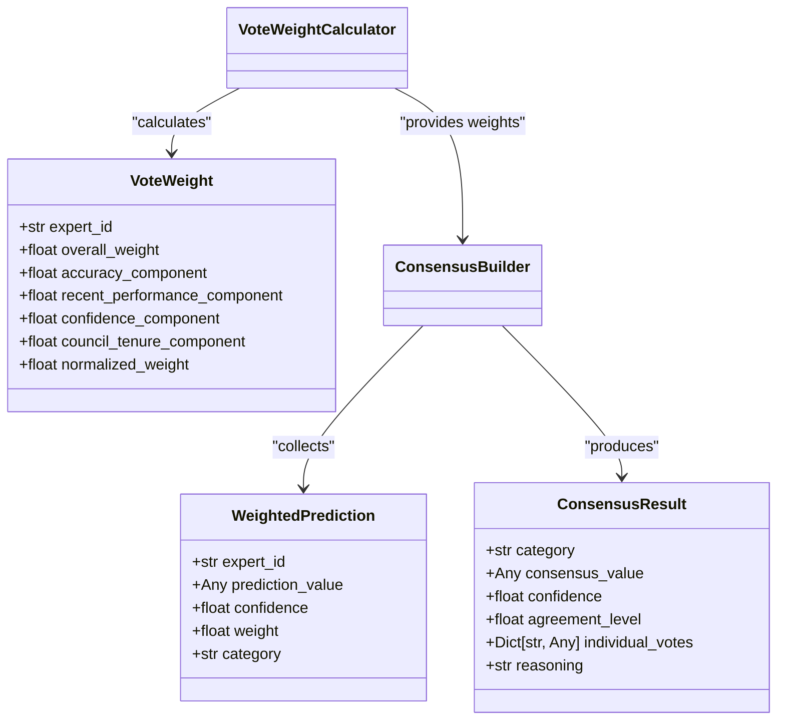

# LLM Expert Enhancement

<cite>
**Referenced Files in This Document**   
- [ai_expert_system_api.py](file://ai_expert_system_api.py)
- [src/ml/expert_competition/competition_framework.py](file://src/ml/expert_competition/competition_framework.py)
- [src/ml/prediction_engine/category_specific_algorithms.py](file://src/ml/prediction_engine/category_specific_algorithms.py)
- [src/ml/prediction_engine/comprehensive_prediction_categories.py](file://src/ml/prediction_engine/comprehensive_prediction_categories.py)
- [src/ml/expert_competition/ranking_system.py](file://src/ml/expert_competition/ranking_system.py)
- [src/ml/expert_competition/council_selector.py](file://src/ml/expert_competition/council_selector.py)
- [src/ml/expert_competition/voting_consensus.py](file://src/ml/expert_competition/voting_consensus.py)
- [src/api/learning_pipeline.py](file://src/api/learning_pipeline.py)
- [src/ml/autonomous_expert_system.py](file://src/ml/autonomous_expert_system.py)
- [src/ml/memory_enabled_expert_service.py](file://src/ml/memory_enabled_expert_service.py)
- [src/services/neo4j_service.py](file://src/services/neo4j_service.py) - *Updated in recent commit*
- [schemas/expert_predictions_v1.schema.json](file://schemas/expert_predictions_v1.schema.json) - *Updated in recent commit*
- [config/category_registry.json](file://config/category_registry.json) - *Updated in recent commit*
</cite>

## Table of Contents
1. [Introduction](#introduction)
2. [System Architecture](#system-architecture)
3. [Core Components](#core-components)
4. [API Interfaces](#api-interfaces)
5. [Prediction Engine](#prediction-engine)
6. [Expert Competition Framework](#expert-competition-framework)
7. [AI Council Selection](#ai-council-selection)
8. [Consensus Building](#consensus-building)
9. [Learning and Adaptation](#learning-and-adaptation)
10. [Integration Patterns](#integration-patterns)
11. [Practical Examples](#practical-examples)
12. [Troubleshooting Guide](#troubleshooting-guide)

## Introduction
The Enhanced LLM Expert system is a sophisticated AI framework designed for NFL game prediction. It features 15 personality-driven experts that compete and collaborate to generate accurate predictions. The system implements a dynamic AI Council selection process, weighted consensus building, and continuous learning mechanisms. Experts are ranked based on multiple performance metrics including accuracy, consistency, and confidence calibration. The framework supports comprehensive prediction across 27 categories, from game outcomes to player performance props, with detailed reasoning and confidence scoring. Recent updates have introduced hybrid Agentuity orchestration for the Expert Council Betting System, expanding expert personalities and betting approaches.

## System Architecture
The Enhanced LLM Expert system follows a modular architecture with distinct components for expert management, prediction generation, and consensus building. The core framework coordinates between specialized subsystems including ranking, council selection, and voting consensus. Experts operate as independent entities with unique personality traits that influence their prediction algorithms. The system integrates with a database for persistent state storage and uses an API layer for external access. A learning pipeline enables continuous improvement through performance analysis and adaptation. The recent implementation of hybrid Agentuity orchestration enhances the betting system by incorporating Neo4j for relationship modeling and improved decision pathways.

**Diagram sources**
- [ai_expert_system_api.py](file://ai_expert_system_api.py)
- [src/ml/expert_competition/competition_framework.py](file://src/ml/expert_competition/competition_framework.py)
- [src/services/neo4j_service.py](file://src/services/neo4j_service.py) - *Updated in recent commit*

## Core Components
The system comprises several core components that work together to deliver enhanced predictions. The Expert Competition Framework serves as the central coordinator, managing the lifecycle of 15 personality-driven experts. Each expert generates predictions based on their unique algorithmic personality, which is influenced by traits like risk tolerance, analytics trust, and contrarian tendency. The Category-Specific Predictor implements tailored algorithms for different prediction categories, from game outcomes to player props. The system maintains expert state in a database, tracking performance metrics, rankings, and historical predictions. The recent update introduces enhanced category registry configuration and schema validation through the expert_predictions_v1.schema.json file.

**Section sources**
- [ai_expert_system_api.py](file://ai_expert_system_api.py#L21-L364)
- [src/ml/expert_competition/competition_framework.py](file://src/ml/expert_competition/competition_framework.py#L57-L1126)
- [config/category_registry.json](file://config/category_registry.json) - *Updated in recent commit*
- [schemas/expert_predictions_v1.schema.json](file://schemas/expert_predictions_v1.schema.json) - *Updated in recent commit*

## API Interfaces
The system exposes a comprehensive API for interacting with the expert system. The AIExpertSystemAPI class provides methods for retrieving system status, expert rankings, AI Council composition, and generating predictions. Key endpoints include get_system_status, get_expert_rankings, get_ai_council, generate_expert_predictions, and generate_ai_council_consensus. These methods return structured JSON responses with detailed metrics, confidence scores, and reasoning. The API supports both individual expert predictions and consensus predictions from the AI Council, enabling flexible integration with front-end applications and external systems. The response schema is now validated against expert_predictions_v1.schema.json to ensure consistency.

**Diagram sources**
- [ai_expert_system_api.py](file://ai_expert_system_api.py#L21-L364)
- [src/ml/expert_competition/competition_framework.py](file://src/ml/expert_competition/competition_framework.py#L57-L1126)

## Prediction Engine
The prediction engine generates comprehensive forecasts across 27 categories using personality-driven algorithms. The CategorySpecificPredictor class implements specialized methods for different prediction types, including game outcomes, betting markets, live scenarios, player props, and situational factors. Each expert's personality traits influence their prediction approach, with parameters like risk tolerance, analytics trust, and contrarian tendency affecting the algorithms. Predictions include confidence scores at both overall and category-specific levels, along with reasoning that explains the key factors behind each forecast. The comprehensive_prediction_categories.py module defines all prediction categories with validation rules and scoring weights.

**Diagram sources**
- [src/ml/prediction_engine/comprehensive_prediction_categories.py](file://src/ml/prediction_engine/comprehensive_prediction_categories.py#L68-L166)
- [src/ml/prediction_engine/category_specific_algorithms.py](file://src/ml/prediction_engine/category_specific_algorithms.py#L11-L815)

## Expert Competition Framework
The Expert Competition Framework manages the competition among 15 personality-driven experts, coordinating their activities and maintaining system state. It handles expert initialization, ranking calculation, AI Council selection, and competition rounds. The framework integrates with a database to persist expert state, including performance metrics, rankings, and prediction history. It implements a comprehensive status system that provides insights into expert performance, council composition, and system health. The framework supports competition rounds that simulate weekly NFL games, evaluating expert performance and updating rankings accordingly. The recent update enhances the framework with hybrid Agentuity orchestration for more sophisticated betting strategy evaluation.

**Section sources**
- [src/ml/expert_competition/competition_framework.py](file://src/ml/expert_competition/competition_framework.py#L57-L1126)
- [ai_expert_system_api.py](file://ai_expert_system_api.py#L21-L364)
- [src/services/neo4j_service.py](file://src/services/neo4j_service.py) - *Updated in recent commit*

## AI Council Selection
The AI Council selection process identifies the top 5 performing experts to serve on the council each week. The AICouncilSelector class implements a multi-criteria evaluation system that considers accuracy, recent performance, consistency, confidence calibration, and specialization strength. Experts must meet minimum prediction volume requirements to be eligible. The selection algorithm calculates a weighted score for each expert based on these criteria, with configurable weights that can be adjusted to emphasize different performance aspects. The system logs selection decisions and can provide detailed breakdowns of the scoring process.

**Diagram sources**
- [src/ml/expert_competition/council_selector.py](file://src/ml/expert_competition/council_selector.py#L49-L436)
- [src/ml/expert_competition/competition_framework.py](file://src/ml/expert_competition/competition_framework.py#L57-L1126)

## Consensus Building
The consensus building system combines predictions from AI Council members using weighted voting. The VoteWeightCalculator determines each expert's voting weight based on accuracy, recent performance, confidence, and council tenure. The ConsensusBuilder then aggregates predictions using appropriate methods for different data types: weighted averages for numeric predictions, weighted voting for categorical predictions, and confidence-based selection for other types. The system calculates consensus confidence and agreement levels, providing transparency into the decision-making process. Consensus results include detailed breakdowns of individual predictions and vote weights.

**Diagram sources**
- [src/ml/expert_competition/voting_consensus.py](file://src/ml/expert_competition/voting_consensus.py#L25-L389)
- [src/ml/expert_competition/competition_framework.py](file://src/ml/expert_competition/competition_framework.py#L57-L1126)

## Learning and Adaptation
The system incorporates continuous learning through performance analysis and adaptation mechanisms. The learning pipeline evaluates expert predictions against actual game outcomes, updating performance metrics and rankings accordingly. Experts adapt their prediction algorithms based on feedback, with personality traits influencing the rate and nature of adaptation. The memory-enabled expert service maintains historical prediction data and outcomes, enabling long-term learning and pattern recognition. The system also implements belief revision to update expert confidence levels and prediction approaches based on recent performance.

**Section sources**
- [src/api/learning_pipeline.py](file://src/api/learning_pipeline.py#L18-L442)
- [src/ml/autonomous_expert_system.py](file://src/ml/autonomous_expert_system.py#L63-L987)
- [src/ml/memory_enabled_expert_service.py](file://src/ml/memory_enabled_expert_service.py#L41-L725)

## Integration Patterns
The Enhanced LLM Expert system supports various integration patterns for different use cases. The API provides REST endpoints for synchronous prediction retrieval and WebSocket support for real-time updates. The system can be integrated with betting platforms through the expert predictions schema, which standardizes data exchange. For advanced analytics, the Neo4j service enables relationship modeling between experts, predictions, and outcomes. The category registry allows for dynamic configuration of prediction categories and validation rules, supporting customization for different sports or markets.

**Section sources**
- [src/services/neo4j_service.py](file://src/services/neo4j_service.py#L33-L678)
- [schemas/expert_predictions_v1.schema.json](file://schemas/expert_predictions_v1.schema.json)
- [config/category_registry.json](file://config/category_registry.json)

## Practical Examples
The system provides several practical examples demonstrating its capabilities. The betting_system_demo.py script illustrates how to generate predictions for betting markets and evaluate potential returns. The memory_enabled_prediction_with_hooks.py example shows how to incorporate memory and learning into the prediction process. The belief_revision_demo.py demonstrates how experts update their confidence and prediction approaches based on feedback. These examples serve as templates for custom integrations and extensions of the core system.

**Section sources**
- [examples/betting_system_demo.py](file://examples/betting_system_demo.py)
- [examples/memory_enabled_prediction_with_hooks.py](file://examples/memory_enabled_prediction_with_hooks.py)
- [examples/belief_revision_demo.py](file://examples/belief_revision_demo.py)

## Troubleshooting Guide
Common issues and their solutions include:
- **Prediction delays**: Check database connection and ensure the learning pipeline is running
- **Inconsistent predictions**: Verify expert configuration and personality trait settings
- **API errors**: Validate input data against the expert_predictions_v1.schema.json schema
- **Performance degradation**: Monitor expert rankings and consider retraining underperforming experts
- **Memory issues**: Check the memory store configuration and清理 old entries if necessary

For persistent issues, consult the system logs and verification reports in the data directory.

**Section sources**
- [scripts/validate_expert_predictions.py](file://scripts/validate_expert_predictions.py)
- [scripts/validate_system.js](file://scripts/validate_system.js)
- [data/verification_report.json](file://data/verification_report.json)