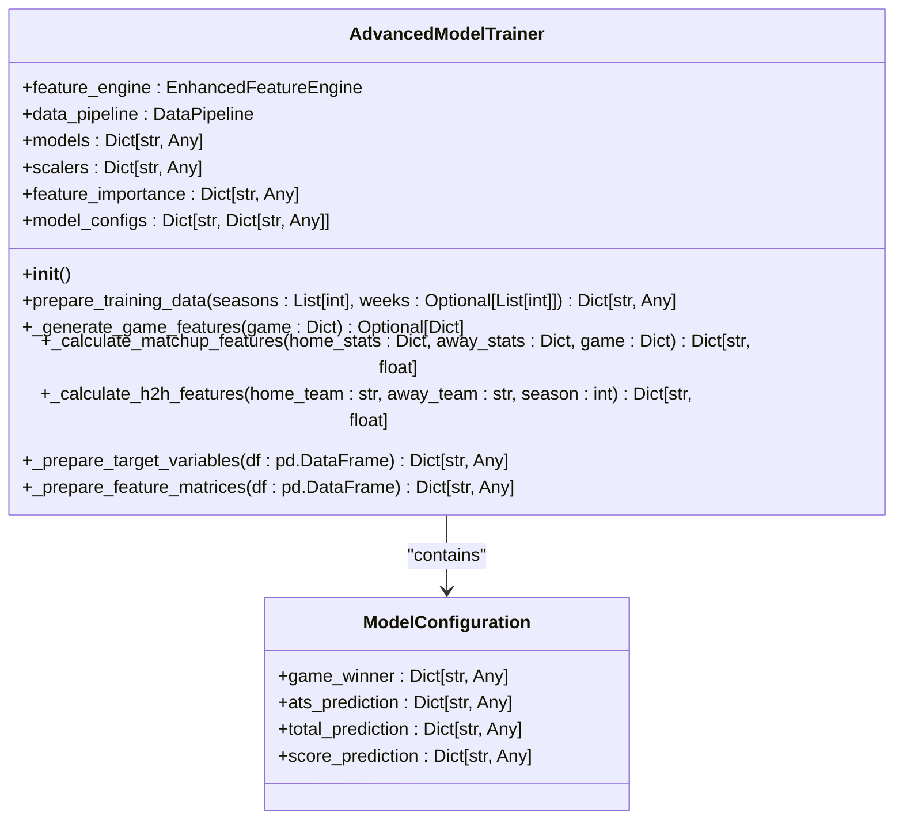
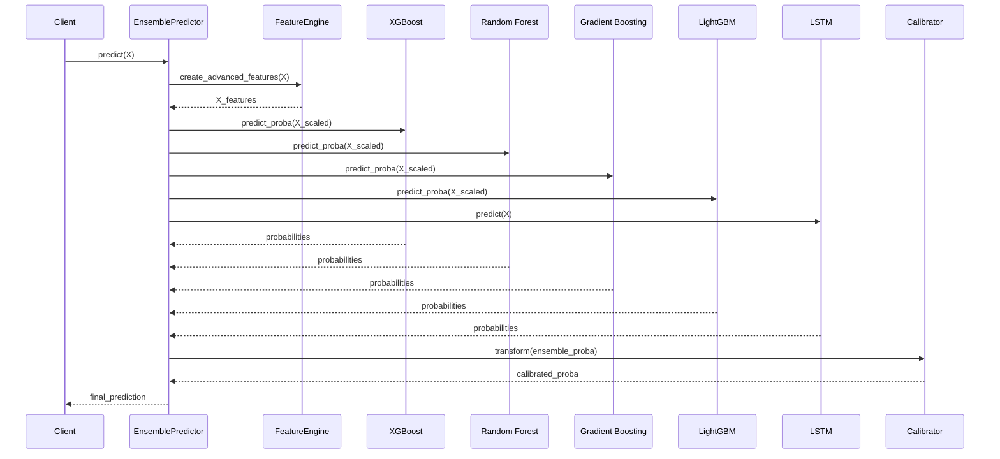

# Ensemble Learning Methods

<cite>
**Referenced Files in This Document**   
- [advanced_model_trainer.py](file://src/ml/advanced_model_trainer.py)
- [ensemble_predictor.py](file://src/ml/ensemble_predictor.py)
- [ats_prediction_models.py](file://src/ml/ats_prediction_models.py)
- [game_prediction_models.py](file://src/ml/game_prediction_models.py)
- [totals_prediction_models.py](file://src/ml/totals_prediction_models.py)
</cite>

## Table of Contents
1. [Introduction](#introduction)
2. [Ensemble Learning Implementation](#ensemble-learning-implementation)
3. [Model Configuration Structure](#model-configuration-structure)
4. [Ensemble Integration with EnsemblePredictor](#ensemble-integration-with-ensemblepredictor)
5. [Common Issues and Solutions](#common-issues-and-solutions)
6. [Conclusion](#conclusion)

## Introduction
This document provides a comprehensive overview of the ensemble learning methods implemented in the NFL prediction system. The system leverages multiple machine learning algorithms including Random Forest, Gradient Boosting, Neural Networks, and SVM models to achieve high accuracy in predicting game outcomes. The ensemble approach combines predictions from various specialized models to improve overall performance and robustness. This documentation explains the implementation details, model configurations, and integration patterns used in the system, making it accessible to both beginners and experienced developers.

## Ensemble Learning Implementation

The ensemble learning implementation is centered around the `AdvancedModelTrainer` class, which manages multiple machine learning models for different prediction tasks. The system uses ensemble methods for both classification and regression problems, with different algorithms selected based on the specific prediction type (game winner, against the spread (ATS), or totals).

For classification tasks like predicting game winners and ATS outcomes, the system employs Random Forest, Gradient Boosting, Neural Networks, and SVM models. For regression tasks such as predicting total points, the system uses Random Forest, Gradient Boosting, and Neural Network regressors. Each model type has specific hyperparameters tuned for optimal performance, with Random Forest using 200-250 estimators and appropriate depth limits, Gradient Boosting with 150-200 estimators, and Neural Networks with (100, 50) hidden layer sizes.

The implementation follows a structured approach where training data is prepared with enhanced features before model training. The feature engineering process incorporates team statistics, momentum indicators, environmental factors, and historical head-to-head data to create a comprehensive feature set for each game. This rich feature representation allows the ensemble models to capture complex patterns in NFL game outcomes.

**Section sources**
- [advanced_model_trainer.py](file://src/ml/advanced_model_trainer.py#L27-L417)
- [ensemble_predictor.py](file://src/ml/ensemble_predictor.py#L1466-L1504)

## Model Configuration Structure

The model configuration structure is defined within the `AdvancedModelTrainer` class through the `model_configs` dictionary. This configuration organizes models by prediction type, with distinct configurations for game winner, ATS, total, and score predictions. Each prediction type has a designated set of models appropriate for its task, with classification models for binary outcomes and regression models for continuous values.

For game winner prediction, the system uses four classification models: Random Forest with 200 estimators and max depth of 15, Gradient Boosting with 150 estimators and max depth of 8, Neural Network with (100, 50) hidden layers, and SVM with RBF kernel. The ATS prediction uses three models: Random Forest with 200 estimators and max depth of 12, Gradient Boosting with 150 estimators and max depth of 6, and Logistic Regression. Total prediction employs three regression models: Random Forest with 200 estimators, Gradient Boosting with 150 estimators, and Neural Network with (100, 50) hidden layers.

The configuration structure allows for easy modification and extension of the ensemble. Each model is instantiated with specific hyperparameters optimized for its role in the prediction system. The type field indicates whether the task is classification or regression, guiding the selection of appropriate algorithms and evaluation metrics. This modular design enables the system to adapt to different prediction requirements while maintaining consistency in implementation.

**Diagram sources **
- [advanced_model_trainer.py](file://src/ml/advanced_model_trainer.py#L27-L417)

**Section sources**
- [advanced_model_trainer.py](file://src/ml/advanced_model_trainer.py#L27-L417)
- [ats_prediction_models.py](file://src/ml/ats_prediction_models.py#L286-L319)

## Ensemble Integration with EnsemblePredictor

The integration between ensemble models and the `EnsemblePredictor` class is implemented through a sophisticated system that combines multiple specialized models with advanced feature engineering. The `AdvancedEnsemblePredictor` class serves as the central component, coordinating various analyzers for weather impact, injury severity, momentum, coaching matchups, and betting line movements.

The integration process begins with the creation of advanced features using the `create_advanced_features` method, which incorporates outputs from specialized analyzers into the feature set. These features are then used to train multiple models including XGBoost, Random Forest, Gradient Boosting, LightGBM, and an LSTM time-series predictor. Each model is trained with appropriate scaling using RobustScaler, and their predictions are combined through weighted averaging based on validation performance.

The ensemble weights are determined during training by evaluating each model's validation accuracy. These weights are stored in the training history and used during prediction to combine the outputs from all models. The system also incorporates confidence calibration using the `ConfidenceCalibrator` class, which ensures that predicted probabilities accurately reflect true likelihoods. Additionally, the integration includes explainability features through SHAP (SHapley Additive exPlanations) to provide insights into individual predictions.

**Diagram sources **
- [ensemble_predictor.py](file://src/ml/ensemble_predictor.py#L1038-L1326)

**Section sources**
- [ensemble_predictor.py](file://src/ml/ensemble_predictor.py#L1038-L1326)
- [ensemble_predictor.py](file://src/ml/ensemble_predictor.py#L1466-L1504)

## Common Issues and Solutions

The ensemble learning system addresses several common issues in machine learning, particularly overfitting and performance degradation. Overfitting is mitigated through multiple strategies including cross-validation, regularization, and ensemble averaging. The system uses TimeSeriesSplit for cross-validation to maintain temporal integrity in the data, preventing data leakage between training and validation sets.

For performance degradation, the system implements several solutions. The confidence calibration component ensures that model confidence aligns with actual accuracy, addressing the issue of overconfident predictions. The feature importance analysis helps identify which features contribute most to predictions, allowing for targeted improvements. The system also includes hyperparameter tuning capabilities using Optuna, which automatically searches for optimal model parameters to maintain peak performance.

Another key solution is the handling of missing data through median imputation in the feature matrices. The system also addresses the challenge of model selection by using validation accuracy to determine ensemble weights, ensuring that better-performing models have greater influence on final predictions. Additionally, the implementation includes robust error handling and logging throughout the training and prediction processes, facilitating debugging and monitoring of model performance over time.

**Section sources**
- [advanced_model_trainer.py](file://src/ml/advanced_model_trainer.py#L27-L417)
- [ensemble_predictor.py](file://src/ml/ensemble_predictor.py#L1038-L1326)

## Conclusion
The ensemble learning methods implemented in the NFL prediction system demonstrate a sophisticated approach to sports analytics. By combining multiple machine learning algorithms with comprehensive feature engineering, the system achieves high accuracy in predicting game outcomes. The modular design of the `AdvancedModelTrainer` and `EnsemblePredictor` classes allows for flexibility in model selection and configuration, while the integration of specialized analyzers enhances prediction quality.

The system effectively addresses common machine learning challenges such as overfitting and performance degradation through cross-validation, regularization, and confidence calibration. The transparent model configuration structure makes it easy to understand and modify the ensemble composition. For developers, the implementation provides a robust framework that can be extended to incorporate additional models or features. The comprehensive documentation and structured code organization make the system accessible to both beginners learning ensemble methods and experienced developers looking to implement similar solutions in other domains.