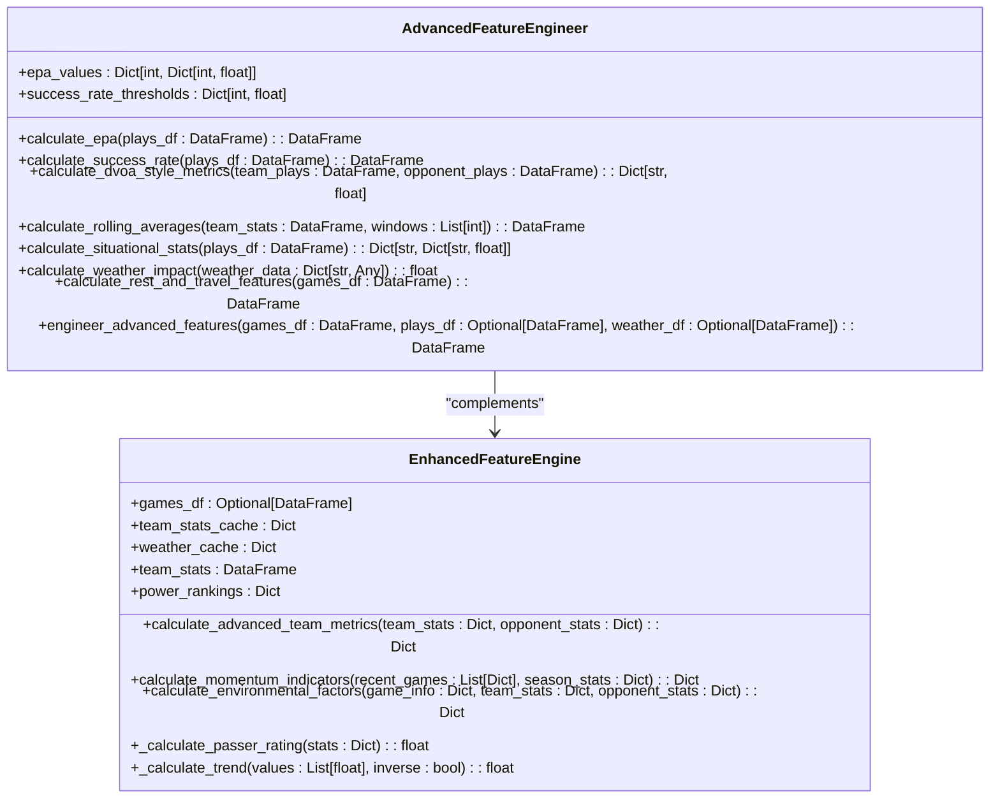

# Feature Engineering Strategy

<cite>
**Referenced Files in This Document**   
- [feature_engineering.py](file://src/ml/feature_engineering.py)
- [enhanced_features.py](file://src/ml/enhanced_features.py)
- [advanced_model_trainer.py](file://src/ml/advanced_model_trainer.py)
- [statistical_feature_extractor.py](file://src/data_pipeline/statistical_feature_extractor.py)
</cite>

## Table of Contents
1. [Introduction](#introduction)
2. [Core Feature Engineering Components](#core-feature-engineering-components)
3. [Advanced Metrics Implementation](#advanced-metrics-implementation)
4. [Momentum Indicators](#momentum-indicators)
5. [Environmental Factors](#environmental-factors)
6. [Matchup-Specific Calculations](#matchup-specific-calculations)
7. _generate_game_features Method Integration
8. [Feature Organization and Prefixing](#feature-organization-and-prefixing)
9. [Handling Missing Data and Outliers](#handling-missing-data-and-outliers)
10. [Conclusion](#conclusion)

## Introduction

The NFL prediction system employs a sophisticated feature engineering pipeline that transforms raw game data into comprehensive inputs for machine learning models. This document details the implementation of advanced features including team metrics, momentum indicators, environmental factors, and matchup-specific calculations. The system integrates multiple data sources to create a rich feature set that captures both quantitative performance metrics and qualitative game context. The feature engineering process is designed to be accessible to beginners while providing sufficient technical depth for experienced developers, with clear patterns for calculating offensive vs defensive matchups, pace differentials, turnover battles, and red zone efficiency.

**Section sources**
- [feature_engineering.py](file://src/ml/feature_engineering.py#L1-L508)
- [enhanced_features.py](file://src/ml/enhanced_features.py#L1-L529)

## Core Feature Engineering Components

The feature engineering system is built around two primary classes: `AdvancedFeatureEngineer` and `EnhancedFeatureEngine`. These components work together to create a comprehensive set of features from raw game data. The `AdvancedFeatureEngineer` focuses on play-by-play derived metrics such as Expected Points Added (EPA) and success rate, while the `EnhancedFeatureEngine` handles higher-level team metrics, momentum indicators, and environmental factors. The integration between these components allows for a multi-layered approach to feature creation, where granular play data informs broader team performance assessments. This modular design enables independent development and testing of different feature categories while maintaining a cohesive overall architecture.



**Diagram sources**
- [feature_engineering.py](file://src/ml/feature_engineering.py#L33-L373)
- [enhanced_features.py](file://src/ml/enhanced_features.py#L14-L528)

## Advanced Metrics Implementation

The system implements several advanced metrics that go beyond basic team statistics to capture nuanced aspects of team performance. Expected Points Added (EPA) is calculated by assessing the point value of each game situation based on historical outcomes, with adjustments for play outcomes like touchdowns, turnovers, and safeties. Success rate metrics use down-specific thresholds (50% on 1st down, 70% on 2nd down, 100% on 3rd and 4th down) to determine whether a play was successful in advancing the team toward a first down. DVOA-style efficiency metrics combine EPA per play with success rate to create a comprehensive offensive and defensive rating. Situational statistics include red zone efficiency, third down conversion rates, goal line efficiency, and explosive play rates (20+ yards), providing detailed insights into team performance in critical situations.

**Section sources**
- [feature_engineering.py](file://src/ml/feature_engineering.py#L100-L250)
- [enhanced_features.py](file://src/ml/enhanced_features.py#L45-L100)

## Momentum Indicators

Momentum indicators are calculated by analyzing recent team performance across multiple dimensions. The system evaluates win/loss momentum by calculating the recent win rate over the last five games, providing a simple but effective measure of team form. Scoring trends are assessed through linear regression on recent points scored, with the slope normalized to create a trend score between -1 and 1. Defensive trends use an inverse calculation, where allowing fewer points represents positive momentum. The system also tracks streak analysis, including current win/loss streaks and against-the-spread (ATS) streaks, which can indicate teams that are consistently outperforming or underperforming expectations. Home and away momentum are calculated separately to account for potential home field advantage effects, and roster stability is estimated based on performance consistency, serving as a proxy for injury impact.

```mermaid
flowchart TD
    Start([Recent Games]) --> WinLoss["Calculate Win/Loss Momentum"]
    WinLoss --> Scoring["Analyze Scoring Trends"]
    Scoring --> Defensive["Analyze Defensive Trends"]
    Defensive --> Margin["Calculate Margin Trends"]
    Margin --> Streaks["