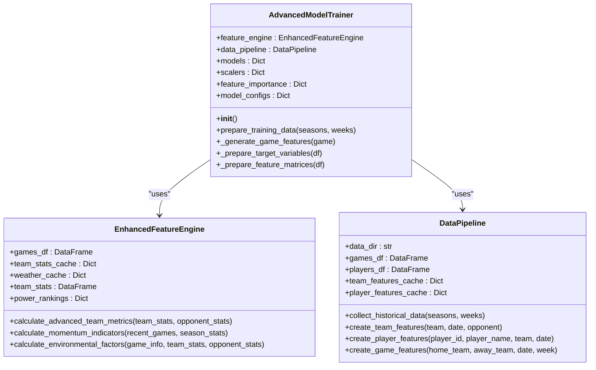
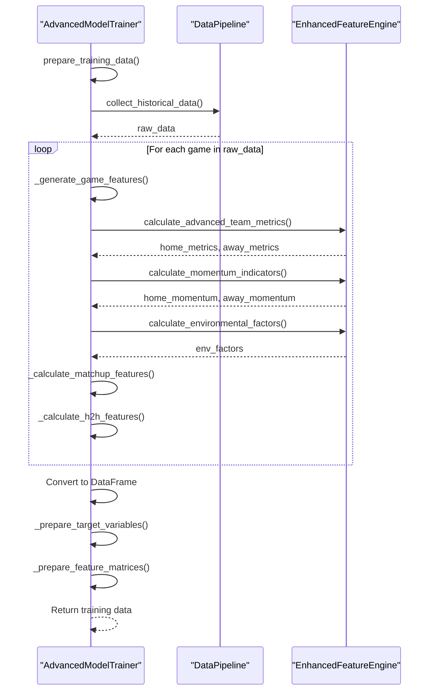
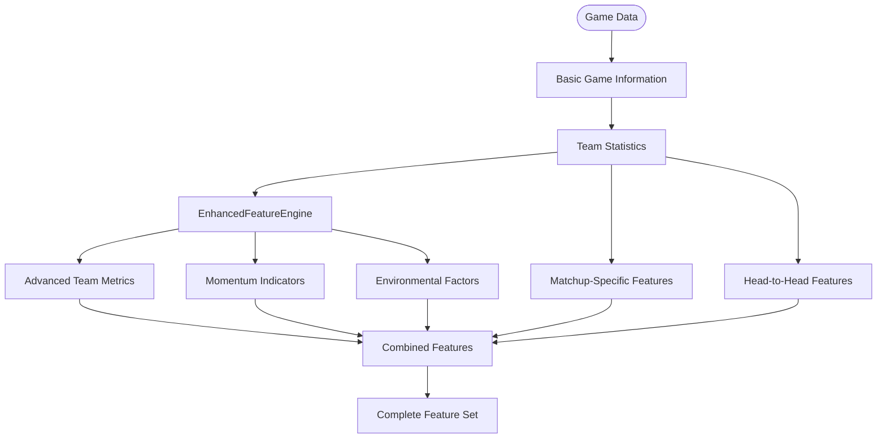
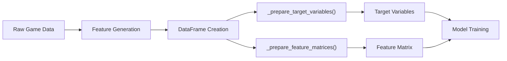

# Model Training Pipeline

<cite>
**Referenced Files in This Document**   
- [advanced_model_trainer.py](file://src/ml/advanced_model_trainer.py)
- [data_pipeline.py](file://src/ml/data_pipeline.py)
- [enhanced_features.py](file://src/ml/enhanced_features.py)
</cite>

## Table of Contents
1. [Introduction](#introduction)
2. [AdvancedModelTrainer Class Overview](#advancedmodeltrainer-class-overview)
3. [Initialization and Component Integration](#initialization-and-component-integration)
4. [Data Preparation Workflow](#data-preparation-workflow)
5. [Feature Engineering Integration](#feature-engineering-integration)
6. [Training Data Transformation](#training-data-transformation)
7. [Common Issues and Solutions](#common-issues-and-solutions)
8. [Conclusion](#conclusion)

## Introduction
The model training pipeline is a critical component of the NFL prediction system, responsible for transforming raw historical game data into sophisticated machine learning models. This document focuses on the AdvancedModelTrainer class, which orchestrates the entire training process by integrating data collection, feature engineering, and model training. The pipeline is designed to handle multiple seasons and weeks of historical data, generating comprehensive feature matrices that capture team performance, momentum indicators, environmental factors, and matchup-specific dynamics. By leveraging the DataPipeline and EnhancedFeatureEngine components, the system creates a robust foundation for accurate game predictions across various betting markets including game winners, against-the-spread outcomes, and total scores.

## AdvancedModelTrainer Class Overview
The AdvancedModelTrainer class serves as the central orchestrator for the model training process, implementing a sophisticated pipeline that combines multiple machine learning models with advanced feature engineering techniques. The class is designed to handle four primary prediction types: game_winner, ats_prediction, total_prediction, and score_prediction, each with its own specialized ensemble of models tailored to the specific characteristics of the prediction task. For classification tasks like game_winner and ats_prediction, the trainer employs Random Forest, Gradient Boosting, Neural Network, and SVM models, while regression tasks for total and score predictions utilize Random Forest, Gradient Boosting, and Ridge regression models. The class maintains separate configurations for each prediction type, allowing for optimized hyperparameters and model selection based on the specific requirements of each prediction category.

**Section sources**
- [advanced_model_trainer.py](file://src/ml/advanced_model_trainer.py#L27-L417)

## Initialization and Component Integration
The AdvancedModelTrainer class initializes with two key components: the EnhancedFeatureEngine and the DataPipeline, establishing the foundation for the entire training workflow. During initialization, the trainer creates instances of both components, enabling seamless integration between data collection and feature generation. The EnhancedFeatureEngine is responsible for calculating advanced team metrics, momentum indicators, and environmental factors, while the DataPipeline handles the collection and preprocessing of historical game data. Additionally, the trainer initializes dictionaries to store trained models, feature scalers, and feature importance metrics for each prediction type. The model configurations are predefined with optimized hyperparameters, including ensemble sizes, depth limits, and regularization parameters, ensuring that each model type is properly configured for its specific prediction task from the outset.

**Diagram sources **
- [advanced_model_trainer.py](file://src/ml/advanced_model_trainer.py#L27-L417)
- [enhanced_features.py](file://src/ml/enhanced_features.py#L14-L528)
- [data_pipeline.py](file://src/ml/data_pipeline.py#L94-L740)

**Section sources**
- [advanced_model_trainer.py](file://src/ml/advanced_model_trainer.py#L27-L417)

## Data Preparation Workflow
The prepare_training_data method orchestrates the comprehensive data preparation workflow, systematically processing historical game data across multiple seasons and weeks. The process begins by collecting raw game data through the DataPipeline's collect_historical_data method, which retrieves games from the specified seasons and weeks. For each game in the dataset, the trainer generates enhanced features by calling the _generate_game_features method, which integrates team statistics, momentum indicators, environmental factors, and matchup-specific metrics. The workflow includes robust error handling, with try-except blocks that log warnings for individual game feature generation failures while continuing processing for the remaining games. After processing all games, the method converts the enhanced data into a pandas DataFrame for easier manipulation, ensuring that at least some valid training data is generated before proceeding. The final output includes the complete DataFrame, target variables, feature matrices, and a game count for validation purposes.

**Diagram sources **
- [advanced_model_trainer.py](file://src/ml/advanced_model_trainer.py#L74-L116)
- [data_pipeline.py](file://src/ml/data_pipeline.py#L110-L163)

**Section sources**
- [advanced_model_trainer.py](file://src/ml/advanced_model_trainer.py#L74-L116)

## Feature Engineering Integration
The feature engineering integration within the AdvancedModelTrainer class represents a sophisticated multi-layered approach to transforming raw game data into predictive features. The _generate_game_features method serves as the central hub for feature generation, coordinating inputs from multiple sources to create a comprehensive feature set for each game. The process begins with basic game information such as scores, point spreads, and team identifiers, then expands to incorporate advanced team metrics calculated by the EnhancedFeatureEngine. These metrics include offensive and defensive efficiency, passing and rushing statistics, turnover differentials, and situational performance indicators like red zone and third-down efficiency. The integration also includes momentum indicators derived from recent game performance, capturing trends in scoring, defensive performance, and win/loss streaks. Environmental factors such as weather conditions, stadium characteristics, and travel impacts are incorporated to account for external influences on game outcomes. Finally, matchup-specific features and historical head-to-head statistics provide context for the specific teams facing each other, creating a holistic view of the game dynamics.

**Diagram sources **
- [advanced_model_trainer.py](file://src/ml/advanced_model_trainer.py#L118-L180)
- [enhanced_features.py](file://src/ml/enhanced_features.py#L31-L89)
- [enhanced_features.py](file://src/ml/enhanced_features.py#L111-L165)
- [enhanced_features.py](file://src/ml/enhanced_features.py#L264-L290)

**Section sources**
- [advanced_model_trainer.py](file://src/ml/advanced_model_trainer.py#L118-L180)

## Training Data Transformation
The transformation of training data into feature matrices and target variables is accomplished through two specialized methods: _prepare_target_variables and _prepare_feature_matrices. The _prepare_target_variables method creates the ground truth labels for model training by deriving binary outcomes for classification tasks and continuous values for regression tasks. For game_winner prediction, it creates a binary target where 1 represents a home team win and 0 represents an away team win. The ATS prediction target is similarly binary, indicating whether the home team covered the point spread. For total_prediction, the target is the actual total score of the game, while score_prediction targets are the individual home and away scores. The _prepare_feature_matrices method transforms the feature DataFrame into a format suitable for machine learning algorithms by selecting only numeric columns, excluding target variables and identifiers, and handling missing values by filling them with zeros. This ensures that the resulting feature matrix is clean, consistent, and ready for model training.

**Diagram sources **
- [advanced_model_trainer.py](file://src/ml/advanced_model_trainer.py#L298-L316)
- [advanced_model_trainer.py](file://src/ml/advanced_model_trainer.py#L318-L337)

**Section sources**
- [advanced_model_trainer.py](file://src/ml/advanced_model_trainer.py#L298-L337)

## Common Issues and Solutions
The model training pipeline addresses several common issues through robust error handling and data quality management. Missing data handling is implemented at multiple levels, with the _prepare_feature_matrices method filling missing values with zeros and the feature generation process including default values for missing statistics. Feature generation failures are managed through try-except blocks in the _generate_game_features method, which logs warnings for individual game processing failures while allowing the pipeline to continue with other games. The system also includes validation checks for reasonable values, such as ensuring week numbers fall within the valid range of 1-18. When historical data is unavailable, the DataPipeline gracefully falls back to generating mock training data with realistic distributions. The EnhancedFeatureEngine includes safeguards against division by zero and other mathematical errors when calculating advanced metrics. Additionally, the pipeline handles cases where historical head-to-head data is unavailable by providing neutral default values, ensuring that all games can be processed even with incomplete historical records.

**Section sources**
- [advanced_model_trainer.py](file://src/ml/advanced_model_trainer.py#L27-L417)
- [data_pipeline.py](file://src/ml/data_pipeline.py#L94-L740)
- [enhanced_features.py](file://src/ml/enhanced_features.py#L14-L528)

## Conclusion
The model training pipeline, centered around the AdvancedModelTrainer class, represents a sophisticated integration of data collection, feature engineering, and machine learning that enables accurate NFL game predictions. By leveraging the DataPipeline for historical data collection and the EnhancedFeatureEngine for advanced feature generation, the system creates comprehensive training datasets that capture the multifaceted nature of football games. The pipeline's modular design allows for easy extension and modification, while its robust error handling ensures reliable operation even with incomplete or imperfect data. The combination of ensemble models with specialized feature sets for different prediction types creates a powerful foundation for the prediction system, capable of adapting to evolving team performance and game dynamics. This comprehensive approach to model training ensures that the system can generate accurate predictions across multiple betting markets, providing valuable insights for users of the NFL prediction platform.