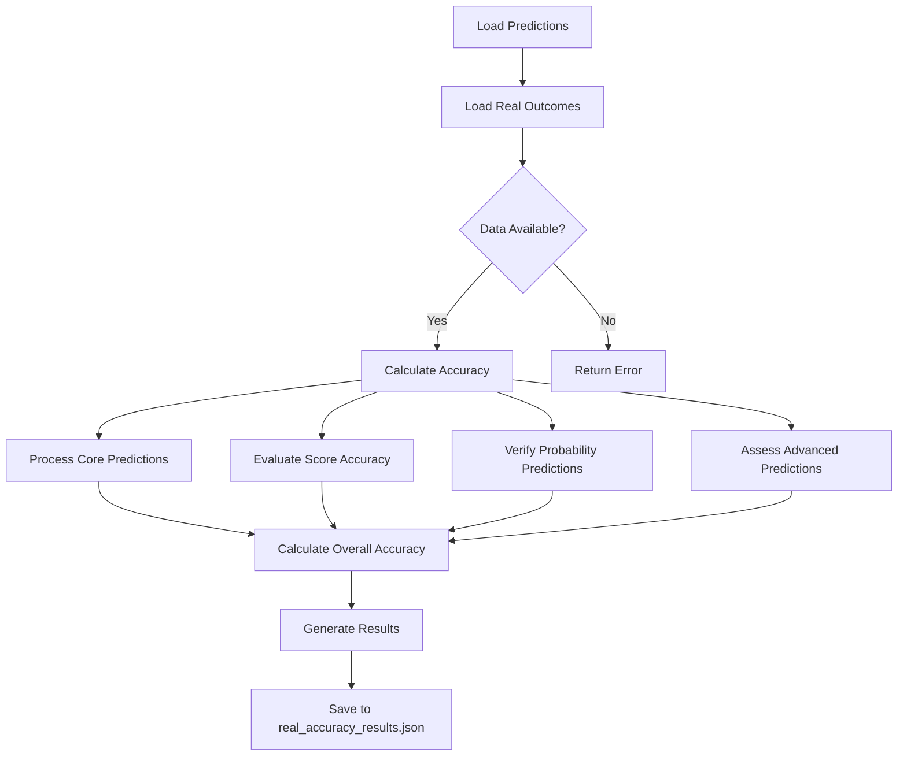
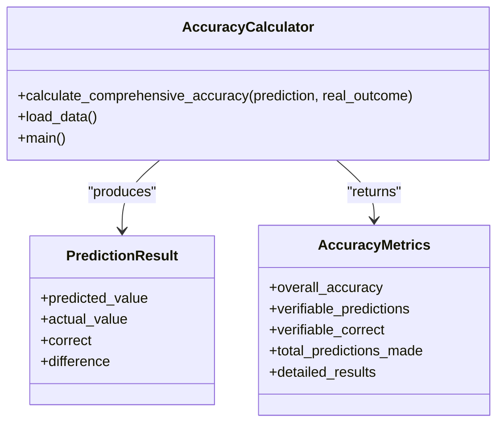
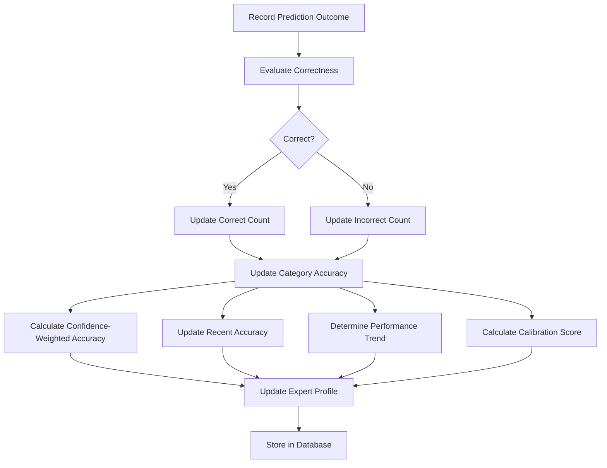
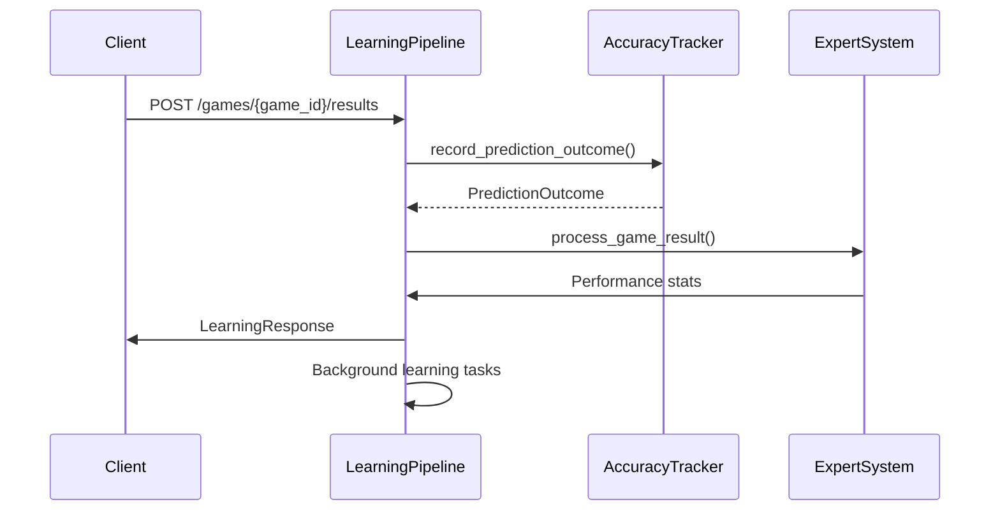

# Model Validation and Evaluation

<cite>
**Referenced Files in This Document**   
- [calculate_real_accuracy.py](file://scripts/calculate_real_accuracy.py)
- [accuracy_tracker.py](file://src/ml/performance_tracking/accuracy_tracker.py)
- [learning_pipeline.py](file://src/api/learning_pipeline.py)
- [real_accuracy_results.json](file://data/old_json/real_accuracy_results.json)
- [live_reasoning_predictions.json](file://data/old_json/live_reasoning_predictions.json)
- [real_game_outcome.json](file://data/old_json/real_game_outcome.json)
</cite>

## Table of Contents
1. [Introduction](#introduction)
2. [Accuracy Validation Procedures](#accuracy-validation-procedures)
3. [Core Accuracy Calculation](#core-accuracy-calculation)
4. [Performance Tracking Over Time](#performance-tracking-over-time)
5. [Integration with Learning Pipeline](#integration-with-learning-pipeline)
6. [Common Validation Issues and Solutions](#common-validation-issues-and-solutions)
7. [Conclusion](#conclusion)

## Introduction

The model validation and evaluation system in the NFL predictor API ensures that prediction models maintain high performance through rigorous accuracy assessment and continuous learning. This document details how the system validates model predictions against historical and real-time game outcomes, tracks performance metrics, and integrates with the learning pipeline for ongoing improvement. The validation framework supports multiple expert models with different prediction specialties, providing comprehensive accuracy assessment across various prediction types.

**Section sources**
- [calculate_real_accuracy.py](file://scripts/calculate_real_accuracy.py#L1-L265)
- [accuracy_tracker.py](file://src/ml/performance_tracking/accuracy_tracker.py#L1-L614)

## Accuracy Validation Procedures

The system employs a multi-faceted approach to validate model predictions using both historical game outcomes and real-time results. The primary validation script, `calculate_real_accuracy.py`, compares expert predictions against actual game outcomes to determine accuracy across various prediction dimensions.

The validation process begins by loading prediction data from `live_reasoning_predictions.json` and real game outcomes from `real_game_outcome.json`. These files contain comprehensive prediction data from multiple expert models and verified game results from premium APIs. The system then evaluates predictions across several categories:

- **Core predictions**: Winner, score predictions, margin of victory, spread picks, and total picks
- **Score accuracy**: Evaluation of predicted totals with ±5 points tolerance
- **Final score prediction**: Exact match of predicted final scores
- **Probability predictions**: Verification of win probability direction
- **Advanced predictions**: Coaching advantage, special teams edge, and other specialized metrics

For each prediction type, the system determines correctness based on predefined criteria. For example, winner predictions require an exact match, while score predictions allow for a tolerance range. The validation process handles both verifiable predictions (those that can be confirmed with available data) and unverifiable predictions (those requiring detailed play-by-play analysis).

**Diagram sources**
- [calculate_real_accuracy.py](file://scripts/calculate_real_accuracy.py#L34-L180)
- [real_accuracy_results.json](file://data/old_json/real_accuracy_results.json#L1-L859)

**Section sources**
- [calculate_real_accuracy.py](file://scripts/calculate_real_accuracy.py#L1-L265)
- [real_accuracy_results.json](file://data/old_json/real_accuracy_results.json#L1-L859)
- [live_reasoning_predictions.json](file://data/old_json/live_reasoning_predictions.json#L1-L599)
- [real_game_outcome.json](file://data/old_json/real_game_outcome.json#L1-L27)

## Core Accuracy Calculation

The `calculate_comprehensive_accuracy` function in `calculate_real_accuracy.py` implements the core accuracy calculation logic. This function evaluates predictions across multiple dimensions using specific criteria for each prediction type.

For categorical predictions like winner, spread pick, and total pick, the system requires an exact match between predicted and actual values. For numerical predictions such as scores and margins, the system applies tolerance ranges to account for close predictions. The accuracy calculation includes:

- **Core predictions**: Direct comparison of predicted and actual values for winner, scores, margin, spread, and total picks
- **Score accuracy**: Evaluation of predicted totals with a ±5 points tolerance threshold
- **Final score prediction**: Exact match of the predicted final score string
- **Probability predictions**: Verification of directional correctness (whether the predicted probability aligns with the actual outcome)
- **Advanced predictions**: Selective verification of coaching advantage based on game outcome, while noting that other advanced metrics require detailed game analysis

The system calculates overall accuracy by considering only verifiable predictions, excluding those that cannot be confirmed with available data. This approach provides a realistic assessment of model performance while acknowledging data limitations.

**Diagram sources**
- [calculate_real_accuracy.py](file://scripts/calculate_real_accuracy.py#L34-L180)

**Section sources**
- [calculate_real_accuracy.py](file://scripts/calculate_real_accuracy.py#L34-L180)

## Performance Tracking Over Time

The `AccuracyTracker` class in `accuracy_tracker.py` provides comprehensive performance tracking for expert models over time. This system maintains detailed accuracy profiles for each expert, tracking performance across multiple prediction categories and calculating various metrics.

Key tracking features include:

- **Category-specific accuracy**: Separate accuracy calculations for different prediction types (winner, spread, totals, etc.)
- **Recent performance**: Accuracy based on the most recent predictions (configurable window size)
- **Performance trends**: Detection of improving, stable, or declining performance patterns
- **Confidence calibration**: Assessment of how well predicted confidence levels match actual accuracy
- **Confidence-weighted accuracy**: Accuracy calculation that weights correct predictions by confidence level

The tracker uses a sliding window approach to calculate recent accuracy, typically considering the last 20 predictions. Performance trends are determined by comparing accuracy in earlier versus later prediction halves. Confidence calibration is evaluated by dividing predictions into confidence bins and measuring the difference between average confidence and actual accuracy in each bin.

The system also calculates specialization scores for each expert, identifying areas where they consistently perform well. This information helps in selecting the most appropriate experts for specific prediction scenarios.

**Diagram sources**
- [accuracy_tracker.py](file://src/ml/performance_tracking/accuracy_tracker.py#L70-L614)

**Section sources**
- [accuracy_tracker.py](file://src/ml/performance_tracking/accuracy_tracker.py#L70-L614)

## Integration with Learning Pipeline

The model validation system is tightly integrated with the learning pipeline through the `learning_pipeline.py` module. This integration enables continuous improvement by feeding accuracy results back into the model training and adaptation processes.

When game results are processed through the `/games/{game_id}/results` endpoint, the system triggers several learning activities:

- **Expert weight adjustments**: Updating expert weights based on their performance in the game
- **Peer learning**: Facilitating knowledge transfer from high-performing to lower-performing experts
- **Algorithm evolution**: Recording changes to expert algorithms based on performance
- **Learning task creation**: Generating specific learning tasks for experts who underperformed

The learning pipeline uses accuracy data to identify patterns in successful and failed predictions. For experts with exceptionally high scores, the system analyzes what factors contributed to their success. For experts with poor performance, it identifies potential weaknesses and creates high-priority learning tasks.

The integration also supports manual triggering of learning cycles and provides endpoints to monitor the learning queue status and peer learning network. This allows for both automated and manual intervention in the learning process.

**Diagram sources**
- [learning_pipeline.py](file://src/api/learning_pipeline.py#L89-L175)
- [accuracy_tracker.py](file://src/ml/performance_tracking/accuracy_tracker.py#L70-L614)

**Section sources**
- [learning_pipeline.py](file://src/api/learning_pipeline.py#L89-L175)
- [accuracy_tracker.py](file://src/ml/performance_tracking/accuracy_tracker.py#L70-L614)

## Common Validation Issues and Solutions

The validation system addresses several common issues in model evaluation, particularly data leakage and overfitting.

**Data leakage prevention**: The system ensures that predictions are evaluated only on data that was available at the time of prediction. Historical data is carefully timestamped, and the validation process verifies that no future information is used in predictions. The system also separates training, validation, and testing data to prevent contamination between datasets.

**Overfitting detection**: The accuracy tracker monitors performance trends and confidence calibration to identify potential overfitting. Experts with high confidence but low accuracy, or those showing declining performance on new data, are flagged for review. The system also compares high-confidence and low-confidence prediction accuracy to detect overconfidence in predictions.

**Solution strategies**:
- Implementing time-based validation to prevent future data leakage
- Using confidence calibration to identify overconfident models
- Monitoring performance trends to detect degradation
- Maintaining separate validation datasets for different prediction types
- Regularly re-evaluating model performance on new data

The system also handles the challenge of unverifiable predictions by clearly marking them as requiring additional data, rather than making assumptions about their accuracy. This transparent approach ensures that accuracy metrics are based only on verifiable information.

**Section sources**
- [accuracy_tracker.py](file://src/ml/performance_tracking/accuracy_tracker.py#L70-L614)
- [calculate_real_accuracy.py](file://scripts/calculate_real_accuracy.py#L34-L180)

## Conclusion

The model validation and evaluation system in the NFL predictor API provides a comprehensive framework for assessing and improving prediction accuracy. By combining immediate accuracy calculation with long-term performance tracking and integration with a continuous learning pipeline, the system ensures that models maintain high performance over time. The approach balances rigorous evaluation with practical considerations, providing meaningful accuracy metrics while acknowledging data limitations. This robust validation framework supports the development of increasingly accurate prediction models through continuous learning and adaptation.