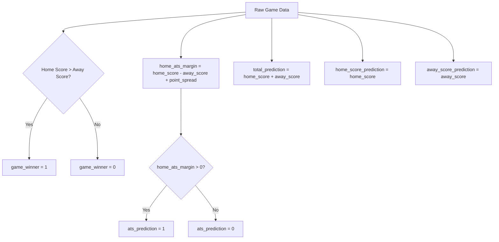
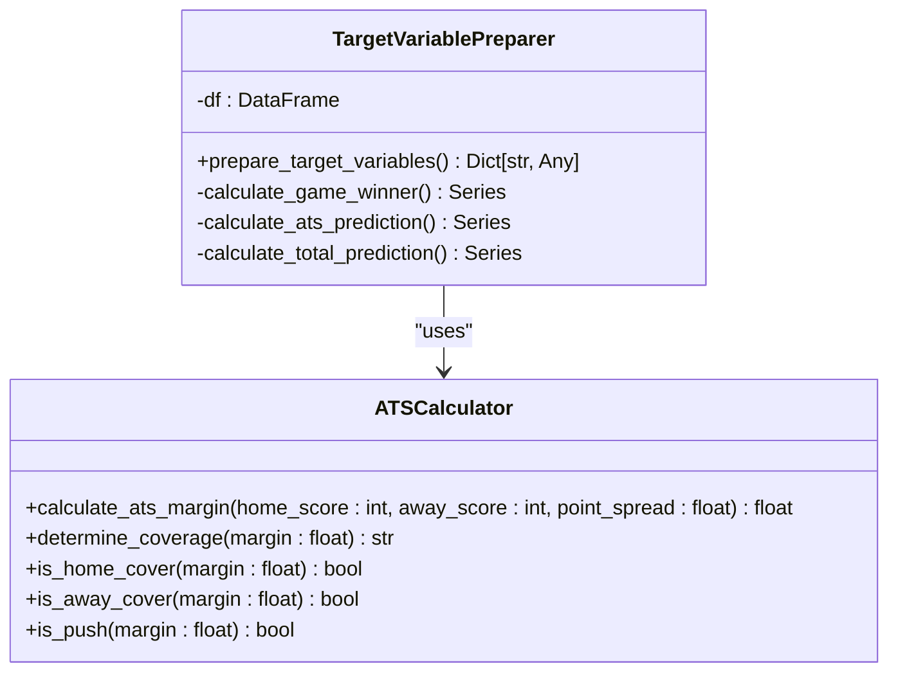
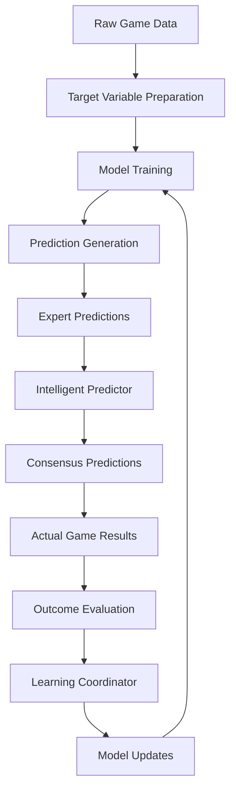

# Prediction Categories and Targets

<cite>
**Referenced Files in This Document**   
- [comprehensive_prediction_categories.py](file://src/ml/prediction_engine/comprehensive_prediction_categories.py)
- [advanced_model_trainer.py](file://src/ml/advanced_model_trainer.py)
- [comprehensive_intelligent_predictor.py](file://src/ml/comprehensive_intelligent_predictor.py)
</cite>

## Table of Contents
1. [Introduction](#introduction)
2. [Prediction Categories Overview](#prediction-categories-overview)
3. [Target Variables Derivation](#target-variables-derivation)
4. [Mathematical Logic for ATS Calculation](#mathematical-logic-for-ats-calculation)
5. [Relationship to Intelligent Predictor System](#relationship-to-intelligent-predictor-system)
6. [Common Issues and Solutions](#common-issues-and-solutions)
7. [Conclusion](#conclusion)

## Introduction
This document provides a comprehensive overview of the prediction categories and target variables within the NFL predictor system. It details the 27 distinct prediction categories, explains how target variables are derived from raw game data, and explores the mathematical foundations behind key calculations such as against-the-spread (ATS) outcomes. The content is designed to be accessible to beginners while providing sufficient technical depth for experienced developers working with the system.

## Prediction Categories Overview

The prediction system organizes its 27 categories into five main groups: Game Outcome, Betting Market, Live Scenario, Player Props, and Situational Analysis. Each category has specific validation rules, data types, and scoring weights that determine its importance in the overall prediction framework.

### Game Outcome Predictions
These four categories focus on the fundamental result of the game:
- **Winner Prediction**: Categorical prediction of home or away team victory
- **Exact Score - Home Team**: Numeric prediction of home team's final score (0-70 range)
- **Exact Score - Away Team**: Numeric prediction of away team's final score (0-70 range)
- **Margin of Victory**: Numeric prediction of point difference (0-50 range)

### Betting Market Predictions
These four categories align with common sports betting markets:
- **Against the Spread**: Categorical prediction of which team covers the spread (home, away, push)
- **Totals Over/Under**: Categorical prediction of whether total points exceed the line (over, under, push)
- **First Half Winner**: Categorical prediction of first-half winner (home, away, tie)
- **Highest Scoring Quarter**: Categorical prediction of which quarter has most points (Q1-Q4)

### Live Scenario Predictions
These four categories require real-time data during games:
- **Live Win Probability**: Percentage-based real-time win chance (0.0-1.0)
- **Next Score Probability**: Categorical prediction of next scoring play (touchdown, field_goal, safety, none)
- **Drive Outcome Prediction**: Categorical prediction of drive result (touchdown, field_goal, punt, turnover)
- **Fourth Down Decision**: Categorical prediction of optimal decision (punt, field_goal, go_for_it)

### Player Props Categories
These eight categories focus on individual player performance:
- **QB Passing Yards**: Numeric prediction (0-600 range)
- **QB Touchdowns**: Integer prediction (0-8 range)
- **QB Interceptions**: Integer prediction (0-6 range)
- **RB Rushing Yards**: Numeric prediction (0-300 range)
- **RB Touchdowns**: Integer prediction (0-5 range)
- **WR Receiving Yards**: Numeric prediction (0-250 range)
- **WR Receptions**: Integer prediction (0-20 range)
- **Fantasy Points Projection**: Numeric prediction (0-50 range)

### Situational Analysis Categories
These seven categories assess contextual factors:
- **Weather Impact Score**: Percentage-based assessment (0.0-1.0)
- **Injury Impact Score**: Percentage-based assessment (0.0-1.0)
- **Travel/Rest Factor**: Numeric impact score (-0.5 to 0.5)
- **Divisional Rivalry Factor**: Percentage-based factor (0.0-1.0)
- **Coaching Advantage**: Categorical advantage (home, away, neutral)
- **Home Field Advantage**: Numeric point advantage (0-10 points)
- **Momentum Factor**: Numeric indicator (-1.0 to 1.0)

**Section sources**
- [comprehensive_prediction_categories.py](file://src/ml/prediction_engine/comprehensive_prediction_categories.py#L168-L415)

## Target Variables Derivation

The `_prepare_target_variables` method in the `AdvancedModelTrainer` class transforms raw game data into target variables used for training machine learning models. This process converts final game outcomes into machine-readable formats that models can learn from.

### Game Winner Target
The game winner target is derived by comparing home and away scores:
- Home team wins: 1
- Away team wins: 0

This binary encoding simplifies the classification task for machine learning models while maintaining clear interpretation.

### Against the Spread (ATS) Target
The ATS target determines which team covered the point spread:
- Home team covers: 1
- Away team covers: 0

The calculation considers the point spread as a handicap applied to the home team's score.

### Total Score Target
The total score target uses regression rather than classification:
- Target value: Sum of home and away scores
- This continuous value allows models to predict exact point totals

### Score Prediction Targets
Individual score predictions are treated as regression problems:
- Home score target: Actual home team points
- Away score target: Actual away team points

These targets enable models to learn scoring patterns and offensive/defensive capabilities.



**Diagram sources **
- [advanced_model_trainer.py](file://src/ml/advanced_model_trainer.py#L298-L316)

**Section sources**
- [advanced_model_trainer.py](file://src/ml/advanced_model_trainer.py#L298-L316)

## Mathematical Logic for ATS Calculation

The against-the-spread (ATS) calculation follows a precise mathematical formula that accounts for the point spread as a handicap. The core logic determines whether the home team covers the spread by calculating their effective margin.

### ATS Margin Formula
The ATS margin is calculated using this formula:
```
home_ats_margin = home_score - away_score + point_spread
```

Where:
- `home_score`: Final points scored by the home team
- `away_score`: Final points scored by the away team
- `point_spread`: The betting line (positive favors away team, negative favors home team)

### Coverage Determination
The home team covers the spread if:
```
home_ats_margin > 0
```

The away team covers the spread if:
```
home_ats_margin < 0
```

A push occurs when:
```
home_ats_margin == 0
```

### Example Scenarios
Consider a game with a point spread of -3.5 (home team favored by 3.5 points):

**Scenario 1: Home Team Covers**
- Home score: 24
- Away score: 20
- Point spread: -3.5
- ATS margin: 24 - 20 + (-3.5) = 0.5
- Result: Home team covers (0.5 > 0)

**Scenario 2: Away Team Covers**
- Home score: 20
- Away score: 24
- Point spread: -3.5
- ATS margin: 20 - 24 + (-3.5) = -7.5
- Result: Away team covers (-7.5 < 0)

**Scenario 3: Push**
- Home score: 20
- Away score: 16.5
- Point spread: -3.5
- ATS margin: 20 - 16.5 + (-3.5) = 0
- Result: Push (0 == 0)

This mathematical approach ensures consistent and objective determination of ATS outcomes across all games, eliminating ambiguity in result calculation.



**Diagram sources **
- [advanced_model_trainer.py](file://src/ml/advanced_model_trainer.py#L298-L316)

**Section sources**
- [advanced_model_trainer.py](file://src/ml/advanced_model_trainer.py#L298-L316)

## Relationship to Intelligent Predictor System

The prediction categories and target variables form the foundation of the comprehensive intelligent predictor system, serving as both inputs and outputs in the machine learning pipeline. This relationship creates a closed-loop system where predictions inform learning, and learning improves future predictions.

### Integration Architecture
The prediction categories are registered in a global instance of `ComprehensivePredictionCategories`, which serves as a central registry accessible throughout the system. This design ensures consistency across different components and prevents category drift.

### Training Pipeline
The target variables derived from historical game data are used to train multiple machine learning models:
- Classification models for categorical predictions (winner, ATS, totals)
- Regression models for numeric predictions (scores, margins, player props)
- Ensemble methods that combine multiple model outputs

### Feedback Loop
When actual game results become available, they are compared against predictions to generate outcomes. These outcomes feed into the learning coordinator, which updates expert performance metrics and triggers retraining cycles. This continuous learning process adapts the system to evolving team dynamics and league trends.

### Expert System Integration
Each expert in the system generates predictions across all 27 categories, creating a rich dataset of diverse analytical perspectives. The intelligent predictor synthesizes these perspectives, weighting them by historical accuracy and confidence levels to produce consensus predictions.



**Diagram sources **
- [comprehensive_prediction_categories.py](file://src/ml/prediction_engine/comprehensive_prediction_categories.py#L168-L415)
- [advanced_model_trainer.py](file://src/ml/advanced_model_trainer.py#L298-L316)

**Section sources**
- [comprehensive_prediction_categories.py](file://src/ml/prediction_engine/comprehensive_prediction_categories.py#L168-L415)
- [comprehensive_intelligent_predictor.py](file://src/ml/comprehensive_intelligent_predictor.py#L29-L84)

## Common Issues and Solutions

Several common issues arise in the calculation and handling of prediction targets, particularly around edge cases and data inconsistencies. The system implements specific solutions to address these challenges.

### Edge Case: Push Outcomes
In ATS calculations, a push occurs when the final margin exactly equals the point spread. This creates a third outcome beyond simple win/loss classification.

**Solution**: The system handles pushes by treating them as a separate category in betting market predictions. For binary classification tasks, pushes are typically counted as losses to maintain conservative performance metrics.

### Edge Case: Missing Data
Incomplete game data, particularly for player props, can prevent target variable calculation.

**Solution**: The system implements data validation rules and fallback mechanisms:
- Numeric predictions use median values from similar game situations
- Categorical predictions default to the most frequent outcome
- Confidence scores are adjusted downward for predictions based on incomplete data

### Data Format Inconsistencies
Different data sources may represent scores, spreads, and other values in varying formats.

**Solution**: The system standardizes data through a preprocessing pipeline:
- All numeric values are converted to floating-point format
- Categorical values are normalized to consistent strings
- Date and time formats are unified across sources

### Temporal Data Issues
Games that are postponed, canceled, or played under unusual circumstances require special handling.

**Solution**: The system flags these games for manual review and excludes them from automated training datasets. A separate process handles rescheduled games by updating prediction timestamps and contextual factors.

### Validation and Error Handling
Each prediction category includes built-in validation rules to ensure data integrity:
- Range checks for numeric values
- Choice validation for categorical values
- Type checking for all prediction values

These validations prevent invalid data from propagating through the system and corrupting model training.

**Section sources**
- [comprehensive_prediction_categories.py](file://src/ml/prediction_engine/comprehensive_prediction_categories.py#L168-L415)
- [advanced_model_trainer.py](file://src/ml/advanced_model_trainer.py#L298-L316)

## Conclusion
The prediction categories and target variables form a comprehensive framework that enables sophisticated NFL game analysis and forecasting. By organizing predictions into 27 distinct categories across five groups, the system provides both breadth and depth of insight. The mathematical derivation of target variables from raw game data creates a robust foundation for machine learning models, while the integration with the intelligent predictor system enables continuous learning and improvement. Addressing common issues like edge cases and data inconsistencies ensures reliable performance across diverse scenarios. This structured approach balances accessibility for beginners with technical depth for developers, making it a powerful tool for sports analytics.