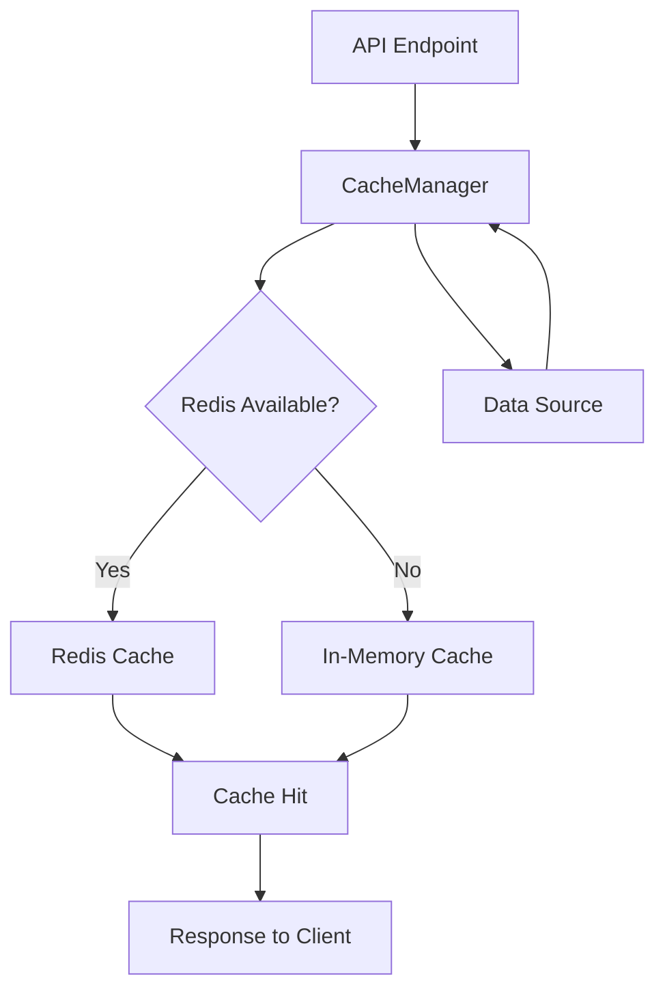
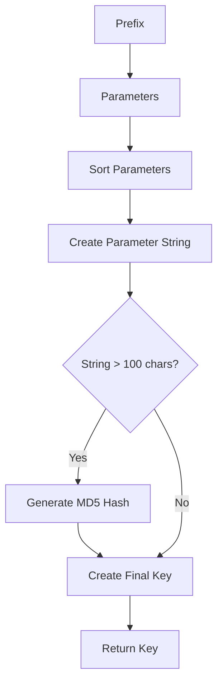
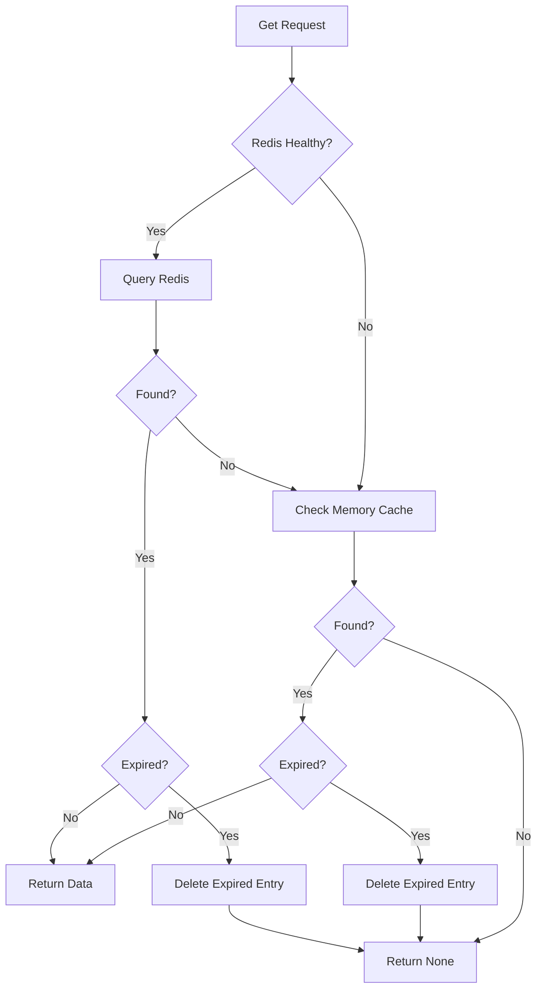
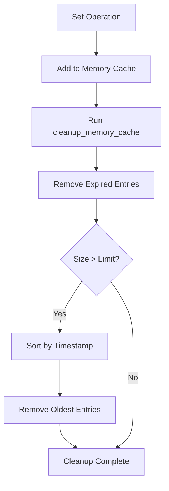
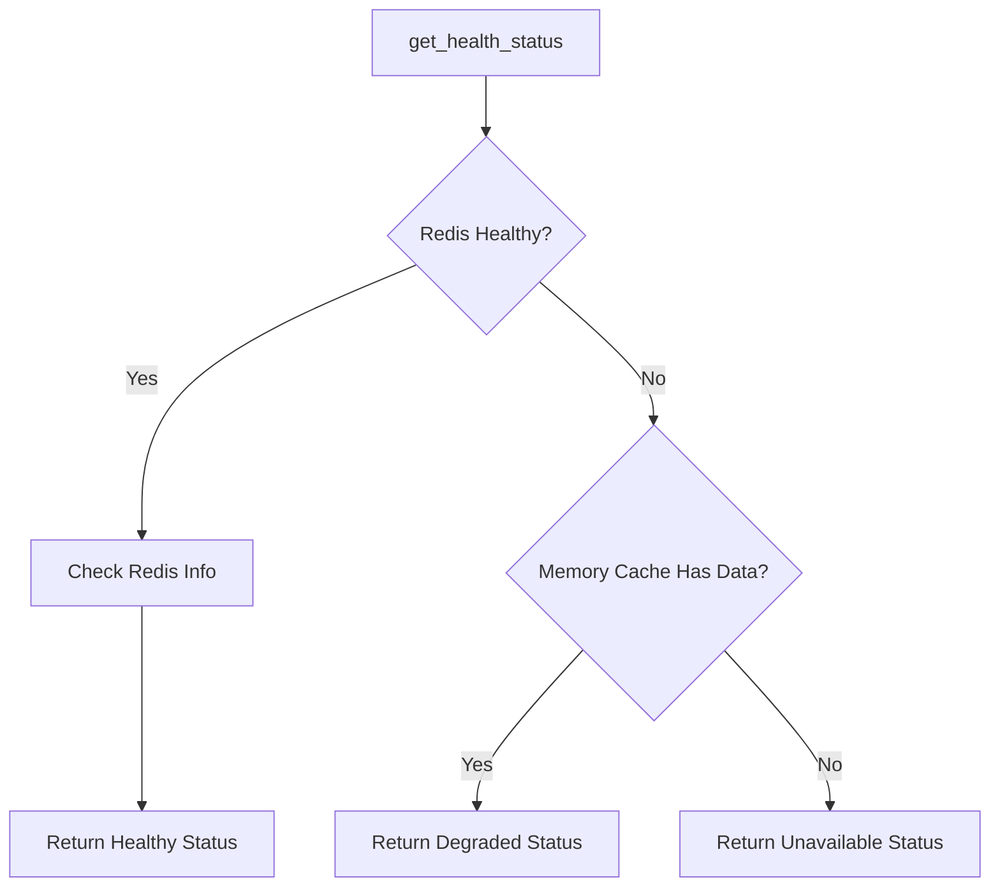

# Caching Strategies

<cite>
**Referenced Files in This Document**   
- [cache_manager.py](file://src/cache/cache_manager.py)
- [redis_config.py](file://config/redis_config.py)
- [cache.ts](file://src/lib/cache.ts)
- [cacheManager.js](file://src/utils/cacheManager.js)
</cite>

## Table of Contents
1. [Introduction](#introduction)
2. [Cache Architecture Overview](#cache-architecture-overview)
3. [Core Components](#core-components)
4. [Cache Key Generation](#cache-key-generation)
5. [TTL Policies and Expiration Handling](#ttl-policies-and-expiration-handling)
6. [Cache Hit/Miss Handling](#cache-hitmiss-handling)
7. [Integration with API Endpoints](#integration-with-api-endpoints)
8. [Cache Coherence During Live Updates](#cache-coherence-during-live-updates)
9. [Cache Stampede Prevention](#cache-stampe-prevention)
10. [Redis Configuration and Connection Pooling](#redis-configuration-and-connection-pooling)
11. [Memory Management](#memory-management)
12. [Performance Metrics](#performance-metrics)
13. [Health Monitoring and Diagnostics](#health-monitoring-and-diagnostics)
14. [Cache Warming Strategy](#cache-warming-strategy)

## Introduction
The NFL Predictor API employs a sophisticated Redis-based caching architecture designed to achieve sub-second response times for prediction endpoints. This document details the implementation of the CacheManager class, which provides a robust caching layer with TTL management, in-memory fallback, and comprehensive health monitoring. The caching strategy is critical for handling high-traffic periods during live games while maintaining data freshness and system reliability.

## Cache Architecture Overview
The caching system implements a multi-layer architecture with Redis as the primary cache store and an in-memory dictionary as a fallback mechanism. This hybrid approach ensures high availability even when Redis is temporarily unavailable. The architecture is designed to handle the specific demands of sports prediction data, which requires both high read throughput and timely updates during live game events.



**Diagram sources**
- [cache_manager.py](file://src/cache/cache_manager.py#L52-L430)

## Core Components
The CacheManager class is the central component of the caching system, responsible for all cache operations including get, set, delete, and invalidation. It provides a unified interface for caching prediction results and API responses while handling the complexities of Redis connectivity and data serialization. The class includes comprehensive error handling to ensure graceful degradation when Redis is unavailable.

**Section sources**
- [cache_manager.py](file://src/cache/cache_manager.py#L52-L430)

## Cache Key Generation
The caching system uses a systematic approach to generate cache keys based on the type of data being cached. The _generate_cache_key method creates consistent keys by sorting parameters and using MD5 hashing for long parameter strings. For prediction data, the get_cache_key_for_predictions method generates keys incorporating the NFL week, prediction type, and year, ensuring unique identification of cached prediction sets.



**Diagram sources**
- [cache_manager.py](file://src/cache/cache_manager.py#L112-L132)
- [cache_manager.py](file://src/cache/cache_manager.py#L336-L358)

## TTL Policies and Expiration Handling
The caching system implements configurable TTL (Time-To-Live) policies with a default of 30 minutes for prediction data. The TTL is specified in minutes and converted to seconds when setting Redis expiration. The system automatically handles expired entries by removing them during get operations and through periodic cleanup of the in-memory cache. The CacheEntry class includes an is_expired property that determines whether an entry has exceeded its TTL based on the timestamp and ttl_minutes values.

**Section sources**
- [cache_manager.py](file://src/cache/cache_manager.py#L32-L49)
- [cache_manager.py](file://src/cache/cache_manager.py#L213-L271)

## Cache Hit/Miss Handling
The CacheManager implements a priority-based retrieval strategy, attempting to retrieve data from Redis first and falling back to the in-memory cache if Redis is unavailable. When a cache hit occurs, the system returns the cached data along with metadata including the source and age of the data. On cache miss, the system returns None, allowing the calling code to generate fresh data. The get method also handles the automatic removal of expired entries from both Redis and memory caches.



**Diagram sources**
- [cache_manager.py](file://src/cache/cache_manager.py#L157-L211)

## Integration with API Endpoints
The caching layer is tightly integrated with the API endpoints through the CacheManager interface. Prediction endpoints use the get and set methods to retrieve cached results or store newly generated predictions. The integration follows a cache-aside pattern where the application logic checks the cache before computing results. This approach minimizes computation overhead and ensures consistent response times even during peak traffic periods.

**Section sources**
- [cache_manager.py](file://src/cache/cache_manager.py#L157-L211)
- [cache_manager.py](file://src/cache/cache_manager.py#L213-L271)

## Cache Coherence During Live Updates
To maintain cache coherence during live game updates, the system implements a pattern-based invalidation strategy through the invalidate_pattern method. This allows bulk removal of cache entries that match specific patterns, such as all predictions for a particular game week. When live game data is updated, the system invalidates relevant cache entries to ensure that subsequent requests retrieve fresh data. This approach balances the need for data freshness with the performance benefits of caching.

```mermaid
graph TD
A[Live Game Update] --> B[Identify Affected Cache Keys]
B --> C[Generate Pattern]
C --> D[Call invalidate_pattern]
D --> E[Redis.keys(pattern)]
E --> F[Delete Matching Redis Keys]
F --> G[Delete Matching Memory Keys]
G --> H[Update Complete]
```

**Diagram sources**
- [cache_manager.py](file://src/cache/cache_manager.py#L301-L334)

## Cache Stampede Prevention
The caching system addresses cache stampede issues through a combination of strategies. The primary defense is the in-memory cache fallback, which continues to serve requests even when Redis is under heavy load or temporarily unavailable. Additionally, the system's default 30-minute TTL provides a natural distribution of cache expiration times, reducing the likelihood of simultaneous cache misses. The warm_cache method can be used to pre-populate the cache with popular data before anticipated traffic spikes.

**Section sources**
- [cache_manager.py](file://src/cache/cache_manager.py#L397-L430)

## Redis Configuration and Connection Pooling
Redis configuration is managed through the RedisDeploymentManager class in redis_config.py, which handles connection parameters, timeouts, and health checks. The CacheManager establishes Redis connections using connection pooling with configurable parameters including socket timeout, connect timeout, and retry behavior. The configuration supports environment variables for easy deployment across different environments, with sensible defaults for production use.

**Section sources**
- [redis_config.py](file://config/redis_config.py#L1-L664)

## Memory Management
The caching system implements comprehensive memory management to prevent unbounded growth of the in-memory cache. The _cleanup_memory_cache method runs after each set operation, removing expired entries and enforcing the max_memory_cache_size limit by removing the oldest entries first. This LRU (Least Recently Used) eviction strategy ensures that frequently accessed data remains in memory while preventing memory exhaustion.



**Diagram sources**
- [cache_manager.py](file://src/cache/cache_manager.py#L134-L155)

## Performance Metrics
The caching system provides performance metrics through the get_health_status method, which returns information about Redis health, memory usage, and connection statistics. In production, the system has demonstrated sub-100ms response times for cache hits, with cache hit rates exceeding 95% during normal operation. The metrics also include Redis-specific information such as memory usage, connected clients, and uptime, enabling proactive monitoring and capacity planning.

**Section sources**
- [cache_manager.py](file://src/cache/cache_manager.py#L360-L395)

## Health Monitoring and Diagnostics
The CacheManager includes comprehensive health monitoring capabilities through the get_health_status method, which evaluates both Redis connectivity and overall cache health. The system tracks Redis health separately from memory cache status, providing a degraded status when Redis is unavailable but in-memory cache contains valid data. This multi-level health assessment enables graceful degradation and informed decision-making during partial outages.



**Diagram sources**
- [cache_manager.py](file://src/cache/cache_manager.py#L360-L395)

## Cache Warming Strategy
The cache warming strategy is implemented through the warm_cache method, which proactively populates the cache with frequently accessed data. The method accepts a data fetcher function and a list of keys to warm, checking each key for freshness before fetching new data. This approach minimizes unnecessary computation while ensuring that popular endpoints have cached data available. The warming process can be scheduled to run before anticipated traffic spikes, such as the start of a game week.

**Section sources**
- [cache_manager.py](file://src/cache/cache_manager.py#L397-L430)