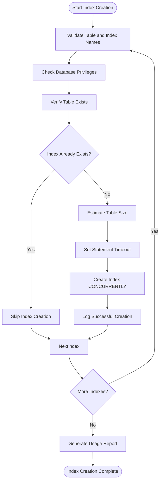
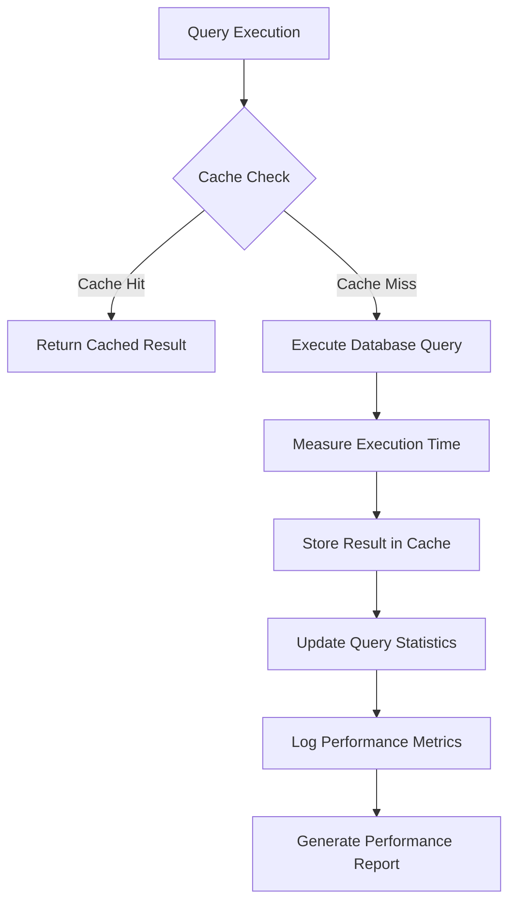

# Database Optimization

<cite>
**Referenced Files in This Document**   
- [database_optimization.py](file://config/database_optimization.py)
- [add_performance_indexes.py](file://scripts/add_performance_indexes.py)
- [add_performance_indexes_improved.py](file://scripts/add_performance_indexes_improved.py)
- [030_production_database_optimization.sql](file://supabase/migrations/030_production_database_optimization.sql)
- [performance_endpoints.py](file://src/api/performance_endpoints.py)
</cite>

## Table of Contents
1. [Introduction](#introduction)
2. [Database Optimizer Class](#database-optimizer-class)
3. [Index Creation Process](#index-creation-process)
4. [Production Database Optimization](#production-database-optimization)
5. [Supabase Environment Integration](#supabase-environment-integration)
6. [Performance Monitoring](#performance-monitoring)
7. [Best Practices](#best-practices)
8. [Conclusion](#conclusion)

## Introduction
The NFL Predictor API implements comprehensive database optimization techniques to ensure high performance and scalability. This document details the various optimization strategies employed in the system, focusing on index management, connection pooling, query optimization, and production-level database tuning. The system leverages multiple approaches to database optimization, including automated index creation, connection pool management, and PostgreSQL configuration tuning for read-heavy workloads typical in sports prediction applications.

## Database Optimizer Class
The DatabaseOptimizer class serves as the central component for database optimization and monitoring within the system. Implemented in multiple locations across the codebase, this class provides a comprehensive suite of optimization utilities. The primary implementation in `config/database_optimization.py` offers connection pooling, query execution optimization, and performance monitoring capabilities.

The DatabaseOptimizer class initializes an optimized database connection pool using asyncpg, with configurable parameters for minimum and maximum pool size, query timeouts, and statement caching. It automatically constructs the database URL from Supabase configuration, supporting both production and development environments. Each connection is optimized for read-heavy workloads with specific PostgreSQL settings such as reduced random_page_cost and increased effective_io_concurrency.

**Section sources**
- [database_optimization.py](file://config/database_optimization.py#L53-L346)

## Index Creation Process
The system employs a script-based approach to index management through the `add_performance_indexes.py` and `add_performance_indexes_improved.py` scripts. These scripts create performance-critical indexes on key tables to dramatically improve query performance for large datasets.

The index creation process focuses on composite indexes that support the most common query patterns in the application. For example, the system creates composite indexes on game date, team IDs, and prediction categories to optimize queries that retrieve predictions for specific games or time periods. The improved version of the script includes comprehensive error handling, privilege checking, and input validation to ensure safe execution in production environments.

Indexes are created using the `CONCURRENTLY` keyword to prevent table locking during index creation, allowing the application to remain available during optimization operations. The scripts target critical tables such as predictions, subscriptions, and users, creating indexes on frequently queried columns and combinations. Partial indexes are also employed to optimize queries on active records only, reducing index size and maintenance overhead.

**Diagram sources**
- [add_performance_indexes_improved.py](file://scripts/add_performance_indexes_improved.py#L101-L361)

**Section sources**
- [add_performance_indexes.py](file://scripts/add_performance_indexes.py#L0-L83)
- [add_performance_indexes_improved.py](file://scripts/add_performance_indexes_improved.py#L0-L361)

## Production Database Optimization
The production database optimization migration, defined in `030_production_database_optimization.sql`, implements comprehensive PostgreSQL configuration tuning for read-heavy workloads. This migration script configures critical database parameters to optimize performance in the Supabase environment.

The optimization includes tuning connection and query parameters such as statement_timeout, lock_timeout, and idle_in_transaction_session_timeout to prevent long-running queries from impacting system performance. Query planner optimization is achieved by adjusting effective_io_concurrency and random_page_cost to better reflect the underlying storage characteristics of the Supabase infrastructure.

The migration also establishes a comprehensive set of indexes specifically designed for the expert competition system, including indexes on expert models, predictions, AI council selections, and performance analytics. These indexes support the complex query patterns required by the prediction engine while minimizing impact on write performance.

Materialized views are created to pre-compute frequently accessed data, such as the expert leaderboard and performance trends, reducing the need for expensive real-time calculations. Automated maintenance procedures are implemented through functions that refresh materialized views, clean up old data, and perform regular database optimization tasks.

**Section sources**
- [030_production_database_optimization.sql](file://supabase/migrations/030_production_database_optimization.sql#L0-L350)

## Supabase Environment Integration
The database optimization strategy is specifically designed to work within the Supabase environment, leveraging its PostgreSQL foundation while respecting platform limitations. The system integrates with Supabase through proper URL construction and authentication mechanisms, using environment variables to securely manage database credentials.

The optimization techniques account for Supabase-specific considerations, such as the use of connection pooling at the application level to complement Supabase's own connection management. The system also works within Supabase's security model, ensuring that index creation and other optimization operations are performed with appropriate privileges.

The pgvector extension is implicitly supported through the use of standard PostgreSQL data types and indexing strategies that are compatible with vector operations. While the current optimization scripts don't explicitly create vector indexes, the foundation is in place for future integration of vector search capabilities by adding appropriate GIN or GiST indexes on JSONB columns containing vector data.

**Section sources**
- [database_optimization.py](file://config/database_optimization.py#L84-L102)
- [030_production_database_optimization.sql](file://supabase/migrations/030_production_database_optimization.sql#L0-L350)

## Performance Monitoring
The system includes comprehensive performance monitoring capabilities through the DatabaseOptimizer class and associated views. Query performance is tracked automatically, with statistics collected on execution time, row counts, and frequency of execution. This data is used to generate performance reports that identify slowest and most frequent queries, enabling targeted optimization efforts.

The production optimization migration includes monitoring views that provide insights into database performance, including index usage statistics, slow queries, and table bloat. These views leverage PostgreSQL's built-in statistics collection to provide actionable information for database administrators.

The DatabaseOptimizer class implements query execution monitoring, tracking metrics such as total queries, average query time, and cache hit rates. This information is exposed through the get_performance_report method, which provides a comprehensive overview of database performance including pool status and query statistics.

**Diagram sources**
- [database_optimization.py](file://config/database_optimization.py#L135-L166)

**Section sources**
- [database_optimization.py](file://config/database_optimization.py#L292-L346)

## Best Practices
The system follows several best practices for balancing index overhead with query speed improvements. Composite indexes are carefully designed to support the most common query patterns while minimizing the number of indexes required. Partial indexes are used to reduce index size and maintenance overhead by only indexing active or recently created records.

During batch prediction updates, the system manages index overhead by leveraging PostgreSQL's efficient index maintenance algorithms. The use of concurrent index creation ensures that write operations can continue during index creation and rebuilding. The system also employs appropriate vacuum and analyze operations to maintain index efficiency and update table statistics.

For read-heavy workloads, the system optimizes query performance through connection pooling, query caching, and prepared statements. The connection pool is configured with appropriate minimum and maximum sizes to balance resource usage with performance requirements. Query results are cached based on configurable TTL values, reducing database load for frequently accessed data.

The system also implements proper error handling and monitoring for index operations, with comprehensive logging and alerting to detect and respond to performance issues. Regular performance reviews are facilitated by the monitoring views and reports, enabling continuous optimization of the database configuration.

**Section sources**
- [database_optimization.py](file://config/database_optimization.py#L197-L230)
- [add_performance_indexes_improved.py](file://scripts/add_performance_indexes_improved.py#L101-L361)

## Conclusion
The NFL Predictor API employs a comprehensive, multi-layered approach to database optimization that addresses performance challenges at multiple levels. From application-level connection pooling and query optimization to database-level indexing and configuration tuning, the system is designed to deliver high performance for read-heavy workloads typical in sports prediction applications.

The combination of automated index management, production-level database tuning, and comprehensive performance monitoring creates a robust foundation for handling large datasets and complex queries. The integration with Supabase is carefully considered, respecting platform limitations while maximizing performance within the available constraints.

Future enhancements could include more sophisticated vector indexing for advanced similarity searches, automated index recommendation based on query patterns, and dynamic adjustment of database parameters based on workload characteristics. The existing foundation provides a solid platform for these and other optimization improvements.