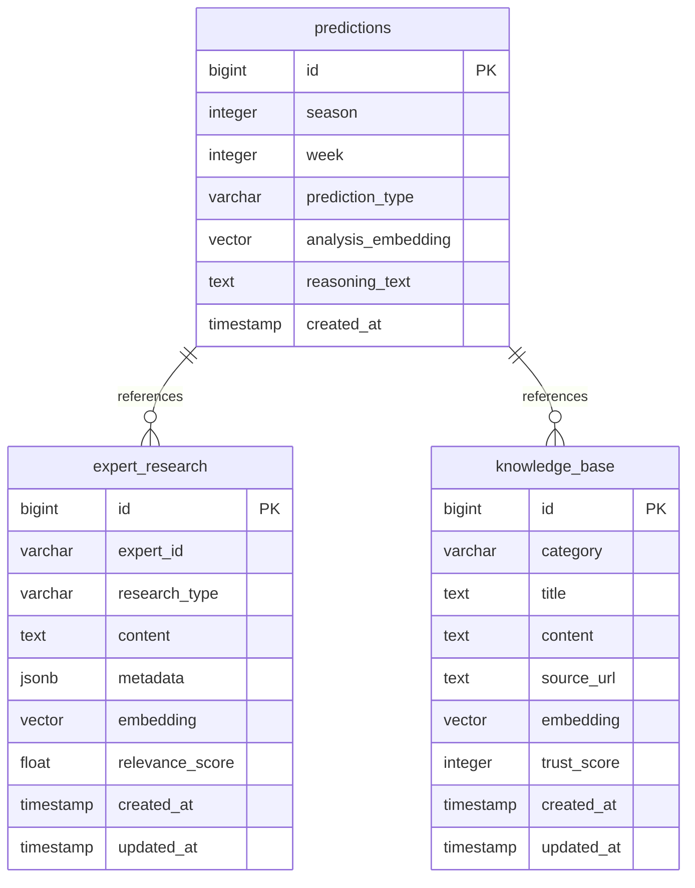
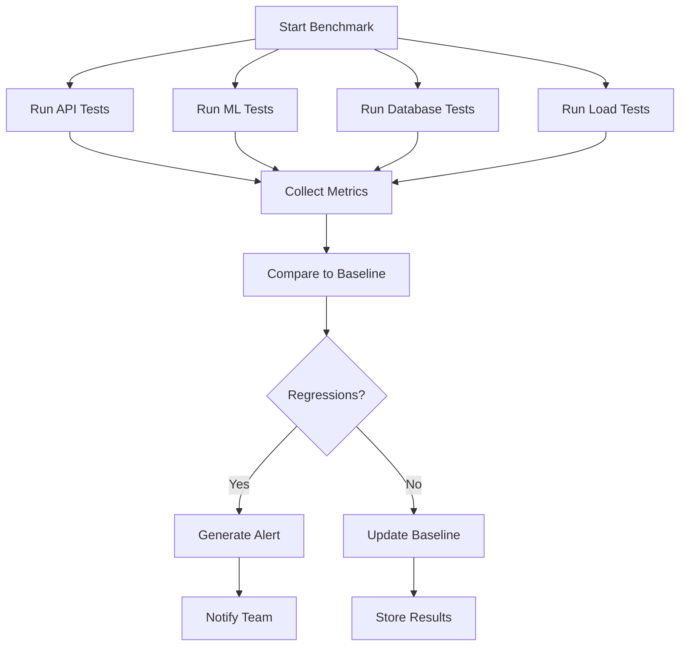

# Performance Optimization

<cite>
**Referenced Files in This Document**   
- [src/cache/cache_manager.py](file://src/cache/cache_manager.py)
- [src/performance/optimized_prediction_service.py](file://src/performance/optimized_prediction_service.py)
- [config/redis_config.py](file://config/redis_config.py)
- [src/database/migrations/001_enable_pgvector.sql](file://src/database/migrations/001_enable_pgvector.sql)
- [src/database/migrations/002_vector_search_functions.sql](file://src/database/migrations/002_vector_search_functions.sql)
- [scripts/add_performance_indexes.py](file://scripts/add_performance_indexes.py)
- [scripts/performance_baseline.py](file://scripts/performance_baseline.py)
- [src/monitoring/performance_dashboard.py](file://src/monitoring/performance_dashboard.py)
</cite>

## Table of Contents
1. [Caching Architecture](#caching-architecture)
2. [Optimized Prediction Service](#optimized-prediction-service)
3. [Database Performance Enhancements](#database-performance-enhancements)
4. [Performance Monitoring and Metrics](#performance-monitoring-and-metrics)
5. [Performance Benchmarking and Validation](#performance-benchmarking-and-validation)
6. [Scalability and Resource Allocation](#scalability-and-resource-allocation)
7. [Cost Efficiency in Production](#cost-efficiency-in-production)

## Caching Architecture

The NFL Predictor API implements a sophisticated Redis-based caching architecture designed to achieve sub-second response times for prediction requests. The system uses a dual-layer caching strategy with Redis as the primary cache and an in-memory fallback mechanism to ensure high availability even during Redis outages.

The CacheManager class provides comprehensive cache management with TTL-based expiration (default 30 minutes), cache key generation, and health monitoring. Cache keys are generated using a consistent hashing strategy that incorporates request parameters, ensuring that identical requests receive cached responses. For long parameter strings, MD5 hashing is used to maintain key length efficiency.

The caching system supports multiple cache operations including get, set, delete, and pattern-based invalidation. It automatically handles connection failures by falling back to in-memory storage, maintaining service continuity. The cache health status is continuously monitored, with metrics including Redis connection status, memory usage, connected clients, and uptime.

Cache warming strategies are implemented to pre-populate frequently accessed data, reducing cold start latency. The system invalidates cache entries based on patterns, allowing for targeted cache clearing when underlying data changes. This architecture enables the API to handle high request volumes while maintaining consistent performance.

**Section sources**
- [src/cache/cache_manager.py](file://src/cache/cache_manager.py#L1-L430)
- [config/redis_config.py](file://config/redis_config.py#L1-L664)

## Optimized Prediction Service

The OptimizedPredictionService is designed to handle 375+ predictions per game with sub-second response times through multiple performance optimization techniques. The service leverages parallel processing with asyncio.gather() to simultaneously execute multiple prediction tasks, significantly reducing overall processing time.

Key optimization features include Redis caching with a 5-minute TTL, database connection pooling using asyncpg, and response compression for large payloads. The service implements field selection to reduce response size, allowing clients to request only specific data fields they need, minimizing bandwidth usage.

The prediction service processes requests in batches, with configurable batch sizes to optimize parallel processing efficiency. It uses a semaphore to limit concurrent operations, preventing resource exhaustion during peak loads. Each game's predictions are generated in parallel, with expert predictions, ML predictions, player props, and totals processed concurrently.

The service includes comprehensive performance monitoring, tracking metrics such as response time, cache hit rate, parallel workers, and database query time. These metrics are exposed through a dedicated performance endpoint, enabling real-time monitoring of service health and optimization effectiveness.

**Section sources**
- [src/performance/optimized_prediction_service.py](file://src/performance/optimized_prediction_service.py#L1-L727)

## Database Performance Enhancements

The NFL Predictor API implements several database performance enhancements to optimize query efficiency and data retrieval speed. Strategic indexing is applied to critical database tables, with concurrent index creation to avoid table locking during production operations.

The system uses pgvector integration for similarity search capabilities, enabling semantic search across news articles, expert research, and prediction analysis. The pgvector extension is enabled with HNSW (Hierarchical Navigable Small World) indexes for efficient vector similarity search using cosine distance operations.

Key database indexes include:
- Composite indexes on predictions table for season, week, and prediction type
- User-specific indexes for authentication and subscription queries
- Time-based indexes for created_at and expires_at fields
- GIN indexes for JSON field optimization

The database schema includes specialized tables for expert research, betting history, and knowledge base with vector embeddings. These tables support advanced search functions that enable intelligent expert research strategies and pattern recognition in betting behavior.

**Diagram sources**
- [src/database/migrations/001_enable_pgvector.sql](file://src/database/migrations/001_enable_pgvector.sql#L1-L89)
- [src/database/migrations/002_vector_search_functions.sql](file://src/database/migrations/002_vector_search_functions.sql#L1-L249)
- [scripts/add_performance_indexes.py](file://scripts/add_performance_indexes.py#L1-L83)

## Performance Monitoring and Metrics

The NFL Predictor API includes a comprehensive performance monitoring system that tracks key metrics and provides real-time insights into system health. The monitoring dashboard collects and visualizes performance data, enabling proactive identification of potential bottlenecks.

The system monitors cache performance, tracking hit rates, memory usage, and connection statistics. Database query performance is continuously monitored, with alerts configured for slow queries or connection pool exhaustion. The prediction service exposes detailed performance metrics including response time, total predictions processed, cache hit rate, and parallel worker utilization.

Monitoring includes health checks for Redis connectivity, memory usage, and persistence configuration. Alerting mechanisms are in place for high memory usage (above 80% threshold) and excessive connection counts. The system generates detailed performance reports that include both current metrics and historical trends.

The monitoring infrastructure supports both real-time dashboards and periodic reporting, allowing teams to analyze performance patterns over time. This enables data-driven decisions for capacity planning and optimization efforts.

**Section sources**
- [src/monitoring/performance_dashboard.py](file://src/monitoring/performance_dashboard.py#L1-L50)
- [config/redis_config.py](file://config/redis_config.py#L1-L664)

## Performance Benchmarking and Validation

The NFL Predictor API implements a robust performance benchmarking framework to establish baselines and validate optimizations. The performance_baseline.py script creates and manages performance baselines for regression testing across multiple categories including API, ML, database, and load testing.

The benchmarking system runs automated tests that measure execution time, memory usage, and query efficiency. It establishes statistical baselines using mean, median, minimum, and maximum values, with standard deviation to measure consistency. These baselines are used to detect performance regressions during development and deployment.

The validation system compares current performance against established baselines, flagging any regressions that exceed configurable tolerance thresholds (default 20%). It generates detailed reports highlighting both regressions and improvements, providing actionable insights for optimization efforts.

Load testing is integrated into the benchmarking framework, simulating realistic user traffic patterns to validate system performance under expected peak loads. The system measures key metrics such as requests per second, error rates, and response time percentiles.

**Diagram sources**
- [scripts/performance_baseline.py](file://scripts/performance_baseline.py#L1-L461)

## Scalability and Resource Allocation

The NFL Predictor API is designed with scalability in mind to handle peak loads during game days. The system employs horizontal scaling strategies, allowing additional instances to be deployed to meet increased demand. Resource allocation is optimized through connection pooling, thread management, and efficient memory usage.

During high-traffic periods, the system automatically adjusts resource utilization based on load patterns. The prediction service limits concurrent operations to prevent resource exhaustion while maintaining optimal throughput. Database connection pooling with asyncpg ensures efficient database resource usage, with configurable pool sizes to balance performance and resource consumption.

The caching architecture plays a crucial role in scalability, absorbing a significant portion of read requests and reducing load on the database and prediction engines. Cache warming strategies are employed before anticipated peak periods to ensure optimal performance from the start of high-traffic events.

Resource allocation is monitored and adjusted based on real-time performance metrics, with automated scaling policies that trigger additional resources when predefined thresholds are exceeded. This ensures consistent performance while optimizing infrastructure costs.

**Section sources**
- [src/performance/optimized_prediction_service.py](file://src/performance/optimized_prediction_service.py#L1-L727)
- [src/cache/cache_manager.py](file://src/cache/cache_manager.py#L1-L430)

## Cost Efficiency in Production

The performance optimizations implemented in the NFL Predictor API directly contribute to cost efficiency in production environments. By achieving sub-second response times through caching and parallel processing, the system reduces the need for over-provisioned infrastructure, lowering compute costs.

The efficient use of database resources through strategic indexing and query optimization reduces database load, allowing for smaller database instances or lower-tier service plans. The connection pooling and thread management minimize resource contention, improving overall system efficiency.

Cache hit rate optimization reduces the number of expensive prediction computations required, significantly lowering CPU utilization and associated costs. The field selection feature reduces bandwidth usage, lowering data transfer costs, particularly important for mobile clients.

The monitoring and benchmarking systems enable data-driven decisions about infrastructure scaling, preventing both over-provisioning (wasted resources) and under-provisioning (poor performance). This balanced approach to resource allocation maximizes cost efficiency while maintaining high service quality.

**Section sources**
- [src/performance/optimized_prediction_service.py](file://src/performance/optimized_prediction_service.py#L1-L727)
- [src/cache/cache_manager.py](file://src/cache/cache_manager.py#L1-L430)
- [scripts/performance_baseline.py](file://scripts/performance_baseline.py#L1-L461)