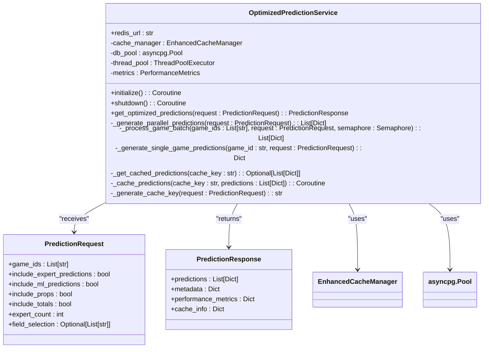

# Query Performance

<cite>
**Referenced Files in This Document**   
- [optimized_prediction_service.py](file://src/performance/optimized_prediction_service.py)
- [database_optimization.py](file://config/database_optimization.py)
- [performance_dashboard.py](file://src/monitoring/performance_dashboard.py)
- [historical_vector_service.py](file://src/ml/historical_vector_service.py)
</cite>

## Table of Contents
1. [Introduction](#introduction)
2. [Optimized Prediction Service Architecture](#optimized-prediction-service-architecture)
3. [Query Optimization Strategies](#query-optimization-strategies)
4. [pgvector Integration for Historical Matching](#pgvector-integration-for-historical-matching)
5. [Performance Monitoring and Bottleneck Detection](#performance-monitoring-and-bottleneck-detection)
6. [Query Performance Metrics and Visualization](#query-performance-metrics-and-visualization)
7. [Trade-offs in Query Complexity and Response Time](#trade-offs-in-query-complexity-and-response-time)
8. [Conclusion](#conclusion)

## Introduction
The NFL Predictor API employs sophisticated query performance optimization techniques to deliver comprehensive predictions with sub-second response times. This document details the architecture and implementation of the OptimizedPredictionService, which reduces database round-trips through batched queries and result set filtering. The system integrates pgvector for similarity-based historical game matching, significantly improving prediction accuracy while maintaining performance. Performance bottlenecks are identified through a comprehensive monitoring dashboard and resolved through query refactoring and optimization. The document also addresses the trade-offs between query complexity and response time, particularly for comprehensive prediction requests spanning multiple categories.

**Section sources**
- [optimized_prediction_service.py](file://src/performance/optimized_prediction_service.py#L1-L50)

## Optimized Prediction Service Architecture
The OptimizedPredictionService is designed to handle 375+ predictions per game with sub-second response times through multiple performance optimization techniques. The service implements Redis caching with 5-minute TTL, parallel processing with asyncio.gather(), database connection pooling, and response compression. The architecture features a sophisticated caching strategy where requests are hashed based on their parameters to generate cache keys, enabling efficient retrieval of previously computed predictions.

The service processes prediction requests through a parallelized workflow that splits games into batches and processes them concurrently using asyncio semaphores to limit concurrent operations. For each game, different prediction types (expert, ML, player props, totals) are generated in parallel, significantly reducing overall processing time. The service also implements field selection to reduce response size by allowing clients to specify which fields they need, minimizing data transfer overhead.



**Diagram sources **
- [optimized_prediction_service.py](file://src/performance/optimized_prediction_service.py#L71-L717)

**Section sources**
- [optimized_prediction_service.py](file://src/performance/optimized_prediction_service.py#L71-L717)

## Query Optimization Strategies
The system employs multiple query optimization strategies to minimize database round-trips and improve performance. The OptimizedPredictionService reduces database interactions through batched queries and result set filtering, processing multiple games in parallel and aggregating results efficiently. Connection pooling is implemented using asyncpg, maintaining a pool of database connections that can be reused across requests, eliminating the overhead of establishing new connections for each query.

The service implements an asynchronous query pattern where multiple prediction types are executed concurrently within a single game processing task. Expert predictions, ML predictions, player props, and totals predictions are all generated in parallel, with results gathered using asyncio.gather(). This approach maximizes resource utilization and minimizes idle time. The connection pool is configured with optimal settings including a minimum size of 5 connections, maximum size of 20 connections, and command timeout of 10 seconds, ensuring efficient resource management.

```mermaid
sequenceDiagram
participant Client
participant OptimizedPredictionService
participant Cache
participant DatabasePool
participant ExpertService
participant MLService
Client->>OptimizedPredictionService : PredictionRequest
OptimizedPredictionService->>Cache : Check cache with generated key
alt Cache hit
Cache-->>OptimizedPredictionService : Return cached predictions
OptimizedPredictionService-->>Client : PredictionResponse
else Cache miss
Cache-->>OptimizedPredictionService : No cache entry
OptimizedPredictionService->>OptimizedPredictionService : Split games into batches
loop For each batch
OptimizedPredictionService->>OptimizedPredictionService : Process batch with semaphore
loop For each game in batch
OptimizedPredictionService->>OptimizedPredictionService : Generate predictions in parallel
parallel Expert, ML, Props, Totals
OptimizedPredictionService->>ExpertService : Get expert predictions
OptimizedPredictionService->>MLService : Get ML predictions
OptimizedPredictionService->>MLService : Get player props
OptimizedPredictionService->>MLService : Get totals predictions
end
end
end
OptimizedPredictionService->>DatabasePool : Execute optimized queries
DatabasePool-->>OptimizedPredictionService : Return query results
OptimizedPredictionService->>Cache : Store results with TTL
OptimizedPredictionService-->>Client : PredictionResponse
end
```

**Diagram sources **
- [optimized_prediction_service.py](file://src/performance/optimized_prediction_service.py#L150-L221)
- [database_optimization.py](file://config/database_optimization.py#L53-L194)

**Section sources**
- [optimized_prediction_service.py](file://src/performance/optimized_prediction_service.py#L150-L221)
- [database_optimization.py](file://config/database_optimization.py#L53-L194)

## pgvector Integration for Historical Matching
The system integrates pgvector for similarity-based historical game matching, enabling experts to find similar games and learn from past outcomes. The HistoricalVectorService loads two years of historical NFL data into pgvector, creating a rich dataset for pattern matching. When processing a prediction request, the service can identify historically similar games based on key parameters such as point spread and total points, providing valuable context for the prediction algorithms.

The historical matching algorithm uses a similarity scoring system that considers both the numerical proximity of spreads and totals, as well as same-team matchups which receive higher similarity weights. For each game, the service identifies the top 10 most similar historical games and analyzes their outcomes, including whether the home team covered the spread and whether the total went over or under. This historical context is particularly valuable for specialized experts like the "Sharp Bettor," "Weather Wizard,"