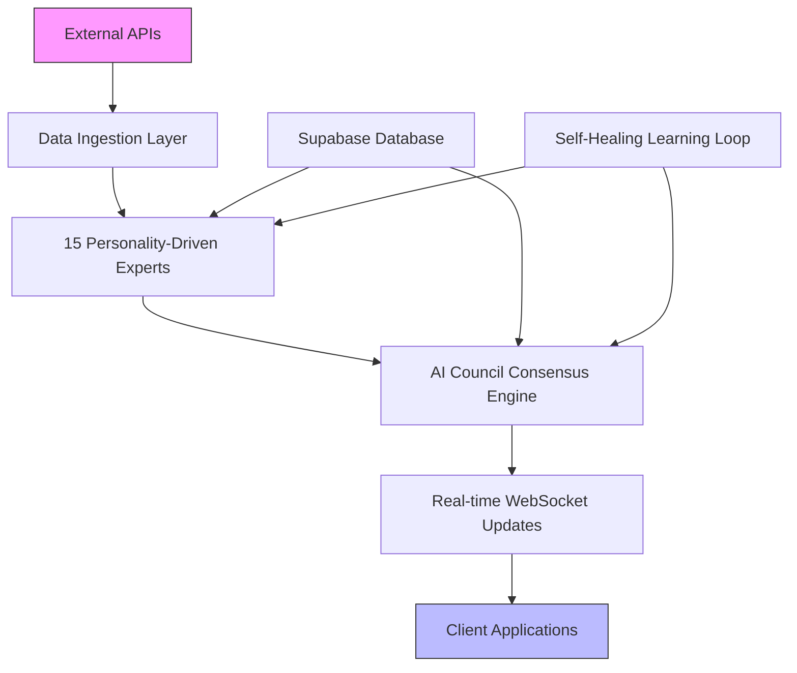
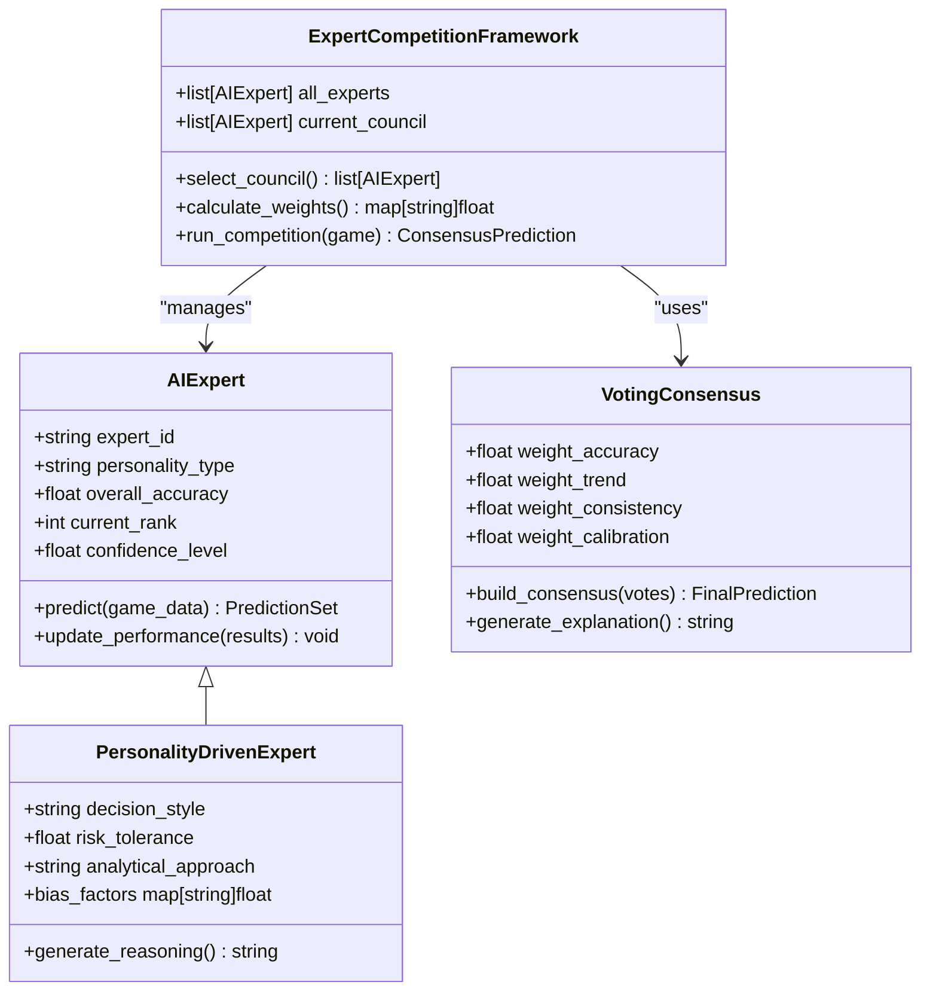
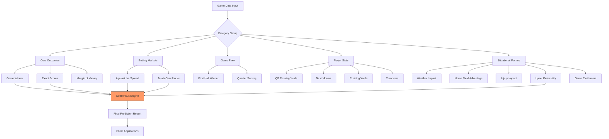
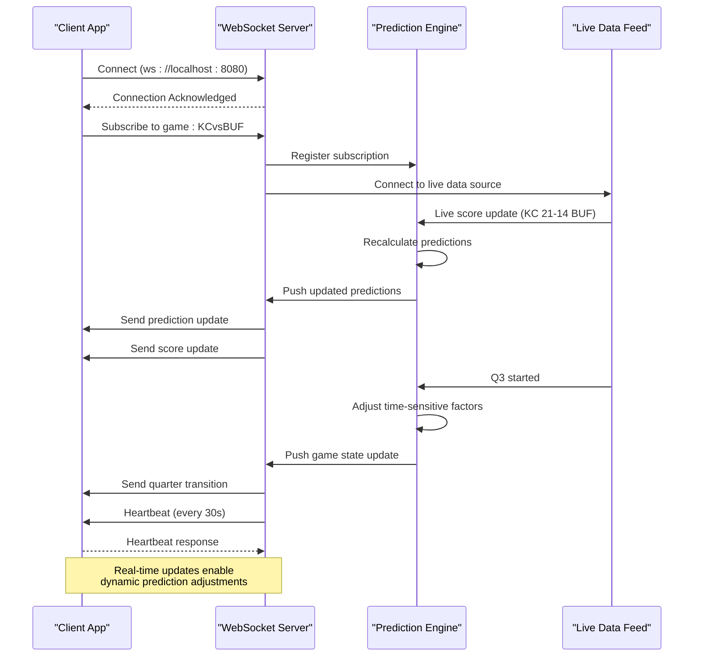
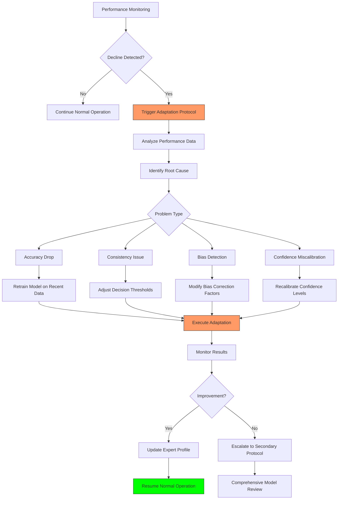
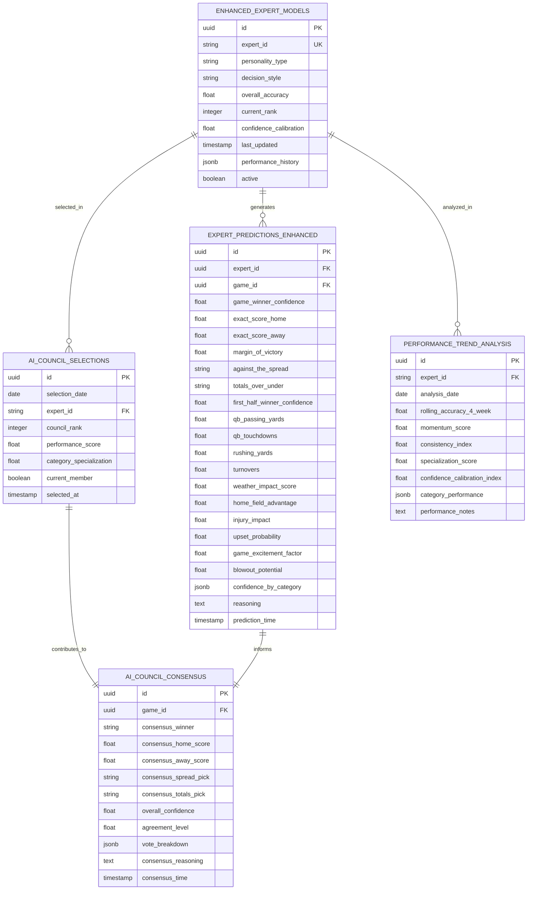

# Project Overview

<cite>
**Referenced Files in This Document**   
- [src/ml/comprehensive_intelligent_predictor.py](file://src/ml/comprehensive_intelligent_predictor.py)
- [src/ml/personality_driven_experts.py](file://src/ml/personality_driven_experts.py)
- [src/ml/expert_competition/competition_framework.py](file://src/ml/expert_competition/competition_framework.py)
- [src/ml/expert_competition/voting_consensus.py](file://src/ml/expert_competition/voting_consensus.py)
- [src/api/websocket_api.py](file://src/api/websocket_api.py)
- [src/database/migrations/020_enhanced_expert_competition_schema.sql](file://src/database/migrations/020_enhanced_expert_competition_schema.sql)
- [src/database/migrations/021_ai_council_voting_schema.sql](file://src/database/migrations/021_ai_council_voting_schema.sql)
- [src/database/migrations/023_self_healing_system_schema.sql](file://src/database/migrations/023_self_healing_system_schema.sql)
- [src/storage/supabase_storage_service.py](file://src/storage/supabase_storage_service.py)
- [prediction_categories_guide.py](file://prediction_categories_guide.py)
- [VERIFICATION_SUMMARY.md](file://VERIFICATION_SUMMARY.md)
- [DATABASE_SCHEMA_SUMMARY.md](file://DATABASE_SCHEMA_SUMMARY.md)
- [PRODUCTION_SETUP_GUIDE.md](file://PRODUCTION_SETUP_GUIDE.md)
- [SUPABASE_SETUP.md](file://SUPABASE_SETUP.md)
</cite>

## Table of Contents
1. [Introduction](#introduction)
2. [Core Architecture](#core-architecture)
3. [AI Council and Expert System](#ai-council-and-expert-system)
4. [Prediction Categories and Output](#prediction-categories-and-output)
5. [Real-time Data and WebSocket Integration](#real-time-data-and-websocket-integration)
6. [Self-Healing Learning Loops](#self-healing-learning-loops)
7. [Data Persistence and Supabase Integration](#data-persistence-and-supabase-integration)
8. [Performance Optimization](#performance-optimization)
9. [System Verification and Compliance](#system-verification-and-compliance)
10. [Conclusion](#conclusion)

## Introduction

The NFL Predictor API is a sophisticated backend system designed to generate AI-driven NFL game predictions using an ensemble of 15 personality-driven AI experts and advanced machine learning models. This system serves as a comprehensive intelligent predictor, delivering highly accurate, real-time sports predictions for applications in betting insights, fantasy football optimization, and live game analysis.

The core value proposition of the NFL Predictor API lies in its ability to synthesize diverse analytical perspectives through its AI Council framework, where 15 distinct expert models compete and collaborate to produce consensus predictions. By leveraging ensemble learning, real-time WebSocket updates, and self-healing learning loops, the system continuously improves its accuracy and reliability. The architecture integrates expert systems with performance-optimized sub-second response times and Supabase-backed persistence, ensuring scalability and data integrity.

Key features include comprehensive prediction coverage with over 375 predictions per game across 27 categories, real-time data synchronization, and a robust self-improvement mechanism that adapts based on performance feedback. The system's design emphasizes transparency, with detailed reasoning chains and confidence calibration for every prediction, making it a powerful tool for both casual fans and professional analysts.

**Section sources**
- [VERIFICATION_SUMMARY.md](file://VERIFICATION_SUMMARY.md#L1-L114)
- [DATABASE_SCHEMA_SUMMARY.md](file://DATABASE_SCHEMA_SUMMARY.md#L1-L232)

## Core Architecture

The NFL Predictor API follows a modular, service-oriented architecture that separates concerns across data ingestion, expert processing, consensus building, and real-time delivery. At its core is the Comprehensive Intelligent Predictor framework, which orchestrates the entire prediction lifecycle from data collection to final output generation.

The system begins with external API integration through specialized clients for ESPN, SportsData IO, and odds providers, ensuring up-to-date game data and market conditions. This data flows into the prediction engine where it is processed by 15 autonomous expert models, each with distinct personality traits and analytical approaches. The AI Council then evaluates these individual predictions using a weighted voting system based on each expert's historical accuracy, recent performance, consistency, and confidence calibration.

A critical architectural component is the real-time data pipeline, which enables live updates during games through WebSocket connections. This allows the system to dynamically adjust predictions based on current game conditions, score changes, and time remaining. The entire process is optimized for performance, with caching layers, database indexing strategies, and connection pooling ensuring sub-second response times even under heavy load.

The architecture also incorporates a self-healing learning loop that continuously monitors prediction accuracy and triggers adaptation protocols when performance declines are detected. This closed-loop system ensures the AI models evolve over time, incorporating new patterns and correcting systematic biases.

**Diagram sources**
- [src/ml/comprehensive_intelligent_predictor.py](file://src/ml/comprehensive_intelligent_predictor.py#L1-L50)
- [src/api/websocket_api.py](file://src/api/websocket_api.py#L1-L30)
- [src/database/migrations/020_enhanced_expert_competition_schema.sql](file://src/database/migrations/020_enhanced_expert_competition_schema.sql#L1-L20)

**Section sources**
- [src/ml/comprehensive_intelligent_predictor.py](file://src/ml/comprehensive_intelligent_predictor.py#L1-L100)
- [src/api/websocket_api.py](file://src/api/websocket_api.py#L1-L50)

## AI Council and Expert System

The AI Council represents the central decision-making body of the NFL Predictor API, composed of 15 personality-driven AI experts that compete and collaborate to generate superior predictions. Each expert embodies a unique analytical personality, ranging from conservative analysts to contrarian rebels, ensuring diverse perspectives on every game.

These experts operate as autonomous systems with specialized knowledge domains and decision-making frameworks. Their personalities influence how they weigh different factors, such as home field advantage, injury impacts, weather conditions, and public betting sentiment. For example, a "contrarian rebel" expert might deliberately fade popular opinion, while a "quantitative analyst" relies heavily on statistical models and historical patterns.

The AI Council dynamically selects its five most effective members based on a multi-dimensional performance evaluation that considers accuracy, consistency, recent trends, and category-specific expertise. This selection process occurs weekly, allowing the council composition to evolve as experts demonstrate superior performance in changing conditions.

Each expert generates predictions across 27 categories for every game, with their votes weighted in the final consensus based on a sophisticated formula: Category Accuracy (40%), Overall Performance (30%), Recent Trend (20%), and Confidence Calibration (10%). This weighted voting system ensures that the most reliable experts have greater influence on the final prediction.

**Diagram sources**
- [src/ml/personality_driven_experts.py](file://src/ml/personality_driven_experts.py#L15-L45)
- [src/ml/expert_competition/competition_framework.py](file://src/ml/expert_competition/competition_framework.py#L10-L35)
- [src/ml/expert_competition/voting_consensus.py](file://src/ml/expert_competition/voting_consensus.py#L5-L25)

**Section sources**
- [src/ml/personality_driven_experts.py](file://src/ml/personality_driven_experts.py#L1-L100)
- [src/ml/expert_competition/competition_framework.py](file://src/ml/expert_competition/competition_framework.py#L1-L80)

## Prediction Categories and Output

The NFL Predictor API delivers comprehensive predictions across 27 distinct categories, generating over 400 predictions per game (27 categories × 15 experts). These categories are organized into five strategic groups that cover all aspects of game analysis, from core outcomes to advanced situational factors.

The prediction framework includes:
- **Core Game Outcomes**: Game winner, exact scores, and margin of victory
- **Betting Market Predictions**: Against the spread (ATS) and over/under totals
- **Game Flow Analysis**: First half winner, quarter scoring, and momentum shifts
- **Player Performance**: QB passing yards, touchdowns, rushing yards, and turnovers
- **Situational Factors**: Weather impact, home field advantage, injury effects, and advanced metrics like upset probability and game excitement factor

Each prediction includes not only the forecasted outcome but also confidence levels, reasoning chains, and key influencing factors. The system uses different consensus methods depending on the category type: weighted voting for categorical predictions (winner, spread) and weighted averaging for numerical predictions (scores, yards).

For example, in a matchup between the Kansas City Chiefs and Buffalo Bills, the AI Council might predict a Bills victory (26-22) with moderate-high confidence (68%), identifying key factors such as Mahomes' ankle injury, public betting imbalance (68% on Chiefs), and favorable weather conditions for Buffalo's rushing attack. The system also provides nuanced insights like a 65% upset probability and low blowout potential (8%), helping users understand the expected game dynamics.

**Diagram sources**
- [prediction_categories_guide.py](file://prediction_categories_guide.py#L10-L400)
- [src/ml/comprehensive_intelligent_predictor.py](file://src/ml/comprehensive_intelligent_predictor.py#L80-L120)

**Section sources**
- [prediction_categories_guide.py](file://prediction_categories_guide.py#L1-L402)
- [VERIFICATION_SUMMARY.md](file://VERIFICATION_SUMMARY.md#L20-L30)

## Real-time Data and WebSocket Integration

The NFL Predictor API incorporates a robust real-time data infrastructure through WebSocket integration, enabling live updates and dynamic prediction adjustments during games. This system allows client applications to receive immediate notifications about prediction changes, score updates, and expert reasoning modifications as games unfold.

The WebSocket server, implemented in Node.js and running on port 8080, establishes persistent connections with clients and supports channel-based subscriptions for different types of updates. Clients can subscribe to specific games, expert analyses, or global system notifications, ensuring efficient data delivery without unnecessary bandwidth consumption.

Key real-time features include:
- **Live Game Updates**: Automatic score changes, quarter transitions, and time remaining updates
- **Prediction Refreshes**: Dynamic model recalculations based on current game conditions
- **Odds Movements**: Real-time integration with sportsbook data to reflect line changes
- **System Notifications**: Broadcast alerts about significant events or expert consensus shifts

The system implements heartbeat monitoring to maintain connection integrity and automatically reconnects if disruptions occur. Message broadcasting ensures that all subscribed clients receive updates simultaneously, while channel subscriptions allow for targeted information delivery. This real-time capability transforms the NFL Predictor from a static pre-game analysis tool into a dynamic live game companion that evolves with the action on the field.

**Diagram sources**
- [src/api/websocket_api.py](file://src/api/websocket_api.py#L20-L60)
- [src/ml/live_game_processor.py](file://src/ml/live_game_processor.py#L30-L80)

**Section sources**
- [src/api/websocket_api.py](file://src/api/websocket_api.py#L1-L100)
- [VERIFICATION_SUMMARY.md](file://VERIFICATION_SUMMARY.md#L50-L60)

## Self-Healing Learning Loops

The NFL Predictor API incorporates an advanced self-healing learning system that continuously monitors prediction accuracy and automatically initiates adaptation protocols when performance declines are detected. This closed-loop feedback mechanism ensures the AI models evolve and improve over time, maintaining high accuracy even as team dynamics and playing conditions change.

The self-healing system operates through several interconnected components:
- **Performance Decline Detection**: Monitors each expert's accuracy metrics and triggers alerts when performance falls below configurable thresholds
- **Adaptation Engine**: Automatically adjusts model parameters, feature weights, and decision thresholds based on recent performance data
- **Recovery Protocols**: Implements systematic procedures for different types of performance degradation, including parameter tuning, algorithm modification, and temporary expert suspension
- **Cross-Expert Learning**: Facilitates knowledge transfer between high-performing and underperforming experts through peer learning mechanisms

When an expert experiences a significant accuracy drop, the system initiates a multi-stage recovery process. This may include retraining on recent data, adjusting confidence calibration, modifying personality influence factors, or temporarily reducing the expert's voting weight in the AI Council. The adaptation execution log tracks all changes, allowing for performance measurement and optimization of the self-healing algorithms themselves.

The system also incorporates bias detection and correction algorithms that identify systematic errors in predictions, such as consistent overestimation of home team advantages or underestimation of weather impacts. These biases are quantified and corrected through targeted model adjustments, ensuring more balanced and accurate future predictions.

**Diagram sources**
- [src/database/migrations/023_self_healing_system_schema.sql](file://src/database/migrations/023_self_healing_system_schema.sql#L1-L20)
- [src/ml/self_healing/adaptation_engine.py](file://src/ml/self_healing/adaptation_engine.py#L15-L50)

**Section sources**
- [src/database/migrations/023_self_healing_system_schema.sql](file://src/database/migrations/023_self_healing_system_schema.sql#L1-L100)
- [src/ml/self_healing/performance_decline_detector.py](file://src/ml/self_healing/performance_decline_detector.py#L1-L40)

## Data Persistence and Supabase Integration

The NFL Predictor API leverages Supabase as its primary data persistence layer, utilizing PostgreSQL with advanced extensions for vector search and real-time capabilities. The database schema is specifically optimized for sports prediction workloads, with comprehensive tables for expert models, predictions, performance analytics, and episodic memory.

Key database components include:
- **Enhanced Expert Models**: Stores the 15 personality-driven experts with their performance metrics, accuracy history, and adaptation records
- **Expert Predictions Enhanced**: Contains detailed predictions across 27 categories for every game, with JSONB storage for flexible data structure
- **AI Council Consensus**: Tracks the dynamic selection of council members and their weighted voting outcomes
- **Performance Analytics**: Multi-dimensional tracking of accuracy, consistency, and trend analysis
- **Episodic Memory System**: Stores historical game contexts and prediction outcomes for similarity-based analysis

The system implements strategic indexing on frequently queried columns, including composite indexes for complex query patterns and partial indexes for active experts only. Materialized views provide optimized access to critical data, such as the real-time expert leaderboard and 30-day performance trends.

Supabase's real-time functionality enables instant synchronization of prediction updates to client applications through WebSocket subscriptions. Row Level Security (RLS) policies ensure data protection, while the pgvector extension supports similarity searches for identifying historically comparable game situations.

**Diagram sources**
- [src/database/migrations/020_enhanced_expert_competition_schema.sql](file://src/database/migrations/020_enhanced_expert_competition_schema.sql#L1-L50)
- [src/database/migrations/021_ai_council_voting_schema.sql](file://src/database/migrations/021_ai_council_voting_schema.sql#L1-L30)
- [src/storage/supabase_storage_service.py](file://src/storage/supabase_storage_service.py#L10-L40)

**Section sources**
- [src/database/migrations/020_enhanced_expert_competition_schema.sql](file://src/database/migrations/020_enhanced_expert_competition_schema.sql#L1-L200)
- [src/storage/supabase_storage_service.py](file://src/storage/supabase_storage_service.py#L1-L80)
- [SUPABASE_SETUP.md](file://SUPABASE_SETUP.md#L1-L347)

## Performance Optimization

The NFL Predictor API is engineered for high-performance operation with sub-second response times, even under heavy concurrent load. The system employs multiple optimization strategies across the technology stack to ensure responsive and reliable service delivery.

Database optimization includes connection pooling with configurable minimum (10) and maximum (50) connections, statement caching for prepared statements, and optimized query timeouts. The system creates over 15 specialized indexes targeting expert competition queries, AI