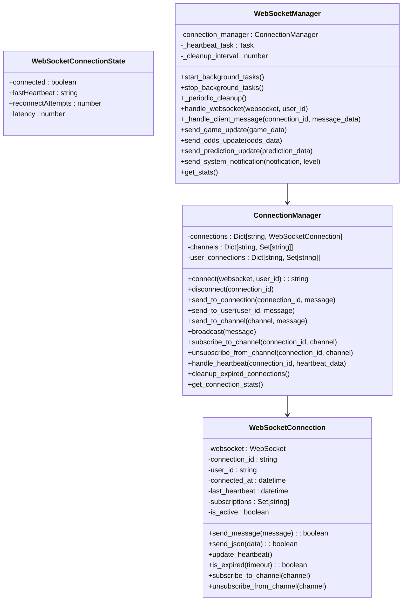
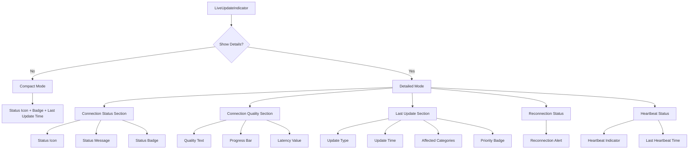
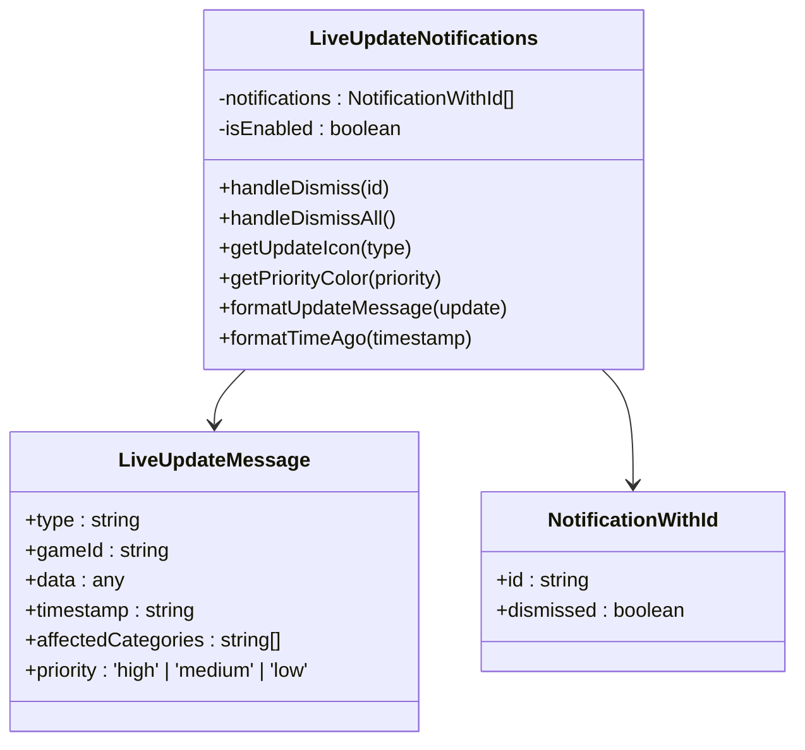
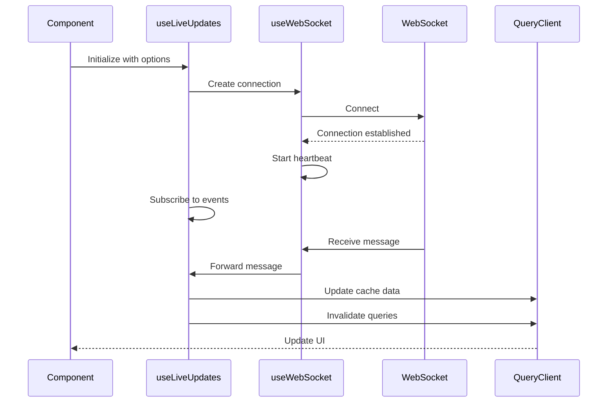
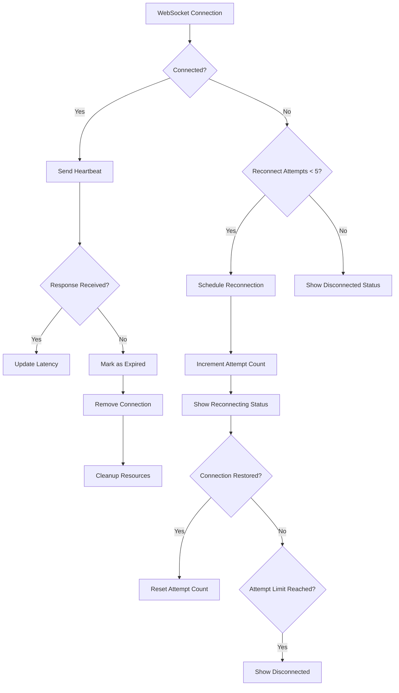
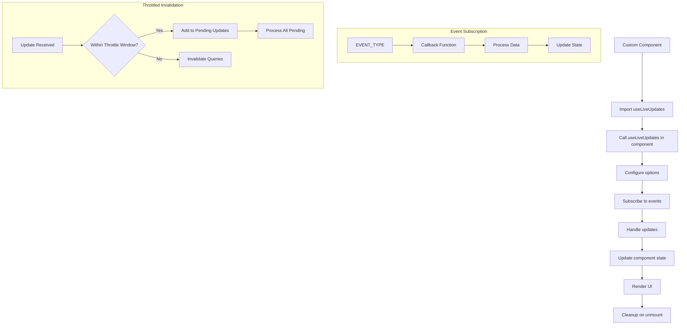
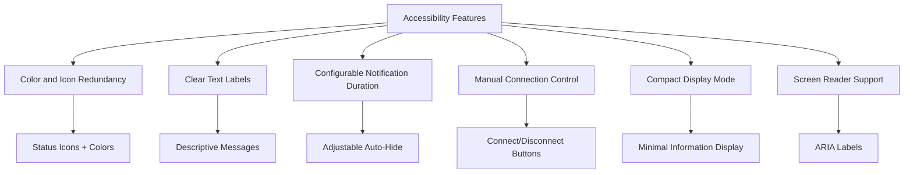

# Client Synchronization

<cite>
**Referenced Files in This Document**   
- [LiveUpdateIndicator.tsx](file://src/components/realtime/LiveUpdateIndicator.tsx)
- [LiveUpdateNotifications.tsx](file://src/components/realtime/LiveUpdateNotifications.tsx)
- [useLiveUpdates.ts](file://src/hooks/useLiveUpdates.ts)
- [useWebSocket.ts](file://src/hooks/useWebSocket.ts)
- [websocket_manager.py](file://src/websocket/websocket_manager.py)
- [realtime_endpoints.py](file://src/api/realtime_endpoints.py)
- [aiCouncil.ts](file://src/types/aiCouncil.ts)
</cite>

## Table of Contents
1. [Introduction](#introduction)
2. [Architecture Overview](#architecture-overview)
3. [Connection State Model](#connection-state-model)
4. [LiveUpdateIndicator Component](#liveupdateindicator-component)
5. [Notification System](#notification-system)
6. [React Hooks for WebSocket Management](#react-hooks-for-websocket-management)
7. [Connection Interruption Handling](#connection-interruption-handling)
8. [Custom Real-Time Component Implementation](#custom-real-time-component-implementation)
9. [Accessibility Considerations](#accessibility-considerations)
10. [Conclusion](#conclusion)

## Introduction
The client-side synchronization system maintains real-time state between the server and frontend through a WebSocket-based architecture. This documentation details the components responsible for connection monitoring, state updates, and user feedback. The system provides visual indicators of connection status, latency, and update timing while managing automatic reconnection and data synchronization. It supports multiple priority levels for updates and offers React hooks for seamless integration with UI components.

## Architecture Overview

```mermaid
graph TD
subgraph "Frontend"
A[LiveUpdateIndicator] --> B[useLiveUpdates Hook]
C[LiveUpdateNotifications] --> B
B --> D[useWebSocket Hook]
D --> E[WebSocket Connection]
end
subgraph "Backend"
F[WebSocketManager] --> G[ConnectionManager]
H[realtime_endpoints.py] --> F
I[real_time_pipeline] --> F
end
E < --> F
G --> J[Active Connections]
G --> K[Channel Subscriptions]
G --> L[Heartbeat Monitoring]
```

**Diagram sources**
- [LiveUpdateIndicator.tsx](file://src/components/realtime/LiveUpdateIndicator.tsx)
- [useLiveUpdates.ts](file://src/hooks/useLiveUpdates.ts)
- [useWebSocket.ts](file://src/hooks/useWebSocket.ts)
- [websocket_manager.py](file://src/websocket/websocket_manager.py)
- [realtime_endpoints.py](file://src/api/realtime_endpoints.py)

**Section sources**
- [LiveUpdateIndicator.tsx](file://src/components/realtime/LiveUpdateIndicator.tsx)
- [useLiveUpdates.ts](file://src/hooks/useLiveUpdates.ts)
- [websocket_manager.py](file://src/websocket/websocket_manager.py)
- [realtime_endpoints.py](file://src/api/realtime_endpoints.py)

## Connection State Model
The connection state model tracks the WebSocket connection status, latency, reconnect attempts, and heartbeat signals. The `WebSocketConnectionState` interface defines the structure with properties including `connected` (boolean), `lastHeartbeat` (timestamp), `reconnectAttempts` (number), and `latency` (number in milliseconds). The system implements automatic reconnection with a maximum of 5 attempts and 3-second intervals between attempts. Heartbeat monitoring occurs every 30 seconds to verify connection health, with connections considered expired after 60 seconds without a heartbeat response.



**Diagram sources**
- [websocket_manager.py](file://src/websocket/websocket_manager.py#L228-L359)
- [aiCouncil.ts](file://src/types/aiCouncil.ts#L200-L205)

**Section sources**
- [websocket_manager.py](file://src/websocket/websocket_manager.py)
- [aiCouncil.ts](file://src/types/aiCouncil.ts)

## LiveUpdateIndicator Component
The LiveUpdateIndicator component provides a visual representation of the connection status, latency, and last update time. It displays different states including connected, disconnected, and reconnecting with appropriate color coding and icons. The component shows latency in milliseconds and categorizes connection quality as excellent (<200ms), good (<500ms), fair (<1000ms), or poor (>1000ms). When updates are received, it displays the time since the last update with a lightning bolt icon. In detailed mode, it shows additional information including affected categories, update priority, and heartbeat status.



**Diagram sources**
- [LiveUpdateIndicator.tsx](file://src/components/realtime/LiveUpdateIndicator.tsx)

**Section sources**
- [LiveUpdateIndicator.tsx](file://src/components/realtime/LiveUpdateIndicator.tsx)

## Notification System
The notification system surfaces real-time updates with three priority levels: high, medium, and low. High-priority updates (red) indicate critical system events or major prediction changes, medium-priority (yellow) for significant updates, and low-priority (blue) for routine updates. Notifications are categorized by type including CONSENSUS_UPDATE, PREDICTION_UPDATE, EXPERT_UPDATE, GAME_UPDATE, and MARKET_MOVEMENT. The system displays affected categories and automatically dismisses notifications after a configurable delay (default 10 seconds). Users can dismiss individual notifications or clear all notifications at once.



**Diagram sources**
- [LiveUpdateNotifications.tsx](file://src/components/realtime/LiveUpdateNotifications.tsx)
- [aiCouncil.ts](file://src/types/aiCouncil.ts#L188-L198)

**Section sources**
- [LiveUpdateNotifications.tsx](file://src/components/realtime/LiveUpdateNotifications.tsx)
- [aiCouncil.ts](file://src/types/aiCouncil.ts)

## React Hooks for WebSocket Management
The system provides React hooks to manage WebSocket state and provide real-time data to UI components. The `useWebSocket` hook handles the WebSocket connection lifecycle, including connection, disconnection, message handling, and reconnection logic. The `useLiveUpdates` hook builds upon `useWebSocket` to provide higher-level functionality for subscribing to specific update types (prediction, consensus, expert, game) and invalidating React Query caches. Both hooks use the React Context API to maintain state and provide callbacks for event handling.



**Diagram sources**
- [useLiveUpdates.ts](file://src/hooks/useLiveUpdates.ts)
- [useWebSocket.ts](file://src/hooks/useWebSocket.ts)

**Section sources**
- [useLiveUpdates.ts](file://src/hooks/useLiveUpdates.ts)
- [useWebSocket.ts](file://src/hooks/useWebSocket.ts)

## Connection Interruption Handling
The frontend handles connection interruptions through automatic reconnection attempts and visual feedback. When a connection is lost, the system attempts to reconnect up to 5 times with 3-second intervals between attempts. During reconnection, the LiveUpdateIndicator displays a "Reconnecting..." message with the current attempt count. If all reconnection attempts fail, it shows a "Disconnected" status. The system maintains a message queue during disconnection and processes pending updates upon reconnection. Heartbeat monitoring ensures connection validity, with connections considered expired after 60 seconds without a response.



**Diagram sources**
- [useWebSocket.ts](file://src/hooks/useWebSocket.ts#L150-L250)
- [websocket_manager.py](file://src/websocket/websocket_manager.py#L100-L150)

**Section sources**
- [useWebSocket.ts](file://src/hooks/useWebSocket.ts)
- [websocket_manager.py](file://src/websocket/websocket_manager.py)

## Custom Real-Time Component Implementation
To implement custom real-time components that respond to WebSocket events, developers should use the `useWebSocket` or `useLiveUpdates` hooks. Custom components can subscribe to specific event types using the `subscribe` method and provide callback functions to handle incoming data. The system supports throttled query invalidation to prevent excessive re-renders. Components should properly clean up subscriptions in their useEffect cleanup functions to prevent memory leaks. The `requestUpdate` function allows components to request specific data from the server on demand.



**Diagram sources**
- [useLiveUpdates.ts](file://src/hooks/useLiveUpdates.ts)
- [useWebSocket.ts](file://src/hooks/useWebSocket.ts)

**Section sources**
- [useLiveUpdates.ts](file://src/hooks/useLiveUpdates.ts)
- [useWebSocket.ts](file://src/hooks/useWebSocket.ts)

## Accessibility Considerations
The system addresses accessibility considerations for users with varying connection qualities through multiple mechanisms. Visual indicators use color and icons to convey connection status, ensuring information is available to color-blind users. Text labels provide clear descriptions of connection states and update types. The notification system includes configurable auto-dismiss delays to accommodate users who need more time to read content. For users with poor connectivity, the system provides clear feedback about reconnection attempts and allows manual connection control. The compact mode of the LiveUpdateIndicator reduces visual clutter for users with cognitive disabilities.



**Diagram sources**
- [LiveUpdateIndicator.tsx](file://src/components/realtime/LiveUpdateIndicator.tsx)
- [LiveUpdateNotifications.tsx](file://src/components/realtime/LiveUpdateNotifications.tsx)

**Section sources**
- [LiveUpdateIndicator.tsx](file://src/components/realtime/LiveUpdateIndicator.tsx)
- [LiveUpdateNotifications.tsx](file://src/components/realtime/LiveUpdateNotifications.tsx)

## Conclusion
The client-side synchronization system provides a robust framework for maintaining real-time state between the server and frontend. Through the LiveUpdateIndicator component, connection state model, notification system, and React hooks, the system delivers a seamless real-time experience. The architecture supports automatic reconnection, efficient data synchronization, and accessible user feedback. Developers can extend the system by implementing custom components that leverage the provided hooks and event system. The comprehensive error handling and accessibility features ensure a reliable experience across different network conditions and user needs.