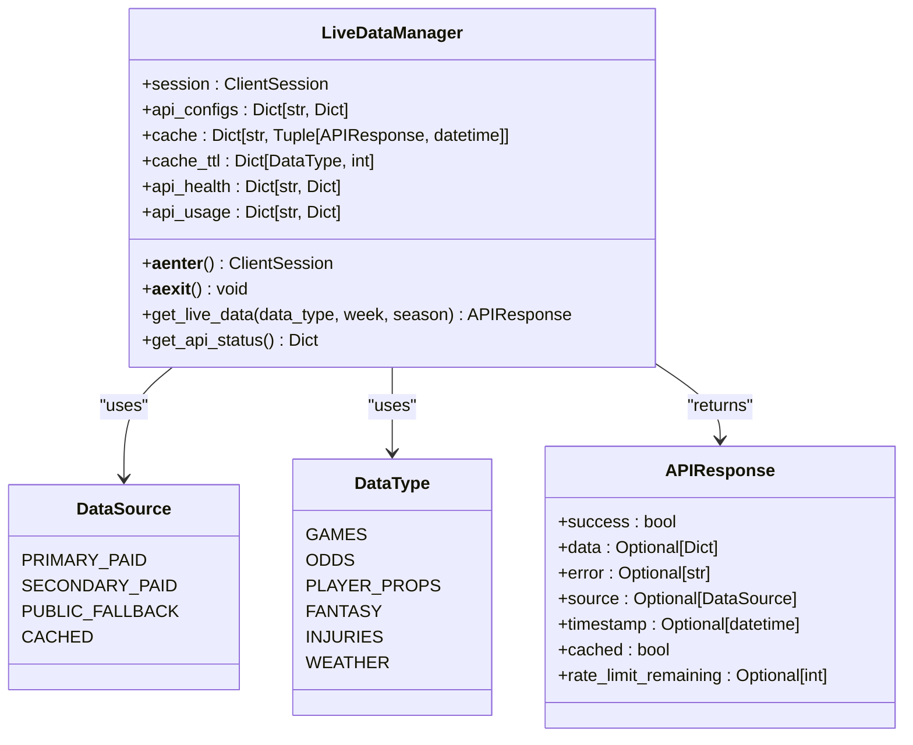
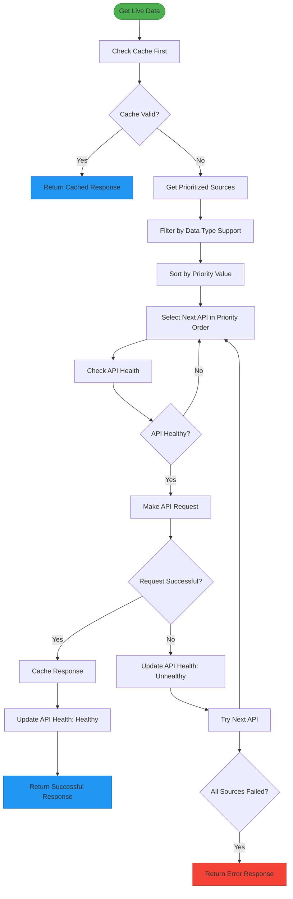
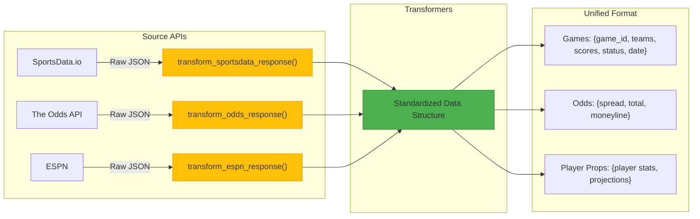
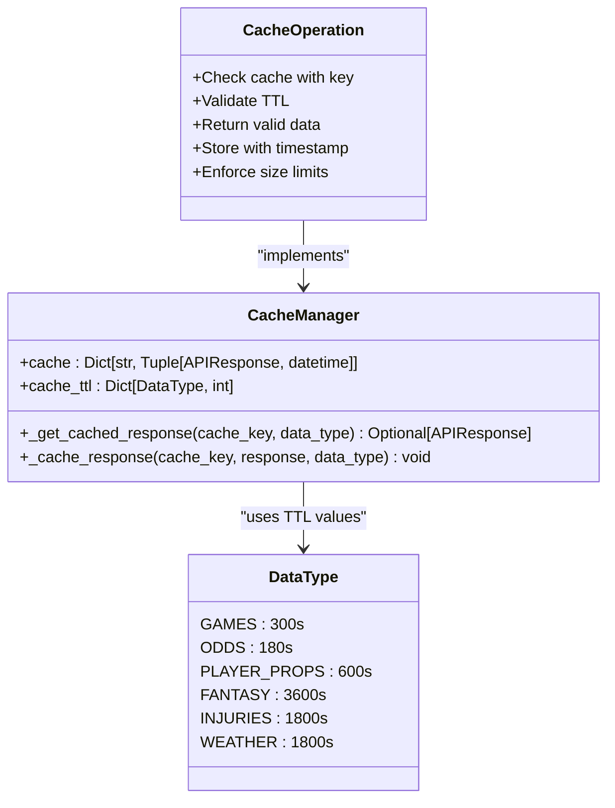
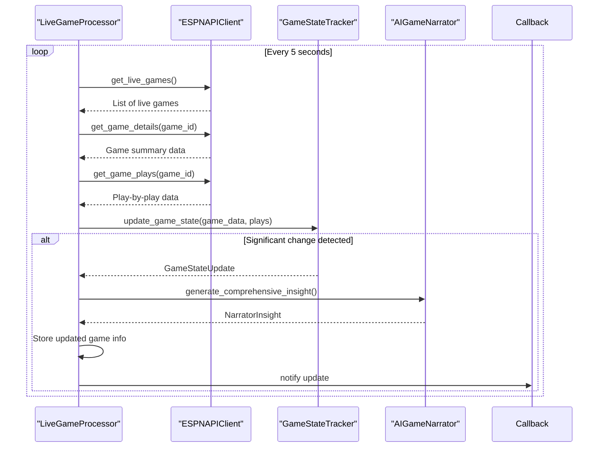
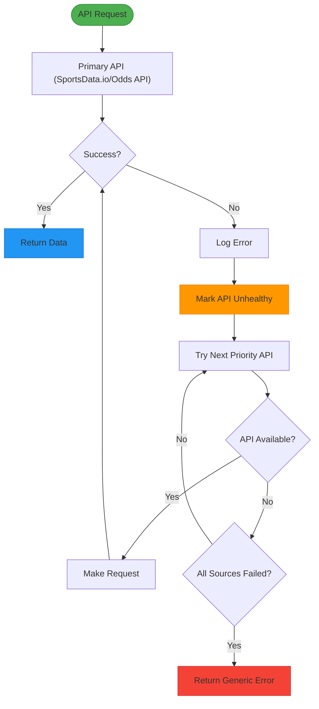

# Live Data Processing

<cite>
**Referenced Files in This Document**   
- [live_data_manager.py](file://src/api/live_data_manager.py)
- [live_game_processor.py](file://src/ml/live_game_processor.py)
- [cache_manager.py](file://src/cache/cache_manager.py)
</cite>

## Table of Contents
1. [LiveDataManager Architecture](#livedatamanager-architecture)
2. [Source Prioritization Algorithm](#source-prioritization-algorithm)
3. [Data Transformation Pipeline](#data-transformation-pipeline)
4. [Caching Strategy](#caching-strategy)
5. [Live Game Processor](#live-game-processor)
6. [Error Handling and Fallback Mechanisms](#error-handling-and-fallback-mechanisms)
7. [Performance Considerations](#performance-considerations)

## LiveDataManager Architecture

The LiveDataManager class orchestrates the integration of multiple data sources for the NFL prediction system, implementing a hierarchical approach with primary paid APIs and public fallbacks. The architecture is designed to ensure reliable data acquisition while optimizing cost and performance.

The system integrates five distinct data sources, categorized into primary paid APIs (SportsData.io, The Odds API), secondary paid APIs (RapidAPI), and public fallbacks (ESPN, NFL.com). Each source is configured with specific capabilities, priority levels, and rate limits, enabling intelligent routing based on data requirements and API health.

The LiveDataManager operates as an async context manager, maintaining an aiohttp ClientSession for efficient HTTP connections with a 30-second timeout and custom User-Agent header. This design enables concurrent data fetching operations while maintaining connection reuse and proper resource cleanup.

**Diagram sources**
- [live_data_manager.py](file://src/api/live_data_manager.py#L17-L42)

**Section sources**
- [live_data_manager.py](file://src/api/live_data_manager.py#L44-L599)

## Source Prioritization Algorithm

The source prioritization algorithm in LiveDataManager implements a multi-factor decision process to select the optimal API for each data request. The algorithm evaluates data type requirements, API reliability, and rate limits to ensure efficient and reliable data acquisition.

The prioritization process begins with the `_get_prioritized_sources` method, which filters available APIs based on their supported data types and sorts them by priority value (lower numbers indicate higher priority). The system maintains a configuration dictionary that defines each API's capabilities, with SportsData.io and The Odds API having the highest priority (1) as primary paid services, followed by RapidAPI (2) as a secondary paid option, and ESPN (3) and NFL.com (4) as public fallbacks.

For each data type, the algorithm selects from APIs that support that specific data category:
- Games data: SportsData.io (priority 1), RapidAPI (2), ESPN (3), NFL.com (4)
- Odds data: The Odds API (priority 1), RapidAPI (2)
- Player props: SportsData.io (priority 1), RapidAPI (2)
- Fantasy data: SportsData.io (priority 1)
- Injuries data: SportsData.io (priority 1), ESPN (3)

The algorithm implements health monitoring through the `_is_api_healthy` method, which prevents requests to APIs that have recently failed. When an API fails, it is marked as unhealthy and excluded from consideration for 5 minutes, allowing time for recovery before retrying. This circuit-breaker pattern prevents cascading failures and reduces unnecessary requests to problematic services.

**Diagram sources**
- [live_data_manager.py](file://src/api/live_data_manager.py#L193-L204)
- [live_data_manager.py](file://src/api/live_data_manager.py#L564-L581)

**Section sources**
- [live_data_manager.py](file://src/api/live_data_manager.py#L129-L191)

## Data Transformation Pipeline

The data transformation pipeline standardizes responses from heterogeneous APIs into a unified format, enabling consistent processing across the application. Each API-specific fetch method transforms the raw response into a common structure that abstracts away the differences between data providers.

For SportsData.io, the `_transform_sportsdata_response` method converts game data into a standardized format with fields including game_id, home_team, away_team, scores, status, date, week, and season. Player props data is transformed to include player_id, name, team, position, and statistical projections for passing, rushing, and receiving yards, receptions, and touchdowns.

The Odds API transformation in `_transform_odds_response` standardizes betting data by extracting spread, total, and moneyline odds from multiple bookmakers. The transformation aggregates odds across bookmakers, creating a unified odds structure with home_spread, home_odds, total_line, over_odds, under_odds, and moneyline odds for both teams.

ESPN data is transformed by `_transform_espn_response` to extract game information from the ESPN API's nested JSON structure. The transformation handles ESPN's unique data organization by parsing events, competitions, and competitors to extract game_id, team abbreviations, scores, status, and date information in the standard format.

**Diagram sources**
- [live_data_manager.py](file://src/api/live_data_manager.py#L402-L441)
- [live_data_manager.py](file://src/api/live_data_manager.py#L443-L493)
- [live_data_manager.py](file://src/api/live_data_manager.py#L495-L534)

**Section sources**
- [live_data_manager.py](file://src/api/live_data_manager.py#L402-L534)

## Caching Strategy

The caching strategy implements TTL-based expiration for different data types, optimizing performance while ensuring data freshness. The system maintains an in-memory cache with configurable time-to-live values that vary by data type based on update frequency and importance.

The cache TTL configuration assigns different expiration times to various data types:
- Games data: 300 seconds (5 minutes) - reflecting frequent score updates during live games
- Odds data: 180 seconds (3 minutes) - accounting for rapid line movements in betting markets
- Player props: 600 seconds (10 minutes) - suitable for pre-game projections that change less frequently
- Fantasy data: 3600 seconds (1 hour) - appropriate for DFS slate information that remains stable
- Injuries data: 1800 seconds (30 minutes) - balancing freshness with relatively infrequent updates
- Weather data: 1800 seconds (30 minutes) - matching typical weather reporting intervals

The cache implementation in LiveDataManager uses a dictionary-based storage system with timestamp tracking. The `_get_cached_response` method checks if a cache entry exists and verifies that it has not exceeded its TTL before returning it. Expired entries are automatically removed from the cache. The `_cache_response` method stores responses with their timestamps and implements size limiting by removing the 20 oldest entries when the cache exceeds 100 items.

**Diagram sources**
- [live_data_manager.py](file://src/api/live_data_manager.py#L536-L562)
- [live_data_manager.py](file://src/api/live_data_manager.py#L300-L315)

**Section sources**
- [live_data_manager.py](file://src/api/live_data_manager.py#L536-L562)

## Live Game Processor

The LiveGameProcessor class handles real-time data ingestion, game state tracking, and prediction updates for live NFL games. It integrates with the ESPN API to monitor active games, detect significant state changes, and trigger AI-driven insights and prediction updates.

The processor operates as an asynchronous service that polls for updates every 5 seconds. It maintains active game tracking through the `active_games` dictionary, storing current state, latest insights, and game information for all ongoing games. The processor uses an ESPNAPIClient to fetch live game data, detailed game summaries, play-by-play information, and team statistics.

The core processing loop in `_process_live_games` identifies significant game state changes through the GameStateTracker. When a significant change is detected (with a significance score of 0.5 or higher), the processor generates AI narrator insights and notifies registered callbacks. The significance scoring considers factors such as score changes, quarter transitions, fourth-down situations, red zone entries, two-minute warnings, and major plays like touchdowns or turnovers.

**Diagram sources**
- [live_game_processor.py](file://src/ml/live_game_processor.py#L466-L510)
- [live_game_processor.py](file://src/ml/live_game_processor.py#L217-L261)

**Section sources**
- [live_game_processor.py](file://src/ml/live_game_processor.py#L433-L654)

## Error Handling and Fallback Mechanisms

The system implements comprehensive error handling and fallback mechanisms to ensure reliability when primary APIs fail. The LiveDataManager employs a cascading fallback strategy that systematically attempts lower-priority sources when higher-priority ones are unavailable.

When an API request fails, the system captures the error and updates the API health status through `_update_api_health`. Failed APIs are marked as unhealthy and excluded from consideration for 5 minutes, preventing repeated attempts to failing services. This circuit-breaker pattern reduces load on problematic APIs and allows time for recovery.

The fallback mechanism follows the priority order defined in the API configuration. For example, when fetching games data:
1. Attempt SportsData.io (primary paid)
2. If unavailable, try RapidAPI (secondary paid)
3. If both paid options fail, use ESPN (public fallback)
4. As a last resort, try NFL.com (public fallback)

Each API-specific fetch method includes comprehensive error handling with try-catch blocks that return standardized APIResponse objects with error details. This ensures consistent error reporting regardless of which API failed. The system also handles specific error conditions such as missing API keys for paid services, returning appropriate error messages to facilitate debugging.

**Section sources**
- [live_data_manager.py](file://src/api/live_data_manager.py#L129-L191)
- [live_data_manager.py](file://src/api/live_data_manager.py#L564-L581)

## Performance Considerations

The live data processing system addresses performance considerations for concurrent API requests and data processing latency through several optimization strategies. The asynchronous design using aiohttp enables concurrent requests to multiple APIs without blocking, improving overall throughput and reducing end-to-end latency.

The system implements rate limiting and request throttling to prevent overwhelming external APIs. The ESPNAPIClient in the LiveGameProcessor includes a 0.5-second delay between game processing operations, while the main LiveDataManager respects the rate limits specified in each API's configuration (e.g., 1000 requests per month for SportsData.io, 500 for The Odds API).

Caching significantly reduces API call volume and improves response times for frequently accessed data. The TTL-based cache ensures that data is refreshed at appropriate intervals while serving stale-but-recent data when immediate freshness is not critical. The cache size is limited to 100 entries with LRU (Least Recently Used) eviction, preventing unbounded memory growth.

The LiveDataManager's priority-based source selection minimizes latency by attempting the most reliable and fastest APIs first. The health monitoring system prevents wasted time on known-unhealthy APIs, redirecting requests to available alternatives more quickly. This intelligent routing ensures optimal performance under varying API availability conditions.

**Section sources**
- [live_data_manager.py](file://src/api/live_data_manager.py#L44-L599)
- [live_game_processor.py](file://src/ml/live_game_processor.py#L433-L654)