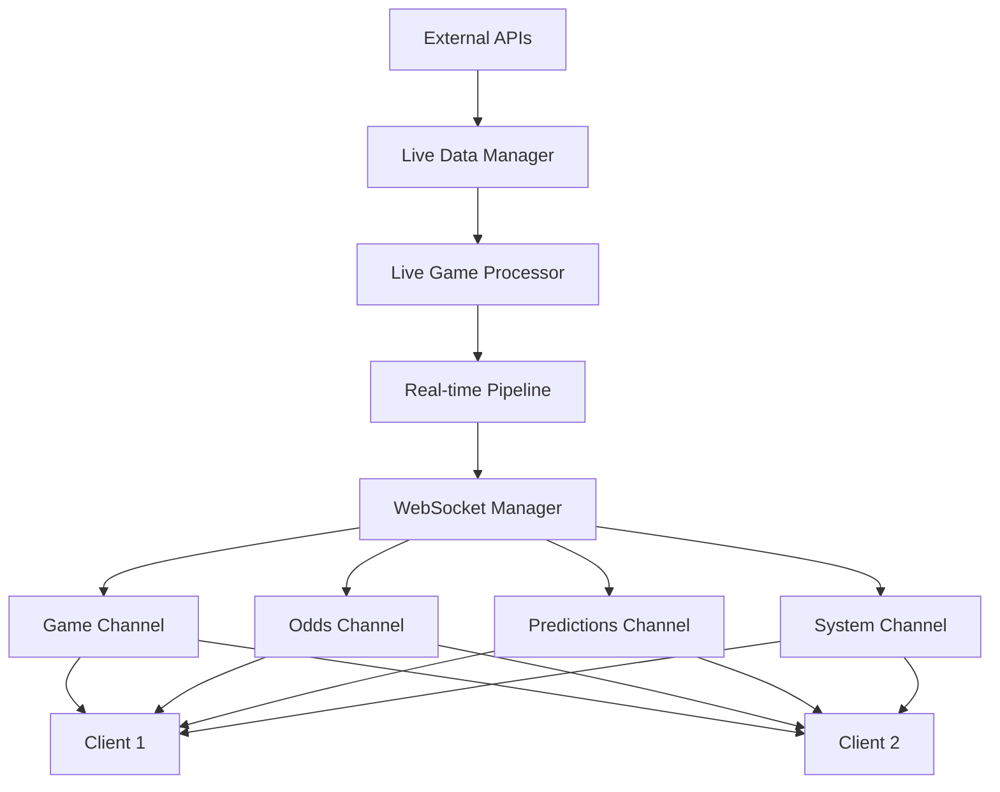
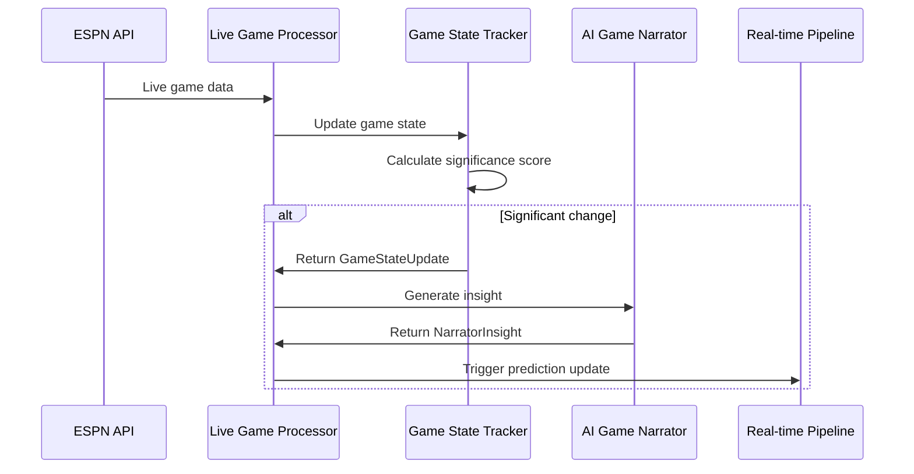
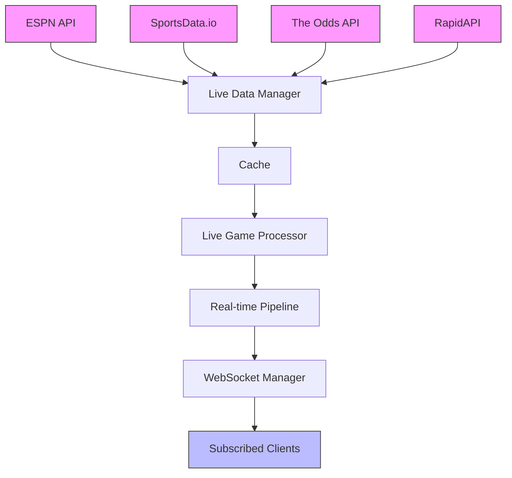
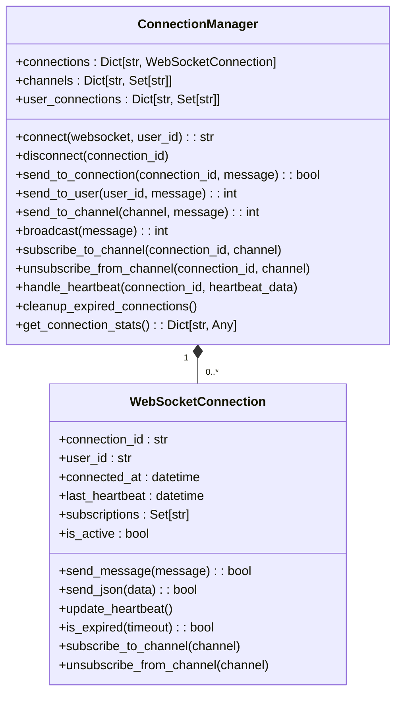
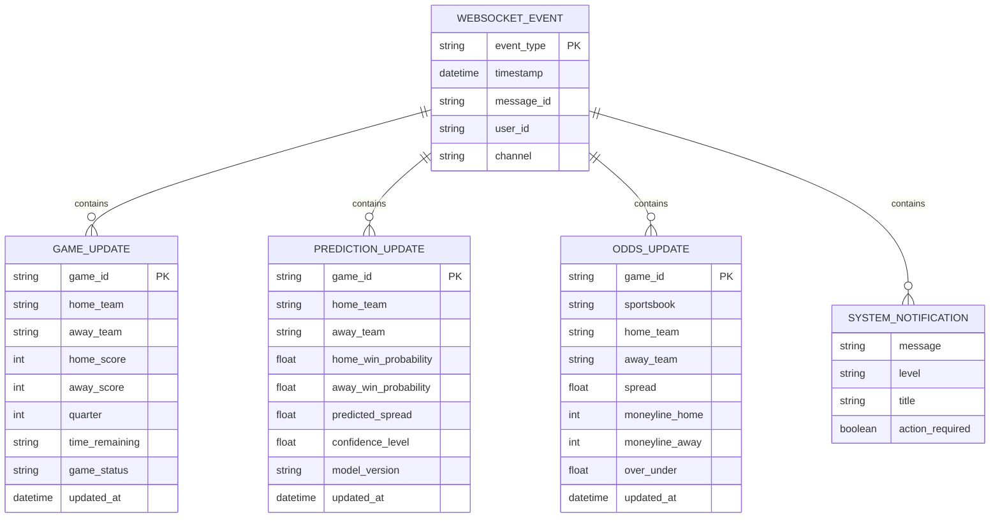
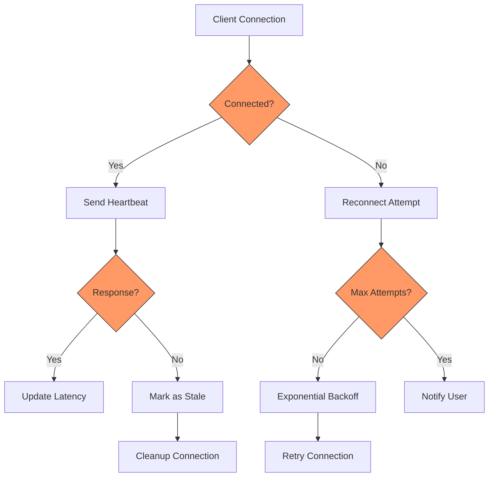
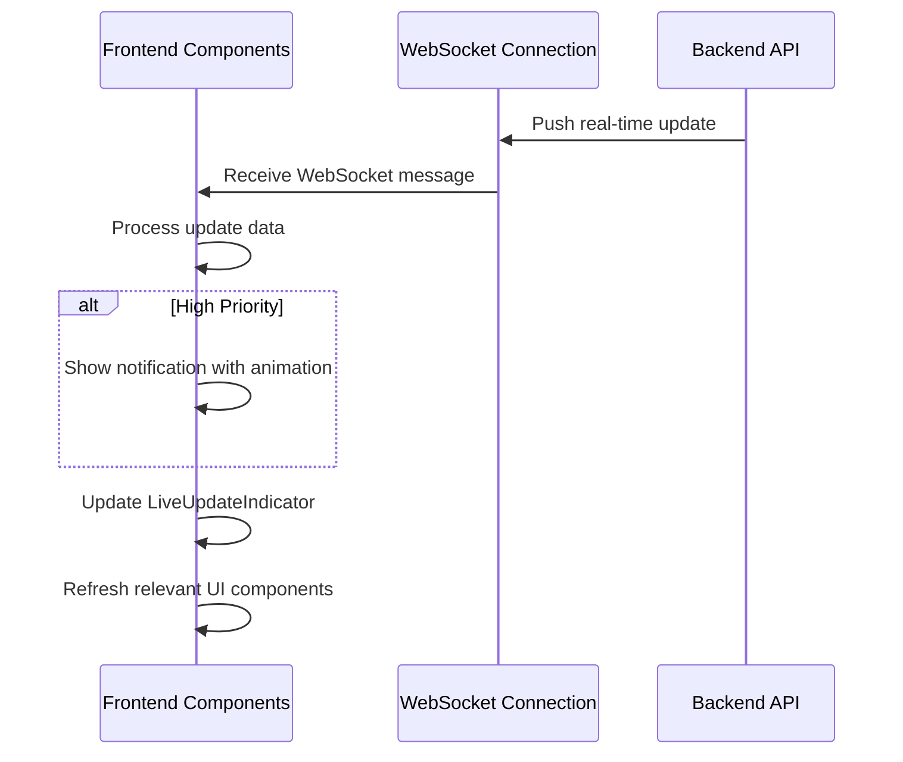

# Real-time Features

<cite>
**Referenced Files in This Document**   
- [websocket_manager.py](file://src/websocket/websocket_manager.py)
- [live_game_processor.py](file://src/ml/live_game_processor.py)
- [live_data_manager.py](file://src/api/live_data_manager.py)
- [realtime_endpoints.py](file://src/api/realtime_endpoints.py)
- [websocket_events.py](file://src/websocket/websocket_events.py)
- [real_time_pipeline.py](file://src/pipeline/real_time_pipeline.py)
- [LiveUpdateIndicator.tsx](file://src/components/realtime/LiveUpdateIndicator.tsx)
- [LiveUpdateNotifications.tsx](file://src/components/realtime/LiveUpdateNotifications.tsx)
- [aiCouncil.ts](file://src/types/aiCouncil.ts)
</cite>

## Table of Contents
1. [WebSocket Architecture](#websocket-architecture)
2. [Live Game Processor](#live-game-processor)
3. [Data Flow and Integration](#data-flow-and-integration)
4. [Connection Management](#connection-management)
5. [Real-time Event Types](#real-time-event-types)
6. [Performance and Resilience](#performance-and-resilience)
7. [Frontend Integration](#frontend-integration)

## WebSocket Architecture

The NFL Predictor API implements a WebSocket-based architecture to deliver live game updates, prediction changes, and scoring events with minimal latency. The system uses a centralized WebSocket manager that handles connection lifecycle, message broadcasting, and channel management. The architecture supports multiple channels including games, odds, predictions, and system notifications, allowing clients to subscribe to specific data streams of interest.

The WebSocket implementation follows a publish-subscribe pattern where the server pushes updates to connected clients based on their subscriptions. Each connection is assigned a unique identifier and can subscribe to multiple channels simultaneously. The system supports various event types including game updates, prediction changes, odds movements, and system notifications, each with appropriate message serialization and delivery mechanisms.

**Diagram sources**
- [websocket_manager.py](file://src/websocket/websocket_manager.py)
- [live_data_manager.py](file://src/api/live_data_manager.py)
- [live_game_processor.py](file://src/ml/live_game_processor.py)
- [real_time_pipeline.py](file://src/pipeline/real_time_pipeline.py)

**Section sources**
- [websocket_manager.py](file://src/websocket/websocket_manager.py)
- [websocket_events.py](file://src/websocket/websocket_events.py)

## Live Game Processor

The live game processor is responsible for ingesting real-time data from ESPN and other sources, processing game state changes, and triggering prediction updates. It uses an ESPN API client to fetch live game data at regular intervals, extracting critical information such as scores, game clock, possession, and play-by-play events. The processor tracks game state changes and identifies significant events that warrant updates to subscribers.

The processor employs a state tracking mechanism that compares current game data with previous states to detect meaningful changes. It calculates a significance score based on factors such as score changes, quarter transitions, down and distance situations, red zone entries, and two-minute warnings. When the significance score exceeds a threshold, the processor generates a game state update that includes the triggering event and relevant context.

**Diagram sources**
- [live_game_processor.py](file://src/ml/live_game_processor.py)
- [real_time_pipeline.py](file://src/pipeline/real_time_pipeline.py)

**Section sources**
- [live_game_processor.py](file://src/ml/live_game_processor.py)

## Data Flow and Integration

The data flow from external APIs through the live data manager to the WebSocket distribution system follows a structured pipeline. The live data manager serves as the primary integration point for multiple data sources, prioritizing paid APIs like SportsData.io and The Odds API while using public APIs like ESPN as fallbacks. The manager implements intelligent source selection based on availability, rate limits, and data quality.

When a client requests live data, the system first checks the cache for recent responses. If no valid cache entry exists, it queries data sources in priority order until successful. The retrieved data is transformed into a standardized format before being processed by the live game processor. Game state updates trigger prediction recalculations, and the resulting updates are distributed through the WebSocket manager to all subscribed clients.

**Diagram sources**
- [live_data_manager.py](file://src/api/live_data_manager.py)
- [real_time_pipeline.py](file://src/pipeline/real_time_pipeline.py)
- [websocket_manager.py](file://src/websocket/websocket_manager.py)

**Section sources**
- [live_data_manager.py](file://src/api/live_data_manager.py)
- [real_time_pipeline.py](file://src/pipeline/real_time_pipeline.py)

## Connection Management

The WebSocket system implements comprehensive connection management to handle client connections efficiently. Each connection is wrapped in a WebSocketConnection object that tracks metadata such as connection ID, user ID, subscription channels, and heartbeat status. The connection manager maintains a registry of active connections and their subscriptions, enabling targeted message delivery to specific clients or channels.

The system includes built-in heartbeat functionality to monitor connection health and detect stale connections. Clients are expected to send periodic heartbeat messages, and the server tracks the last heartbeat timestamp for each connection. Connections that fail to send heartbeats within a configurable timeout period are automatically cleaned up. The manager also supports user-level operations, allowing messages to be sent to all connections associated with a specific user.

**Diagram sources**
- [websocket_manager.py](file://src/websocket/websocket_manager.py)

**Section sources**
- [websocket_manager.py](file://src/websocket/websocket_manager.py)

## Real-time Event Types

The system supports multiple real-time event types, each with a specific JSON payload structure. Game updates include current scores, quarter, time remaining, possession, down and distance, and field position. Prediction updates contain win probabilities, confidence levels, and model metadata. Odds updates include spread, moneyline, and over/under values from various sportsbooks.

The WebSocket events are defined in a comprehensive enumeration that categorizes events by type and purpose. Each event type has an associated message structure with appropriate fields and data types. The system uses Pydantic models to validate incoming and outgoing messages, ensuring data integrity and consistency across the API.

**Diagram sources**
- [websocket_events.py](file://src/websocket/websocket_events.py)

**Section sources**
- [websocket_events.py](file://src/websocket/websocket_events.py)

## Performance and Resilience

The real-time system implements several strategies to handle high-concurrency connections and ensure connection resilience. Rate limiting is applied at multiple levels, including API calls to external services and WebSocket message broadcasting, preventing resource exhaustion. The system uses Redis caching with appropriate TTL values to reduce load on external APIs and improve response times.

For connection resilience, the system includes automatic reconnection logic on the client side and connection cleanup on the server side. The WebSocket manager performs periodic cleanup of expired connections, and clients implement exponential backoff when reconnecting after failures. The pipeline includes error handling and fallback mechanisms, switching to alternative data sources when primary sources are unavailable.

**Diagram sources**
- [websocket_manager.py](file://src/websocket/websocket_manager.py)
- [real_time_pipeline.py](file://src/pipeline/real_time_pipeline.py)

**Section sources**
- [real_time_pipeline.py](file://src/pipeline/real_time_pipeline.py)
- [websocket_manager.py](file://src/websocket/websocket_manager.py)

## Frontend Integration

The frontend components integrate with the real-time features to create a dynamic user experience. The LiveUpdateIndicator component provides visual feedback on connection status, latency, and the timing of the last update. It displays different states including connected, disconnected, and reconnecting, with appropriate visual indicators for each state.

The LiveUpdateNotifications component presents real-time updates to users in a non-intrusive manner. It displays notifications for various event types including consensus updates, prediction changes, and game events, with different visual treatments based on priority. Users can dismiss individual notifications or clear all notifications, and the component supports configurable display duration and maximum visible notifications.

**Diagram sources**
- [LiveUpdateIndicator.tsx](file://src/components/realtime/LiveUpdateIndicator.tsx)
- [LiveUpdateNotifications.tsx](file://src/components/realtime/LiveUpdateNotifications.tsx)
- [aiCouncil.ts](file://src/types/aiCouncil.ts)

**Section sources**
- [LiveUpdateIndicator.tsx](file://src/components/realtime/LiveUpdateIndicator.tsx)
- [LiveUpdateNotifications.tsx](file://src/components/realtime/LiveUpdateNotifications.tsx)
- [aiCouncil.ts](file://src/types/aiCouncil.ts)