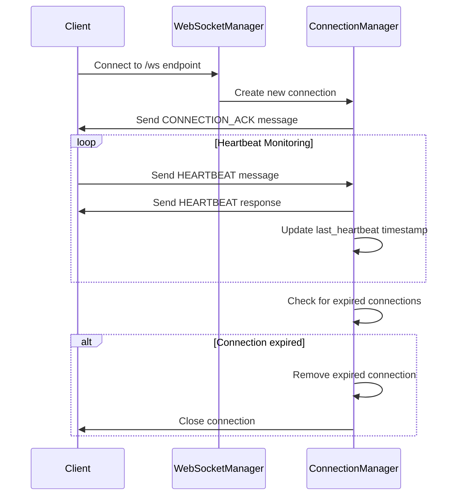
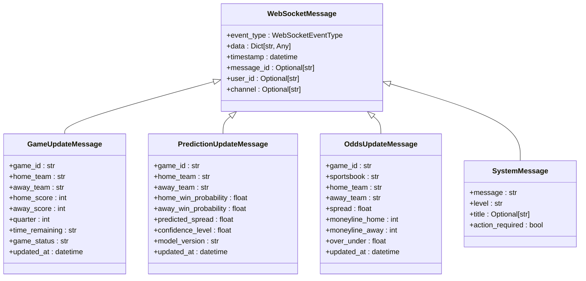
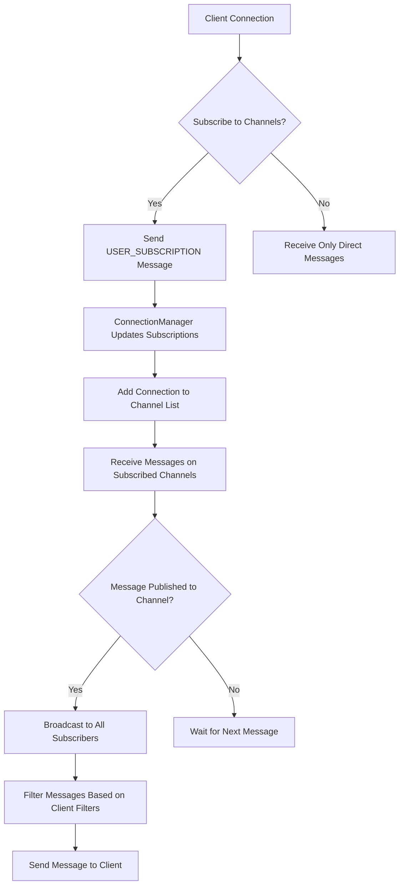
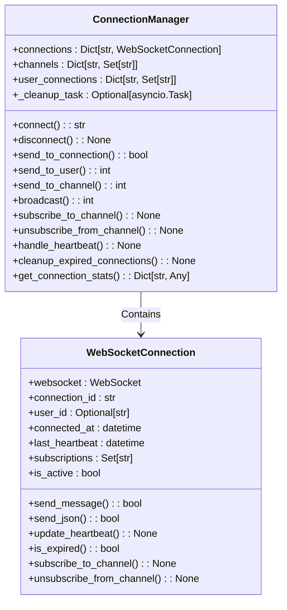
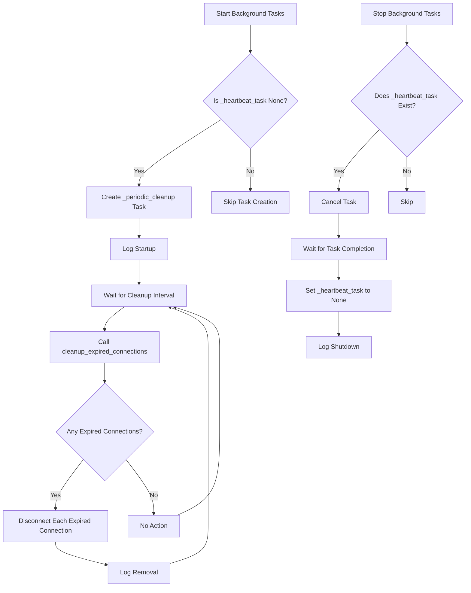
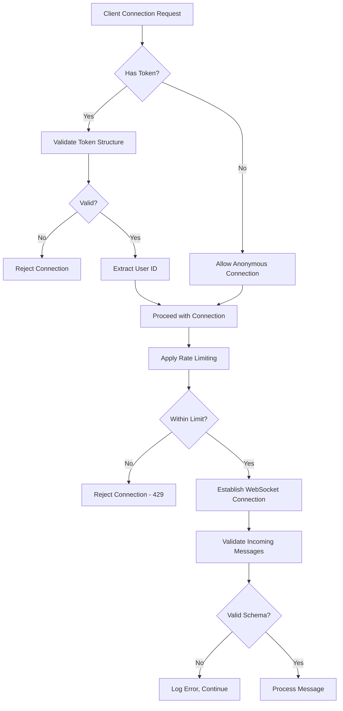

# WebSocket Integration

<cite>
**Referenced Files in This Document**   
- [websocket_manager.py](file://src/websocket/websocket_manager.py)
- [websocket_events.py](file://src/websocket/websocket_events.py)
- [websocket_handlers.py](file://src/websocket/websocket_handlers.py)
- [rate_limiting.py](file://src/middleware/rate_limiting.py)
</cite>

## Table of Contents
1. [Introduction](#introduction)
2. [Connection Lifecycle Management](#connection-lifecycle-management)
3. [Message Protocols](#message-protocols)
4. [Channel-Based Subscription Model](#channel-based-subscription-model)
5. [ConnectionManager Implementation](#connectionmanager-implementation)
6. [WebSocketManager Background Tasks](#websocketmanager-background-tasks)
7. [Security Considerations](#security-considerations)
8. [Client Implementation Guidelines](#client-implementation-guidelines)
9. [Conclusion](#conclusion)

## Introduction
The WebSocket integration in the NFL Predictor API provides real-time updates for game data, odds, predictions, and system notifications. This documentation details the architecture, protocols, and implementation of the WebSocket system, enabling clients to establish persistent connections for live data streaming. The system is built on FastAPI's WebSocket support with a comprehensive management layer for connection pooling, message broadcasting, and resource cleanup.

**Section sources**
- [websocket_manager.py](file://src/websocket/websocket_manager.py#L1-L50)
- [websocket_events.py](file://src/websocket/websocket_events.py#L1-L20)

## Connection Lifecycle Management
The WebSocket connection lifecycle is managed through a standardized process that includes connection establishment, heartbeat monitoring, and automatic cleanup of expired connections. Clients initiate connections through various endpoints, with the system providing connection acknowledgment and maintaining persistent communication channels.

The connection process begins with the client connecting to one of the available WebSocket endpoints. Upon successful connection, the server sends a CONNECTION_ACK message containing the connection ID, server time, supported event types, and heartbeat interval. The system implements a heartbeat mechanism with a 30-second interval, where clients are expected to send heartbeat messages to maintain their connection. Connections that fail to send heartbeats within the timeout period (60 seconds) are automatically cleaned up by the background task manager.

**Diagram sources**
- [websocket_manager.py](file://src/websocket/websocket_manager.py#L74-L225)
- [websocket_manager.py](file://src/websocket/websocket_manager.py#L228-L359)

**Section sources**
- [websocket_manager.py](file://src/websocket/websocket_manager.py#L74-L225)
- [websocket_manager.py](file://src/websocket/websocket_manager.py#L228-L359)

## Message Protocols
The WebSocket system supports multiple event types with standardized message formats for different data categories. All messages follow the WebSocketMessage structure, which includes the event type, data payload, timestamp, and optional metadata.

### GAME_UPDATE Events
GAME_UPDATE events provide real-time updates on game status, scores, and other game-related information. The message includes details such as game ID, team names, current scores, quarter, time remaining, and game status.

### ODDS_UPDATE Events
ODDS_UPDATE events deliver real-time odds changes from various sportsbooks. The message contains the game ID, sportsbook name, spread, moneyline odds for both teams, over/under value, and update timestamp.

### PREDICTION_UPDATE Events
PREDICTION_UPDATE events communicate ML-generated predictions for games, including win probabilities for both teams, predicted spread, confidence level, model version, and update timestamp.

### NOTIFICATION Events
NOTIFICATION events are used for system-wide alerts and messages, with configurable severity levels (info, warning, error) and optional action requirements.

**Diagram sources**
- [websocket_events.py](file://src/websocket/websocket_events.py#L50-L119)

**Section sources**
- [websocket_events.py](file://src/websocket/websocket_events.py#L50-L119)

## Channel-Based Subscription Model
The WebSocket system implements a flexible channel-based subscription model that allows clients to subscribe to specific data streams based on their interests. Channels are organized hierarchically, with both general and game-specific channels available.

Clients can subscribe to channels using the USER_SUBSCRIPTION message type, specifying the channel they wish to join. The system supports multiple channel types:

- **General channels**: "games", "odds", "predictions" - for receiving updates across all games
- **Game-specific channels**: "game_{game_id}", "odds_{game_id}", "predictions_{game_id}" - for receiving updates specific to a particular game
- **Specialized channels**: "bets", "lines", "eliminations", "bankroll" - for specific betting-related updates

The subscription model allows clients to receive targeted updates without being overwhelmed by irrelevant data. When a message is published to a channel, it is broadcast to all connected clients subscribed to that channel. The system automatically manages subscription state and ensures message delivery to appropriate recipients.

**Diagram sources**
- [websocket_manager.py](file://src/websocket/websocket_manager.py#L74-L225)
- [websocket_handlers.py](file://src/websocket/websocket_handlers.py#L0-L211)

**Section sources**
- [websocket_manager.py](file://src/websocket/websocket_manager.py#L74-L225)
- [websocket_handlers.py](file://src/websocket/websocket_handlers.py#L0-L211)

## ConnectionManager Implementation
The ConnectionManager class is responsible for managing all active WebSocket connections, handling client subscriptions, and facilitating message broadcasting. It maintains several key data structures to track connections, channels, and user sessions.

The ConnectionManager uses a dictionary-based approach to store connections by their unique connection ID, with additional mappings for channels to connection IDs and user IDs to their associated connection IDs. This structure enables efficient lookups and operations when sending messages to specific connections, users, or channels.

Key responsibilities of the ConnectionManager include:
- Accepting new WebSocket connections and assigning unique IDs
- Managing client subscriptions to various channels
- Tracking user sessions across multiple connections
- Handling heartbeat messages and updating connection timestamps
- Cleaning up expired connections based on heartbeat timeouts
- Providing connection statistics for monitoring purposes

The implementation includes safeguards against resource leaks by automatically removing connections from all tracking structures during disconnection and cleanup operations.

**Diagram sources**
- [websocket_manager.py](file://src/websocket/websocket_manager.py#L74-L225)

**Section sources**
- [websocket_manager.py](file://src/websocket/websocket_manager.py#L74-L225)

## WebSocketManager Background Tasks
The WebSocketManager class orchestrates the background tasks necessary for maintaining healthy connections and cleaning up expired resources. It implements a periodic cleanup mechanism that runs at configurable intervals (default: 60 seconds) to identify and remove connections that have not sent heartbeats within the timeout period.

The background task system follows these steps:
1. Initialize background tasks when the WebSocketManager starts
2. Run periodic cleanup at the specified interval
3. Check each connection's last heartbeat timestamp
4. Identify connections that have exceeded the timeout threshold
5. Disconnect and clean up expired connections
6. Log cleanup activities for monitoring

The WebSocketManager also handles the WebSocket connection lifecycle, receiving messages from clients and routing them to appropriate handlers based on the event type. It processes heartbeat messages, subscription requests, and unsubscription requests, ensuring the connection state remains synchronized between client and server.

**Diagram sources**
- [websocket_manager.py](file://src/websocket/websocket_manager.py#L228-L359)

**Section sources**
- [websocket_manager.py](file://src/websocket/websocket_manager.py#L228-L359)

## Security Considerations
The WebSocket integration incorporates several security measures to protect against abuse and ensure system stability. These include connection validation, message sanitization, and rate limiting at multiple levels.

Connection validation occurs during the initial handshake, where the system verifies the WebSocket upgrade request and optionally validates authentication tokens if provided. The system supports user identification through the user_id query parameter, enabling personalized updates and tracking.

Message sanitization is implemented through Pydantic model validation, ensuring that all incoming messages conform to expected schemas before processing. This prevents malformed data from causing errors or security vulnerabilities in the system.

Rate limiting is enforced through middleware that restricts the number of WebSocket connections per IP address. The current configuration allows 10 WebSocket connections per minute per IP address, preventing abuse and ensuring fair resource allocation among clients.

**Diagram sources**
- [websocket_manager.py](file://src/websocket/websocket_manager.py#L74-L225)
- [rate_limiting.py](file://src/middleware/rate_limiting.py#L600-L638)

**Section sources**
- [websocket_manager.py](file://src/websocket/websocket_manager.py#L74-L225)
- [rate_limiting.py](file://src/middleware/rate_limiting.py#L600-L638)

## Client Implementation Guidelines
Clients integrating with the NFL Predictor API WebSocket system should follow these guidelines to ensure reliable and efficient communication.

### Connection State Management
Clients should implement proper state management to handle the various stages of the WebSocket lifecycle:
- Track connection status (connecting, connected, disconnected, error)
- Implement reconnection logic with exponential backoff for temporary failures
- Handle the CONNECTION_ACK message to obtain the connection ID and system information
- Monitor connection health through heartbeat responses

### Error Recovery
Robust error recovery mechanisms should include:
- Automatic reconnection attempts when the connection is lost
- Queueing of outbound messages during connection outages
- Validation of reconnection state to avoid duplicate subscriptions
- Graceful degradation when real-time updates are unavailable

### Message Parsing
Clients should implement structured message parsing according to the defined schemas:
- Use the event_type field to route messages to appropriate handlers
- Validate message data against expected formats before processing
- Implement type-specific handlers for different event types
- Handle optional fields gracefully when they are not present

The system provides multiple endpoint options for clients with different needs:
- `/ws` - General WebSocket endpoint for all update types
- `/ws/games` - Auto-subscribed to game updates
- `/ws/odds` - Auto-subscribed to odds updates
- `/ws/predictions` - Auto-subscribed to prediction updates
- `/ws/game/{game_id}` - Auto-subscribed to updates for a specific game

**Section sources**
- [websocket_handlers.py](file://src/websocket/websocket_handlers.py#L0-L211)
- [websocket_manager.py](file://src/websocket/websocket_manager.py#L74-L225)

## Conclusion
The WebSocket integration in the NFL Predictor API provides a robust, scalable solution for real-time data delivery. The system's architecture balances performance, reliability, and security through careful management of connections, efficient message broadcasting, and comprehensive error handling. By following the documented protocols and implementation guidelines, clients can establish reliable connections and receive timely updates for games, odds, predictions, and system notifications. The modular design of the WebSocketManager and ConnectionManager classes enables easy maintenance and future enhancements to the real-time capabilities of the API.