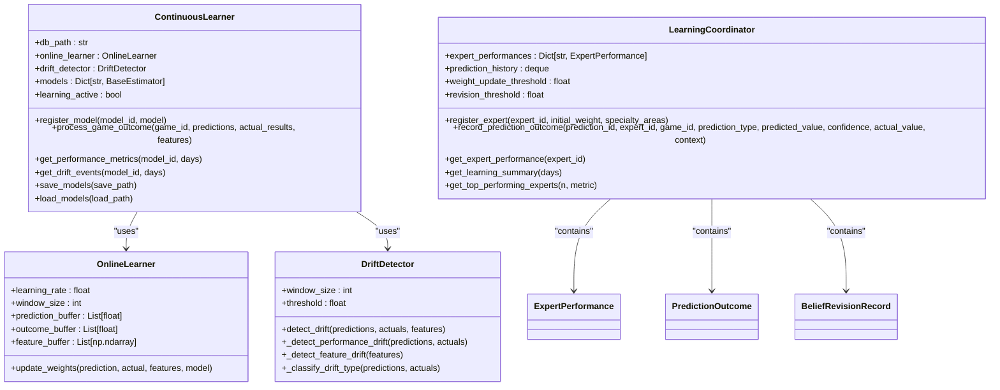
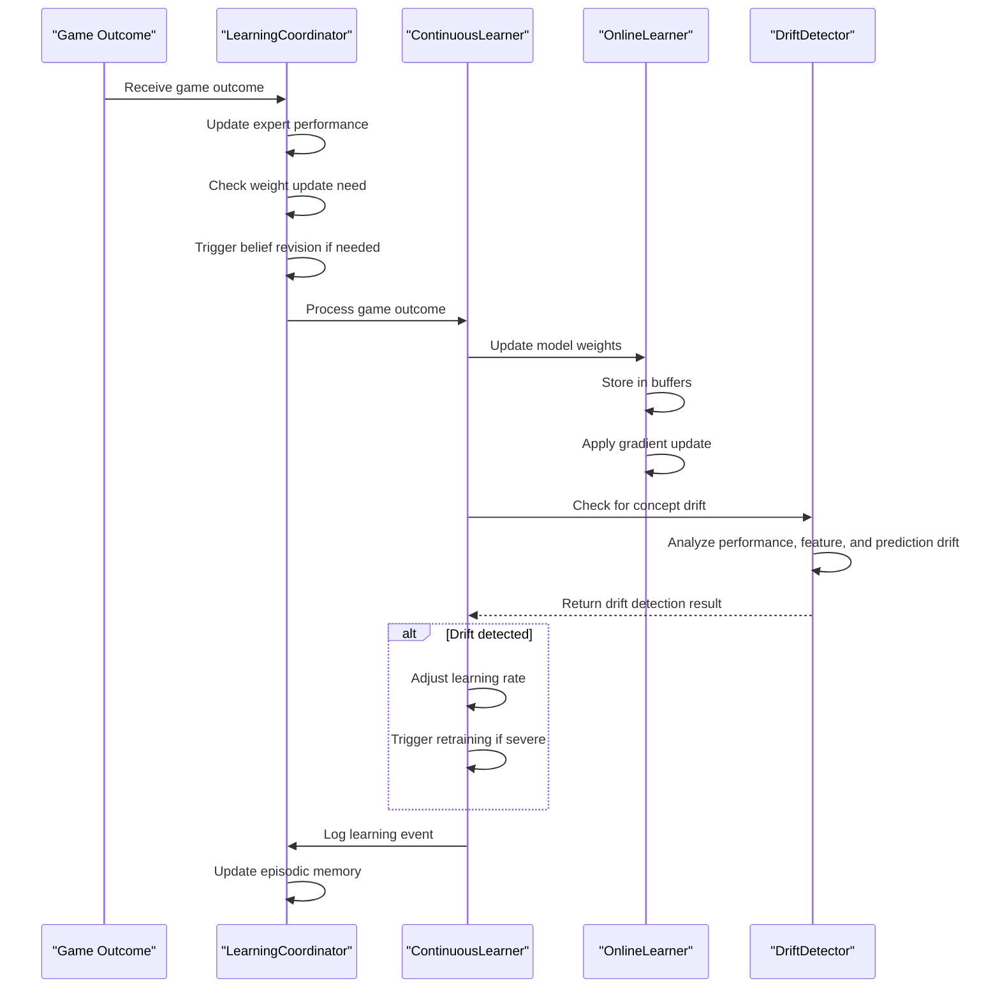
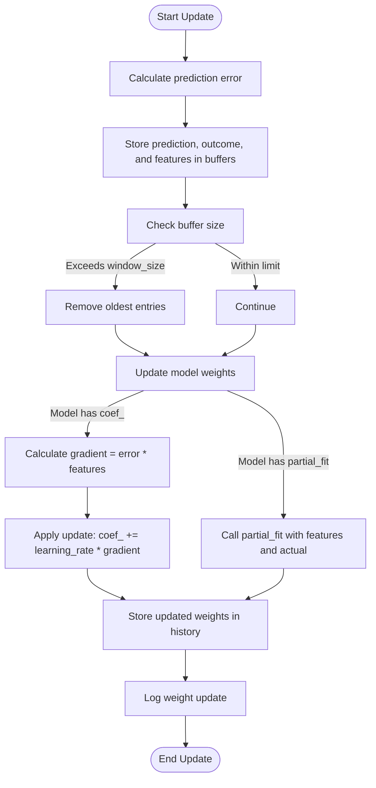
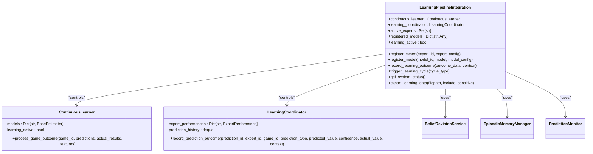

# Learning Feedback Loop

<cite>
**Referenced Files in This Document**   
- [continuous_learner.py](file://src/ml/continuous_learner.py)
- [learning_coordinator.py](file://src/ml/learning_coordinator.py)
- [learning_pipeline_integration.py](file://src/ml/learning_pipeline_integration.py)
</cite>

## Table of Contents
1. [Introduction](#introduction)
2. [Core Components](#core-components)
3. [Learning Workflow](#learning-workflow)
4. [Continuous Learner Implementation](#continuous-learner-implementation)
5. [Online Learning Process](#online-learning-process)
6. [Integration Between Components](#integration-between-components)
7. [Configuration Options](#configuration-options)
8. [Error Handling and Data Consistency](#error-handling-and-data-consistency)
9. [Performance Monitoring and Reporting](#performance-monitoring-and-reporting)
10. [Conclusion](#conclusion)

## Introduction
The NFL Predictor API employs a sophisticated learning feedback loop mechanism that enables continuous improvement of prediction models through real game outcomes. This system combines online learning with expert performance tracking to dynamically adjust model parameters and expert weights based on prediction accuracy. The architecture centers around two main components: the ContinuousLearner class that handles model updates and the LearningCoordinator that manages expert performance and belief revision. Together, these components form a self-improving system that adapts to changing NFL dynamics and maintains high prediction accuracy over time.

**Section sources**
- [continuous_learner.py](file://src/ml/continuous_learner.py#L1-L50)
- [learning_coordinator.py](file://src/ml/learning_coordinator.py#L1-L50)

## Core Components
The learning feedback loop consists of several interconnected components that work together to process game outcomes and update the prediction system. The ContinuousLearner class serves as the main coordinator for model updates, while the OnlineLearner handles the actual weight adjustments. The DriftDetector monitors for concept drift, and the LearningCoordinator tracks expert performance and triggers appropriate learning actions. These components are integrated through the LearningPipelineIntegration class, which provides a unified interface for the entire learning system.

**Diagram sources**
- [continuous_learner.py](file://src/ml/continuous_learner.py#L283-L644)
- [learning_coordinator.py](file://src/ml/learning_coordinator.py#L99-L749)

**Section sources**
- [continuous_learner.py](file://src/ml/continuous_learner.py#L1-L100)
- [learning_coordinator.py](file://src/ml/learning_coordinator.py#L1-L100)

## Learning Workflow
The learning feedback loop begins when real game outcomes are received by the system. The LearningCoordinator first records the prediction outcome and updates the expert's performance metrics. It then evaluates whether the expert's weights should be updated based on accuracy changes or the number of predictions made. Simultaneously, the ContinuousLearner processes the game outcome to update model weights through the OnlineLearner component. The system checks for concept drift using multiple detection methods, and if significant drift is detected, it triggers appropriate actions such as increasing the learning rate or initiating full model retraining.

**Diagram sources**
- [continuous_learner.py](file://src/ml/continuous_learner.py#L341-L387)
- [learning_coordinator.py](file://src/ml/learning_coordinator.py#L267-L333)

**Section sources**
- [continuous_learner.py](file://src/ml/continuous_learner.py#L341-L387)
- [learning_coordinator.py](file://src/ml/learning_coordinator.py#L267-L333)

## Continuous Learner Implementation
The ContinuousLearner class serves as the main coordinator for the continuous learning system. It manages model registration, processes game outcomes, detects concept drift, and tracks performance metrics over time. The class maintains a database connection to store learning events, drift detections, and model performance. When a game outcome is processed, it iterates through registered models, updates their weights via the OnlineLearner, checks for concept drift, and updates performance tracking. The system also provides methods to save and load model states, including both the models themselves and the learning configuration.

**Section sources**
- [continuous_learner.py](file://src/ml/continuous_learner.py#L283-L644)

## Online Learning Process
The OnlineLearner class implements the core online learning algorithm that updates model weights based on prediction outcomes. It maintains buffers for recent predictions, actual outcomes, and feature vectors, allowing it to apply gradient-based updates to model parameters. For models that support partial fitting (like scikit-learn's partial_fit), it uses the native method. For linear models with coefficient arrays, it applies manual gradient updates using the prediction error and learning rate. The buffer system implements a sliding window approach, keeping only the most recent observations as defined by the window_size parameter, which defaults to 50 observations.

**Diagram sources**
- [continuous_learner.py](file://src/ml/continuous_learner.py#L52-L98)

**Section sources**
- [continuous_learner.py](file://src/ml/continuous_learner.py#L52-L98)

## Integration Between Components
The learning system components are integrated through the LearningPipelineIntegration class, which coordinates the interaction between the ContinuousLearner and LearningCoordinator. When a prediction outcome is recorded, the LearningCoordinator updates expert performance metrics and triggers belief revisions if needed, while simultaneously passing relevant data to the ContinuousLearner for model updates. The integration system ensures that both model-level and expert-level learning occur in a coordinated fashion, with shared configuration parameters and synchronized state management. This integration allows the system to maintain consistency between model updates and expert weight adjustments.

**Diagram sources**
- [learning_pipeline_integration.py](file://src/ml/learning_pipeline_integration.py#L43-L59)

**Section sources**
- [learning_pipeline_integration.py](file://src/ml/learning_pipeline_integration.py#L43-L59)

## Configuration Options
The learning system provides several configurable parameters to control its behavior. The learning rate, which defaults to 0.01, determines how quickly models adapt to new information. The window size, set to 50 by default, controls how many recent observations are kept in the prediction buffers. The drift detection threshold, initially set to 0.1, determines when concept drift is considered significant enough to trigger actions. Expert weight updates are triggered when accuracy changes by at least 10% (weight_update_threshold), while belief revisions are triggered when recent accuracy drops below 30% (revision_threshold). These parameters can be adjusted based on the specific requirements of the prediction system and the volatility of the NFL environment.

**Section sources**
- [continuous_learner.py](file://src/ml/continuous_learner.py#L52-L55)
- [learning_coordinator.py](file://src/ml/learning_coordinator.py#L105-L107)

## Error Handling and Data Consistency
The learning system implements robust error handling to maintain data consistency during the learning process. All database operations use transactions to ensure atomicity, and critical operations are wrapped in try-except blocks to prevent system crashes from individual failures. The system handles delayed game results by timestamping all learning events, allowing for proper chronological ordering even when outcomes arrive out of sequence. Data consistency is maintained through the use of SQLite databases with appropriate indexes and constraints. The system also includes backup and recovery mechanisms, with regular model state saving and the ability to load previous states if needed.

**Section sources**
- [continuous_learner.py](file://src/ml/continuous_learner.py#L341-L387)
- [learning_coordinator.py](file://src/ml/learning_coordinator.py#L267-L333)

## Performance Monitoring and Reporting
The learning system includes comprehensive performance monitoring and reporting capabilities. The ContinuousLearner maintains a history of model performance metrics including accuracy, log loss, Brier score, and confidence calibration. The LearningCoordinator tracks expert performance over time, recording total predictions, correct predictions, accuracy trends, and confidence scores. Both components store their data in SQLite databases, allowing for historical analysis and reporting. The system can generate learning cycle reports that summarize recent activities, expert performances, and system status, providing valuable insights into the effectiveness of the learning process.

**Section sources**
- [continuous_learner.py](file://src/ml/continuous_learner.py#L450-L500)
- [learning_coordinator.py](file://src/ml/learning_coordinator.py#L500-L550)

## Conclusion
The learning feedback loop in the NFL Predictor API represents a sophisticated approach to continuous model improvement. By combining online learning with expert performance tracking, the system creates a self-improving prediction engine that adapts to changing conditions in the NFL. The integration of the ContinuousLearner and LearningCoordinator components ensures that both model-level and expert-level learning occur in a coordinated fashion, maintaining consistency across the system. With configurable parameters, robust error handling, and comprehensive monitoring, the learning system provides a reliable foundation for maintaining high prediction accuracy over time.